# HUG × 아이엔 안심주거 생태계

## Backend API 명세서

작성 기준일: 2026년 7월 14일 (KST) · 문서 버전: 1.0 · 상태: 초안(구현 착수 기준)

> **⚠️ [260721 갱신 공지]** 구현이 본 명세를 넘어섰다(명세 40 op → 실구현 61 op). 엔드포인트 목록·경로는
> `API_Contract_260721.yaml`(실구현 재생성본)을 기준으로 하고, 차이 상세는 `구현현황_문서정합_260721.md` 1장을 보라.
> 본 문서의 아키텍처·공통 응답 봉투·오류코드(11장)·인증/권한(9장)·MongoDB 설계(12~14장)는 여전히 유효하다.
> 주요 변경: `/hug/dashboard` 1개→5분할, `POST /notifications/{id}/read`→`PATCH`, `/ml/counsel/predict`→`/ml/counsel/classify`,
> verifications 경로변수 `verification_id`→`evidence_id`, esign·counsel-queue·incidents·landlords·properties 도메인 신설.

---

## 0. 문서 개요

### 0.1 목적

본 문서는 `개발설계보고서_260714_수정보완.docx`가 정의한 최상위 원칙을 바탕으로, FastAPI 백엔드를 실제로 구현하기 위한 상세 개발 명세다. AI 에이전트 또는 개발자가 이 문서만으로 Router, Service, Repository, DB 모델, 인증·권한, 외부 연계 Adapter, 스케줄러, 테스트, 배포 파일을 파일 단위로 생성할 수 있도록 작성한다.

### 0.2 데이터베이스 기술 변경 공지 (중요)

개발설계보고서와 데이터수집_및_API가이드는 PostgreSQL(+pgvector)을 기본 데이터저장소로 제시한다. 그러나 이번 Backend 구현 기준은 **PostgreSQL 대신 MongoDB를 사용**하도록 확정한다. 이는 발제사 문서 원칙과 충돌하는 것이 아니라, DB 엔진 선택은 API Contract·상위 설계 원칙(공통 식별자, 상태값, 온체인/오프체인 분리, 개인정보 최소화)에 영향을 주지 않는 구현 세부사항이라고 판단했기 때문이다. 변경 내역은 다음과 같다.

| 항목 | 발제사 문서 기준 | 본 문서 확정 기준 | 비고 |
|---|---|---|---|
| DB 엔진 | PostgreSQL | MongoDB (Atlas 또는 로컬 Docker) | 문서 4장에서 상세 |
| ORM/ODM | SQLAlchemy 2.x | Beanie ODM (Motor 기반) | 문서 4·17장 |
| 마이그레이션 | Alembic | Collection 초기화 스크립트 + 버전 태그 문서(마이그레이션 이력 컬렉션) | 문서 34장 |
| 벡터 검색 | pgvector | MongoDB Atlas Vector Search (`rag_chunks` 컬렉션 내 벡터 인덱스), 로컬 개발은 Chroma 대체 가능 | 문서 22장 |
| ERD | 관계형 ERD(Table·PK·FK·JOIN) | 논리 데이터 모델(Collection 간 참조/임베드 관계도) | 문서 15장 |

API Contract(`API_Contract_260714.yaml`)는 REST Endpoint·요청/응답 스키마·상태코드에 대해서만 최종 기준이며, 저장소 엔진에 대해 규정하지 않는다. 따라서 이 변경은 API Contract와 충돌하지 않는다. 단, `deposit`, `claim_amount` 등 금액 필드는 계약이 요구하는 정수 원 단위(BIGINT 상당)를 MongoDB에서도 `Int64`로 엄격히 유지한다.

### 0.3 이 문서가 담당하는 범위

FastAPI 프로젝트 구조, 내부 REST API 구현 기준, API Contract-코드 매핑, Pydantic DTO, MongoDB Document(Beanie) 모델, Collection 설계, Repository 패턴, Service Layer, 인증·인가, 트랜잭션(MongoDB 세션/Outbox), 외부 API Gateway, ML Inference Adapter, RAG Adapter, Blockchain Adapter, Scheduler, Notification, 로그·감사 추적, 테스트, 배포, Mock Mode.

담당하지 않는 범위: 외부 API 키 발급 상세(→ 데이터수집_및_API가이드), ML 학습 코드·Notebook(→ ML개발가이드), Frontend 컴포넌트(→ Frontend_UIUX_명세서), Solidity 함수·스마트컨트랙트 내부 구현(→ Blockchain_설계서, 아직 미작성).

### 0.4 표기 원칙

식별자는 `snake_case`, 상태값은 `PascalCase`(API Contract Enum 값 그대로), 일시는 KST 오프셋(`+09:00`) 포함 ISO 8601, 금액은 KRW 정수 원 단위, Python 코드는 클래스/함수 시그니처 수준의 pseudocode만 제시하고 전체 구현 코드는 작성하지 않는다. 확정되지 않은 사항은 본문에 `확인 필요`로 표기한다.

---

## 1. 선행 문서와 우선순위

| 순위 | 문서 | 역할 | 충돌 시 |
|---|---|---|---|
| 1 | `API_Contract_260714.yaml` | REST Endpoint·Request/Response Schema·상태코드·오류코드·권한(x-permission)·Mock 지원(x-mock-supported)의 최종 기준 | API 관련 사항은 이 문서가 항상 승리 |
| 2 | `개발설계보고서_260714_수정보완.docx` | 전체 원칙, 공통 식별자·상태, 생애주기, 모듈 책임, 온체인 금지 원칙 | API Contract와 충돌 시 API Contract 우선, 그 외는 이 문서 우선 |
| 3 | `데이터수집_및_API가이드_260714.md` | 외부 API 상세(엔드포인트·파라미터·응답), Mock 목록, Fallback 정책, 개인정보 처리 규칙 | 외부 연동 세부사항 기준 |
| 4 | `ML개발가이드_260714.md` | 모델 입출력 계약, 저장/버전 규칙, Rule Engine 결합, Mock 추론 시나리오 | ML 연동 세부사항 기준 |
| 5 | `Frontend_UIUX_명세서_260714.md` | 화면-API 매핑, 상태 UI(Loading/Partial/Error 등), 표시 원칙 | 화면 흐름 참고, API 형태는 Contract 우선 |

계약 자체에서 발견된 기술적 이슈는 임의로 수정하지 않고 본문에서 `계약 수정 제안` 박스로 표기하며, 전체 목록은 부록 H에 모은다. 이번 작업에서 `API_Contract_260714.yaml` 파일 자체는 수정하지 않는다.

---

## 2. 백엔드 책임 범위

FastAPI 구조, 내부 REST API 구현, API Contract-코드 매핑, Pydantic DTO, MongoDB Document/Repository, Service Layer, 인증·인가, 트랜잭션과 정합성, 외부 API Gateway, ML Inference Adapter, RAG Adapter, Blockchain Adapter, Object Storage, D-90 Scheduler, Notification, 로그·감사 추적, 보안·개인정보, 테스트, 배포, Mock Mode를 담당한다. 외부 API 키 발급, ML 학습 코드, Frontend 컴포넌트, Solidity 함수는 각 상세 문서를 참조한다.

---

## 3. 기술 스택

| 영역 | 채택 | 이유 | 대안 |
|---|---|---|---|
| 언어/런타임 | Python 3.11 | 타입힌트·async 성숙도, ML 생태계와 동일 언어 | 3.12(패키지 호환성 확인 필요) |
| 웹 프레임워크 | FastAPI + Uvicorn | OpenAPI 자동생성이 API Contract와 대조(Contract Test)하기 쉬움, async 네이티브 | Flask+연동 라이브러리(생산성 낮음) |
| 검증 | Pydantic v2 | FastAPI 기본 통합, 성능 개선(Rust core) | Marshmallow(FastAPI와 통합 약함) |
| DB | MongoDB (Atlas 우선, 로컬 Docker 대체) | 0.2절 사유. 문서 원문(JSON형 Feature, ML/RAG 산출물)과 스키마 유연성이 잘 맞음, Atlas Vector Search로 RAG 벡터검색까지 단일 스토어에서 처리 가능 | PostgreSQL+pgvector(발제사 원안, 관계형 무결성은 더 강함) |
| ODM | Beanie (Motor 기반 비동기 ODM) | Pydantic v2 모델을 그대로 Document로 재사용, FastAPI와 동일한 검증 스택 | Motor 저수준 직접 사용(보일러플레이트 증가), PyMongo 동기 클라이언트(비동기 FastAPI와 불일치) |
| 마이그레이션 | 커스텀 Collection 초기화 스크립트 + `schema_migrations` 컬렉션 | Alembic 대체. MongoDB는 스키마리스이므로 마이그레이션은 "인덱스 생성/문서 형태 변환/시드 데이터"로 축소 | Mongock, migrate-mongo(Node 기반, 이번 스택과 불일치) |
| 캐시/큐 | Redis(선택) | 1인 개발 MVP는 필수 아님. 외부 API 캐시·Idempotency 락에 확장 활용 | 없음(인메모리 dict, 프로세스 재시작 시 소실) |
| 스케줄러 | APScheduler | 단일 프로세스 배포에 적합, DB 폴링형 D-90 잡에 충분 | Celery Beat(Redis/브로커 필요, 1인 개발엔 과함), Cloud Scheduler(배포 플랫폼 종속) |
| HTTP 클라이언트 | httpx (async) | 외부 API Gateway·ML/Blockchain 내부 호출에 timeout/retry 제어 용이 | aiohttp(FastAPI 생태계 관례상 httpx 선호) |
| 인증 | JWT Bearer + OAuth2PasswordBearer, passlib(bcrypt) 또는 pwdlib | Contract가 Bearer 인증만 정의(`security: bearerAuth`) | 세션 기반 인증(Contract와 불일치) |
| Refresh Token | 미지원(MVP) | `LoginResponse` 스키마에 `refresh_token` 필드 없음(계약 확인됨). `expires_in=3600` 초과 시 재로그인 요구 | 확장 시 `POST /auth/refresh` 신설 제안(부록 H) |
| Storage | Supabase Storage 또는 S3 호환 | `File.object_uri` 예시가 `s3://...` 형식 | GridFS(MongoDB 내장, 대용량 아닌 소형 문서 위주라 비효율) |
| ML | joblib Artifact 로드 + FastAPI 내부 Adapter | ML개발가이드 19~20장과 동일 저장 구조 재사용 | 별도 ML 마이크로서비스(해커톤 범위 초과) |
| RAG | MongoDB Atlas Vector Search + Hybrid(BM25 텍스트 인덱스) | 별도 벡터DB 없이 동일 클러스터에서 처리, 운영 단순화 | Chroma(로컬 개발/오프라인 데모 대체용) |
| 블록체인 | Backend → 내부 REST(`/blockchain/anchor`) → 별도 Node/ethers.js 서비스 호출 | 개발설계보고서 9장 논리 아키텍처와 동일, Solidity 상세는 Blockchain_설계서 이관 | Web3.py 직접 연동(1인 개발 부담 증가, ethers.js 서비스 분리가 더 단순) |
| 테스트 | pytest, pytest-asyncio, httpx AsyncClient, mongomock-motor(단위) + Testcontainers MongoDB(통합), coverage | 비동기 FastAPI 표준 조합 | unittest(보일러플레이트 증가) |
| 코드품질 | Ruff, Ruff format, mypy, pre-commit | 단일 도구로 lint+format 겸용, 속도 빠름 | Black+Flake8(도구 2종 관리 부담) |
| 배포 | Docker, Render 또는 Railway, MongoDB Atlas, Vercel(Frontend) | 개발설계보고서 9.9절과 동일 배포 축, DB만 Atlas로 대체 | Fly.io(대안, 확인 필요) |

---

## 4. 전체 백엔드 아키텍처

### 4.1 계층 구조

```
Client
  → FastAPI Router
  → Application Service
  → Domain Service / Rule Engine
  → Repository (Beanie Document)
  → MongoDB
```

외부 연계:

```
Application Service
├── External API Gateway   (CODEF, 주소, 실거래가, 건축물대장, DART, 사업자상태, 온비드)
├── ML Inference Adapter   (위험유사도, 상담분류, 회수, 처리기간)
├── RAG Adapter            (Atlas Vector Search / Chroma)
├── Blockchain Adapter     (내부 anchor 서비스 → Polygon Amoy)
├── Object Storage         (Supabase Storage / S3 호환)
├── Notification Adapter   (In-app, Email, 확장: SMS/Kakao/FCM)
└── Scheduler               (APScheduler, D-90/D-60/D-30)
```

### 4.2 주요 흐름 (Mermaid)

**① 계약 생성**

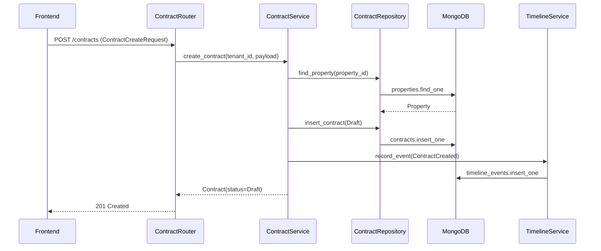

**② 위험진단**

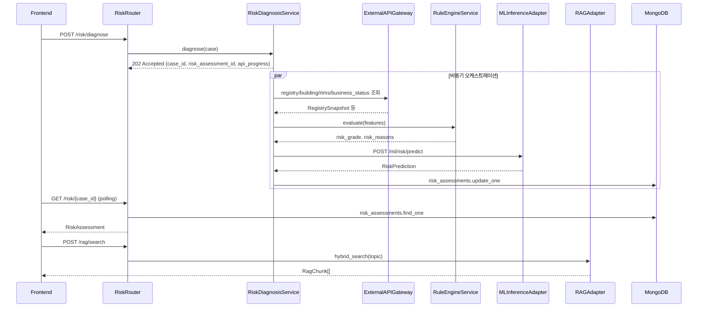

**③ 증빙 제출·검증**

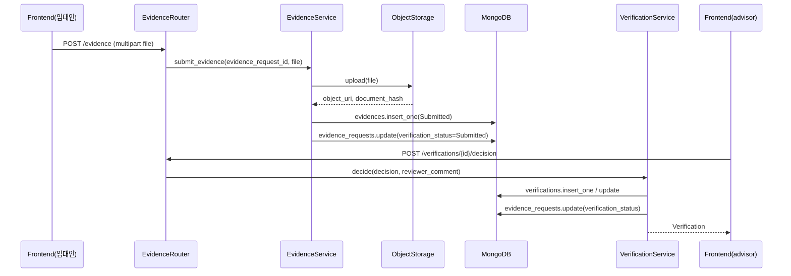

**④ 계약 상태변경**

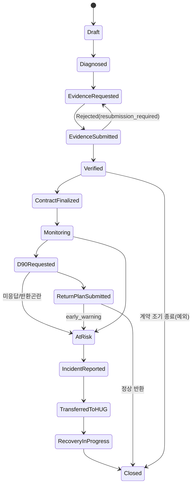

**⑤ 블록체인 공증**

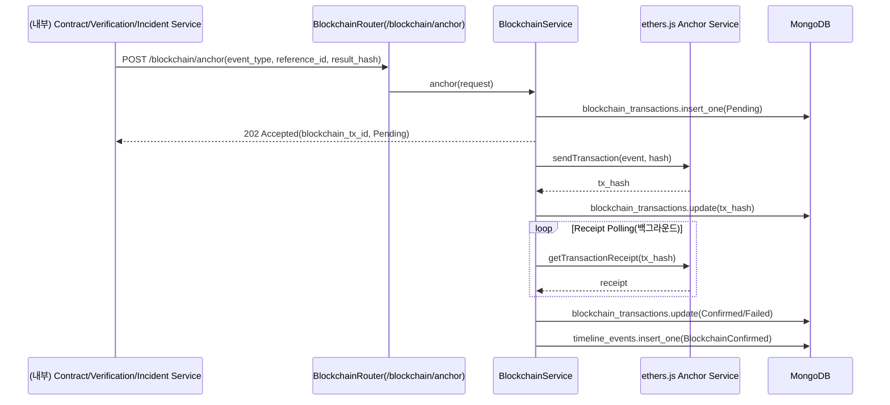

**⑥ D-90**

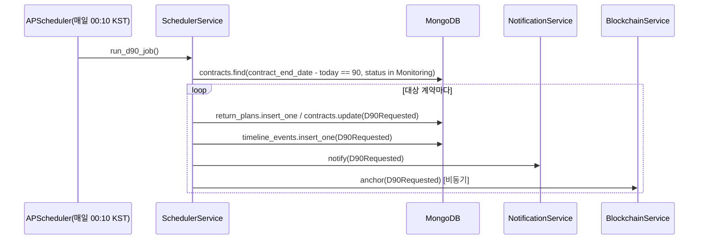

**⑦ 사고 접수·HUG 인계**

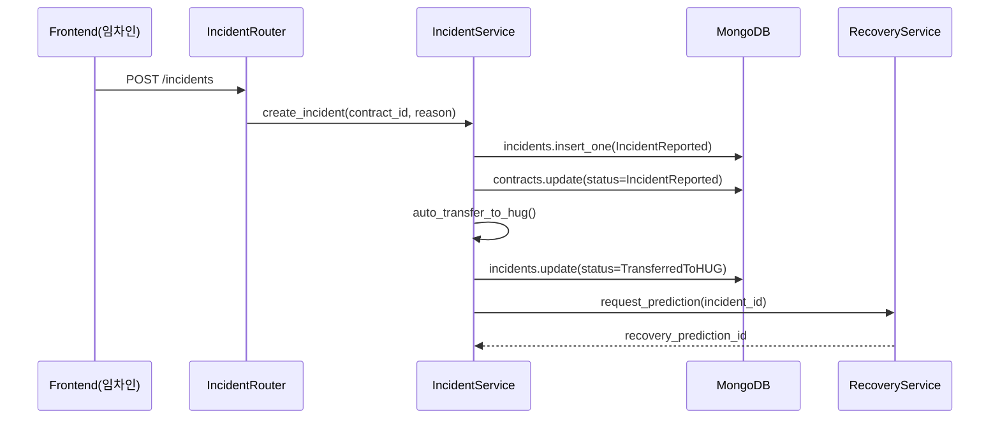

**⑧ 회수·처리기간 예측**

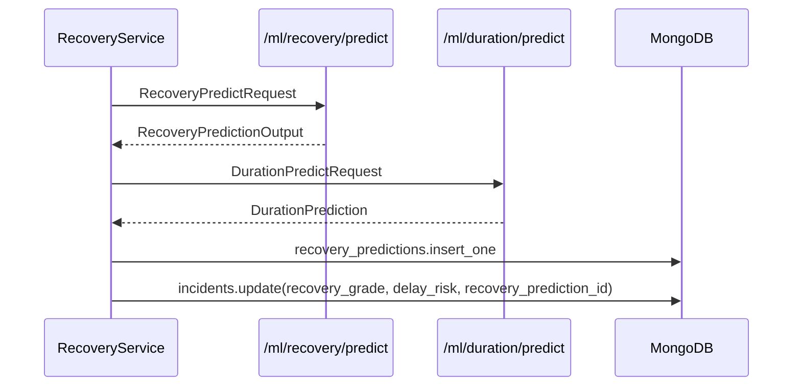

**⑨ API 실패·Mock Fallback**

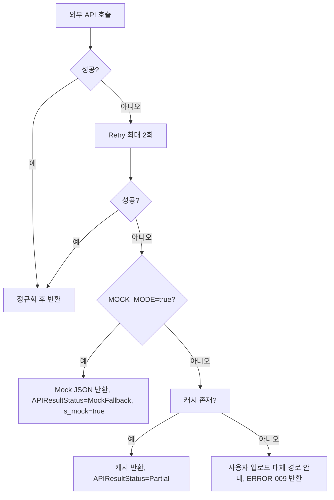

---

## 5. 프로젝트 디렉터리 구조

```
backend/
├── app/
│   ├── main.py
│   ├── api/
│   │   ├── deps.py
│   │   └── v1/
│   │       ├── router.py
│   │       └── endpoints/
│   │           ├── auth.py
│   │           ├── property_risk.py
│   │           ├── contract.py
│   │           ├── evidence_verification.py
│   │           ├── advisor.py
│   │           ├── hug.py
│   │           ├── admin.py
│   │           ├── blockchain.py
│   │           ├── ml.py
│   │           └── notification.py
│   ├── core/
│   │   ├── config.py
│   │   ├── security.py
│   │   ├── exceptions.py
│   │   ├── logging.py
│   │   └── constants.py
│   ├── db/
│   │   ├── base.py
│   │   ├── session.py            # Motor client, Beanie init_beanie
│   │   └── migrations/           # 인덱스/시드/문서형태 변환 스크립트
│   ├── models/                   # Beanie Document 정의(=Collection Schema)
│   ├── schemas/                  # Pydantic DTO(API Contract 1:1)
│   ├── repositories/
│   ├── services/
│   ├── integrations/
│   │   ├── external_api/
│   │   ├── ml/
│   │   ├── rag/
│   │   ├── blockchain/
│   │   ├── storage/
│   │   └── notification/
│   ├── scheduler/
│   ├── middleware/
│   ├── utils/
│   └── tests/
├── alembic/                      # 미사용(호환성 표시용 빈 디렉터리, 34장 참고)
├── scripts/                      # seed, index 생성, mock 데이터 로더
├── mock_data/
├── Dockerfile
├── docker-compose.yml
├── pyproject.toml
├── alembic.ini                   # 미사용
└── .env.example
```

| 경로 | 책임 |
|---|---|
| `app/main.py` | FastAPI 앱 생성, 미들웨어·라우터 등록, 시작 훅(DB 연결, Beanie 초기화, ML 모델 로드, Scheduler 시작) |
| `app/api/deps.py` | `get_current_user`, `require_role`, `get_db` 등 공통 Dependency |
| `app/api/v1/router.py` | 태그별 서브라우터 결합(`/api/v1` prefix) |
| `app/api/v1/endpoints/*.py` | Contract Tag 1:1 대응 Router 파일(19장) |
| `app/core/config.py` | Pydantic Settings, 환경변수 로드 |
| `app/core/security.py` | JWT 발급/검증, 비밀번호 해시 |
| `app/core/exceptions.py` | 커스텀 예외 → ERROR-NNN 매핑 |
| `app/core/logging.py` | 구조화 로그(JSON), PII 마스킹 필터 |
| `app/core/constants.py` | Enum, 오류코드 상수 |
| `app/db/session.py` | `AsyncIOMotorClient` 생성, `init_beanie(document_models=[...])` |
| `app/db/migrations/` | 버전별 인덱스 생성/필드 리네임 스크립트, `schema_migrations` 컬렉션에 이력 기록 |
| `app/models/*.py` | Beanie `Document` 서브클래스(Collection당 1개) |
| `app/schemas/*.py` | Request/Response Pydantic 모델(Contract Schema 이름 그대로 사용) |
| `app/repositories/*.py` | Beanie Query 캡슐화, 비즈니스 규칙 금지 |
| `app/services/*.py` | Use Case 실행, 상태전이, 외부 Adapter 호출, 트랜잭션 경계 |
| `app/integrations/external_api/*.py` | CODEF/주소/실거래가/건축물대장/DART/사업자상태/온비드 Adapter |
| `app/integrations/ml/*.py` | 모델 로더, 4개 추론 Adapter |
| `app/integrations/rag/*.py` | Atlas Vector Search/Chroma 클라이언트, Hybrid 검색 |
| `app/integrations/blockchain/*.py` | Anchor 요청, Receipt Polling |
| `app/integrations/storage/*.py` | Signed URL 발급, 업로드/다운로드 |
| `app/integrations/notification/*.py` | 채널별 발송 어댑터 |
| `app/scheduler/*.py` | APScheduler Job 정의(D-90/D-60/D-30, 외부 API 재시도, 블록체인 재확인) |
| `app/middleware/*.py` | Request-ID/Trace-ID 주입, 예외 핸들러, CORS, Rate Limit |
| `app/utils/*.py` | 해시, 날짜, 마스킹, canonical JSON |
| `app/tests/` | pytest 스위트(32장) |

---

## 6. 계층별 책임

| 계층 | 책임 | 금지사항 |
|---|---|---|
| Router | HTTP 요청/응답 매핑, `Depends`로 권한 검사 위임, Pydantic DTO 검증, 상태코드 반환 | 비즈니스 로직 직접 작성, Repository 직접 호출 |
| Service | Use Case 실행, 상태전이 판단, 외부 Adapter 호출, 트랜잭션 경계 설정, 도메인 규칙 조합 | HTTP 객체(Request/Response) 직접 조작, ORM 세부 쿼리 작성 |
| Repository | Beanie Document CRUD, 쿼리·페이지네이션·정렬 | 상태전이 규칙, 권한 판단, 외부 API 호출 |
| Model(Document) | Collection 스키마 정의, 인덱스 선언 | 비즈니스 로직 메서드 최소화(단순 파생 프로퍼티만 허용) |
| Schema(DTO) | OpenAPI Request/Response 검증 | DB 접근 |
| Integration Adapter | 외부 시스템(CODEF, 공공 API, ML, RAG, Blockchain, Notification, Storage) 호출 캡슐화, 표준 DTO 변환 | Service의 상태전이 로직 포함 |

호출 방향은 `Router → Service → (Repository | Adapter)`로 고정하며, Service 간 직접 호출은 허용하되(예: `IncidentService → RecoveryService`) 순환 의존을 만들지 않는다. Repository와 Adapter는 서로 호출하지 않는다.

---

## 7. 공통 식별자와 상태

### 7.1 식별자

API_Contract의 `UUID` 스키마(`format: uuid`)를 모든 식별자에 사용한다. MongoDB `_id` 필드는 Python `uuid.UUID`(Beanie는 `Indexed(UUID)` 또는 `id: UUID = Field(default_factory=uuid4)`로 커스텀 PK 지정 가능)를 그대로 사용하고, ObjectId는 사용하지 않는다(Contract가 UUID 포맷을 강제하므로).

| 식별자 | 소속 Collection | 비고 |
|---|---|---|
| user_id | users | |
| property_id | properties | |
| contract_id | contracts | |
| contract_version_id | contract_versions | |
| registry_snapshot_id | registry_snapshots | |
| risk_assessment_id | risk_assessments | `case_id`와 최초 생성 시 1:1(확인 필요, 7.3절) |
| evidence_request_id | evidence_requests | |
| evidence_id | evidences | |
| verification_id | verifications | |
| return_plan_id | return_plans | |
| incident_id | incidents | |
| recovery_prediction_id | recovery_predictions | |
| timeline_event_id | timeline_events | |
| model_version_id | model_versions(내부, `model_key+model_version` 복합) | API 노출은 문자열 `model_version` |
| blockchain_tx_id | blockchain_transactions | |
| api_call_id | api_call_logs(내부, Contract 19개 엔티티에는 미포함) | |
| counsel_id | counsels | |
| referral_id | referrals(내부, 부록 H 참고) | API 응답에 아직 정식 노출 안 됨 |
| notification_id | notifications | |

### 7.2 상태 Enum (API_Contract 그대로)

| Enum | 값 |
|---|---|
| ContractStatus | Draft, Diagnosed, EvidenceRequested, EvidenceSubmitted, Verified, ContractFinalized, Monitoring, D90Requested, ReturnPlanSubmitted, AtRisk, IncidentReported, TransferredToHUG, RecoveryInProgress, Closed |
| VerificationStatus | Pending, Submitted, Reviewing, Verified, Rejected, Expired |
| BlockchainStatus | NotRequested, Pending, Confirmed, Failed |
| APIResultStatus | Success, Partial, Failed, MockFallback |
| ModelResultStatus | Success, RuleOnlyFallback, Failed, InsufficientData |
| RiskGrade / RecoveryGrade / DelayRisk | LOW, MEDIUM, HIGH |
| UserRole | tenant, landlord, advisor, hug_admin, system_admin, verifier |

`verifier`는 별도 role이 아니라 advisor 내 서브 권한이다(11.4절).

### 7.3 ContractStatus 전이

4장 ④의 stateDiagram을 표준 전이로 사용한다. 허용되지 않는 전이는 `ERROR-007 STATE_CONFLICT`(409)로 처리한다. 전이 판단은 `ContractService.transition(contract, target_status)` 단일 지점에서만 수행하며, 다른 Service가 `contract_status`를 직접 변경하지 않는다.

| 현재 상태 | 허용 다음 상태 | 트리거 |
|---|---|---|
| Draft | Diagnosed | 위험진단 완료(`GET /risk/{case_id}` 결과 연결) |
| Diagnosed | EvidenceRequested | 해결 가능 위험 존재 시 보완요청 생성 |
| Diagnosed | ContractFinalized | 보완요청 불필요(위험 없음) |
| EvidenceRequested | EvidenceSubmitted | `POST /evidence` |
| EvidenceSubmitted | Verified | `decision=approve` |
| EvidenceSubmitted | EvidenceRequested | `decision=reject`(resubmission_required) |
| Verified | ContractFinalized | 계약 버전 Final 확정 |
| ContractFinalized | Monitoring | 계약 시작일 도달 |
| Monitoring | D90Requested | 스케줄러(D-90) |
| Monitoring | AtRisk | 이상징후(위험재평가 HIGH 전환 등) |
| D90Requested | ReturnPlanSubmitted | `POST /return-plans` |
| D90Requested | AtRisk | 미응답/반환곤란(`landlord_response_status=ReturnDifficultyReported`) |
| ReturnPlanSubmitted | Closed | 만료일 정상 반환 확인(수동/배치, 확인 필요) |
| AtRisk | IncidentReported | `POST /incidents` |
| IncidentReported | TransferredToHUG | 자동 인계(IncidentService) |
| TransferredToHUG | RecoveryInProgress | HUG 담당자 액션 시작 |
| RecoveryInProgress | Closed | 사건 종결 |

`risk_assessment_id`와 `case_id`의 관계: API Contract 예시상 위험진단 최초 생성 시 두 값이 함께 발급되며, `GET /risk/{case_id}`는 `case_id`로 조회한다. 재진단(동일 계약에서 위험을 다시 계산하는 경우) 시 `case_id`가 유지되고 `risk_assessment_id`가 새로 생성되는지, 아니면 완전히 새로운 `case_id`가 생성되는지는 계약에 명시되어 있지 않다(확인 필요, 부록 H 5번).

---

## 8. API Contract 구현 원칙

`API_Contract_260714.yaml`은 OpenAPI 3.1.0, `operationId` 40개(경로 39개), `Tag` 10개, `schema` 79개(Entity 19 · ML 9 · Blockchain 6 · 공통 7 · 공통응답 3 · 요청/응답 DTO 21 · Enum 14)로 구성된다(계약 파일의 `x-contract-summary` 기준). 본 문서 19장의 Router별 표와 부록 A·B에서 전체 `operationId` 40개를 1:1로 매핑하며, 개수가 일치하는지 39장 완료 검수에서 재확인한다.

각 Endpoint 구현은 다음을 지킨다.

- Router 함수명은 `operationId`와 동일한 이름의 snake_case 변환을 사용한다(예: `createContract` → `create_contract`).
- Request/Response Pydantic 스키마는 Contract의 스키마명을 그대로 클래스명으로 사용한다(예: `ContractCreateRequest`).
- 응답 봉투는 `SuccessResponse`/`ErrorResponse`를 공통 사용하고, `data` 필드에 개별 스키마를 채운다.
- 상태코드는 Contract에 정의된 값만 반환한다(예: 계약 생성은 `201`, 위험진단 요청은 `202`).
- `x-permission`, `x-mock-supported`는 각각 11장 권한 체계, 29장 Mock Mode로 구현한다.

---

## 9. 인증과 권한

### 9.1 인증

JWT Bearer(`OAuth2PasswordBearer(tokenUrl="/api/v1/auth/login")`). `POST /auth/login`은 `security: []`(비로그인), 그 외 대부분 Endpoint는 `bearerAuth`가 기본이나 Contract의 `security` 필드가 명시적으로 비어있지 않은 한 전역 `security: [{bearerAuth: []}]`를 따른다(확인 필요: Contract 전역 `security` 기본값 확인).

| 항목 | 값 |
|---|---|
| Access Token 수명 | 3600초(Contract `LoginResponse.expires_in` 예시 기준) |
| Refresh Token | 미지원(0.2·3장 참고). 만료 시 재로그인 |
| 비밀번호 해시 | passlib(bcrypt) 또는 pwdlib, cost factor `확인 필요`(기본 12 권장) |
| Role Claim | JWT payload에 `role`, `user_id` 포함 |
| 토큰 검증 실패 | `ERROR-004 INVALID_TOKEN`(401) |
| Authorization 헤더 누락 | `ERROR-003 AUTHENTICATION_REQUIRED`(401) |

### 9.2 권한 2단계 검사

1. **Role 검사**: `Depends(require_roles(["tenant", "landlord"]))` 형태로 Router에서 선언. Contract의 `x-permission` 문자열을 파싱해 역할 목록으로 변환한다(19장 표에 Endpoint별 역할 명시).
2. **Resource Ownership 검사**: Service 계층에서 조회 대상 리소스의 소유자(`tenant_user_id`, `landlord_user_id`, `reviewer_user_id` 등)와 `current_user.user_id`를 비교. 불일치 시 `ERROR-006 RESOURCE_NOT_FOUND`(404, Contract 설명상 "존재하지 않거나 본인 소유가 아님"을 404로 통일) 또는 `ERROR-005 PERMISSION_DENIED`(403)로 구분한다(19장 Endpoint별 표에서 어느 코드를 쓸지 명시).

### 9.3 역할별 접근 범위

| 역할 | 접근 범위 |
|---|---|
| tenant | 본인 `contract_id`/`case_id`만 조회, 계약 생성·위험진단 요청·사고 접수 주체 |
| landlord | 본인이 연결된 `contract_id`만 조회, 증빙 제출·반환계획 제출 |
| advisor | 담당 상담(`counsel`)·검증(`verification`) 건 접근, `verifier` 서브 권한 보유 시 검증 결정 가능(미보유 시 조회만) |
| verifier | advisor의 서브 권한(별도 role 아님). `decideVerification`은 verifier 서브 권한 필수 |
| hug_admin | HUG 인계 이후 사건(`incident`, `recovery_prediction`, `entity_risk_group`) 및 대시보드 접근 |
| system_admin | 전체 관리(`/admin/*`), 사용자 권한 관리, 모델/블록체인/시스템 로그 조회 |

`GET /blockchain/{tx_id}`는 "로그인한 전체 역할(본인 관련 트랜잭션 또는 system_admin 전체)"로 정의되어 있어, Service에서 `reference_id`가 가리키는 원본 리소스(계약/검증/사고 등)의 소유권을 재귀적으로 확인해야 한다(구현 시 `reference_id` → 원본 리소스 타입 판별 로직 필요, 확인 필요: `event_type` 문자열로 리소스 종류를 구분).

`/ml/*`, `/blockchain/anchor`는 "Backend 내부 서비스 호출 전용"으로 명시된다. 이는 REST로 노출은 되어 있으나 일반 사용자 토큰으로 호출을 금지한다는 뜻이며, 다음 방식으로 구현한다.

- 내부 서비스 간 호출은 별도의 **내부 서비스 토큰**(`system_admin` role + `is_internal_service=true` claim, 발급 대상은 Backend 자기 자신)을 사용한다.
- Router Dependency `require_internal_service_or_roles([...])`로 일반 사용자 role(`advisor`, `hug_admin`)과 내부 서비스 토큰을 함께 허용한다(예: `mlCounselPredict`는 advisor 직접 호출 허용, `mlRiskPredict`는 내부 전용).

---

## 10. 요청·응답 공통 규칙

### 10.1 공통 응답 봉투

```
성공: {"status": "Success" | "Partial", "data": {...}, "request_id": "req_..."}
실패: {"status": "Failed", "error": {"error_code": "ERROR-NNN", "message": "...", "details": {...}}, "request_id": "req_..."}
```

`error.code`가 아니라 **`error.error_code`**가 Contract 필드명이므로 구현 시 이를 그대로 따른다.

### 10.2 헤더

| 헤더 | 방향 | 정의 |
|---|---|---|
| `Request-ID` | 요청(선택) | 클라이언트 지정 추적 ID |
| `Trace-ID` | 요청(선택) | 분산 트레이싱 상관관계 ID |
| `X-Model-Version` | 요청(선택, ML 응답에서 응답 헤더로도 사용) | 특정 모델 버전 강제 지정(테스트/롤백) |
| `X-Blockchain-Version` | 요청(선택)/응답 | 스마트컨트랙트/ABI 버전 |
| `X-Request-ID` | 응답 | 요청-응답 상관관계, 본문 `request_id`와 동일 값 |
| `X-Trace-ID` | 응답 | Trace-ID 그대로 반환 |

요청 헤더명(`Request-ID`, `Trace-ID`)과 응답 헤더명(`X-Request-ID`, `X-Trace-ID`)이 다른 것은 계약 원문 그대로이며, 명명 불일치 가능성은 부록 H 1번에 기록한다.

### 10.3 날짜·금액

일시는 KST 오프셋 포함 ISO 8601로 응답한다. MongoDB에는 UTC `datetime`(BSON native)으로 저장하고, 응답 직렬화 시 `+09:00`으로 변환한다(Pydantic `field_serializer`). 금액은 `Money`(정수, KRW)이며 MongoDB에는 Python `int`(BSON `Int64`)로 저장한다. float 사용을 금지한다(단, `similarity_score`, `expected_recovery_rate` 등 ML 산출 비율 필드는 Contract가 `number`로 정의하므로 float를 사용한다 — 금액에만 정수 원칙 적용).

### 10.4 Pagination

```
{"page": 1, "size": 20, "total_elements": 1, "total_pages": 1}
```

MongoDB에서는 `skip`/`limit` + `count_documents`로 구현하며, 목록이 큰 컬렉션(`system_logs`, `api_call_logs`)은 근사 카운트(`estimated_document_count` 후 필터 시 정확 카운트로 폴백) 사용을 검토한다(확인 필요: 트래픽 규모).

### 10.5 Idempotency

Contract에는 `Idempotency-Key` 헤더가 정의되어 있지 않다. 이 문서는 계약을 깨지 않는 범위에서 **자연키 기반 중복 방지**를 구현 원칙으로 삼는다.

| API | 중복 방지 전략 |
|---|---|
| `createContract` | (`tenant_user_id`, `property_id`, `contract_start_date`) 복합 unique 인덱스 |
| `submitEvidence` | (`evidence_request_id`, `document_hash`) 복합 unique 인덱스로 동일 파일 재제출 차단 |
| `decideVerification` | `verification_id`는 `evidence_id`당 최신 1건만 유효하도록 Service에서 상태 확인 후 처리 |
| `submitReturnPlan` | (`contract_id`) unique 인덱스(계약당 1개 반환계획, 갱신은 update) |
| `createIncident` | (`contract_id`) partial unique 인덱스(활성 사고 1건, `incident_status != Closed`) |
| `anchorBlockchain` | (`event_type`, `reference_id`) unique 인덱스로 동일 이벤트 중복 anchor 차단 |

클라이언트가 재시도할 가능성이 높은 위 6개 API는 향후 `Idempotency-Key` 헤더 도입을 부록 H 3번으로 제안한다.

---

## 11. 오류와 오류코드

### 11.1 오류코드 (Contract `x-error-codes` 그대로, 최종 기준)

| error_code | name | HTTP | 설명 | 처리 방식 | 로그 레벨 |
|---|---|---|---|---|---|
| ERROR-001 | INTERNAL_SERVER_ERROR | 500 | 예상하지 못한 서버 오류 | 전역 예외 핸들러 catch-all, Sentry/로그 전송 | ERROR |
| ERROR-002 | VALIDATION_ERROR | 422 | 요청 값 검증 실패 | Pydantic `ValidationError` → `field_errors` 포함 응답 | WARN |
| ERROR-003 | AUTHENTICATION_REQUIRED | 401 | Authorization 헤더 누락 | `OAuth2PasswordBearer` 자동 처리 | INFO |
| ERROR-004 | INVALID_TOKEN | 401 | JWT 만료/서명 불일치 | `jwt.decode` 예외 catch | INFO |
| ERROR-005 | PERMISSION_DENIED | 403 | role 또는 verifier 서브권한 부족 | `require_roles` Dependency | WARN |
| ERROR-006 | RESOURCE_NOT_FOUND | 404 | 리소스 없음/본인 소유 아님 | Repository `None` 반환 시 Service에서 발생 | INFO |
| ERROR-007 | STATE_CONFLICT | 409 | 중복 접수, 상태전이 규칙 위반 | 7.3절 상태기계, 10.5절 unique 인덱스 위반 catch | WARN |
| ERROR-008 | EXTERNAL_API_TIMEOUT | 408 | 외부 API 응답 지연 | httpx `TimeoutException` → 재시도 트리거(20장) | WARN |
| ERROR-009 | EXTERNAL_API_FAILED | 502 | 외부 API 재시도 2회 실패 | 캐시/업로드/MockFallback 전환(20장) | ERROR |
| ERROR-010 | MODEL_INFERENCE_FAILED | 500 | ML 로딩/추론 실패 | `ModelResultStatus=RuleOnlyFallback` 전환(21장) | ERROR |
| ERROR-011 | MODEL_INSUFFICIENT_DATA | 422 | 필수 Feature 결측 | `ModelResultStatus=InsufficientData` | WARN |
| ERROR-012 | BLOCKCHAIN_ANCHOR_FAILED | 502 | 온체인 기록 실패 | `BlockchainStatus=Failed`, DB 상태는 별도 유지(23장) | ERROR |

### 11.2 내부 세부원인 확장(계약 비침해)

Contract는 외부 API별(CODEF/실거래가/건축물대장 등) 세부 실패 원인을 구분하지 않는다. 이를 무리하게 `AUTH-001`, `EXT-001`처럼 새 코드 체계로 만들면 계약의 `ERROR-NNN` 패턴(`^ERROR-[0-9]{3}$`)과 충돌하므로, 대신 **`ErrorResponse.error.details` 내부에 비표준 보조 필드**를 추가하는 방식으로 세분화한다(스키마상 `details`는 `additionalProperties: true`이므로 허용됨).

```
error.details = {
  "internal_reason": "CODEF_TIMEOUT" | "JUSO_AUTH_FAILED" | "RTMS_NO_DATA" | ...,
  "provider": "codef" | "juso" | "rtms" | "building_registry" | "dart" | "business_status" | "onbid",
  "retry_count": 2
}
```

| internal_reason (예시) | 대응 error_code | 발생 위치 |
|---|---|---|
| CODEF_TIMEOUT | ERROR-008 | CodefRegistryAdapter |
| CODEF_AUTH_FAILED | ERROR-009 | CodefRegistryAdapter |
| JUSO_NO_CANDIDATE | ERROR-009(206 Partial로 전환 가능) | JusoAdapter |
| RTMS_NO_DATA | ERROR-009(Partial 허용) | RTMSAdapter |
| DART_NOT_DISCLOSED | 오류 아님(정상 흐름, `dart_disclosure_flag=false`) | DartAdapter |
| MODEL_LOAD_FAILED | ERROR-010 | MLInferenceService |
| FEATURE_MISSING | ERROR-011 | MLInferenceService |
| ANCHOR_TX_REVERTED | ERROR-012 | BlockchainService |
| STORAGE_UPLOAD_FAILED | ERROR-002 또는 500(확인 필요, Contract에 STO 코드 없음) | ObjectStorageAdapter |
| SCHEDULER_LOCK_FAILED | ERROR-001(내부 로그만, 사용자 응답 없음) | SchedulerService |

Object Storage·Scheduler 전용 오류코드(`STO-*`, `SCH-*`)는 Contract에 존재하지 않는다. 두 영역은 사용자 대면 API가 아니거나(Scheduler) 파일 업로드가 `submitEvidence`의 일부(Evidence-Verification)로 흡수되어 있으므로, 발생 시 `ERROR-002`(검증실패, 예: 파일 형식/크기 초과) 또는 `ERROR-001`(예상 못한 서버 오류)로 매핑하고 `details.internal_reason`으로 세분화한다.

---

## 12. Database 설계 원칙 (MongoDB)

- `_id`는 애플리케이션이 생성한 `UUID`(v4) 문자열을 사용하고, MongoDB 기본 `ObjectId`는 사용하지 않는다.
- 모든 Document는 `created_at`(UTC datetime)을 갖고, 갱신 가능한 Document는 `updated_at`을 추가한다.
- Soft delete는 필요한 Collection에만 적용한다(`users.is_active`처럼 이미 Contract가 boolean 플래그를 정의한 경우는 이를 그대로 사용하고, 별도 `deleted_at` 필드는 감사로그·블록체인 트랜잭션 등 append-only 성격 Collection에는 적용하지 않는다).
- 문서 내 배열/객체(JSONB에 대응하는 개념)는 변경 가능성이 높고 조회 조건으로 거의 쓰이지 않는 필드에만 사용한다(예: `risk_assessments.ml_prediction`, `incidents.assignee_action_log`).
- 자주 필터링·정렬·집계되는 필드는 최상위 필드로 정규화하고 인덱스를 건다(예: `contract_status`, `verification_status`, `blockchain_status`, `recovery_grade`).
- 관계형 FK 대신 참조 필드(`contract_id`, `evidence_request_id` 등)를 유지하되, MongoDB는 참조 무결성을 강제하지 않으므로 **Service 계층에서 참조 대상 존재 여부를 항상 조회 후 처리**한다(Repository 단에 `exists()` 헬퍼 제공).
- 감사로그(`system_logs`, `blockchain_transactions`, `timeline_events`)는 Append-only로 설계하고, update는 상태 필드(`blockchain_status` 등)에 한해서만 허용한다.
- 원문 파일(계약서, 등기부 PDF, 증빙)은 MongoDB에 저장하지 않는다. `evidences.object_uri`, `evidences.document_hash`만 저장하고 원문은 Object Storage에 둔다.
- 개인정보 최소화: 상세주소(`dong`, `ho`)는 선택 필드로만 저장, 주민등록번호는 어떤 Collection에도 필드를 만들지 않는다. 사업자등록번호는 원문 대신 `b_no_hash`만 저장한다(데이터수집가이드 13장과 동일 원칙).

### 12.1 인덱스 전략 개요

| Collection | 주요 인덱스 |
|---|---|
| users | `email`(unique, sparse — `email`이 nullable), `role` |
| properties | `address.road_address`(text 또는 일반 인덱스), `address.bd_mgt_sn` |
| contracts | `tenant_user_id`, `landlord_user_id`, `contract_status`, `property_id`, (`tenant_user_id`,`property_id`,`contract_start_date`) unique |
| contract_versions | `contract_id` + `version_label`(compound) |
| registry_snapshots | `property_id`, `api_call_id` |
| risk_assessments | `case_id`(unique), `contract_id`, `risk_grade` |
| evidence_requests | `contract_id`, `risk_assessment_id`, `verification_status` |
| evidences | `evidence_request_id`, (`evidence_request_id`,`document_hash`) unique |
| verifications | `evidence_id`, `verification_status`, `reviewer_user_id` |
| return_plans | `contract_id`(unique) |
| incidents | `contract_id`(partial unique, `incident_status != "Closed"`), `incident_status`, `recovery_grade` |
| recovery_predictions | `incident_id` |
| timeline_events | `contract_id` + `occurred_at`(compound, 정렬용) |
| blockchain_transactions | (`event_type`,`reference_id`) unique, `blockchain_status`, `tx_hash`(sparse) |
| notifications | `related_reference_id`, (`is_read`,`created_at`) compound(수신자 스코프는 Service에서 별도 필드로 추가 관리 필요, 확인 필요: Contract Notification 스키마에 recipient_user_id 필드 부재) |
| counsels | `region_sido`, `region_sigungu` |
| recovery_groups | (`criteria`,`region`,`housing_type`) compound |
| entity_risk_groups | `region`, `housing_type` |
| system_logs | `log_level` + `logged_at`(compound), TTL 인덱스 검토(보존기간 확인 필요) |
| model_versions | `model_key`(unique per 최신, 이력은 `model_key+model_version` compound) |
| api_call_logs | `api_name` + `called_at`(compound) |
| rag_chunks | Atlas Vector Search 인덱스(`embedding` 필드) + 텍스트 인덱스(`excerpt`) |

`Notification` 엔티티 스키마에 수신자 식별 필드(`recipient_user_id` 등)가 없다는 점은 계약 검토 결과 실제 이슈로 확인되며, 부록 H 6번에서 다룬다. 구현에서는 Contract가 명시하지 않은 내부 전용 필드로 `recipient_user_id`를 Document에 추가하되 API 응답 직렬화에서는 제외한다(계약 비침해: 응답 스키마는 Contract 그대로 유지, 저장은 자유).

---

## 13. MongoDB 데이터 모델링

### 13.1 Reference vs Embedded 전략

| 관계 | 전략 | 근거 |
|---|---|---|
| Contract → ContractVersion | Reference(`contracts.latest_contract_version_id`) + 별도 컬렉션 | 버전 이력이 append-only로 계속 누적되고, 블록체인 해시와 함께 개별 조회(`GET` 대상)되어야 하므로 별도 컬렉션이 적합 |
| RiskAssessment → risk_reasons/resolvable_risks/unresolvable_risks | Embedded(string 배열) | Contract 스키마가 단순 `string[]`으로 정의, 별도 조회 API 없음 |
| RiskAssessment → ml_prediction | Embedded(subdocument, `RiskPrediction` 형태 그대로) | 진단 결과와 함께 항상 조회되며 독립 조회 API 없음 |
| Contract → EvidenceRequest → Evidence → Verification | Reference 체인(각각 별도 컬렉션) | 각 단계가 독립적인 조회/목록 API(`GET /evidence-requests`, `GET /verifications/{id}`)를 가지므로 임베드 시 목록 조회 성능 저하 |
| Incident → assignee_action_log | Embedded(subdocument 배열) | 담당자 액션 이력은 사건과 항상 함께 조회되고 개별 조회 API가 없음 |
| Incident → RecoveryPrediction | Reference(`incidents.recovery_prediction_id`) | RecoveryPrediction은 자체 `GET /recovery-predictions/{id}` 및 유사사건 비교 API를 가짐 |
| Contract → TimelineEvent | Reference(1:N, 별도 컬렉션) | 이벤트가 계속 누적(append-only)되고 페이지네이션 조회(`GET /contracts/{id}/timeline`) 대상 |

### 13.2 Evidence-Verification 관계: 1:N인가 1:1인가

**1:1로 확정**: 하나의 `Evidence`(제출본)는 하나의 `Verification`(결정)을 가진다. 반려(`reject`)로 재제출이 필요한 경우, 기존 `Evidence`를 수정하지 않고 **새로운 `evidence_id`로 재제출**하도록 설계한다(Evidence는 제출 시점의 스냅샷이어야 감사 추적이 명확하기 때문). 따라서 `evidence_request_id` 기준으로는 1:N(여러 번 제출 가능)이지만, `evidence_id` 기준으로는 항상 1:1이다. `Verification.evidence_id`가 `required`인 것도 이 설계와 일치한다.

### 13.3 논리 데이터 모델(Collection 관계도)

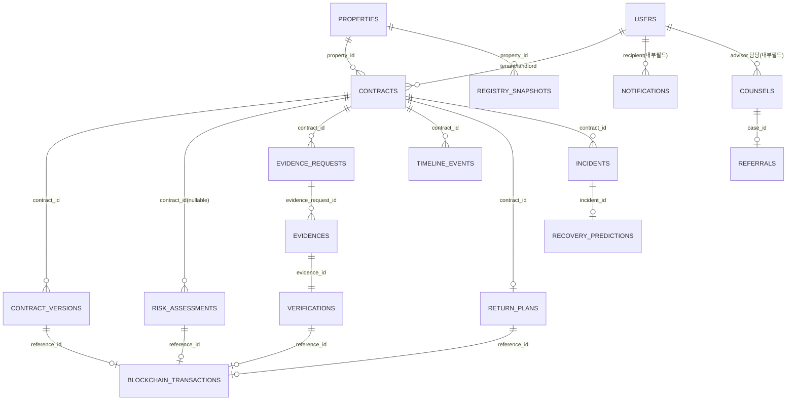

MongoDB는 조인을 강제하지 않으므로 위 도표는 물리적 FK가 아니라 **참조 필드 기반 논리 관계**다. 목록/상세 조회에서 조인이 필요한 경우 `$lookup` Aggregation 또는 Service 계층에서 순차 조회(N+1 방지를 위해 `$in` 배치 조회) 중 하나를 선택하며, 트래픽이 낮은 MVP 단계에서는 Service 계층 순차 조회를 기본으로 한다(19장 각 Endpoint에서 명시).

---

## 14. Collection 상세

각 Collection은 API_Contract의 동명 Entity Schema를 기반으로 하되, `_backend_internal` 표시가 있는 필드는 API 응답에는 노출되지 않는 저장 전용 필드다.

### 14.1 users

| 필드 | 타입 | 필수 | 기본값 | 설명 | 인덱스 | PII | Schema 매핑 |
|---|---|---|---|---|---|---|---|
| _id (user_id) | UUID | Y | uuid4 | | PK | | User.user_id |
| role | str(Enum UserRole) | Y | | | Y | | User.role |
| display_name | str | N | null | | | Y(이름) | User.display_name |
| email | str\|null | N | null | | unique, sparse | Y | User.email |
| password_hash | str | Y(내부) | | bcrypt 해시, 응답 직렬화 제외 | | Y | 없음(writeOnly) |
| is_active | bool | N | true | | | | User.is_active |
| created_at | datetime | Y | now | | | | User.created_at |
| last_login_at | datetime\|null | N | null | | | | User.last_login_at |
| verifier_scope | bool | N | false | `_backend_internal`, advisor의 verifier 서브권한 여부 | | | 없음(신규, 9.3절) |

### 14.2 properties

| 필드 | 타입 | 필수 | 기본값 | 설명 | 인덱스 | PII | Schema 매핑 |
|---|---|---|---|---|---|---|---|
| _id (property_id) | UUID | Y | | | PK | | Property.property_id |
| address | Address(subdoc) | Y | | road_address/jibun_address/adm_cd/bd_mgt_sn/zip_no/dong/ho/coordinate | `address.bd_mgt_sn` | dong/ho는 최소화 | Property.address |
| housing_type | str(Enum) | N | null | | | | Property.housing_type |
| building_age_years | int\|null | N | null | | | | Property.building_age_years |
| created_at | datetime | Y | now | | | | Property.created_at |

### 14.3 contracts

| 필드 | 타입 | 필수 | 기본값 | 설명 | 인덱스 | PII | Schema 매핑 |
|---|---|---|---|---|---|---|---|
| _id (contract_id) | UUID | Y | | | PK | | Contract.contract_id |
| property_id | UUID | Y | | | Y | | Contract.property_id |
| tenant_user_id | UUID | Y | | | Y | | Contract.tenant_user_id |
| landlord_user_id | UUID\|null | N | null | | Y | | Contract.landlord_user_id |
| contract_status | str(Enum) | Y | Draft | | Y | | Contract.contract_status |
| deposit | Int64 | Y | | KRW 원 | | Y(금융) | Contract.deposit |
| contract_start_date | date | Y | | | | | Contract.contract_start_date |
| contract_end_date | date | Y | | D-90 계산 기준 | Y | | Contract.contract_end_date |
| landlord_type | str(Enum) | N | null | | | | Contract.landlord_type |
| housing_type | str(Enum) | N | null | | | | Contract.housing_type |
| latest_contract_version_id | UUID\|null | N | null | | | | Contract.latest_contract_version_id |
| created_at | datetime | Y | now | | | | Contract.created_at |
| updated_at | datetime | Y | now | | | | Contract.updated_at |

### 14.4 contract_versions

| 필드 | 타입 | 필수 | 설명 | Schema 매핑 |
|---|---|---|---|---|
| _id (contract_version_id) | UUID | Y | | ContractVersion.contract_version_id |
| contract_id | UUID | Y | | ContractVersion.contract_id |
| version_label | str(Enum: Draft/Amended/Final/HUGSubmission) | Y | | ContractVersion.version_label |
| document_hash | str | Y | SHA-256, canonical JSON 기반 | ContractVersion.document_hash |
| blockchain_tx_id | UUID\|null | N | | ContractVersion.blockchain_tx_id |
| created_at | datetime | Y | | ContractVersion.created_at |

### 14.5 registry_snapshots

| 필드 | 타입 | 필수 | 설명 | Schema 매핑 |
|---|---|---|---|---|
| _id (registry_snapshot_id) | UUID | Y | | RegistrySnapshot.registry_snapshot_id |
| property_id | UUID | Y | | RegistrySnapshot.property_id |
| api_call_id | UUID\|null | N | api_call_logs 참조 | RegistrySnapshot.api_call_id |
| api_result_status | str(Enum) | Y | | RegistrySnapshot.api_result_status |
| source | str | N | codef/mock/user_upload | RegistrySnapshot.source |
| rights_summary | dict\|null | N | 근저당·압류 요약(원문 비저장) | RegistrySnapshot.rights_summary |
| fetched_at | datetime | Y | | RegistrySnapshot.fetched_at |

### 14.6 risk_assessments

| 필드 | 타입 | 필수 | 설명 | Schema 매핑 |
|---|---|---|---|---|
| _id (risk_assessment_id) | UUID | Y | | RiskAssessment.risk_assessment_id |
| case_id | UUID | Y(unique) | 진단 세션 ID | RiskAssessment.case_id |
| contract_id | UUID\|null | N | | RiskAssessment.contract_id |
| risk_grade | str(Enum) | Y | | RiskAssessment.risk_grade |
| risk_score | float\|null | N | 하위호환용, 신규 클라이언트는 risk_grade 우선 | RiskAssessment.risk_score |
| risk_reasons | list[str] | Y | | RiskAssessment.risk_reasons |
| resolvable_risks | list[str] | N | | RiskAssessment.resolvable_risks |
| unresolvable_risks | list[str] | N | | RiskAssessment.unresolvable_risks |
| ml_prediction | RiskPrediction(subdoc)\|null | N | | RiskAssessment.ml_prediction |
| data_sources | list[str] | N | | RiskAssessment.data_sources |
| fetched_at | datetime | N | | RiskAssessment.fetched_at |
| blockchain_tx_id | UUID\|null | N | | RiskAssessment.blockchain_tx_id |
| created_at | datetime | Y | | RiskAssessment.created_at |
| api_progress | list[APIProgressStep]\|_backend_internal | N | 비동기 진행상태 캐시(폴링 응답용) | RiskDiagnoseRequest 202 응답 내부 |

### 14.7 evidence_requests

| 필드 | 타입 | 필수 | 설명 | Schema 매핑 |
|---|---|---|---|---|
| _id (evidence_request_id) | UUID | Y | | EvidenceRequest.evidence_request_id |
| contract_id | UUID | Y | | EvidenceRequest.contract_id |
| risk_assessment_id | UUID\|null | N | | EvidenceRequest.risk_assessment_id |
| reason | str | Y | | EvidenceRequest.reason |
| evidence_type | str(Enum) | Y | | EvidenceRequest.evidence_type |
| due_date | date\|null | N | | EvidenceRequest.due_date |
| verification_status | str(Enum) | N | Pending | EvidenceRequest.verification_status |
| created_at | datetime | Y | | EvidenceRequest.created_at |

### 14.8 evidences

| 필드 | 타입 | 필수 | 설명 | Schema 매핑 |
|---|---|---|---|---|
| _id (evidence_id) | UUID | Y | | Evidence.evidence_id |
| evidence_request_id | UUID | Y | | Evidence.evidence_request_id |
| file_name | str | Y | | Evidence.file_name |
| document_hash | str | Y | SHA-256 | Evidence.document_hash |
| object_uri | str | Y(내부) | Object Storage 경로, 응답 시 `File.object_uri`로 매핑 | File.object_uri |
| verification_status | str(Enum) | N | Submitted | Evidence.verification_status |
| submitted_at | datetime | Y | | Evidence.submitted_at |
| landlord_user_id | UUID | Y(내부) | 소유권 검사용 | 없음(내부 전용) |

### 14.9 verifications

| 필드 | 타입 | 필수 | 설명 | Schema 매핑 |
|---|---|---|---|---|
| _id (verification_id) | UUID | Y | | Verification.verification_id |
| evidence_id | UUID | Y | | Verification.evidence_id |
| verification_status | str(Enum) | Y | | Verification.verification_status |
| reviewer_comment | str\|null | N | | Verification.reviewer_comment |
| resubmission_required | bool | N | false | | Verification.resubmission_required |
| reviewer_user_id | UUID\|null | N | | Verification.reviewer_user_id |
| blockchain_tx_id | UUID\|null | N | | Verification.blockchain_tx_id |
| decided_at | datetime | Y | | Verification.decided_at |

### 14.10 return_plans

| 필드 | 타입 | 필수 | 설명 | Schema 매핑 |
|---|---|---|---|---|
| _id (return_plan_id) | UUID | Y | | ReturnPlan.return_plan_id |
| contract_id | UUID | Y(unique) | | ReturnPlan.contract_id |
| d_day | int | N | 음수=만료 전 잔여일 | ReturnPlan.d_day |
| landlord_response_status | str(Enum) | N | NotResponded | ReturnPlan.landlord_response_status |
| early_warning | bool | N | false | ReturnPlan.early_warning |
| planned_return_date | date\|null | N | | ReturnPlan.planned_return_date |
| return_method | str\|null | N | | ReturnPlan.return_method |
| note | str\|null | N | | ReturnPlan.note |
| blockchain_tx_id | UUID\|null | N | | ReturnPlan.blockchain_tx_id |
| created_at | datetime | Y | | ReturnPlan.created_at |

### 14.11 incidents

| 필드 | 타입 | 필수 | 설명 | Schema 매핑 |
|---|---|---|---|---|
| _id (incident_id) | UUID | Y | | Incident.incident_id |
| contract_id | UUID | Y | partial unique(활성 1건) | Incident.contract_id |
| incident_status | str(Enum) | Y | IncidentReported | Incident.incident_status |
| incident_reason | str | Y | | Incident.incident_reason |
| recovery_grade | str(Enum)\|null | N | | Incident.recovery_grade |
| delay_risk | str(Enum)\|null | N | | Incident.delay_risk |
| recovery_prediction_id | UUID\|null | N | | Incident.recovery_prediction_id |
| assignee_action_log | list[subdoc]\|null | N | actor_user_id/action/memo/acted_at | Incident.assignee_action_log |
| attachment_ids | list[UUID] | N | [] | IncidentCreateRequest.attachment_ids(저장) |
| reported_at | datetime | Y | | Incident.reported_at |
| closed_at | datetime\|null | N | | Incident.closed_at |

### 14.12 recovery_predictions

| 필드 | 타입 | 필수 | 설명 | Schema 매핑 |
|---|---|---|---|---|
| _id (recovery_prediction_id) | UUID | Y | | RecoveryPrediction.recovery_prediction_id |
| incident_id | UUID | Y | | RecoveryPrediction.incident_id |
| recovery | RecoveryPredictionOutput(subdoc) | Y | | RecoveryPrediction.recovery |
| duration | DurationPrediction(subdoc) | Y | | RecoveryPrediction.duration |
| blockchain_tx_id | UUID\|null | N | | RecoveryPrediction.blockchain_tx_id |
| created_at | datetime | Y | | RecoveryPrediction.created_at |

### 14.13 timeline_events

| 필드 | 타입 | 필수 | 설명 | Schema 매핑 |
|---|---|---|---|---|
| _id (timeline_event_id) | UUID | Y | | TimelineEvent.timeline_event_id |
| contract_id | UUID | Y | | TimelineEvent.contract_id |
| event_type | str(Enum 13종) | Y | | TimelineEvent.event_type |
| occurred_at | datetime | Y | | TimelineEvent.occurred_at |
| blockchain_status | str(Enum)\|null | N | NotRequested | TimelineEvent.blockchain_status |
| blockchain_tx_id | UUID\|null | N | | TimelineEvent.blockchain_tx_id |

### 14.14 blockchain_transactions

| 필드 | 타입 | 필수 | 설명 | Schema 매핑 |
|---|---|---|---|---|
| _id (blockchain_tx_id) | UUID | Y | | BlockchainTransaction.blockchain_tx_id |
| event_type | str | Y | | BlockchainTransaction.event_type |
| reference_id | UUID | Y | unique with event_type | BlockchainTransaction.reference_id |
| chain_id | int\|null | N | 80002(Polygon Amoy, 확인 필요) | BlockchainTransaction.chain_id |
| contract_address | str\|null | N | | BlockchainTransaction.contract_address |
| tx_hash | str\|null | N | | BlockchainTransaction.tx_hash |
| result_hash | str | Y | | BlockchainTransaction.result_hash |
| blockchain_status | str(Enum) | Y | Pending | BlockchainTransaction.blockchain_status |
| is_mock | bool | N | false | BlockchainTransaction.is_mock |
| created_at | datetime | Y | | BlockchainTransaction.created_at |
| confirmed_at | datetime\|null | N | | BlockchainTransaction.confirmed_at |

### 14.15 notifications

| 필드 | 타입 | 필수 | 설명 | Schema 매핑 |
|---|---|---|---|---|
| _id (notification_id) | UUID | Y | | Notification.notification_id |
| notification_type | str(Enum 8종) | Y | | Notification.notification_type |
| title | str | Y | | Notification.title |
| body | str\|null | N | | Notification.body |
| related_reference_id | UUID\|null | N | | Notification.related_reference_id |
| is_read | bool | Y | false | Notification.is_read |
| created_at | datetime | Y | | Notification.created_at |
| recipient_user_id | UUID | Y(내부) | 응답 직렬화 제외, 목록 조회 필터 키 | 없음(부록 H 6번) |

### 14.16 counsels

| 필드 | 타입 | 필수 | 설명 | Schema 매핑 |
|---|---|---|---|---|
| _id (counsel_id) | UUID | Y | | Counsel.counsel_id |
| region_sido | str | Y | | Counsel.region_sido |
| region_sigungu | str\|null | N | | Counsel.region_sigungu |
| deposit_range | str\|null | N | | Counsel.deposit_range |
| housing_type | str(Enum)\|null | N | | Counsel.housing_type |
| counsel_text | str\|null | N | 비식별 처리 | Counsel.counsel_text |
| prediction | CounselPrediction(subdoc)\|null | N | | Counsel.prediction |
| created_at | datetime | Y | | Counsel.created_at |
| assigned_advisor_id | UUID\|null | N(내부) | 상담 현황 담당자 배정 | 없음(내부 전용) |

### 14.17 recovery_groups / entity_risk_groups / system_logs / model_versions / api_call_logs / referrals

| Collection | 핵심 필드 | 비고 |
|---|---|---|
| recovery_groups | recovery_group_id, criteria, region, housing_type, sample_size, average_recovery_rate, average_duration_days, is_low_sample_warning | 배치로 집계 생성(ML 파이프라인 산출물 적재), 개별 CRUD API 없음 |
| entity_risk_groups | entity_group_id, region, housing_type, dart_disclosure_ratio, business_closed_ratio, sample_size, individual_entity_tracking_supported(항상 false), disclaimer | 동일 |
| system_logs | log_id, log_level, message(마스킹 적용), source_module, logged_at | Append-only, TTL 보존기간 확인 필요 |
| model_versions | model_key, model_version(PK 역할), loaded_at, recent_status, average_latency_ms, rule_only_fallback_count_24h | `GET /admin/model-status` 소스, 서버 시작 시 갱신 |
| api_call_logs(내부) | api_call_id, api_name, request_payload(마스킹), response_status, api_result_status, called_at, latency_ms | Contract 19개 엔티티 외 내부 로그 |
| referrals(내부) | referral_id, case_id, reason, assigned_expert, priority, status, created_at | `createReferral` 저장용, 부록 H 4번 참고 |

---

## 15. Repository 설계

| Repository | 주요 Method | 입력 | 반환 | 사용 Service | 트랜잭션 |
|---|---|---|---|---|---|
| UserRepository | `get_by_id`, `get_by_email`, `create`, `update_last_login` | user_id/email | User\|None | AuthService | N |
| PropertyRepository | `get_or_create_by_address`, `get_by_id` | Address | Property | PropertyService, RiskDiagnosisService | Y(get_or_create) |
| ContractRepository | `create`, `get_by_id`, `list_by_user`, `update_status`, `set_latest_version` | contract_id/user_id/filter | Contract, List[Contract] | ContractService | Y(상태전이) |
| ContractVersionRepository | `create`, `list_by_contract` | contract_id | ContractVersion | ContractService | N |
| RegistrySnapshotRepository | `create`, `get_latest_by_property` | property_id | RegistrySnapshot | ExternalAPIGatewayService | N |
| RiskAssessmentRepository | `create`, `get_by_case_id`, `update_progress`, `finalize` | case_id | RiskAssessment | RiskDiagnosisService | Y(finalize) |
| EvidenceRequestRepository | `create`, `get_by_id`, `list_by_contract_or_case`, `update_verification_status` | contract_id/case_id | EvidenceRequest | EvidenceService, VerificationService | N |
| EvidenceRepository | `create`, `get_by_id`, `list_by_request` | evidence_request_id | Evidence | EvidenceService | N |
| VerificationRepository | `create`, `get_by_id`, `get_by_evidence_id` | evidence_id/verification_id | Verification | VerificationService | Y(결정 시 evidence_request 상태 동시 갱신) |
| ReturnPlanRepository | `upsert_by_contract`, `get_by_contract` | contract_id | ReturnPlan | ReturnPlanService, SchedulerService | Y(upsert) |
| IncidentRepository | `create`, `get_by_id`, `get_active_by_contract`, `append_action_log`, `update_status` | contract_id/incident_id | Incident | IncidentService | Y(상태전이) |
| RecoveryPredictionRepository | `create`, `get_by_id`, `find_similar` | incident_id, criteria | RecoveryPrediction, List | RecoveryService | N |
| TimelineRepository | `append_event`, `list_by_contract` | contract_id | TimelineEvent | TimelineService | N(append-only) |
| BlockchainTransactionRepository | `create_pending`, `update_status`, `get_by_id`, `get_by_reference` | reference_id/tx_id | BlockchainTransaction | BlockchainService | Y(Pending→Confirmed 갱신) |
| CounselRepository | `create`, `get_by_id`, `list_queue` | filter | Counsel, List | AdvisorService | N |
| NotificationRepository | `create`, `list_by_recipient`, `mark_read` | recipient_user_id/notification_id | Notification | NotificationService | N |
| AuditLogRepository(=SystemLogRepository) | `append`, `list_by_filter` | log_level/date range | SystemLog | 전역(미들웨어) | N(append-only) |
| ReferralRepository | `create`, `get_by_id` | case_id | Referral | ReferralService | N |
| ModelVersionRepository | `upsert_status`, `get_all` | model_key | ModelMetadata | MLInferenceService, AdminService | N |
| ApiCallLogRepository | `append`, `get_by_id` | api_call_id | ApiCallLog | ExternalAPIGatewayService | N(append-only) |

---

## 16. Service Layer 설계

| Service | 책임 | 주요 Use Case | 호출 Repository | 호출 Adapter | 상태전이 | 관련 operationId |
|---|---|---|---|---|---|---|
| AuthService | 로그인/세션 조회/로그아웃 | 로그인, 내 정보 조회 | UserRepository | - | - | authLogin, authMe, authLogout |
| PropertyService | 주소 정규화 및 물건 식별 | 주소 후보 조회, property 확보 | PropertyRepository | JusoAdapter | - | addressNormalize |
| ContractService | 계약 생성/조회/상태전이 총괄 | 계약 생성, 목록/상세, 타임라인 트리거 | ContractRepository, ContractVersionRepository | BlockchainService(내부호출) | 7.3절 전체 | createContract, listContracts, getContract, getContractTimeline, getReturnPlan(조회 위임) |
| RiskDiagnosisService | 위험진단 오케스트레이션(비동기) | 진단 요청 접수, 외부 API 병렬 호출, 결과 폴링 응답 | RiskAssessmentRepository, RegistrySnapshotRepository | ExternalAPIGatewayService, RuleEngineService, MLInferenceService | Draft→Diagnosed | riskDiagnose, getRiskResult |
| RuleEngineService | 규칙 기반 위험 판단 | Feature→risk_grade/risk_reasons 산출, ML 결과와 보수적 결합 | - | - | - | (RiskDiagnosisService 내부 호출) |
| EvidenceService | 보완요청/증빙 제출 | 보완요청 목록/상세, 증빙 업로드 | EvidenceRequestRepository, EvidenceRepository | ObjectStorageAdapter | Diagnosed→EvidenceRequested→EvidenceSubmitted | listEvidenceRequests, getEvidenceRequest, submitEvidence |
| VerificationService | 증빙 검토·결정 | 검증 상태 조회, 승인/반려/보류 | VerificationRepository, EvidenceRequestRepository | BlockchainService | EvidenceSubmitted→Verified/EvidenceRequested | getVerification, decideVerification |
| TimelineService | 생애주기 이벤트 통합 기록 | 이벤트 append, 조회 | TimelineRepository | - | - | getContractTimeline |
| ReturnPlanService | D-90 반환계획 제출/조회 | 반환계획 제출, 조기경보 판단 | ReturnPlanRepository, ContractRepository | NotificationService | D90Requested→ReturnPlanSubmitted | submitReturnPlan, getReturnPlan |
| IncidentService | 사고 접수 및 HUG 인계 | 사고 등록, 자동 인계, 담당자 액션 기록 | IncidentRepository, ContractRepository | RecoveryService, NotificationService | AtRisk→IncidentReported→TransferredToHUG | createIncident, getIncident |
| RecoveryService | 회수등급·처리기간 우선순위 보조 | 예측 요청, 유사사건 비교, 법인 집단위험 조회 | RecoveryPredictionRepository | MLInferenceService | TransferredToHUG→RecoveryInProgress | getRecoveryPrediction, getSimilarRecoveryCases, getEntityRiskGroup, mlRecoveryPredict/mlDurationPredict 경유 |
| CounselService | 상담 현황/상세 관리 | 큐 조회, 상세+RAG 근거 | CounselRepository | RAGService, MLInferenceService | - | listCounselQueue, getCounselDetail, mlCounselPredict 경유 |
| ReferralService | 전문가 이관 기록 | 이관 생성 | ReferralRepository | NotificationService | - | createReferral |
| NotificationService | 알림 생성/조회/읽음처리 | 이벤트 기반 알림 생성, 목록/읽음 | NotificationRepository | Notification Adapter(Email/InApp) | - | listNotifications, markNotificationRead |
| BlockchainService | 온체인 기록 요청/조회 | anchor 접수, 상태 조회, receipt polling | BlockchainTransactionRepository | Blockchain Adapter(ethers.js 서비스) | NotRequested→Pending→Confirmed/Failed | anchorBlockchain, getBlockchainTransaction |
| ExternalAPIGatewayService | 외부 API 통합 호출·로그·fallback | 주소/등기/시세/건축물/DART/사업자/온비드 조회 | RegistrySnapshotRepository, ApiCallLogRepository | 20장 7개 Adapter | - | (내부, riskDiagnose/addressNormalize 경유) |
| MLInferenceService | 4개 모델 추론 오케스트레이션 | 위험유사도/상담분류/회수/처리기간 추론 | ModelVersionRepository | ML Adapter(21장) | - | mlRiskPredict, mlCounselPredict, mlRecoveryPredict, mlDurationPredict |
| RAGService | 상담·제도 근거 검색 | Hybrid 검색, 근거 반환 | - | RAG Adapter(22장) | - | ragSearch |
| SchedulerService | D-90/D-60/D-30 배치 및 재시도 | 대상 계약 조회, 이벤트 생성 | ContractRepository, ReturnPlanRepository, TimelineRepository | NotificationService, BlockchainService | Monitoring→D90Requested | (배치, REST 미노출) |
| AdminService | 운영 관리 조회 | 사용자/모델상태/블록체인로그/시스템로그 | UserRepository, ModelVersionRepository, BlockchainTransactionRepository, AuditLogRepository | - | - | listAdminUsers, getModelStatus, listBlockchainLogs, listSystemLogs, healthCheck |

각 Service 함수 시그니처는 `async def <verb>_<noun>(self, ctx: RequestContext, ...) -> <ResponseDTO>` 형태의 pseudocode로 구현하며, `RequestContext`에 `current_user`, `request_id`, `trace_id`를 담아 로깅·감사추적에 재사용한다(구체 코드는 작성하지 않음).

---

## 17. Router별 구현 명세 (Tag 기준)

| Tag | 파일 | Prefix | 주요 Dependency | operationId 목록 |
|---|---|---|---|---|
| Auth | `endpoints/auth.py` | `/api/v1/auth` | 없음(login) / `get_current_user`(me, logout) | authLogin, authMe, authLogout |
| Property-Risk | `endpoints/property_risk.py` | `/api/v1` | `require_roles(["tenant"])` 등 19.1 표 | addressNormalize, riskDiagnose, getRiskResult, ragSearch |
| Contract | `endpoints/contract.py` | `/api/v1/contracts` | `require_roles([...])` + ownership | listContracts, createContract, getContract, getContractTimeline, getReturnPlan |
| Evidence-Verification | `endpoints/evidence_verification.py` | `/api/v1` | role별 상이(19.2 표) | listEvidenceRequests, getEvidenceRequest, submitEvidence, getVerification, decideVerification, submitReturnPlan, createIncident, createReferral |
| Advisor | `endpoints/advisor.py` | `/api/v1` | `require_roles(["advisor"])` | listCounselQueue, getCounselDetail |
| HUG | `endpoints/hug.py` | `/api/v1` | `require_roles(["hug_admin"])` | getHugDashboard, getIncident, getRecoveryPrediction, getSimilarRecoveryCases, getEntityRiskGroup |
| Admin | `endpoints/admin.py` | `/api/v1/admin` (`/health`는 루트) | `require_roles(["system_admin"])`(health 제외) | listAdminUsers, getModelStatus, listBlockchainLogs, listSystemLogs, healthCheck |
| Blockchain | `endpoints/blockchain.py` | `/api/v1/blockchain` | `require_internal_service`(anchor) / 로그인 전체+ownership(조회) | anchorBlockchain, getBlockchainTransaction |
| ML | `endpoints/ml.py` | `/api/v1/ml` | 9.3절 내부서비스/역할별 혼합 | mlRiskPredict, mlCounselPredict, mlRecoveryPredict, mlDurationPredict |
| Notification | `endpoints/notification.py` | `/api/v1/notifications` | `get_current_user` + ownership | listNotifications, markNotificationRead |

### 17.1 Property-Risk 상세

| operationId | Method/Path | Router 함수 | Request | Response | Service | Repository | 주요 Collection | 권한 | 트랜잭션 | 비동기 | Mock | 테스트파일 |
|---|---|---|---|---|---|---|---|---|---|---|---|---|
| addressNormalize | POST /address/normalize | `address_normalize` | AddressNormalizeRequest | SuccessResponse[AddressNormalizeResponse] | PropertyService | PropertyRepository | properties | tenant | N | N | Y | test_property_risk.py |
| riskDiagnose | POST /risk/diagnose | `risk_diagnose` | RiskDiagnoseRequest | SuccessResponse[202 data] | RiskDiagnosisService | RiskAssessmentRepository | risk_assessments, registry_snapshots | tenant | Y(초기 문서 생성) | Y(백그라운드 오케스트레이션) | Y | test_property_risk.py |
| getRiskResult | GET /risk/{case_id} | `get_risk_result` | - | SuccessResponse[RiskAssessment] | RiskDiagnosisService | RiskAssessmentRepository | risk_assessments | tenant(본인) | N | N | Y | test_property_risk.py |
| ragSearch | POST /rag/search | `rag_search` | RagSearchRequest | SuccessResponse[RagSearchResponse] | RAGService | - | rag_chunks | tenant, advisor | N | N(짧은 동기 호출) | Y | test_rag.py |

### 17.2 Contract 상세

| operationId | Method/Path | Router 함수 | Request | Response | Service | Repository | 주요 Collection | 권한 | 트랜잭션 | 비동기 | Mock | 테스트파일 |
|---|---|---|---|---|---|---|---|---|---|---|---|---|
| listContracts | GET /contracts | `list_contracts` | Query(page,size,contract_status) | SuccessResponse[Contract[]]+Pagination | ContractService | ContractRepository | contracts | tenant, landlord | N | N | Y | test_contract.py |
| createContract | POST /contracts | `create_contract` | ContractCreateRequest | SuccessResponse[Contract] 201 | ContractService | ContractRepository, PropertyRepository | contracts | tenant | Y | N | Y | test_contract.py |
| getContract | GET /contracts/{contract_id} | `get_contract` | - | SuccessResponse[Contract] | ContractService | ContractRepository | contracts | tenant/landlord(본인), advisor, hug_admin, system_admin(읽기) | N | N | Y | test_contract.py |
| getContractTimeline | GET /contracts/{contract_id}/timeline | `get_contract_timeline` | Query(page,size) | SuccessResponse[TimelineEvent[]] | TimelineService | TimelineRepository | timeline_events | tenant/landlord(본인), advisor, hug_admin | N | N | Y | test_contract.py |
| getReturnPlan | GET /contracts/{contract_id}/return-plan | `get_return_plan` | - | SuccessResponse[ReturnPlan] | ReturnPlanService | ReturnPlanRepository | return_plans | tenant/landlord(본인) | N | N | Y | test_return_plan.py |

### 17.3 Evidence-Verification 상세

| operationId | Method/Path | Router 함수 | Request | Response | Service | Repository | 주요 Collection | 권한 | 트랜잭션 | 비동기 | Mock | 테스트파일 |
|---|---|---|---|---|---|---|---|---|---|---|---|---|
| listEvidenceRequests | GET /evidence-requests | `list_evidence_requests` | Query(case_id,contract_id,page,size) | SuccessResponse[EvidenceRequest[]] | EvidenceService | EvidenceRequestRepository | evidence_requests | tenant, landlord | N | N | Y | test_evidence.py |
| getEvidenceRequest | GET /evidence-requests/{id} | `get_evidence_request` | - | SuccessResponse[EvidenceRequest] | EvidenceService | EvidenceRequestRepository | evidence_requests | tenant, landlord, advisor | N | N | Y | test_evidence.py |
| submitEvidence | POST /evidence | `submit_evidence` | multipart(EvidenceSubmitRequest) | SuccessResponse[Evidence] 201 | EvidenceService | EvidenceRepository, EvidenceRequestRepository | evidences, evidence_requests | landlord | Y | Y(업로드+해시) | Y | test_evidence.py |
| getVerification | GET /verifications/{id} | `get_verification` | - | SuccessResponse[Verification] | VerificationService | VerificationRepository | verifications | landlord(본인), advisor, verifier | N | N | Y | test_verification.py |
| decideVerification | POST /verifications/{id}/decision | `decide_verification` | VerificationDecisionRequest | SuccessResponse[Verification] | VerificationService | VerificationRepository, EvidenceRequestRepository | verifications, evidence_requests | advisor(verifier 서브권한) | Y | Y(블록체인 anchor 트리거) | Y | test_verification.py |
| submitReturnPlan | POST /return-plans | `submit_return_plan` | ReturnPlanCreateRequest | SuccessResponse[ReturnPlan] 201 | ReturnPlanService | ReturnPlanRepository, ContractRepository | return_plans, contracts | landlord | Y | N | Y | test_return_plan.py |
| createIncident | POST /incidents | `create_incident` | IncidentCreateRequest | SuccessResponse[Incident] 201 | IncidentService | IncidentRepository, ContractRepository | incidents, contracts | tenant | Y | Y(자동 인계+예측 요청) | Y | test_incident.py |
| createReferral | POST /referrals | `create_referral` | ReferralCreateRequest | SuccessResponse(SuccessResponse) 201 | ReferralService | ReferralRepository | referrals | advisor | N | N | Y | test_referral.py |

### 17.4 Advisor / HUG / Admin / Blockchain / ML / Notification 상세

| operationId | Method/Path | Router 함수 | Response | Service | 권한 | Mock | 테스트파일 |
|---|---|---|---|---|---|---|---|
| listCounselQueue | GET /counsel-queue | `list_counsel_queue` | SuccessResponse[Counsel[]] | CounselService | advisor | Y | test_advisor.py |
| getCounselDetail | GET /counsel/{counsel_id} | `get_counsel_detail` | SuccessResponse[Counsel] | CounselService | advisor | Y | test_advisor.py |
| getHugDashboard | GET /hug/dashboard | `get_hug_dashboard` | SuccessResponse[집계 dict] | RecoveryService | hug_admin | Y | test_hug.py |
| getIncident | GET /incidents/{incident_id} | `get_incident` | SuccessResponse[Incident] | IncidentService | hug_admin | Y | test_hug.py |
| getRecoveryPrediction | GET /recovery-predictions/{id} | `get_recovery_prediction` | SuccessResponse[RecoveryPrediction] | RecoveryService | hug_admin | Y | test_hug.py |
| getSimilarRecoveryCases | GET /recovery-predictions/{id}/similar | `get_similar_recovery_cases` | SuccessResponse[RecoveryGroup[]] | RecoveryService | hug_admin | Y | test_hug.py |
| getEntityRiskGroup | GET /entity-risk-groups/{id} | `get_entity_risk_group` | SuccessResponse[EntityRiskGroup] | RecoveryService | hug_admin | Y | test_hug.py |
| listAdminUsers | GET /admin/users | `list_admin_users` | SuccessResponse[User[]] | AdminService | system_admin | Y | test_admin.py |
| getModelStatus | GET /admin/model-status | `get_model_status` | SuccessResponse[ModelMetadata[]] | AdminService | system_admin | Y | test_admin.py |
| listBlockchainLogs | GET /admin/blockchain-logs | `list_blockchain_logs` | SuccessResponse[BlockchainTransaction[]] | AdminService | system_admin | Y | test_admin.py |
| listSystemLogs | GET /admin/system-logs | `list_system_logs` | SuccessResponse[SystemLog[]] | AdminService | system_admin | Y | test_admin.py |
| healthCheck | GET /health | `health_check` | HealthCheckResponse | AdminService | 없음(공개) | Y | test_admin.py |
| anchorBlockchain | POST /blockchain/anchor | `anchor_blockchain` | SuccessResponse(202) | BlockchainService | 내부서비스 전용 | Y | test_blockchain.py |
| getBlockchainTransaction | GET /blockchain/{tx_id} | `get_blockchain_transaction` | SuccessResponse[BlockchainTransaction] | BlockchainService | 로그인 전체(본인/system_admin) | Y | test_blockchain.py |
| mlRiskPredict | POST /ml/risk/predict | `ml_risk_predict` | RiskPrediction | MLInferenceService | 내부서비스(Risk Engine) | Y | test_ml.py |
| mlCounselPredict | POST /ml/counsel/predict | `ml_counsel_predict` | CounselPrediction | MLInferenceService | advisor | Y | test_ml.py |
| mlRecoveryPredict | POST /ml/recovery/predict | `ml_recovery_predict` | RecoveryPredictionOutput | MLInferenceService | hug_admin(내부 경유) | Y | test_ml.py |
| mlDurationPredict | POST /ml/duration/predict | `ml_duration_predict` | DurationPrediction | MLInferenceService | hug_admin(내부 경유) | Y | test_ml.py |
| listNotifications | GET /notifications | `list_notifications` | SuccessResponse[Notification[]] | NotificationService | 로그인 전체(본인) | Y | test_notification.py |
| markNotificationRead | POST /notifications/{id}/read | `mark_notification_read` | SuccessResponse | NotificationService | 로그인 전체(본인) | Y | test_notification.py |

40개 `operationId`가 위 17.1~17.4에 모두 매핑되었다(부록 A에서 재확인).

---

## 18. 외부 API Gateway

Router/Service는 외부 API를 직접 호출하지 않고 `ExternalAPIGatewayService`가 아래 7개 Adapter를 통해서만 호출한다.

| Adapter | 대상 | 입력 DTO | 내부 표준 DTO | Timeout | Retry | Circuit Breaker | Cache | Mock Fallback |
|---|---|---|---|---|---|---|---|---|
| JusoAdapter | 도로명주소 API | `{keyword}` | `AddressCandidate[]` | 3s | 2회 | N(MVP) | 최근 성공 주소 캐시(TTL 확인 필요) | `mock_address.json` |
| CodefRegistryAdapter | CODEF 등기부등본 | `{property_id, address}` | `RegistrySnapshot.rights_summary` | 8s | 2회 | Y(연속 실패 N회 시 Open, 확인 필요) | 최근 조회 재사용(동일 property 24h 확인 필요) | `mock_registry_normal/mortgage/seizure/complex_rights.json` |
| RTMSAdapter | 국토부 실거래가 | `{adm_cd, deal_ymd}` | `market_price` Feature | 5s | 2회 | N | 지역 평균 캐시 | `mock_transaction_recent/empty.json` |
| BuildingRegistryAdapter | 건축물대장 | `{sigungu_cd, bjdong_cd, bun, ji}` | `Property.housing_type/building_age_years` | 5s | 2회 | N | 주소별 캐시 | 건축물 Mock profile |
| PublicPriceAdapter | 공동주택/개별주택/개별공시지가 | `{address, base_year}` | `official_price` Feature | 5s | 1회(★★★☆☆ 우선순위) | N | Mock 우선(Contract 3장) | `mock_official_price_success.json` |
| DartAdapter | OpenDART | `{corp_code}` | `dart_disclosure_flag` | 5s | 1회 | N | 24h 캐시(확인 필요) | `mock_dart_found/not_found.json` |
| BusinessStatusAdapter | 사업자등록 상태 | `{b_no}` | `business_closed_flag` | 5s | 2회 | N | 단기 캐시 | `mock_business_closed.json` |
| OnbidAdapter | 온비드 공매 | `{asset_id, region}` | 공매 물건 정보(발표용) | 5s | 1회 | N | 없음 | `mock_onbid_active.json` |

### 18.1 공통 처리 흐름

4장 ⑨의 흐름을 그대로 구현한다: `Call → Timeout(ERROR-008) → Retry 최대 2회 → 실패 시 캐시 확인 → 캐시 없으면 MOCK_MODE 확인 → Mock 또는 업로드 안내(ERROR-009)`. 모든 호출은 `api_call_logs`에 `api_call_id, api_name, request_payload(마스킹), response_status, api_result_status, latency_ms, called_at`를 기록한다. CODEF 실패 시에는 등기부 PDF 업로드 대체 경로(`EvidenceService`의 `EvidenceType=REGISTRY_CANCELLATION_PROOF` 흐름과 별개로, 위험진단 단계에서는 사용자가 등기부 PDF를 업로드하면 `RegistrySnapshot.source=user_upload`로 저장)를 유지한다.

개인정보 마스킹: `request_payload` 저장 시 `b_no`, `owner_name`, 상세주소는 저장하지 않거나 해시 처리한다(13.3절 개인정보 원칙과 동일).

---

## 19. ML Inference Adapter

### 19.1 모델 로딩 원칙

서버 시작(`app.main.py`의 `lifespan`) 시 `models/{model_key}/{model_version}/model.joblib`을 1회 로드하여 앱 상태(`app.state.models`)에 보관한다. 요청마다 재로딩하지 않는다. 모델 파일 경로는 `ML_MODEL_DIR` 환경변수 기준, 개별 모델 경로는 `COUNSEL_MODEL_PATH`, `RECOVERY_MODEL_PATH`, `DURATION_MODEL_PATH`, `RISK_MODEL_PATH`(확인 필요: 위험유사도 모델 경로 변수명 미정)로 관리한다. 로딩 실패 시 해당 모델은 `ModelResultStatus=RuleOnlyFallback`(위험유사도) 또는 `Failed`로 처리하고 `model_versions` 문서의 `recent_status`를 갱신한다.

### 19.2 4개 모델 Adapter

| Adapter | Endpoint | Request DTO | Response DTO | Feature 검증 | 실패 시 Fallback |
|---|---|---|---|---|---|
| RiskSimilarityAdapter | POST /ml/risk/predict | RiskPredictRequest(region_sido 외 선택 Feature) | RiskPrediction | `region_sido` 필수, 나머지 결측 허용(모델이 결측 처리) | RuleOnlyFallback(규칙 엔진 결과만 사용, `ModelResultStatus=RuleOnlyFallback`) |
| CounselClassifierAdapter | POST /ml/counsel/predict | CounselPredictRequest | CounselPrediction | `region_sido` 필수 | InsufficientData 또는 수동분류(advisor 화면에 "수동 분류 필요" 표시) |
| RecoveryRegressorAdapter | POST /ml/recovery/predict | RecoveryPredictRequest | RecoveryPredictionOutput | `claim_amount`, `region_sido` 필수 | Group Median(`recovery_groups` 집계값) 또는 수동검토 |
| DurationRegressorAdapter | POST /ml/duration/predict | DurationPredictRequest | DurationPrediction | `procedure_type`, `claim_amount`, `region_sido` 필수 | Group Median 또는 수동검토 |

각 Adapter는 추론시간(`inference_ms`)을 측정해 `PredictionMetadata`에 채우고, `model_version`을 `model_versions` 컬렉션과 대조해 `X-Model-Version` 응답 헤더로 반환한다. `X-Model-Version` 요청 헤더가 오면 해당 버전 모델을 강제 로드 시도하되, 없으면 `ERROR-002`로 거부한다(확인 필요: 버전 미존재 시 400 계열 처리 방식).

SHAP 설명(`ShapExplanation`)은 사용자 화면에는 `natural_language_summary`만, 관리자 화면에는 `top_factors` 상세까지 노출한다는 ML개발가이드 17장 원칙을 Service 계층에서 role 기준으로 필터링해 구현한다.

---

## 20. RAG Adapter

```
Query → Metadata Filter(topic/region/consultation_stage) → Vector Search(Atlas Vector Search) →
BM25/Keyword Search(텍스트 인덱스) → Hybrid Rank(가중합 또는 RRF) → Top-K(top_k, 기본 3) →
Source 반환(chunk_id, source, pii_removed) → (선택) LLM Summary
```

- 근거 0건이면 결론을 생성하지 않고 빈 배열을 반환한다(`RagSearchResponse.chunks=[]`).
- `RagChunk`마다 `chunk_id`, `source`, `topic`, `consultation_stage`, `excerpt`, `pii_removed`(기본 true)를 포함한다.
- 상담사례(`source=in_consulting`)와 법령/제도 문서(`source=hug_faq`, `source=law` 등, 확인 필요: 정확한 source 값 목록)를 구분해 필터링한다.
- 전문가 이관 기준: `CounselPrediction.expert_referral=true`이거나 RAG 근거가 0건인 고위험 상담은 `ReferralService` 호출을 advisor 화면에 유도한다(자동 이관은 하지 않음, 최종 판단은 advisor).
- LLM 응답(자연어 요약) 원문은 저장을 최소화하고, `RiskAssessment.ml_prediction`이나 `CounselPrediction`에 이미 포함된 구조화 필드만 영속 저장한다(LLM 원문 로그는 `system_logs`에 마스킹 후 저비용 보관, TTL 적용 검토).

### 20.1 Collection 구조 (pgvector 대체)

```
rag_chunks {
  _id: chunk_id (str, 예: "rag_0001"),
  source: str,
  topic: str | null,
  consultation_stage: str | null,   // 계약전 | 계약중 | 사고후
  excerpt: str | null,              // PII 제거 완료
  pii_removed: bool,
  region_code: str | null,
  embedding: float[] (Atlas Vector Search 인덱스 대상, 차원수 확인 필요 — 임베딩 모델 스펙에 종속),
  created_at: datetime
}
```

Atlas Vector Search 인덱스(`vectorSearch` 타입)를 `embedding` 필드에 생성하고, `$vectorSearch` Aggregation Stage로 유사도 검색 후 텍스트 인덱스 검색 결과와 병합(RRF: Reciprocal Rank Fusion)한다. 로컬 개발/오프라인 데모 환경에서는 Atlas 접속이 어려울 수 있으므로 Chroma 컬렉션을 동일 인터페이스(`RAGAdapter.search(query, top_k)`)로 대체 구현할 수 있게 Adapter를 추상화한다(`RAGAdapter` 인터페이스 + `AtlasVectorRAGAdapter`/`ChromaRAGAdapter` 구현체).

---

## 21. Blockchain Adapter

Backend는 Solidity를 구현하지 않는다. Backend 관점에서 다음만 정의한다.

1. Anchor 요청 접수(`POST /blockchain/anchor` — 내부 서비스 전용 호출)
2. Canonical JSON 생성(데이터수집가이드 12장 규칙: `sort_keys({case_id/reference_id, normalized_address_hash, risk_grade, model_version, created_at, ...})`)
3. SHA-256 Hash 산출(`result_hash`)
4. Blockchain Service(별도 ethers.js Node 서비스, `BLOCKCHAIN_SERVICE_URL`) 호출
5. `blockchain_transactions`에 `Pending` 상태로 즉시 저장 후 202 반환
6. 백그라운드(APScheduler 또는 asyncio task)로 `TransactionReceipt` Polling
7. `Confirmed`/`Failed` 갱신, `timeline_events`에 `BlockchainConfirmed` 이벤트 추가
8. 실패 시 Retry(최대 2회, `ERROR-012`) 후에도 실패하면 `Failed` 유지, DB 업무 상태(`ContractStatus` 등)는 별도로 유지(온체인 실패가 업무 흐름을 막지 않음)
9. `MOCK_MODE=true`이면 Mock Chain(`mock_blockchain_tx_success.json` 패턴)으로 즉시 `Confirmed` 처리하고 `is_mock=true`

### 21.1 온체인 전송/비전송 데이터

| 전송(온체인) | 비전송(오프체인 유지) |
|---|---|
| event_type | 계약서/등기부 원문 |
| reference_id(해시화 여부 확인 필요 — Contract `AnchorRequest.reference_id`는 UUID 원문 전달) | 상세주소 |
| result_hash | 주민등록번호 |
| model_version(선택) | 사업자등록번호 원문 |
| issuer(서명 주체, 확인 필요) | 금융정보 |
| timestamp | 상담본문 |

Contract의 `AnchorRequest`는 `reference_id`를 UUID 원문으로 요구하지만, 개발설계보고서 10.4절은 "블록체인에는 원문 ID가 아닌 해시 또는 내부 참조값을 저장할 수 있다"고 되어 있어 약한 긴장이 있다. 이 문서는 Contract를 우선하되, 실제 스마트컨트랙트 전송 시 `reference_id`를 그대로 온체인에 새기지 않고 Blockchain Adapter 내부에서 해시로 변환해 Node 서비스에 전달하는 방식으로 절충한다(Backend DB에는 원문 `reference_id` 보관, 체인에는 해시만 기록 — Blockchain_설계서에서 최종 확정 필요, 확인 필요).

Backend와 Blockchain_설계서의 역할 경계: 본 문서는 Anchor 요청/응답 REST 계약, DB 저장, Receipt Polling까지만 다루며, 스마트컨트랙트 함수명·이벤트·role·배포 스크립트·가스 정책은 Blockchain_설계서_260714.md(미작성)에서 정의한다.

---

## 22. Object Storage

| 저장 대상 | 규칙 |
|---|---|
| 계약서(ContractVersion) | `object_uri`만 DB 저장, 원문은 Private Bucket |
| 증빙(Evidence) | 동일, `document_hash` 필수 |
| 등기부 업로드 대체본 | RegistrySnapshot과 연결(확인 필요: 저장 스키마) |

DB 저장 정보: `file_id, storage_path(object_uri), file_name, mime_type(content_type), size_bytes, sha256_hash(document_hash), uploader_id, created_at, access_scope`. 보안: Private Bucket + Signed URL(만료시간 `확인 필요`, 기본 10분 권장), 확장자·MIME 화이트리스트(`application/pdf, image/png, image/jpeg` 등, 확인 필요), 파일 크기 제한(`확인 필요`, 기본 20MB 권장), 악성 파일 검사는 확장 과제로 표시한다.

---

## 23. D-90 Scheduler

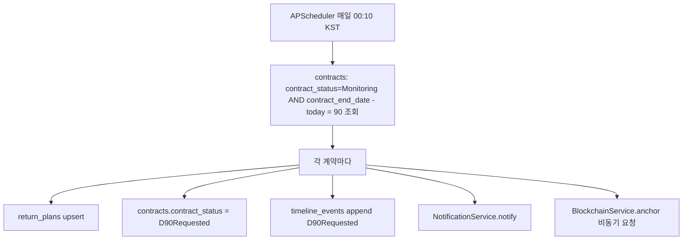

중복 생성 방지: `return_plans.contract_id` unique 인덱스 + Job 실행 전 `scheduler_locks` 컬렉션(간단한 분산 락, `{job_name, locked_at, locked_by}`, TTL 인덱스로 자동 해제)으로 동시 실행을 차단한다.

| 추가 스케줄 | 조건 | 동작 | 범위 |
|---|---|---|---|
| D-60 미응답 재알림 | `D90Requested` 상태이고 `landlord_response_status=NotResponded`이고 D-60 도달 | 재알림 발송 | MVP |
| D-30 위험경보 | 동일 조건, D-30 도달 | `AtRisk` 전이 검토 + `early_warning=true` | MVP |
| 만료일 미반환 확인 | `contract_end_date` 당일에도 `ReturnPlanSubmitted`가 아니면 | `AtRisk` 전이, 사고 접수 유도 알림 | MVP |
| 외부 API 재시도 큐 | `api_call_logs`에서 실패건 재조회 | 백그라운드 재시도 | 확장 |
| 블록체인 재확인 | `blockchain_transactions.blockchain_status=Pending` 장기 체류 | Receipt 재폴링 | MVP(21장과 통합) |

---

## 24. Notification

MVP: In-app(`notifications` 컬렉션 조회) + Email(SMTP). 확장: SMS, Kakao Alimtalk, FCM.

| NotificationType | 트리거 | 채널(MVP) |
|---|---|---|
| EvidenceRequested | 보완요청 생성 | In-app + Email |
| D90Reminder | D-90/D-60/D-30 스케줄러 | In-app + Email |
| VerificationResult | 검증 결정(승인/반려) | In-app + Email |
| RiskAssessed | 위험진단 완료 | In-app |
| IncidentUpdate | 사고 상태 변경 | In-app + Email |
| BlockchainConfirmed | 온체인 확정 | In-app |
| ExpertReferral | 전문가 이관 생성 | In-app |
| SystemAlert | 시스템 경고(관리자) | In-app |

Contract의 `NotificationType`은 8종이며, 개발설계보고서 10.3절의 공통 이벤트(13종)와 완전히 1:1은 아니다(예: `ContractCreated`, `EvidenceSubmitted`, `ContractVersionFinalized`, `TransferredToHUG`, `RecoveryPredictionCreated`는 `NotificationType`에 없음). 이 문서는 Contract의 8종만 사용자 알림으로 발송하고, 나머지는 `timeline_events`에는 기록하되 별도 Notification은 생성하지 않는 것으로 확정한다(필요 시 부록 H 추가 제안 대상).

Retry: 발송 실패 시 최대 2회 재시도(지수 백오프), 최종 실패는 `system_logs`에 `WARN` 기록하고 In-app 알림(있는 경우)만 유지한다. 발송로그는 `notifications` 문서 자체에 `send_status`, `send_attempts`, `last_error`(`_backend_internal`)로 기록한다(확인 필요: Contract Notification 스키마에는 발송상태 필드 없음, 내부 전용 필드로 추가).

---

## 25. 트랜잭션과 정합성

MongoDB는 단일 문서 쓰기는 원자적이며, 여러 컬렉션에 걸친 원자성이 필요할 때는 **Replica Set 기반 Multi-Document Transaction**(`client.start_session()` + `with_transaction`)을 사용한다. Atlas는 기본적으로 Replica Set이므로 트랜잭션 사용에 제약이 없다.

| Use Case | 트랜잭션 범위 |
|---|---|
| 계약 생성 | `properties.get_or_create` + `contracts.insert_one` + `timeline_events.insert_one` |
| 위험진단 결과 저장 | `risk_assessments.update_one`(finalize) + `contracts.update_one`(status=Diagnosed, 계약 연결된 경우) |
| 증빙 제출 | `evidences.insert_one` + `evidence_requests.update_one`(verification_status) |
| 검증 결정 | `verifications.insert_one` + `evidence_requests.update_one` + `contracts.update_one`(상태전이) |
| 반환계획 제출 | `return_plans.upsert` + `contracts.update_one`(status=ReturnPlanSubmitted) |
| 사고 접수 | `incidents.insert_one` + `contracts.update_one`(status=IncidentReported→TransferredToHUG) |
| 상태전이 전체 | `ContractService.transition()` 내부에서 `contracts.update_one` + `timeline_events.insert_one`을 하나의 세션으로 |
| Timeline Event 생성 | 위 각 트랜잭션에 포함(독립 발생 없음) |

블록체인·외부 API 호출은 DB 트랜잭션과 **같은 트랜잭션으로 묶지 않는다**. 권장 방식(Outbox Pattern, 확장 설계):

```
DB Commit(업무 상태 확정)
  → outbox_events 컬렉션에 이벤트 삽입(event_type, payload, status=Pending)
  → Background Worker(APScheduler 폴링 또는 asyncio 태스크)가 outbox_events를 읽어
  → Blockchain Adapter / Notification Adapter 호출
  → 성공 시 outbox_events.status=Sent, 실패 시 재시도 카운트 증가
```

해커톤 MVP에서는 Service 계층에서 DB Commit 직후 `asyncio.create_task(...)`로 단순화해 호출하되(Outbox 컬렉션 생략 가능), 실패 시 최소한 `system_logs`에 남기고 사용자 업무 흐름을 막지 않는다. Outbox 패턴 전체 구현은 확장 과제로 남긴다.

---

## 26. 비동기 처리

| 작업 | MVP 방식 | 확장 |
|---|---|---|
| 위험진단 외부 API 오케스트레이션 | FastAPI `BackgroundTasks` 또는 `asyncio.gather`(7개 Adapter 병렬 호출) | Celery + Redis(호출량 증가 시) |
| ML 추론 | 동기 호출(모델이 메모리 상주, 지연 낮음) | 배치 추론 큐(대량 처리 시) |
| Blockchain Anchor | `BackgroundTasks` + Receipt Polling(APScheduler interval job) | 별도 워커 프로세스 |
| 알림 발송 | `BackgroundTasks` | Celery(대량 발송 시) |
| 파일 Hash 생성 | 요청 처리 중 동기 계산(작은 파일 기준) | 대용량 파일은 백그라운드 |
| D-90 Scheduler | APScheduler(단일 프로세스 cron) | Celery Beat / Cloud Scheduler(다중 인스턴스 배포 시 락 필요) |

선택 기준: 사용자 응답을 즉시 줄 수 없는 작업(외부 API 병렬 조회, 블록체인 confirm 대기)은 비동기·폴링(202+GET) 패턴을 쓰고, 그 외는 동기 처리한다.

---

## 27. Mock Mode

환경변수 `MOCK_MODE=true`(29장 33번 참고)로 전역 제어한다.

| 대상 | Mock 구현 |
|---|---|
| CODEF/실거래가/건축물대장/DART/사업자상태/온비드 | 18장 각 Adapter가 `mock_data/`의 JSON 파일 반환, `APIResultStatus=MockFallback` |
| ML | 4개 Adapter가 `is_mock=true`, `model_result_status`는 시나리오별로 다양하게(21장 및 ML개발가이드 23장 10개 시나리오) |
| RAG | `rag_chunks`에 Mock 데이터 시드, `RagSearchResponse.is_mock=true` |
| Blockchain | Mock Chain(`mock_blockchain_tx_success.json`), 즉시 `Confirmed`, `is_mock=true` |
| Notification | 실제 발송 대신 로그만 기록(`send_status=mock_skipped`) |

모든 Mock 응답은 `is_mock`(또는 `APIResultStatus=MockFallback`/`ModelResultStatus`)을 반드시 포함하고, DB에도 `is_mock`(해당 필드가 있는 Collection: `blockchain_transactions`, ML 관련 subdocument)을 저장해 실제 데이터와 혼동하지 않는다. `RegistrySnapshot.source`, `RiskAssessment.data_sources`도 Mock일 때 `mock`/`user_upload`로 명확히 남긴다.

---

## 28. 로그와 감사 추적

| 로그 종류 | 저장 위치 | 보존/특징 |
|---|---|---|
| Application Log | 표준 출력(JSON) + 배포 플랫폼 로그 수집 | 구조화, PII 마스킹 |
| API Access Log | `api_call_logs`(외부) / 미들웨어 표준출력(내부 REST) | Request-ID 상관관계 |
| External API Log | `api_call_logs` | provider, latency, result_status |
| Model Inference Log | `system_logs` + `model_versions.rule_only_fallback_count_24h` 갱신 | 추론시간, 버전, 결과상태 |
| Security Log | `system_logs`(log_level=WARN/ERROR) | 인증 실패, 권한 거부 |
| Blockchain Log | `blockchain_transactions` 자체가 로그 겸 상태 저장소 | Append + 상태 필드만 갱신 |
| Audit Log | `system_logs` + 각 상태변경 시 `timeline_events` | Append-only |

PII 마스킹 규칙(데이터수집가이드 13장과 동일): 이메일 로컬파트 일부 마스킹(`ab***@example.com`), 이름 `홍*동`, 상세주소(동/호) 로그 제외, 사업자번호는 해시만 로깅. Audit Log 대상: 상태 변경(`ContractStatus`), 검증 결정, 권한 변경(`admin/users` 갱신, 확인 필요: Contract에 사용자 role 변경 API가 없음 — 조회만 존재), 사고 접수, HUG 인계, 계약 버전 확정. 모든 Audit Log는 Append-only이며 수정 API를 제공하지 않는다.

---

## 29. 보안과 개인정보

- 비밀번호: bcrypt/argon2 해시, 원문 미저장.
- JWT Secret, API Key, DB 연결문자열은 환경변수(33장)로만 관리하고 코드/로그에 노출하지 않는다.
- Private Key(블록체인 서명키)는 Backend가 아니라 별도 ethers.js 서비스가 보관한다(Backend는 결과만 수신).
- 상세주소(`dong`, `ho`)는 선택 필드로 최소 저장, 필요 시 애플리케이션 레벨 암호화(AES-256-GCM, 키 관리 `확인 필요`).
- 원문 파일은 Private Storage + Signed URL로만 접근.
- SQL Injection은 해당 없음(NoSQL이나, `$where`/임의 연산자 주입 방지를 위해 사용자 입력을 쿼리 연산자로 직접 사용하지 않는다 — NoSQL Injection 방지).
- CORS는 Frontend 배포 도메인만 허용.
- Rate Limiting은 로그인/증빙 업로드 등 민감 Endpoint에 우선 적용(확인 필요: 구체 임계치).
- 파일 검증: MIME/확장자 화이트리스트, 크기 제한(22장).
- 로그 마스킹은 28장 규칙 적용.
- 온체인에는 개인정보를 저장하지 않는다(21.1절).
- 법률 안내와 법률자문 구분: 본 서비스의 위험진단·근거 제공은 정보 제공이며 법률자문이 아니다. RAG/LLM 응답에는 법률자문 면책 문구를 포함한다(문구 확정은 Frontend/기획 영역, 확인 필요).

---

## 30. 테스트 명세

### 30.1 테스트 유형

| 유형 | 대상 | 도구 |
|---|---|---|
| Unit | Service, Rule Engine, Repository(mongomock-motor), Adapter(httpx mock) | pytest, pytest-asyncio |
| Integration | API+DB(Testcontainers MongoDB), API+Mock Adapter, Scheduler(APScheduler job 단위 실행), Blockchain Mock | pytest, httpx AsyncClient |
| Contract | FastAPI `openapi.json` 산출물과 `API_Contract_260714.yaml` 대조(operationId/path/schema 일치) | `openapi-spec-validator` + 커스텀 diff 스크립트 |
| E2E | 계약 생성→위험진단→증빙→검증→D-90→사고접수→HUG 인계 전체 흐름 | pytest 시나리오 스위트 |
| Security | 권한, 소유권, 파일 접근, 토큰 만료 | pytest + 역할별 fixture |

### 30.2 operationId별 최소 테스트 케이스 (발췌, 전체는 부록 F)

| Test ID | operationId | Given | When | Then | Expected Status | Mock |
|---|---|---|---|---|---|---|
| T-AUTH-01 | authLogin | 유효한 이메일/비밀번호 | POST /auth/login | access_token 발급 | 200 | N |
| T-AUTH-02 | authLogin | 잘못된 비밀번호 | POST /auth/login | 인증 실패 | 401(ERROR-004, 확인 필요: 로그인 실패가 004인지 별도 코드인지) | N |
| T-CONTRACT-01 | createContract | tenant 로그인, 유효 property_id | POST /contracts | Draft 계약 생성 | 201 | N |
| T-CONTRACT-02 | createContract | 동일 (tenant,property,start_date) 중복 | POST /contracts | 중복 차단 | 409(ERROR-007) | N |
| T-RISK-01 | riskDiagnose | tenant, 유효 property_id | POST /risk/diagnose | case_id/risk_assessment_id 발급, 202 | 202 | Y |
| T-RISK-02 | getRiskResult | 존재하지 않는 case_id | GET /risk/{case_id} | 리소스 없음 | 404(ERROR-006) | Y |
| T-EVID-01 | submitEvidence | landlord, 유효 evidence_request_id, PDF 파일 | POST /evidence | 201, document_hash 포함 | 201 | Y |
| T-VER-01 | decideVerification | advisor(verifier 서브권한), decision=approve | POST /verifications/{id}/decision | Verified, evidence_request 갱신, anchor 트리거 | 200 | Y |
| T-VER-02 | decideVerification | advisor(verifier 서브권한 없음) | POST /verifications/{id}/decision | 조회만 허용, 결정 거부 | 403(ERROR-005) | N |
| T-RETURN-01 | submitReturnPlan | landlord, D90Requested 상태 계약 | POST /return-plans | ReturnPlanSubmitted 전이 | 201 | N |
| T-INC-01 | createIncident | tenant, 유효 contract_id, 활성 사고 없음 | POST /incidents | IncidentReported→TransferredToHUG | 201 | Y |
| T-INC-02 | createIncident | 동일 contract_id에 활성 사고 존재 | POST /incidents | 중복 차단 | 409(ERROR-007) | N |
| T-BC-01 | anchorBlockchain | 내부 서비스 토큰 | POST /blockchain/anchor | Pending 저장, 202 | 202 | Y |
| T-BC-02 | anchorBlockchain | 일반 사용자 토큰 | POST /blockchain/anchor | 내부 전용 거부 | 403(ERROR-005) | N |
| T-ML-01 | mlRiskPredict | 정상 Feature | POST /ml/risk/predict | RiskPrediction 반환 | 200 | Y |
| T-ML-02 | mlRiskPredict | 모델 로드 실패 상황(주입) | POST /ml/risk/predict | RuleOnlyFallback | 200(또는 500/ERROR-010, 확인 필요: 위험모델은 라우팅 자체가 내부용이라 실패시 RiskDiagnosisService가 흡수) | Y |
| T-HUG-01 | getHugDashboard | hug_admin | GET /hug/dashboard | 집계 데이터 | 200 | Y |
| T-SEC-01 | getContract | tenant가 타인 계약 조회 | GET /contracts/{id} | 소유권 불일치 | 404(ERROR-006) | N |
| T-SEC-02 | 전체 | 만료 토큰 | 임의 인증 필요 API 호출 | 토큰 무효 | 401(ERROR-004) | N |

---

## 31. 환경변수

`.env.example` 초안(35장 참고). 민감한 값은 실제 값 대신 플레이스홀더만 기록하고, README/문서 어디에도 실제 시크릿을 출력하지 않는다.

```
APP_ENV=local
APP_NAME=hug-anshim-backend
API_V1_PREFIX=/api/v1

SECRET_KEY=
JWT_ALGORITHM=HS256
ACCESS_TOKEN_EXPIRE_MINUTES=60
# REFRESH_TOKEN_EXPIRE_DAYS=   # 미사용(9.1절)

MONGODB_URI=mongodb+srv://<user>:<password>@<cluster>/  # 또는 mongodb://localhost:27017
MONGODB_DB_NAME=hug_anshim
# 대체: SUPABASE_URL / SUPABASE_KEY (PostgreSQL 채택 시 사용 예정이었던 변수, MongoDB 전환으로 미사용)

STORAGE_PROVIDER=supabase   # supabase | s3
STORAGE_BUCKET=
STORAGE_ACCESS_KEY=
STORAGE_SECRET_KEY=

CODEF_CLIENT_ID=
CODEF_CLIENT_SECRET=
JUSO_API_KEY=
DATA_GO_KR_API_KEY=
DART_API_KEY=
ONBID_API_KEY=

ML_MODEL_DIR=./models
RISK_MODEL_PATH=
COUNSEL_MODEL_PATH=
RECOVERY_MODEL_PATH=
DURATION_MODEL_PATH=

RAG_BACKEND=atlas_vector_search   # atlas_vector_search | chroma
LLM_API_KEY=
EMBEDDING_MODEL_NAME=

BLOCKCHAIN_SERVICE_URL=
POLYGON_RPC_URL=
CONTRACT_ADDRESS=
# BLOCKCHAIN_PRIVATE_KEY는 Backend가 아니라 별도 ethers.js 서비스에서만 보관(21장)

MOCK_MODE=true

SMTP_HOST=
SMTP_PORT=587
SMTP_USER=
SMTP_PASSWORD=

REDIS_URL=   # 선택
```

---

## 32. Docker와 배포

- `Dockerfile`: `python:3.11-slim` 베이스, `pip install`(또는 `uv`), 비root 유저 실행, `CMD ["uvicorn", "app.main:app", "--host", "0.0.0.0", "--port", "8000"]`.
- `docker-compose.yml`: `backend`(FastAPI) + `mongo`(로컬 개발용, `mongo:7`) + 선택 `redis`. Health Check는 `/health` 엔드포인트를 Docker `healthcheck` 및 배포 플랫폼(Render/Railway) 헬스체크로 재사용한다.
- Migration 실행: 커스텀 `scripts/migrate.py`(인덱스 생성/시드)를 컨테이너 시작 시 `entrypoint`에서 1회 실행(`schema_migrations` 컬렉션에 적용 이력 기록, 중복 실행 방지).
- Startup Hook: `lifespan`에서 (1) Motor 클라이언트 연결 (2) `init_beanie` (3) ML 모델 로드 (4) APScheduler 시작 (5) RAG 인덱스 연결 확인 순서로 수행하고, 실패 시 `/health`가 `degraded`/`down`을 반환하도록 구성한다.
- 배포: Backend는 Render 또는 Railway(확인 필요: 최종 선택), DB는 MongoDB Atlas, Frontend는 Vercel. CORS `allow_origins`에 Vercel 배포 도메인을 명시적으로 등록한다.
- Rollback: 이전 컨테이너 이미지 태그로 재배포. 인덱스/시드 마이그레이션은 하위호환(필드 추가만 허용, 삭제/타입변경은 별도 점검) 원칙을 지켜 즉시 롤백 가능하게 한다.

---

## 33. 개발 순서

1. FastAPI Skeleton(`main.py`, 라우터 스캐폴딩)
2. Config·MongoDB 연결(Motor client, `init_beanie`)
3. Beanie Document 모델(14장)
4. 인덱스/시드 스크립트(Alembic 대체, 34장)
5. Auth(JWT, 로그인/세션)
6. Contract·Property
7. Mock External API(18장 Adapter의 Mock 경로부터)
8. Risk Diagnosis(Rule Engine 우선, ML 연동은 이후)
9. Evidence·Verification
10. Timeline
11. D-90
12. Incident
13. HUG Dashboard
14. ML Adapter(joblib 연동)
15. RAG(Atlas Vector Search 또는 Chroma)
16. Blockchain Adapter(Mock Chain 우선, 이후 실제 ethers.js 서비스 연동)
17. Notification
18. Admin
19. 통합 테스트(30장)
20. 실 API 교체(MOCK_MODE=false 전환, CODEF 등 실계정 연동)

---

## 34. TODO

| 영역 | TODO |
|---|---|
| 인증 | Refresh Token 확장 여부 최종 결정(부록 H 2번) |
| 위험진단 | `case_id`/`risk_assessment_id` 재진단 관계 확정(부록 H 5번) |
| 블록체인 | `reference_id` 온체인 전송 시 해시 변환 여부를 Blockchain_설계서와 합의(21.1절) |
| 알림 | Notification 8종과 timeline 13종 이벤트 간 발송 정책 최종 확정(24장) |
| Storage | Signed URL 만료시간, 파일 크기/확장자 제한 확정(22장) |
| 스케줄러 | 다중 인스턴스 배포 시 락 전략(현재 단일 프로세스 가정) |
| RAG | 임베딩 모델·차원수, source 값 목록 확정 |
| Admin | 사용자 role 변경 API 부재 확인(28장) — Contract에 없으므로 MVP는 조회만 |
| 배포 | Render vs Railway 최종 선택 |

---

## 35. Definition of Done

각 API 구현은 다음을 모두 만족해야 완료로 인정한다.

- OpenAPI Contract(`operationId`, path, request/response schema, status code)와 정확히 일치
- Pydantic 요청/응답 검증 통과
- Role + Ownership 2단계 권한 검사 구현
- 필요한 경우 MongoDB 세션 기반 트랜잭션 적용(25장)
- 오류코드 매핑(11장) 및 구조화 로그 기록
- `MOCK_MODE` 지원(해당 Endpoint가 `x-mock-supported: true`인 경우)
- Unit Test + Integration Test 작성 및 통과
- `mypy`/`ruff` 통과, 타입 오류 없음
- 관련 환경변수 `.env.example`에 문서화
- README 갱신(신규 Endpoint/모듈 설명)
- 인덱스/시드 스크립트 포함(신규 Collection인 경우)
- 변경 파일 목록을 PR 설명 또는 커밋 메시지에 보고

---

## 36. 한계와 확인사항

- 발제사 CODEF 실계정, HUG 내부 데이터, 정상계약 데이터, 비식별 법인키는 미확보 상태이며 본 문서의 Mock/규칙 기반 설계는 이 한계를 전제로 한다(개발설계보고서 부록 F·E와 동일 인식).
- ML 결과는 "실제 사고확률"이 아니라 과거 사례 기반 위험유사도/패턴 매칭이며, API 응답·로그·UI 문구 어디에도 확률적 단정 표현을 사용하지 않는다.
- 블록체인 `Confirmed` 상태는 법적 효력을 의미하지 않는다.
- 본 서비스는 근저당 말소, 압류, 경매개시, 대위변제 승인, 법원 배당순위 결정, 원화 자동이체를 수행하지 않는다.
- 본 문서에서 `확인 필요`로 표시한 항목(Refresh Token, Signed URL 만료시간, RAG 임베딩 차원수, 배포 플랫폼 최종 선택 등)은 구현 착수 전 발제사/팀 확인이 필요하다.

---

## 37. 최종 산출물

본 작업(문서 작성)의 산출물은 `Backend_API_명세서_260714.md` 단일 파일이다. 이 문서를 기준으로 향후 생성될 산출물은 FastAPI 프로젝트 소스, MongoDB 인덱스/시드 스크립트, Docker 구성, pytest 스위트이며 이번 작업 범위에는 포함하지 않는다.

---

## 부록 A. API-화면 매핑

| operationId | 관련 화면(Frontend_UIUX_명세서) |
|---|---|
| authLogin, authMe, authLogout | AUTH-01 |
| addressNormalize | TEN-01 |
| riskDiagnose, getRiskResult | TEN-02, TEN-03 |
| ragSearch | TEN-03, ADV-01 |
| listContracts, getContract | TEN 홈, LAND 홈(확인 필요: 목록 화면 ID) |
| createContract | TEN-01 |
| getContractTimeline | TEN-05 |
| getReturnPlan, submitReturnPlan | TEN-06, LAND-03 |
| listEvidenceRequests, getEvidenceRequest | TEN-04, LAND-01 |
| submitEvidence | LAND-01 |
| getVerification | LAND-02 |
| decideVerification | ADV-02 |
| createIncident | TEN-07 |
| createReferral | ADV-03 |
| listCounselQueue | ADV-00 |
| getCounselDetail | ADV-01 |
| getHugDashboard | HUG-01 |
| getIncident | HUG-02 |
| getRecoveryPrediction, getSimilarRecoveryCases | HUG-02, HUG-03 |
| getEntityRiskGroup | HUG-04 |
| listAdminUsers | ADM-00 |
| getModelStatus | ADM-01 |
| listBlockchainLogs | ADM-02 |
| listSystemLogs | ADM-03 |
| healthCheck | ADM-01(부가) |
| anchorBlockchain, getBlockchainTransaction | TEN-05, ADM-02 |
| mlRiskPredict | TEN-03(내부) |
| mlCounselPredict | ADV-01 |
| mlRecoveryPredict, mlDurationPredict | HUG-01~03(내부) |
| listNotifications, markNotificationRead | COMMON-01 |

`목록 화면 ID`는 Frontend 문서에 명시적 ID가 없어 확인 필요로 남긴다.

## 부록 B. API-Service-Repository-Table 매핑

17장 17.1~17.4 표가 본 부록을 겸한다(operationId·Router·Service·Repository·Collection·권한·트랜잭션·비동기·Mock·테스트파일 전체 포함). 총 40개 `operationId`가 10개 Tag, 10개 Service 그룹, 22개 Repository, 24개 Collection(19 Contract 엔티티 + `rag_chunks`, `api_call_logs`, `referrals`, `model_versions`, `scheduler_locks`)에 매핑된다.

## 부록 C. 공통 Enum

7.2절 표와 동일(중복 게재 생략). 추가로 Router/Service에서 사용하는 내부 전용 값: `AddressCandidate` 없음(Address 재사용), `EvidenceType` 7종, `DisputeType` 8종, `HousingType` 7종, `LandlordType` 3종, `NotificationType` 8종 — 13장(원본 API_Contract 스키마 절) 참조.

## 부록 D. 오류코드

11장 표와 동일(ERROR-001~012). 세부원인 확장은 11.2절 참조.

## 부록 E. 환경변수 목록

31장 `.env.example` 전체가 본 부록을 겸한다.

## 부록 F. 테스트 케이스

30.2절은 발췌본이며, 전체 40개 `operationId` 각각에 대해 최소 1개의 성공 케이스(200/201/202)와 1개의 실패 케이스(401/403/404/409/422 중 해당 값)를 작성하는 것을 기준으로 한다. 구체 테스트 코드는 이번 문서 범위에 포함하지 않으며, `app/tests/api/test_<tag>.py` 파일 단위로 17장 표의 "테스트파일" 컬럼을 따른다.

## 부록 G. 파일별 수정 범위

AI 에이전트가 기능 단위로 작업할 때 아래 범위 밖 파일은 수정하지 않는 것을 원칙으로 한다.

```
REQ-AUTH:
  app/api/v1/endpoints/auth.py
  app/services/auth_service.py
  app/repositories/user_repository.py
  app/schemas/auth.py
  app/models/user.py
  app/tests/api/test_auth.py

REQ-PROPERTY-RISK:
  app/api/v1/endpoints/property_risk.py
  app/services/property_service.py
  app/services/risk_diagnosis_service.py
  app/services/rule_engine_service.py
  app/repositories/property_repository.py
  app/repositories/risk_assessment_repository.py
  app/repositories/registry_snapshot_repository.py
  app/integrations/external_api/**
  app/integrations/ml/risk_adapter.py
  app/models/property.py, app/models/risk_assessment.py, app/models/registry_snapshot.py
  app/schemas/property_risk.py
  app/tests/api/test_property_risk.py

REQ-CONTRACT:
  app/api/v1/endpoints/contract.py
  app/services/contract_service.py
  app/services/timeline_service.py
  app/repositories/contract_repository.py
  app/repositories/contract_version_repository.py
  app/repositories/timeline_repository.py
  app/models/contract.py, app/models/contract_version.py, app/models/timeline_event.py
  app/schemas/contract.py
  app/tests/api/test_contract.py

REQ-EVIDENCE-VERIFICATION:
  app/api/v1/endpoints/evidence_verification.py
  app/services/evidence_service.py
  app/services/verification_service.py
  app/services/return_plan_service.py
  app/services/incident_service.py
  app/services/referral_service.py
  app/repositories/evidence_request_repository.py
  app/repositories/evidence_repository.py
  app/repositories/verification_repository.py
  app/repositories/return_plan_repository.py
  app/repositories/incident_repository.py
  app/repositories/referral_repository.py
  app/integrations/storage/**
  app/models/evidence_request.py, app/models/evidence.py, app/models/verification.py,
  app/models/return_plan.py, app/models/incident.py, app/models/referral.py
  app/schemas/evidence_verification.py
  app/tests/api/test_evidence.py, test_verification.py, test_return_plan.py, test_incident.py, test_referral.py

REQ-ADVISOR-HUG:
  app/api/v1/endpoints/advisor.py, app/api/v1/endpoints/hug.py
  app/services/counsel_service.py
  app/services/recovery_service.py
  app/repositories/counsel_repository.py
  app/repositories/recovery_prediction_repository.py
  app/models/counsel.py, app/models/recovery_prediction.py, app/models/recovery_group.py, app/models/entity_risk_group.py
  app/schemas/advisor.py, app/schemas/hug.py
  app/tests/api/test_advisor.py, test_hug.py

REQ-ML:
  app/api/v1/endpoints/ml.py
  app/services/ml_inference_service.py
  app/integrations/ml/**
  app/repositories/model_version_repository.py
  app/models/model_version.py
  app/schemas/ml.py
  app/tests/api/test_ml.py

REQ-RAG:
  app/api/v1/endpoints/property_risk.py (ragSearch 부분만)
  app/services/rag_service.py
  app/integrations/rag/**
  app/tests/integrations/test_rag.py

REQ-BC:
  app/api/v1/endpoints/blockchain.py
  app/services/blockchain_service.py
  app/integrations/blockchain/**
  app/repositories/blockchain_transaction_repository.py
  app/models/blockchain_transaction.py
  app/schemas/blockchain.py
  app/tests/integrations/test_blockchain.py

REQ-NOTIFICATION:
  app/api/v1/endpoints/notification.py
  app/services/notification_service.py
  app/integrations/notification/**
  app/repositories/notification_repository.py
  app/models/notification.py
  app/schemas/notification.py
  app/tests/api/test_notification.py

REQ-ADMIN:
  app/api/v1/endpoints/admin.py
  app/services/admin_service.py
  app/repositories/audit_log_repository.py
  app/repositories/api_call_log_repository.py
  app/models/system_log.py
  app/schemas/admin.py
  app/tests/api/test_admin.py

REQ-SCHEDULER:
  app/scheduler/**
  app/services/scheduler_service.py
  app/tests/integrations/test_scheduler.py
```

다른 영역 파일은 위 범위 밖에서는 수정하지 않는다. `app/core/**`, `app/db/**`, `app/middleware/**`, `app/utils/**`는 공통 영역으로 별도 `REQ-CORE` 작업으로만 수정한다.

## 부록 H. OpenAPI 수정 제안

`API_Contract_260714.yaml` 자체는 이번 작업에서 수정하지 않으며, 아래는 향후 계약 개정 시 반영을 제안하는 목록이다.

**1. 헤더 네이밍 불일치**
- 문제점: 요청 헤더 파라미터명은 `Request-ID`/`Trace-ID`(X- 접두어 없음)인데 응답 헤더 컴포넌트명은 `X-Request-ID`/`X-Trace-ID`(X- 접두어 있음)로 정의되어 있다.
- 영향 범위: 클라이언트/서버 헤더 매핑 코드에서 혼선 가능, OpenAPI 코드 생성기가 서로 다른 이름으로 인식.
- 권장 수정안: 요청·응답 헤더명을 `X-Request-ID`/`X-Trace-ID`로 통일(또는 반대로 통일).
- 대상: `components.parameters.RequestIdHeaderParam`, `TraceIdHeaderParam`, `components.headers.RequestIdHeader`, `TraceIdHeader`, 각 operation의 `responses.*.headers`.

**2. Refresh Token 미지원**
- 문제점: `LoginResponse`에 `refresh_token` 필드가 없고, 갱신 Endpoint도 없다. Access Token 수명 3600초 후 강제 재로그인이 필요하다.
- 영향 범위: 장시간 세션이 필요한 HUG/Admin 대시보드 사용성 저하.
- 권장 수정안: `POST /auth/refresh` 신설, `LoginResponse.data.refresh_token`(선택 필드) 추가.
- 대상: `components.schemas.LoginResponse`, `paths` 신규 `/auth/refresh`.

**3. Idempotency-Key 헤더 부재**
- 문제점: 계약 생성/증빙 제출/검증 결정/반환계획 제출/사고 접수/블록체인 anchor 등 상태 변경 API에 표준 `Idempotency-Key` 헤더가 없어 네트워크 재시도 시 중복 생성 위험이 있다(본 문서 10.5절에서 자연키 unique 인덱스로 완화했으나 완전한 대체는 아니다).
- 영향 범위: 위 6개 Endpoint.
- 권장 수정안: `components.parameters.IdempotencyKeyHeaderParam` 신설 후 해당 Endpoint에 선택 파라미터로 추가.
- 대상: `createContract`, `submitEvidence`, `decideVerification`, `submitReturnPlan`, `createIncident`, `anchorBlockchain`.

**4. Referral 엔티티 스키마 부재**
- 문제점: `createReferral`(POST /referrals) 응답이 `SuccessResponse`(느슨한 `data: object`)만 참조하고, 전용 `Referral` 엔티티 스키마와 `GET /referrals/{referral_id}` 조회 Endpoint가 없다. 개발설계보고서·본 문서는 `referral_id`를 공통 식별자로 다루지만 계약에는 대응 스키마가 없다.
- 영향 범위: 상담 이관 이력 추적/재조회 불가, HUG·Admin 화면에서 이관 이력 표시 어려움.
- 권장 수정안: `Referral` 엔티티 스키마(`referral_id, case_id, reason, assigned_expert, priority, status, created_at`) 추가, `createReferral` 응답을 해당 스키마로 대체, `GET /referrals/{referral_id}` 신설.
- 대상: `components.schemas`(신규 `Referral`), `paths./referrals.post.responses`, `paths` 신규 `/referrals/{referral_id}`.

**5. RiskAssessment `case_id`/`risk_assessment_id` 관계 불명확**
- 문제점: 최초 진단 시 두 값이 함께 발급되나, 재진단(동일 계약·물건에 대한 재평가) 시 `case_id` 유지 여부와 `risk_assessment_id` 신규 발급 여부가 명시되어 있지 않다.
- 영향 범위: 위험진단 이력 관리, `GET /risk/{case_id}`가 항상 최신 1건만 반환하는지 이력 배열을 반환하는지 불명확.
- 권장 수정안: `RiskAssessment.description` 또는 별도 설명에 재진단 정책을 명문화(예: "재진단 시 새 case_id 발급, 이전 이력은 `GET /contracts/{id}/timeline`으로 조회").
- 대상: `components.schemas.RiskAssessment`, `paths./risk/{case_id}`.

**6. Notification에 수신자 식별 필드 부재**
- 문제점: `Notification` 엔티티 스키마에 수신자(`recipient_user_id` 등)를 나타내는 필드가 없다. `listNotifications`는 "로그인 전체 역할(본인 알림만)"로 필터링되어야 하는데 응답 스키마상 본인 여부를 나타낼 필드가 없다(서버 내부적으로는 필터링 가능하나, 계약만 보면 응답에 수신자 정보가 누락).
- 영향 범위: 클라이언트가 여러 계정 알림을 혼용해 캐싱할 위험, 계약 문서만으로는 필터링 근거를 알 수 없음.
- 권장 수정안: `Notification` 스키마에 읽기 전용 `recipient_user_id`(UUID) 필드 추가는 개인정보 노출 우려가 있으므로, 대신 스키마 설명에 "본인 알림만 반환됨을 서버가 보장"이라는 문구를 명시.
- 대상: `components.schemas.Notification`.

**7. 외부 API 세부 실패 원인 표준 필드 부재**
- 문제점: `ErrorResponse.error.error_code`는 12종 공통 코드만 정의하고, 외부 API(CODEF/실거래가/건축물대장 등) 중 어느 것이 실패했는지 표준 필드가 없다(`details`는 `additionalProperties: true`로 자유 형식).
- 영향 범위: 프런트엔드가 실패한 특정 외부 API를 특정해 안내 문구를 다르게 표시하기 어려움.
- 권장 수정안: `ErrorResponse.error.details`에 `provider`(enum: codef/juso/rtms/building_registry/dart/business_status/onbid), `internal_reason`(string) 표준 필드를 문서화(스키마 강제까지는 아니어도 `x-` 확장으로 명시).
- 대상: `components.schemas.ErrorResponse`, `x-error-codes`.

---

## 39. 완료 검수 체크리스트

| # | 항목 | 확인 |
|---|---|---|
| 1 | API Contract의 모든 operationId(40개) 반영 | Y(17장, 부록 A·B) |
| 2 | Endpoint 개수(39 path / 40 operation) 일치 | Y |
| 3 | 모든 Entity Schema(19개)가 DB 또는 DTO와 연결 | Y(14장) |
| 4 | 논리 데이터 모델(ERD 대응) 작성 | Y(13.3절) |
| 5 | 모든 Collection의 PK·참조필드 정의 | Y(14장) |
| 6 | Service·Repository 책임 구분 | Y(6, 15, 16장) |
| 7 | Role·Ownership 권한 정의 | Y(9장) |
| 8 | 외부 API 실패와 Mock Fallback 정의 | Y(18, 27장) |
| 9 | ML·RAG·Blockchain 연결 정의 | Y(19, 20, 21장) |
| 10 | D-90 Scheduler 정의 | Y(23장) |
| 11 | 테스트 명세가 operationId와 연결 | Y(30장, 부록 F) |
| 12 | 파일별 수정 범위 | Y(부록 G) |
| 13 | Definition of Done | Y(35장) |
| 14 | Markdown/Mermaid 문법 오류 없음 | 저장 후 재검증 예정(39.1절) |
| 15 | UTF-8 저장 | 저장 후 재검증 예정 |

---

## 40. 구현 동기화 (2026-07-20)

이 장은 2026-07-20 기준 **실제 구현된 코드**와 본 설계 문서의 편차를 기록한다. 17장 설계표와
다른 부분은 이 장이 우선한다. 전체 테스트: `backend/tests` 42개 통과.

### 40.1 신규 구현 엔드포인트

| Method/Path | 권한 | 내용 | 파일 | 테스트 |
|---|---|---|---|---|
| POST /api/v1/ml/recovery/predict | hug_admin, system_admin | 채권 단건 회수율·등급(LOW/MED/HIGH)·소요일·우선순위 스코어(포트폴리오 백분위)·SHAP 상위3요인 | `endpoints/ml.py`, `services/ml_service.py` | test_ml_hug.py |
| POST /api/v1/ml/counsel/classify | advisor, hug_admin, system_admin | 상담 텍스트 → 분쟁유형/진행단계 top3 확률 (설계의 mlCounselPredict 대응) | 〃 | 〃 |
| GET /api/v1/ml/models/info | advisor, hug_admin, system_admin | joblib 모델 목록 + 학습 지표(ml_metrics_*.json) | 〃 | 〃 |
| GET /api/v1/hug/dashboard/summary | hug_admin, system_admin | KPI: 채권수·청구총액·기대회수총액·회수율/소요일 중앙값·등급분포·상품별 잔고 | `endpoints/hug.py`, `services/hug_dashboard_service.py` | 〃 |
| GET /api/v1/hug/dashboard/priority | 〃 | 우선순위 스코어 내림차순 채권 목록 (grade/claim_type 필터, 페이지네이션) | 〃 | 〃 |
| GET /api/v1/hug/dashboard/region-risk | 〃 | 시군구별 실집계 사고율(HOUSTA) 지도 데이터 (sido 필터) | 〃 | 〃 |
| GET /api/v1/hug/dashboard/issuance | 〃 | 발급 시계열 (sido/housing_type 필터) | 〃 | 〃 |
| GET /api/v1/hug/dashboard/victims | 〃 | 전세사기피해주택 시군구 분포 (year 필터) | 〃 | 〃 |
| POST /api/v1/incidents | tenant | 사고 접수(유형 5종). 계약 연결 시 contract_status=IncidentReported 전이+타임라인 기록 | `endpoints/incidents.py`, `services/incident_service.py` | test_incidents_counsel_notifications.py |
| GET /api/v1/incidents | tenant(본인)/hug_admin(전체) | 상태·유형 필터 목록 | 〃 | 〃 |
| GET /api/v1/incidents/{id} | 본인, advisor, hug_admin | 상세+타임라인+상태별 next_steps(포털 피해지원 절차 기반) | 〃 | 〃 |
| PATCH /api/v1/incidents/{id}/status | hug_admin, system_admin | Received→Reviewing→TransferredToRecovery→Closed 전이 검증, 위반 시 422 | 〃 | 〃 |
| POST /api/v1/counsel-queue | tenant, landlord | 상담 이관 접수. ML 자동분류 태깅+우선순위 규칙(high/normal) | `endpoints/counsel_queue.py`, `services/counsel_queue_service.py` | 〃 |
| GET /api/v1/counsel-queue | advisor·hug(전체, high→오래된순) / tenant(본인) | 상태·우선순위 필터 | 〃 | 〃 |
| GET /api/v1/counsel-queue/{id} | 〃 | 상세 (설계의 getCounselDetail 대응, prefix 통일) | 〃 | 〃 |
| PATCH /api/v1/counsel-queue/{id} | advisor, hug_admin, system_admin | Waiting→InProgress→Answered→Closed + 답변 등록(Answered 시 요청자 알림) | 〃 | 〃 |
| GET /api/v1/notifications | 로그인 전체(본인) | 목록+unread_count (unread_only 필터) | `endpoints/notifications.py`, `services/notification_service.py` | 〃 |
| PATCH /api/v1/notifications/{id}/read | 〃 | 읽음 처리 (설계는 POST /read였으나 PATCH로 통일) | 〃 | 〃 |
| PATCH /api/v1/notifications/read-all | 〃 | 전체 읽음 | 〃 | 〃 |
| POST /api/v1/notifications/demo-seed | 〃 (MOCK_MODE 한정) | 데모용 샘플 알림 3종(등기변동·확정일자·보증만기, 본문에 "(모의 알림)" 표기) | 〃 | 〃 |

### 40.2 설계 대비 주요 편차

1. **ML 서빙 방식**: 19장의 별도 ML Inference 서비스 대신, FastAPI 프로세스 내 joblib 로드
   + 스레드풀 추론으로 구현했다(`DATA_DIR` 설정으로 아티팩트 경로 주입). `/ml/risk/predict`,
   `/ml/duration/predict`는 미구현 — 위험진단은 rule-based 엔진이 담당하고 소요기간은
   recovery/predict 응답에 포함된다.
2. **HUG 대시보드**: 설계의 단일 `GET /hug/dashboard` 대신 용도별 5개 서브경로로 분리했다.
   데이터 소스는 DB가 아니라 `processed/` 산출물 CSV(프로세스 캐시)다.
3. **위험진단 신호 2종 추가**(설계 외 확장): `risk_engine`에 ①지역 사고율(HOUSTA 실집계,
   adm_cd 5자리→주소 토큰 순 매칭, ≥3.0% high/≥2.0% medium) ②악성임대인 공개명단 매칭
   (name_sido 일치 시 +30·HIGH 강제, name_only는 +15·동명이인 안내)을 추가했다.
   `source_status`에 `region_risk`, `landlord_disclosure` 키가 추가되었다.
4. **알림 생성원**: 24장의 D-90 스케줄러 연동 대신 도메인 이벤트(사고 접수/상태 변경,
   상담 답변)와 demo-seed로 한정했다(모니터링 배치는 미구현).
5. **공용 데이터 로더**: `services/public_data.py`가 HOUSTA·악성임대인·우선순위 CSV를
   glob 최신 파일 기준으로 lru_cache 로드한다. 파일 부재 시 신호 missing 처리(서비스 불사).

### 40.3 신규 컬렉션

| Collection | 인덱스 | 비고 |
|---|---|---|
| incidents | (reporter_user_id, created_at desc), (status) | timeline 배열 내장 |
| counsel_queue | (status, priority_rank, created_at), (requester_user_id) | classification 내장, priority_rank 0=high |
| notifications | (user_id, created_at desc), (user_id, is_read) | |

### 40.4 등기부 조회·전자계약 (2026-07-20 추가 구현)

| Method/Path | 권한 | 내용 |
|---|---|---|
| POST /api/v1/properties/{id}/registry/refresh | 로그인 전체 | **CODEF 샌드박스 실호출**(OAuth+RSA 암호화 password) → 등기부 파싱(채권최고액 dedupe 합산, 활성 압류·가압류 행 집계, 권리 키워드) → registry_snapshots에 `source_system="api_live"` 저장. `?deposit=` 지정 시 보증금 대비 채권최고액 비율 계산, `?scenario=normal|mortgage|complex_rights`는 mock 경로. 실패 시 mock 폴백 |
| GET /api/v1/properties/{id}/registry/latest | 로그인 전체 | 최신 등기부 스냅샷 조회 |
| POST /api/v1/esign/sessions | tenant(본인 계약) | 전자계약 공동세션 생성. **AI 특약 추천** 자동 생성(위험진단 risk_factors 코드→특약 템플릿 + 상담사례 빈출 특약 2종), 4자리 세션 코드 발급 |
| POST /api/v1/esign/sessions/join | landlord | 세션 코드로 참여. 계약 landlord_user_id 미지정 시 바인딩 |
| GET /api/v1/esign/sessions/{id} | 세션 당사자 | 상태 폴링(접속·특약·서명·앵커) — 동시접속 표시는 폴링 기반 |
| POST /api/v1/esign/sessions/{id}/terms | 세션 당사자 | 특약 수동 제안(제안자 자동 agree) |
| POST /api/v1/esign/sessions/{id}/terms/{term_id} | 세션 당사자 | agree/withdraw. 상대방 제안 특약은 철회 불가(403), 양측 agree 시 확정 |
| POST /api/v1/esign/sessions/{id}/sign | 세션 당사자 | 서명. 양측 미접속(409)·미합의 특약 존재(409) 차단. **양측 서명 완료 시 canonical JSON 계약문서의 SHA-256을 BlockchainService로 자동 앵커링**(event_type=ContractSigned, 멱등) → 계약 상태 ContractFinalized + 타임라인 + 양측 알림 |
| POST /api/v1/esign/contracts/{contract_id}/verify | 당사자·advisor·hug_admin | 저장 문서 해시 재계산 vs 온체인(모의) 해시 비교. `tampered_fields`(예: {"deposit": 200000000}) 지정 시 변조 불일치 데모 |

- CODEF 검증 결과(2026-07-20): 샌드박스 OAuth 200, real-estate-register/status CF-00000 성공.
  샌드박스는 주소와 무관하게 고정 샘플 등기부(집합건물·근저당 8건 합산 2.8억·활성 압류 6행)를
  반환하므로 데모에 충분. 파서는 휴리스틱이며 features.parser_note에 한계 명시.
- `.env`의 CODEF 키 4종이 비어 있던 문제를 원본(backend_env_설정_260714.txt)에서 보충함.
- 신규 컬렉션 `esign_sessions` 인덱스: (contract_id), (session_code).
- 블록체인은 BLOCKCHAIN_MODE=mock 기본(오프라인 시연 가능). Polygon 어댑터는 스켈레톤 유지.
