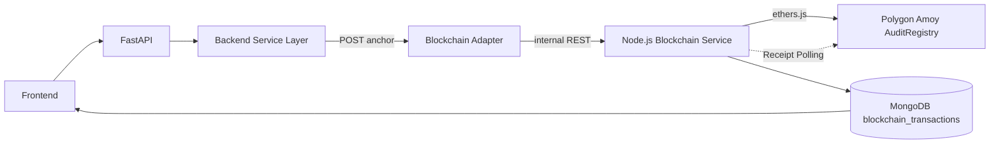
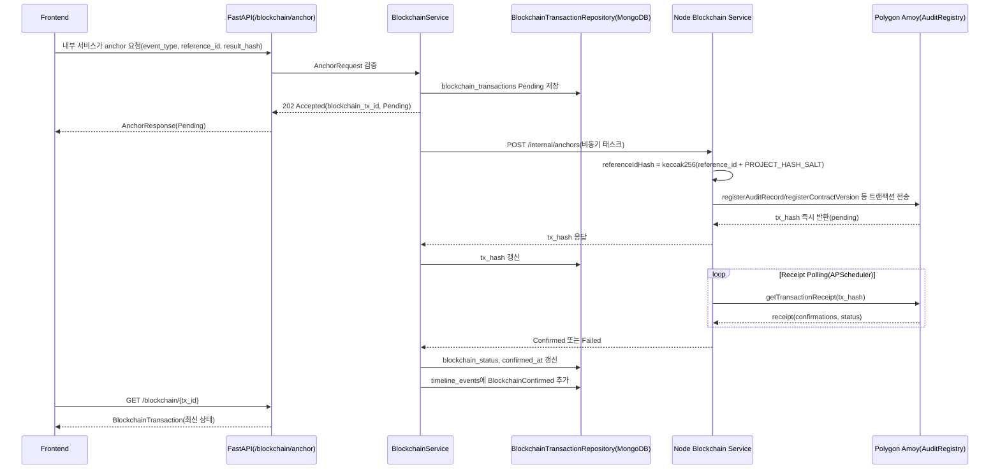
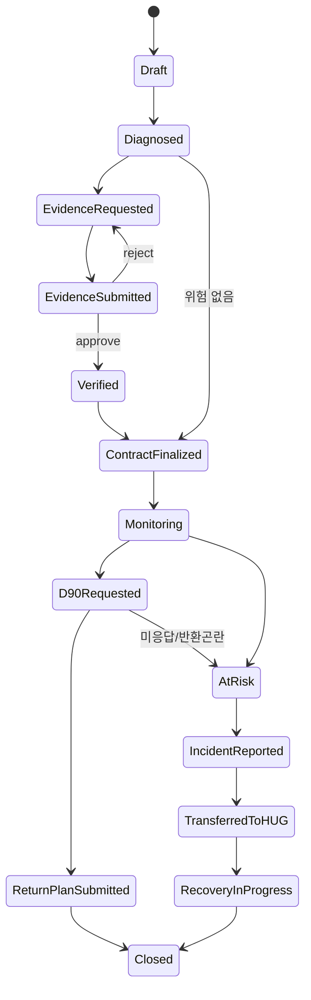
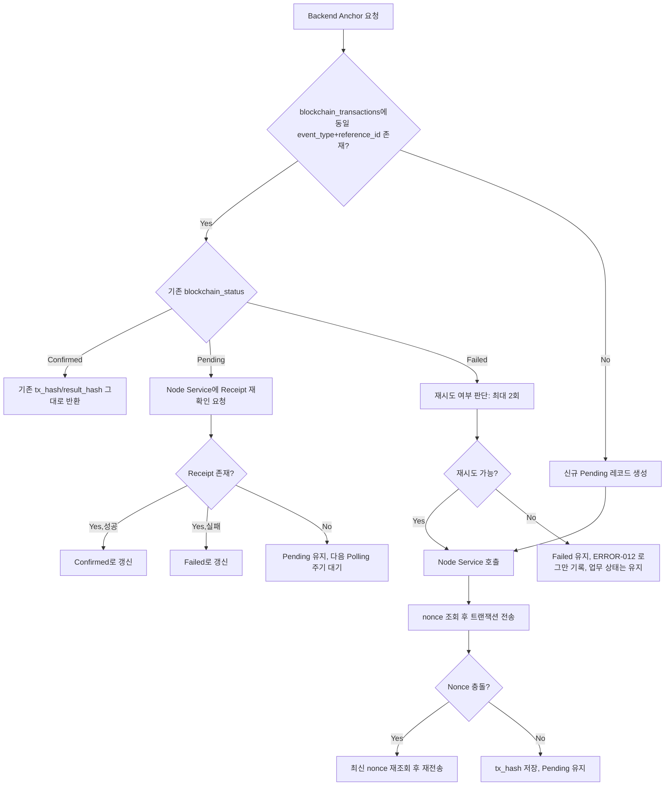
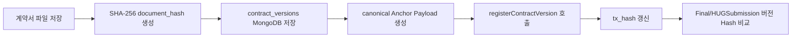
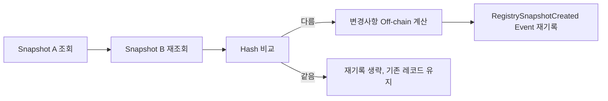
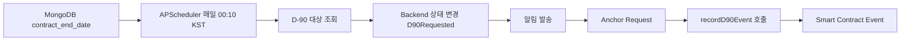
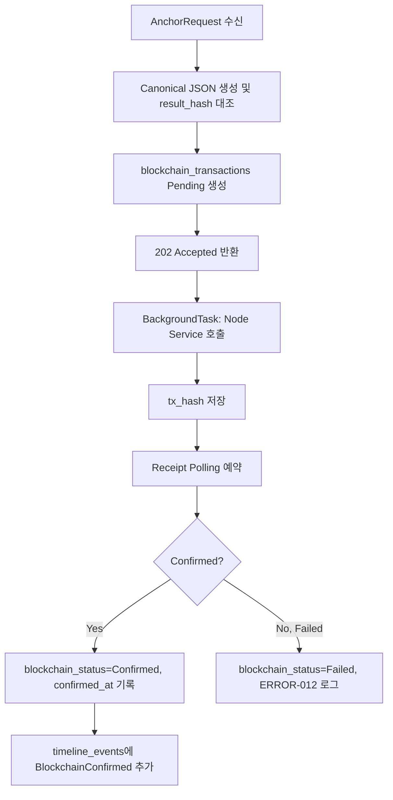
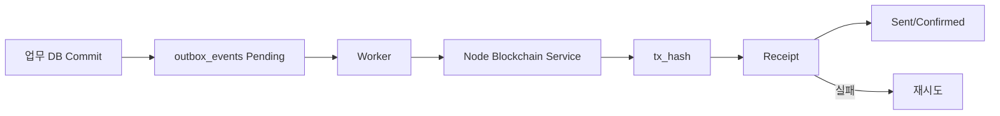

# HUG × 아이엔 안심주거 생태계
## Blockchain 설계서

문서 버전 1.0 · 작성 기준일 2026-07-14(KST) · 형식 Markdown(UTF-8)

> **⚠️ [260721 갱신 공지]** anchor/조회는 mock 모드로 구현·동작 중(`POST /blockchain/anchor`, `GET /blockchain`,
> `GET /blockchain/{tx_id}`). 본 설계서 이후 전자계약 esign 도메인 7종이 추가되어 계약서 해시 앵커·위변조 검증의
> 실제 진입점은 `POST /esign/contracts/{contract_id}/verify`다. 목록: `API_Contract_260721.yaml`.

---

## 0. 문서 개요

### 0.1 목적

본 문서는 HUG 안심전세 체인의 블록체인 영역을 실제로 구현 가능한 수준까지 상세화한 설계서다. Solidity Smart Contract, Hardhat 프로젝트, Polygon Amoy 배포, ethers.js 기반 Node.js Blockchain Service, FastAPI Blockchain Adapter 연동, MongoDB 트랜잭션 상태 동기화, Mock Chain, 테스트, 배포·검증·업그레이드, 개인정보 보호를 다룬다.

블록체인은 "문서 해시를 저장하는 저장소"로 축소되지 않는다. 본 설계에서 블록체인은 **계약·검증·상태변경의 공동 감사장부이자 임대차 계약 생애주기의 신뢰 레이어**로 기능하되, 법원·은행·HUG의 법적 권한을 대신하지 않는다.

### 0.2 프로젝트 범위

계약 전 위험진단 → 위험조건 보완 → 증빙·API 검증 → 계약 버전 확정 → 계약 중 모니터링 → D-90 반환계획 → 사고 발생 → HUG 채권관리 인계로 이어지는 전세 계약 생애주기 중, **계약서 버전, 외부 조회 스냅샷, 증빙 검증, 상태변경, D-90 이력, 사고·인계 이력을 감사 가능한 형태로 온체인에 공증**하는 것이 본 문서의 범위다.

### 0.3 문서 책임

담당: 블록체인 사용 목적, Smart Contract 구조·State Machine·Role·Access Control, 온체인/오프체인 데이터 구분, 해시 생성·검증 규칙, Solidity Storage·함수·이벤트·에러, 중복 방지, 버전 관리, 배포, 테스트, ethers.js 서비스, FastAPI Adapter 연동, MongoDB 상태 동기화, Mock Chain, 보안, 개인정보, 시연 시나리오.

미담당(타 문서 참조): MongoDB Collection 전체 설계·FastAPI 전체 REST API(Backend_API_명세서_260714.md), Frontend 컴포넌트(Frontend_UIUX_명세서_260714.md), ML 학습(ML개발가이드_260714.md), 외부 API 상세(데이터수집_및_API가이드_260714.md), 실제 법적 공증 효력 판단·은행 원화 이체·법원 경매 개시·근저당 말소(모두 타 기관/법률 영역).

### 0.4 표기 원칙

식별자는 snake_case, Solidity 심볼은 camelCase/PascalCase, 상태값은 PascalCase, 일시는 KST 기준 ISO 8601(온체인 저장은 UTC unix timestamp), 금액은 KRW 정수(본 문서 범위에는 금액 온체인 기록 없음)를 사용한다. 확정되지 않은 항목은 `확인 필요`로 표시한다.

---

## 1. 선행 문서와 우선순위

| 순위 | 문서 | 확인한 핵심 내용 |
|---|---|---|
| 1 | `API_Contract_260714.yaml` | `/blockchain/anchor`, `/blockchain/{tx_id}`, `AnchorRequest`, `AnchorResponse`, `BlockchainTransaction`, `BlockchainStatus`, `BlockchainEvent`, `TransactionReceipt`, `DocumentHash`, `ContractHash`(6개 Blockchain Schema), `ERROR-012`, `x-permission`, 응답 상태코드 |
| 2 | `Backend_API_명세서_260714.md` | 21장 Blockchain Adapter, 14.14 `blockchain_transactions` Collection, 25장 트랜잭션/Outbox, 26장 비동기 처리, 27장 Mock Mode, 31장 환경변수, 부록G `REQ-BC` 파일 범위 |
| 3 | `개발설계보고서_260714_수정보완.docx` | 8장 블록체인 상위 설계(감사장부 역할 정의), 10장 공통 식별자·상태·이벤트, 온체인 금지 원칙, 개인정보 원칙 |
| 4 | `Frontend_UIUX_명세서_260714.md` | `BlockchainBadge`, TEN-05 계약 타임라인, ADM-02 블록체인 로그, `/blockchain/[txId]` 상세 화면, Pending/Confirmed/Failed 3단계 표시 원칙 |
| 참고 | `데이터수집_및_API가이드_260714.md` 12장 | canonical JSON 해시 생성 규칙, `case_id_hash`/`result_hash`/`model_version_hash` 온체인 저장 원칙 |

우선순위 규칙: API Contract와 다른 문서가 충돌하면 API Contract를 따른다. 본 작업에서 기존 문서는 수정하지 않으며, 기술적 오류로 판단되는 사항은 부록 I에 계약 수정 제안으로만 기록한다.

**중요 확인 사항 — 데이터베이스**: 개발설계보고서는 PostgreSQL을 상위 설계로 제시하지만, `Backend_API_명세서_260714.md` 0.2절에서 **MongoDB(Beanie ODM)로 최종 확정**했다. API Contract는 저장소 엔진을 규정하지 않으므로 이 변경은 계약과 충돌하지 않는다. 본 문서는 Backend 확정 사항을 따라 **MongoDB `blockchain_transactions`**를 기준으로 작성한다.

---

## 2. 블록체인 적용 목적

블록체인의 목적을 다음 7가지로 정의한다. 각 목적은 13장 이후 Solidity 구조와 1:1로 대응한다.

| # | 목적 | 기록 내용 | 대응 Solidity 요소 |
|---|---|---|---|
| 1 | 계약 버전 공증 | Draft/Amended/Final/HUGSubmission 버전별 Hash와 확정 시각, Final-HUGSubmission 불일치 탐지 | `ContractVersionRecord`, `registerContractVersion()` |
| 2 | 외부 API 조회 스냅샷 공증 | CODEF 등기조회 등 정규화 결과의 Hash, 조회시각, 출처 | `AuditRecord`(`eventType=RegistrySnapshotCreated`) |
| 3 | 위험조건 해소 이력 | 근저당 존재→말소예정→말소확인, 압류 해소, 증빙 미제출→검증완료 | `AuditRecord`(`eventType=RiskAssessed`), `VerificationRecord` |
| 4 | 기관별 검증 서명 | 임대인 제출/아이엔 검토/API 조회/HUG 확인의 검증주체(주소·역할) | `VerificationRecord.verifier`, Role 매핑 |
| 5 | 계약 상태변경 감사로그 | ContractStatus 전/후, 변경 시각·주체 | `AuditRecord`(`eventType`, `statusCode`), `LifecycleEventRegistered` |
| 6 | D-90 반환준비 기록 | 요청/응답/증빙제출/보완요청/미응답/반환곤란 | `recordD90Event()` |
| 7 | 사고 후 HUG 인계 기록 | 사고의심→접수→HUG 인계→회수분석→종결 | `recordIncidentTransfer()` |

블록체인은 업무 원장 전체를 대체하지 않는다. **MongoDB가 운영 데이터의 System of Record이며, Blockchain은 주요 상태와 문서 무결성을 검증하는 Audit Anchor**다.

---

## 3. 적용 원칙과 제외 범위

### 3.1 블록체인으로 하지 않는 것

계약서/등기부/납세증명서 원문 저장, 주민등록번호·사업자등록번호 원문 저장, 상세주소·상담본문·예금/소득/자산정보 저장, 허위문서 진실 여부 판단, 등기부 자동 발급, 근저당 말소, 세금체납 조회, 잔금 원화 자동이체, 임대인 재산 압류, 경매 신청, HUG 대위변제 승인, 법원의 배당순위 결정, ML 위험예측 자체 수행, 법률적 공증기관 대체.

> 블록체인 기록은 특정 데이터가 특정 시점에 존재했고 이후 변경되지 않았음을 검증하는 기술적 감사기록이며, 문서 내용의 진실성이나 법적 효력을 자체적으로 보장하지 않는다.

### 3.2 핵심 시스템 원칙(Backend 확정 구조 유지)



1. FastAPI는 Solidity RPC를 직접 호출하지 않는다. 별도 Node.js + ethers.js Blockchain Service가 체인 통신을 전담한다.
2. FastAPI는 내부 REST(Adapter Interface)로만 Node Service를 호출한다.
3. `/blockchain/anchor`는 온체인 확정을 기다리지 않고 `202 Accepted + Pending`을 반환한다.
4. 이후 Receipt Polling으로 `Confirmed`/`Failed`를 갱신한다.
5. 블록체인 실패가 계약·검증 등 핵심 업무 DB 트랜잭션을 롤백시키지 않는다.
6. 업무 DB를 먼저 Commit하고 온체인 기록은 비동기로 수행한다(Backend 25장).
7. MVP는 `asyncio.create_task`/`BackgroundTasks`, 확장안은 Outbox Pattern을 사용한다(27장).
8. 행사장 시연을 위해 Mock Chain을 지원한다(31장).

---

## 4. 기술 스택

| 영역 | 채택 | 근거 | 대안(기각 사유) |
|---|---|---|---|
| Smart Contract 언어 | Solidity 0.8.24 이상 | 0.8 기본 Overflow 보호, Polygon(EVM) 호환 | Vyper(생태계·툴링 부족) |
| 라이브러리 | OpenZeppelin Contracts 5.x `AccessControl`, `Pausable` | 감사된 표준 구현, Role 기반 권한 요구와 정확히 일치 | 자체 구현(보안 검증 비용 과다) |
| ReentrancyGuard | 필요 함수 한정 적용(외부 호출 없는 단순 storage 쓰기 위주이므로 대부분 불필요, 향후 자금 관련 함수 추가 시 재검토) | 가스 절감, 현재 함수는 external call 없음 | 전체 함수 일괄 적용(불필요한 가스 낭비) |
| 표준 준수 | ERC-165 `supportsInterface`는 OZ AccessControl이 기본 제공, 별도 ERC 토큰 표준(ERC-20/721) 불필요 | 감사 로그는 자산이 아니므로 토큰 표준 대상 아님 | ERC-721 기반 기록(과설계) |
| 개발 언어 | TypeScript(Hardhat, Node Service 공통) | 단일 타입 시스템으로 ABI 타입 안전성 확보(TypeChain) | JavaScript(런타임 타입 오류 위험) |
| 프레임워크 | Hardhat | TypeChain·hardhat-verify·Network 관리 통합, 커뮤니티 표준 | Foundry(Solidity 테스트는 빠르나 TS 통합·팀 학습곡선 고려 시 1인 개발엔 Hardhat이 유리) |
| 라이브러리(ethers) | ethers.js v6 | Hardhat 6 기본 통합, Contract 타입 추론 | web3.js(레거시, API 일관성 낮음) |
| 타입 생성 | TypeChain | ABI→TS 타입 자동 생성, Node Service·테스트에서 재사용 | 수동 타입 정의(유지보수 비용) |
| 배포 스크립트 | 직접 Deployment Script(Hardhat `scripts/deploy.ts`) | 컨트랙트 1개·환경 2개(Local/Amoy) 규모에서 hardhat-deploy 도입 비용 대비 이득 낮음 | hardhat-deploy(다중 컨트랙트·다중 네트워크 확장 시 재검토) |
| 커버리지 | solidity-coverage | Hardhat 표준 통합 | 없음 |
| 정적분석 | Slither(가능한 경우 CI에서 실행, 로컬 미설치 시 생략 허용) | 무료 오픈소스, Role/Reentrancy 취약점 사전 탐지 | Mythril(속도 느림, 1인 개발 워크플로우 부담) |
| 네트워크 | Polygon Amoy Testnet, `chain_id=80002` | HUG 안심전세 체인 발제·Contract `chain_id: 80002` 예시와 일치, 저비용 테스트넷 | Mumbai(2024년 폐지), Sepolia(EVM이나 Polygon 생태계 아님) |
| RPC Provider | Alchemy 또는 Infura(둘 중 하나, `확인 필요`) | 무료 티어로 Amoy 지원, 안정적 Uptime | 자체 노드 운영(1인 해커톤 규모에 과설계) |
| Block Explorer | PolygonScan Amoy(`amoy.polygonscan.com`) | 공식 Explorer, `hardhat-verify` 연동 | 없음 |
| Test POL | Amoy Faucet(공식/서드파티) | 무료 테스트 토큰 | 없음 |
| Backend 통신 | FastAPI + httpx(비동기) | Backend 스택과 통일(21장), Node Service 호출 시 timeout/retry 제어 용이 | requests(동기, FastAPI 비동기 흐름과 불일치) |
| DB | MongoDB(Beanie ODM) | Backend 0.2절 확정 사항을 그대로 승계 | PostgreSQL(발제사 원안이나 Backend가 이미 변경) |
| 테스트 프레임워크 | Mocha + Chai(Hardhat 기본), ethers.js | Hardhat 표준 조합 | Jest(Hardhat 통합 시 추가 설정 필요) |
| Contract Unit/Integration Test | Hardhat Network(In-memory EVM) | 빠른 실행, gas report 통합 | 실제 Amoy 대상 테스트(느림, 비용 발생) |
| FastAPI Mock Adapter Test | pytest + httpx `MockTransport`, mongomock-motor | Backend 30장 테스트 스택과 통일 | 실제 MongoDB 통합 테스트로 대체(속도 저하) |

---

## 5. 전체 블록체인 아키텍처



계층 책임: Frontend는 상태 표시만 담당(9장). FastAPI는 요청 검증·Pending 저장·202 응답만 담당(24장). Node Service는 실제 서명·전송·Receipt Polling을 전담(23장). MongoDB는 상태의 단일 기준점(25장). Smart Contract는 감사 기록의 최종 저장소(10~19장).

---

## 6. 온체인·오프체인 데이터 구분

### 6.1 온체인 저장 후보

| 데이터 | 온체인 여부 | 타입 | Hash 처리 | 공개 가능성 | 개인정보 여부 | 원본 저장 위치 | 검증 방법 | 보존기간 |
|---|---|---|---|---|---|---|---|---|
| record_id | O | bytes32 | 해시 자체가 ID | 공개 가능 | 아님 | MongoDB(blockchain_transactions) | 온체인 조회 | 영구(온체인 특성) |
| reference_id_hash | O | bytes32 | keccak256(uuid+salt) | 공개 가능(재식별 어려움, salt 비공개 전제) | 저엔트로피 위험 있음(10장) | MongoDB(원문 reference_id) | Backend가 salt로 재계산 후 대조 | 영구 |
| result_hash | O | bytes32 | sha256(canonical JSON) | 공개 가능 | 아님(정규화 결과 해시) | MongoDB/오프체인 원본 | 오프체인 재계산 후 대조 | 영구 |
| document_hash | O | bytes32 | sha256(파일 byte) | 공개 가능 | 아님 | Object Storage | 오프체인 재계산 후 대조 | 영구 |
| previous_record_hash | O | bytes32 | 이전 레코드 recordId | 공개 가능 | 아님 | 온체인 자체 참조 | 체인 조회 | 영구 |
| status_code | O | uint8 | 없음 | 공개 가능 | 아님 | MongoDB(상세 상태) | 온체인 조회 | 영구 |
| issuer(주소) | O | address | 없음 | 공개(지갑 주소) | 기관 전용 지갑이므로 낮음 | MongoDB(user_id 매핑, 내부 전용) | 온체인 조회 | 영구 |
| contract_version(숫자) | O | uint32 | 없음 | 공개 가능 | 아님 | MongoDB | 온체인 조회 | 영구 |
| model_version_hash | O | bytes32 | sha256(model_version 문자열) | 공개 가능 | 아님 | MongoDB(model_versions) | 오프체인 재계산 후 대조 | 영구 |
| timestamp | O | uint64(unix) | 없음 | 공개 가능 | 아님 | 블록 타임스탬프 | 체인 조회 | 영구 |
| schema_version | O | uint32 | 없음 | 공개 가능 | 아님 | 컨트랙트 상수 | 체인 조회 | 영구 |

### 6.2 오프체인 저장(MongoDB/Object Storage)

| 데이터 | 저장 위치 | 비고 |
|---|---|---|
| contract_id, reference_id 원문(UUID) | MongoDB | 온체인에는 해시만 |
| 계약서 파일, 등기부 PDF, 증빙파일 | Object Storage(Backend 22장) | `object_uri`만 MongoDB, 원문은 Private Bucket |
| 검증 코멘트, 상세주소, 사용자 정보 | MongoDB | 온체인 절대 금지 |
| ML 결과 상세, RAG 결과 | MongoDB/Model Artifact | 온체인은 result hash만 |
| API 응답 원문 | MongoDB(registry_snapshots) | 온체인은 정규화 결과 해시만 |
| MongoDB Document 전체 | MongoDB | System of Record |

### 6.3 Backend 21.1절과의 정합성

Backend 21.1절은 "Contract의 `AnchorRequest.reference_id`는 UUID 원문 전달"과 "개발설계보고서는 해시만 온체인 저장 가능"이라는 약한 긴장을 이미 인지하고 있다. 본 문서는 다음으로 절충을 확정한다.

- FastAPI `/blockchain/anchor`가 받는 `AnchorRequest.reference_id`는 API Contract대로 **UUID 원문**이다(계약 위반 아님).
- MongoDB `blockchain_transactions.reference_id`에도 원문 UUID를 그대로 저장한다(Backend 14.14절과 일치).
- **Node.js Blockchain Service 내부에서만** `reference_id_hash = keccak256(abi.encodePacked(reference_id, PROJECT_HASH_SALT))`로 변환한 뒤 체인에 전송한다. 원문 UUID는 체인에 도달하지 않는다.
- 이 절충은 API Contract·Backend 어느 쪽도 수정하지 않고 구현 계층에서 흡수한다.

---

## 7. 공통 식별자와 해시 규칙

### 7.1 Hash 종류 구분

| Hash 종류 | 알고리즘 | 생성 위치 | 용도 |
|---|---|---|---|
| `document_hash` | SHA-256 | FastAPI(Evidence/ContractVersion 업로드 시점) | 원본 파일 무결성 |
| `result_hash` | SHA-256 | FastAPI(canonical JSON 생성 후) | 정규화된 결과값 무결성 |
| `reference_id_hash` | keccak256 | Node Blockchain Service(온체인 전송 직전) | UUID 원문 비공개 참조 |
| `model_version_hash` | SHA-256 | FastAPI(ML Adapter 호출 후) | 모델 버전 무결성 |
| `previous_record_hash` | keccak256(온체인 recordId 자체가 keccak256 기반이므로 동일 도메인 사용) | Smart Contract(자동 연결) | 버전/이력 체인 연결 |

SHA-256과 keccak256을 혼용하는 이유: 오프체인 파일·JSON 해시는 범용 표준인 SHA-256을 사용해 타 시스템(Backend, 데이터수집가이드 12장)과 형식을 통일하고, Solidity 내부에서 파생되는 식별자(참조ID 비식별화, recordId 자체)는 EVM 네이티브 연산인 keccak256을 사용해 가스 효율과 온체인 일관성을 확보한다. 두 Hash는 절대 상호 대체하지 않는다.

### 7.2 Document Hash

원본 파일 Byte 그대로 SHA-256을 계산한다. 업로드 전후 Byte가 1비트라도 다르면 Hash도 달라진다. PDF 메타데이터(생성일시, 편집기 정보 등) 정규화 여부는 `확인 필요`(권장: 정규화하지 않고 원문 그대로 해시 — 메타데이터 변경도 "동일 문서가 아님"을 의미할 수 있으므로).

### 7.3 Canonical JSON Hash

데이터수집_및_API가이드 12장의 규칙을 그대로 승계한다.

```text
canonical_json = sort_keys({
  reference_id,          # 온체인 전송 전 값(오프체인 해시 계산에는 원문 사용 가능)
  event_type,
  normalized_payload,    # 이벤트별 핵심 필드(예: risk_grade, verification_status 등)
  model_version,         # 있는 경우만
  created_at             # ISO 8601, UTC
})
result_hash = "sha256:" + hex(sha256(utf8(canonical_json)))
```

세부 규칙: Key는 오름차순 정렬, 인코딩은 UTF-8, 값 사이 공백 제거(구분자 `,`/`:` 최소 표기), `null` 필드는 canonical_json에서 제외(포함 여부는 스키마별로 고정), 날짜는 ISO 8601 UTC(`Z` 표기), 금액은 정수(KRW), 배열은 입력 순서를 유지(정렬하지 않음 — 배열 순서 자체가 의미를 가지는 경우 다수). JSON Canonicalization Scheme(RFC 8785) 전면 적용은 라이브러리 의존성 추가 대비 이득이 크지 않아 MVP에서는 위 축소 규칙을 사용하고, 확장 단계에서 RFC 8785 적용을 재검토한다(`확인 필요`).

### 7.4 Reference ID 비식별화

```solidity
// pseudocode
bytes32 referenceIdHash = keccak256(abi.encodePacked(referenceId, PROJECT_HASH_SALT));
```

- UUID 원문은 온체인에 저장하지 않는다.
- `PROJECT_HASH_SALT`는 온체인에 공개하지 않고 Node Service 환경변수로만 보관한다(42장).
- 단순 `keccak256(uuid)`만 사용하면 UUID 후보 공간이 제한적인 도메인(예: 순차 발급 UUID)에서 무차별 대입 재식별 위험이 있으므로 **Salt 필수**로 확정한다.
- 재검증 시 Backend/Node가 동일 Salt로 재계산 후 온체인 값과 비교한다.

### 7.5 Hash 검증 절차

1. 오프체인 원본(MongoDB 또는 Object Storage)에서 canonical JSON 또는 파일을 다시 읽는다.
2. 동일 규칙으로 Hash를 재계산한다.
3. `getRecord(recordId)` 또는 `verifyHash(recordId, candidateHash)`로 온체인 값과 비교한다.
4. 일치하면 "무결성 검증 완료", 불일치하면 "무결성 검증 실패"를 Frontend에 표시한다(29장 문구 기준).

---

## 8. 기록 대상 이벤트

### 8.1 EventType 정합성 확인 결과

API Contract `TimelineEvent.event_type` enum은 정확히 13종이며, `AnchorRequest.event_type`은 자유 문자열이지만 이 13종 중 감사 대상 사건만 사용하는 것으로 해석한다.

```text
ContractCreated, RegistrySnapshotCreated, RiskAssessed, EvidenceRequested,
EvidenceSubmitted, VerificationCompleted, ContractVersionFinalized,
D90Requested, ReturnPlanSubmitted, IncidentReported, TransferredToHUG,
RecoveryPredictionCreated, BlockchainConfirmed
```

`BlockchainConfirmed`는 온체인 기록의 **결과로 생성되는 메타 이벤트**이므로 `AnchorRequest.event_type`으로 다시 전송하지 않는다(순환 방지). 따라서 온체인 기록 대상 EventType은 위 13종 중 `BlockchainConfirmed`를 제외한 **12종**이다.

과제 초안에서 제시된 16종(`VerificationRejected`, `ContractVersionRegistered`, `MonitoringStarted`, `RiskEscalated`, `CaseClosed` 등)은 API Contract·Backend의 13종 enum에 없다. 본 문서는 **API Contract를 우선**하여 Solidity `eventType`은 12종을 기준으로 하고, 초안이 요구한 세부 상태(승인/반려, 버전 유형, 위험 상향 등)는 각 레코드의 `statusCode`(uint8) 필드로 표현한다. Backend enum에 없는 이벤트(사건 종결, 회수 진행 등)는 부록 I 계약 수정 제안으로 남긴다.

### 8.2 이벤트별 상세

| event_type | 발생 조건 | Backend Service | reference_id 대상 | result_hash 입력 | 호출 주체 | Smart Contract 함수 | Solidity Event | MongoDB 상태 | Frontend 표시 | 중복 허용 |
|---|---|---|---|---|---|---|---|---|---|---|
| ContractCreated | 계약 생성(`POST /contracts`) | ContractService | contract_id | {contract_id, property_id, created_at} | ANCHOR_ROLE(Backend) | recordLifecycleEvent | LifecycleEventRegistered | blockchain_status=Pending→Confirmed | TEN-05 타임라인 | 불허(동일 contract_id 1회) |
| RegistrySnapshotCreated | 등기/API 조회 완료 | ExternalAPIGatewayService | registry_snapshot_id | {property_id, source, fetched_at, status_code} | ANCHOR_ROLE | recordLifecycleEvent | LifecycleEventRegistered | 동일 | TEN-05, ADM-02 | 허용(재조회마다 신규 recordId) |
| RiskAssessed | 위험진단 확정 | RiskDiagnosisService | risk_assessment_id | {case_id, risk_grade, model_version} | ANCHOR_ROLE | recordLifecycleEvent | LifecycleEventRegistered | 동일 | TEN-03, TEN-05 | 허용(재진단 시 신규) |
| EvidenceRequested | 보완요청 생성 | EvidenceService | evidence_request_id | {contract_id, requested_conditions} | ANCHOR_ROLE | recordLifecycleEvent | LifecycleEventRegistered | 동일 | LAND-01, TEN-05 | 불허 |
| EvidenceSubmitted | 증빙 제출 | EvidenceService | evidence_id | {evidence_request_id, document_hash} | ANCHOR_ROLE | recordLifecycleEvent | LifecycleEventRegistered | 동일 | LAND-02, TEN-05 | 허용(재제출 시 신규) |
| VerificationCompleted | 검증 결정(승인/반려) | VerificationService | verification_id | {evidence_id, verification_status} | VERIFIER_ROLE | registerVerification | VerificationRegistered | 동일 | LAND-02, TEN-05 | 불허(evidence_id당 최종 결정 1회, 반려 후 재제출은 새 evidence_id) |
| ContractVersionFinalized | 계약서 Final 확정 | ContractService | contract_version_id | {contract_reference_hash, document_hash, version} | ANCHOR_ROLE | registerContractVersion | ContractVersionRegistered | 동일 | TEN-05, ADM-02 | 불허(버전당 1회) |
| D90Requested | D-90 스케줄러 트리거 | SchedulerService | contract_id | {contract_id, contract_end_date} | ANCHOR_ROLE | recordD90Event | D90EventRegistered | 동일 | TEN-06 | 불허(계약당 1회) |
| ReturnPlanSubmitted | 반환계획 제출 | ReturnPlanService | return_plan_id | {contract_id, plan_summary_hash} | ANCHOR_ROLE | recordD90Event | D90EventRegistered | 동일 | TEN-06 | 불허(계약당 1회, upsert 특성 반영) |
| IncidentReported | 사고 접수 | IncidentService | incident_id | {contract_id, incident_type} | ANCHOR_ROLE | recordIncidentTransfer | IncidentTransferRegistered | 동일 | TEN-07 | 불허 |
| TransferredToHUG | HUG 인계 | IncidentService | incident_id | {incident_id, transferred_at} | HUG_ROLE | recordIncidentTransfer | IncidentTransferRegistered | 동일 | HUG-01 | 불허 |
| RecoveryPredictionCreated | 회수예측 생성 | RecoveryService | recovery_prediction_id | {incident_id, recovery_grade, model_version_hash} | HUG_ROLE | recordIncidentTransfer | IncidentTransferRegistered | 동일 | HUG-02 | 허용(예측 갱신 시 신규 recordId, 기존 불변) |

---

## 9. Contract State Machine

Backend 7.3절의 `ContractStatus` 상태기계를 그대로 기준으로 사용한다.



### 9.1 방식 비교

| 방식 | 설명 | 장점 | 단점 |
|---|---|---|---|
| A. Smart Contract가 상태전이 직접 검증 | Solidity에서 `ContractStatus` enum과 전이표를 구현, 잘못된 전이는 revert | 온체인 자체로 규칙 강제 | 상태기계 변경 시 재배포 필요, 가스 비용 증가, Backend와 이중 유지보수 |
| B. Backend가 검증하고 Smart Contract는 감사기록만 저장 | `ContractService.transition()` 단일 지점에서 검증(Backend 7.3절), 온체인은 결과만 Append | 상태기계 변경이 Backend 코드 수정만으로 가능, 가스 절감, 단일 진실 지점(Backend) 유지 | 온체인 자체만으로는 상태전이 규칙을 강제하지 못함(감사 목적상 허용 가능한 트레이드오프) |

**기본안: B.** 근거: (1) Backend 7.3절이 이미 `ContractService.transition()`을 상태전이의 유일한 지점으로 확정했고 다른 Service가 직접 변경하지 않도록 통제하고 있어, 온체인에서 동일 로직을 재구현하면 이중 관리가 된다. (2) 해커톤 MVP 기간 내 상태기계가 변경될 가능성이 높은데(발제사 피드백 반영 등) 온체인 로직 변경은 재배포·재검증 비용이 크다. (3) 블록체인의 역할은 "이미 확정된 상태변경의 불변 기록"이지 "상태변경 자체의 결정 권한"이 아니다(2장 목적 정의와 일치).

다만 Smart Contract에서도 다음 **최소 검증**은 수행한다: `recordId` 중복 등록 차단, `referenceIdHash` 존재 여부에 따른 최신 레코드 연결(`previousRecordHash` 자동 매칭), 명백히 잘못된 `eventType`/`statusCode` 값(정의되지 않은 enum 범위) 차단. 이는 "상태전이 규칙"이 아니라 "데이터 무결성 규칙"이므로 B안의 원칙과 충돌하지 않는다.

---

## 10. Smart Contract 구성

### 10.1 단일 vs 다중 Contract 비교

| 구조 | 설명 | 장점 | 단점 |
|---|---|---|---|
| 단일 `AuditRegistry.sol` | 모든 도메인(계약버전/증빙검증/생애주기/D-90/사고인계)을 하나의 컨트랙트에서 처리 | 배포 1회, ABI 1개, Node Service 연동 단순, 가스 최적화(공통 storage 재사용) | 컨트랙트 크기 증가(24KB 제한 근접 여부 확인 필요), 단일 장애점 |
| 다중 Contract(`ContractRegistry`, `EvidenceRegistry`, `LifecycleRegistry`, `IncidentRegistry`) | 도메인별 컨트랙트 분리 | 컨트랙트별 책임 명확, 개별 업그레이드(재배포) 가능 | 배포·검증·Role 부여 4배, Node Service가 4개 주소·ABI 관리, 크로스 컨트랙트 참조 복잡 |

**기본안: 단일 `AuditRegistry.sol`.** 1인 개발 체제와 해커톤 일정에서 배포·검증·Role 관리·Node Service 연동 복잡도를 4배로 늘리는 다중 컨트랙트 구조는 실익보다 위험이 크다. 내부 Struct(`AuditRecord`, `ContractVersionRecord`, `VerificationRecord`)와 함수는 도메인별로 명확히 분리해 가독성을 유지한다. 컨트랙트 크기가 EIP-170 제한(24,576 byte)에 근접하면 라이브러리(`RecordTypes.sol`) 분리로 코드 크기를 낮춘다(`확인 필요`: 실제 컴파일 후 크기 측정).

---

## 11. 권장 프로젝트 구조

```
blockchain/
├── contracts/
│   ├── AuditRegistry.sol
│   ├── interfaces/
│   │   └── IAuditRegistry.sol
│   └── libraries/
│       └── RecordTypes.sol
├── scripts/
│   ├── deploy.ts
│   ├── verify.ts
│   ├── grant-role.ts
│   └── seed-demo.ts
├── test/
│   ├── AuditRegistry.unit.test.ts
│   ├── AuditRegistry.access.test.ts
│   ├── AuditRegistry.lifecycle.test.ts
│   ├── AuditRegistry.duplicate.test.ts
│   └── AuditRegistry.gas.test.ts
├── service/
│   ├── src/
│   │   ├── server.ts
│   │   ├── config.ts
│   │   ├── blockchain.client.ts
│   │   ├── anchor.service.ts
│   │   ├── receipt.service.ts
│   │   ├── routes/
│   │   ├── schemas/
│   │   └── mock/
│   ├── test/
│   ├── package.json
│   └── tsconfig.json
├── deployments/
│   ├── amoy/
│   │   ├── deployment.json
│   │   └── abi.json
│   └── localhost/
├── hardhat.config.ts
├── package.json
├── tsconfig.json
├── .env.example
└── README.md
```

| 경로 | 책임 |
|---|---|
| `contracts/AuditRegistry.sol` | 전체 감사 레코드 등록·조회·Role·Pause 로직 |
| `contracts/interfaces/IAuditRegistry.sol` | 외부(Node Service, 테스트)가 참조하는 함수 시그니처 인터페이스 |
| `contracts/libraries/RecordTypes.sol` | Struct 정의, 컨트랙트 코드 크기 분리 |
| `scripts/deploy.ts` | 배포, 초기 Role 부여, `deployments/*.json` 기록 |
| `scripts/verify.ts` | PolygonScan Amoy Contract Verification 자동화 |
| `scripts/grant-role.ts` | 배포 후 추가 지갑에 Role 부여(운영 확장 시) |
| `scripts/seed-demo.ts` | 시연용 샘플 레코드 온체인 시드 |
| `test/*.test.ts` | 33장 테스트 스펙 구현 |
| `service/src/server.ts` | Express/Fastify 기반 내부 REST 서버 진입점 |
| `service/src/config.ts` | 환경변수 로딩·검증 |
| `service/src/blockchain.client.ts` | ethers.js Provider/Wallet/Contract 인스턴스 관리 |
| `service/src/anchor.service.ts` | Anchor 요청 처리, Canonical Payload→bytes32 변환, 트랜잭션 전송 |
| `service/src/receipt.service.ts` | Receipt Polling, Confirmed/Failed 판정 |
| `service/src/routes/` | `/internal/anchors`, `/internal/transactions/{tx_hash}`, `/internal/health`, `/internal/contract-info` |
| `service/src/schemas/` | 내부 요청/응답 스키마(zod 또는 TypeBox 등, `확인 필요`) |
| `service/src/mock/` | Mock Chain 시나리오(31장) |
| `deployments/amoy/deployment.json` | `contract_address`, `chain_id`, `deployer`, `deployed_at`, `git_commit` |
| `deployments/amoy/abi.json` | 배포된 ABI(Backend/Node Service 공유) |
| `hardhat.config.ts` | 네트워크(Local/Amoy), 컴파일러, gas reporter 설정 |
| `.env.example` | 42장 환경변수 목록 |

---

## 12. Solidity Storage 구조

### 12.1 Struct 통합 검토

세 후보 Struct(`AuditRecord`, `ContractVersionRecord`, `VerificationRecord`)를 단일 `AuditRecord`로 완전 통합할지 검토한 결과, **부분 통합**을 기본안으로 한다. 이유: `ContractVersionRecord`는 `version`(uint32) 순서 검증과 `contractReferenceHash`별 최신 버전 추적이라는 고유 로직이 필요하고, `VerificationRecord`는 `verifier` 주소와 `verificationStatus`(승인/반려) 판정이 핵심이라 범용 `AuditRecord`의 `eventType`/`statusCode`만으로 표현은 가능하나 조회 편의성(버전별 최신값 매핑, 검증자별 이력)이 떨어진다. 가스 비용 측면에서는 완전 통합이 유리하지만(중복 storage slot 없음), 조회 편의성과 Node Service 구현 명확성을 우선해 **3개 Struct + 공통 매핑 구조**를 채택한다.

### 12.2 Struct 정의(pseudocode)

```solidity
struct AuditRecord {
    bytes32 recordId;
    bytes32 referenceIdHash;
    bytes32 resultHash;
    bytes32 previousRecordHash;
    uint8 eventType;      // 0~11 (8.1절 12종, BlockchainConfirmed 제외)
    uint8 statusCode;      // 이벤트별 세부 상태(부록 D)
    address issuer;
    uint64 createdAt;
    uint32 schemaVersion;
    bool exists;
}

struct ContractVersionRecord {
    bytes32 recordId;
    bytes32 contractReferenceHash;   // 계약 참조 비식별화 값
    bytes32 documentHash;
    bytes32 previousVersionHash;
    uint32 version;
    uint8 versionType;     // 0=Draft, 1=Amended, 2=Final, 3=HUGSubmission
    address issuer;
    uint64 createdAt;
}

struct VerificationRecord {
    bytes32 recordId;
    bytes32 evidenceReferenceHash;
    bytes32 documentHash;
    bytes32 verificationResultHash;
    uint8 verificationStatus;  // 0=Verified, 1=Rejected
    address verifier;
    uint64 verifiedAt;
}
```

### 12.3 Mapping 후보

```solidity
mapping(bytes32 => AuditRecord) public records;                    // recordId => AuditRecord
mapping(bytes32 => ContractVersionRecord) public contractVersions;  // recordId => ContractVersionRecord
mapping(bytes32 => VerificationRecord) public verifications;        // recordId => VerificationRecord

mapping(bytes32 => bytes32) public latestRecordByReference;         // referenceIdHash => 최신 recordId
mapping(bytes32 => uint32) public latestVersionByContract;          // contractReferenceHash => 최신 version 번호
mapping(bytes32 => bool) public usedRecordId;                        // 중복 방지
mapping(bytes32 => bool) public usedResultHash;                      // 중복 방지(선택적, 20장 참고)
```

`referenceRecords`(전체 이력 배열)는 채택하지 않는다. 배열에 계속 push하면 계약 생애주기가 길어질수록(계약당 이벤트 10건 이상) 가스 비용이 선형 증가하고, 이력 전체 조회는 이벤트 로그(`AuditRecordRegistered` 등)를 오프체인에서 인덱싱해 재구성하는 편이 훨씬 저렴하다. `latestRecordByReference`로 최신값만 O(1) 조회하고, 전체 이력은 Node Service/Backend가 이벤트를 파싱해 MongoDB `timeline_events`에서 조회한다(Event Replay, 18장).

---

## 13. Role과 Access Control

OpenZeppelin `AccessControl`을 사용한다.

| Role | 상수명 | 권한 | 부여 대상(MVP) |
|---|---|---|---|
| DEFAULT_ADMIN_ROLE | `DEFAULT_ADMIN_ROLE` | Role 부여/회수, Pause/Unpause, 배포 후 제한적 관리 | 배포자 지갑(추후 다중서명 확장, `확인 필요`) |
| ANCHOR_ROLE | `keccak256("ANCHOR_ROLE")` | 일반 Lifecycle Event 기록(`registerAuditRecord`, `registerContractVersion`, `recordLifecycleEvent`, `recordD90Event`, `recordIncidentTransfer`의 `IncidentReported`) | Backend Blockchain Service Wallet |
| VERIFIER_ROLE | `keccak256("VERIFIER_ROLE")` | 검증 완료/반려 기록(`registerVerification`) | Backend Blockchain Service Wallet(MVP는 단일 지갑, 15.2절 참고) |
| HUG_ROLE | `keccak256("HUG_ROLE")` | 사고 인계·회수 관련 이벤트 기록(`recordIncidentTransfer`의 `TransferredToHUG`, `RecoveryPredictionCreated`) | Backend Blockchain Service Wallet(MVP 동일 지갑) |
| PAUSER_ROLE | `keccak256("PAUSER_ROLE")` | 긴급 정지(`pause`/`unpause`) | 배포자 지갑(운영 확장 시 별도 Ops 지갑) |
| UPGRADER_ROLE | 미사용 | - | 35장에서 비업그레이드 방식 채택으로 해당 없음 |

### 13.1 MVP 지갑 구조에 대한 설명

일반 사용자의 MetaMask 지갑으로 직접 Smart Contract를 호출하도록 설계하지 않는다. **MVP에서는 Backend Blockchain Service Wallet(단일 EOA) 하나가 ANCHOR_ROLE·VERIFIER_ROLE·HUG_ROLE을 모두 보유**한다. Role 자체는 컨트랙트 수준에서 분리해 두어 향후(PoC 단계 이후) HUG 전용 서명 지갑, 검증기관 전용 서명 지갑을 별도로 발급하고 해당 Role만 재부여하면 코드 변경 없이 권한을 분리할 수 있도록 확장성을 남긴다. DEFAULT_ADMIN_ROLE과 PAUSER_ROLE은 배포자 개인 지갑이 아니라 별도 Ops 지갑 사용을 권장하되, 해커톤 MVP에서는 배포자 지갑과 동일할 수 있다(`확인 필요`).

### 13.2 Role별 허용 함수 매트릭스

| 함수 | DEFAULT_ADMIN | ANCHOR | VERIFIER | HUG | PAUSER |
|---|---|---|---|---|---|
| registerAuditRecord | - | O | - | - | - |
| registerContractVersion | - | O | - | - | - |
| registerVerification | - | - | O | - | - |
| recordLifecycleEvent | - | O | - | - | - |
| recordD90Event | - | O | - | - | - |
| recordIncidentTransfer(IncidentReported) | - | O | - | - | - |
| recordIncidentTransfer(TransferredToHUG, RecoveryPredictionCreated) | - | - | - | O | - |
| getRecord / getLatestRecord / verifyHash / recordExists | O | O | O | O | O(누구나 view 가능, 권한 무관) |
| pause / unpause | - | - | - | - | O |
| grantRole / revokeRole | O | - | - | - | - |

view 함수는 Role 무관 `public`으로 열어 Frontend/Explorer에서 직접 조회 가능하게 한다(개인정보 미포함 원칙 준수 시 안전, 29·37장).

---

## 14. Solidity 함수 명세

공통 `registerAuditRecord()`로 완전히 통합할 수 있는지 검토한 결과, **부분 통합**을 채택한다. `registerContractVersion`과 `registerVerification`은 각각 버전 순서 검증(`previousVersionHash` 자동 연결, `version` 증가 검증)과 검증자 이력 매핑이라는 도메인 고유 로직이 있어 별도 함수로 유지하고, 나머지 8종 이벤트(ContractCreated, RegistrySnapshotCreated, RiskAssessed, EvidenceRequested, EvidenceSubmitted, D90Requested, ReturnPlanSubmitted, IncidentReported/TransferredToHUG/RecoveryPredictionCreated)는 `recordLifecycleEvent`/`recordD90Event`/`recordIncidentTransfer` 3개의 얇은 Wrapper로 묶어 `registerAuditRecord`(내부 `_registerAuditRecord`)를 호출하게 한다. 이렇게 하면 외부 노출 함수는 6개(상태변경) + 4개(조회) + 2개(Pause) = 12개로 관리 가능한 범위를 유지한다.

| 함수 | 목적 | 접근 Role | 반환 | Emit Event | 중복 검증 | Revert 조건 | Backend 연결 | MVP |
|---|---|---|---|---|---|---|---|---|
| `registerAuditRecord(recordId, referenceIdHash, resultHash, previousRecordHash, eventType, statusCode, schemaVersion)` | 범용 감사 레코드 등록(내부 핵심 로직, 나머지 Wrapper가 호출) | ANCHOR_ROLE | - | `AuditRecordRegistered` | `usedRecordId[recordId]` 확인 | `RecordAlreadyExists`, `InvalidHash`(zero), `InvalidEventType`, `InvalidStatus`, `ContractPaused` | `blockchain_tx_id` ↔ `recordId` | Y |
| `registerContractVersion(recordId, contractReferenceHash, documentHash, previousVersionHash, version, versionType)` | 계약 버전(Draft/Amended/Final/HUGSubmission) 공증 | ANCHOR_ROLE | - | `ContractVersionRegistered` | `usedRecordId`, `latestVersionByContract`와 `version` 증가 검증 | `RecordAlreadyExists`, `InvalidVersion`(version ≤ latest), `PreviousRecordMismatch` | `contract_version_id` | Y(Final·HUGSubmission 필수, Draft·Amended는 확장 옵션, `확인 필요`) |
| `registerVerification(recordId, evidenceReferenceHash, documentHash, verificationResultHash, verificationStatus)` | 증빙 검증 결과(승인/반려) 공증 | VERIFIER_ROLE | - | `VerificationRegistered` | `usedRecordId` | `RecordAlreadyExists`, `InvalidStatus`(0/1 외 값) | `verification_id` | Y |
| `recordLifecycleEvent(recordId, referenceIdHash, resultHash, eventType, statusCode)` | ContractCreated/RegistrySnapshotCreated/RiskAssessed/EvidenceRequested/EvidenceSubmitted Wrapper | ANCHOR_ROLE | - | `LifecycleEventRegistered` | `usedRecordId`, 내부적으로 `_registerAuditRecord` 호출 | 위와 동일 + `InvalidEventType`(5종 외 값 차단) | `blockchain_tx_id` | Y |
| `recordD90Event(recordId, referenceIdHash, resultHash, eventType, statusCode)` | D90Requested/ReturnPlanSubmitted Wrapper | ANCHOR_ROLE | - | `D90EventRegistered` | 동일 | 동일 + `InvalidEventType`(2종 외 값 차단) | `blockchain_tx_id` | Y |
| `recordIncidentTransfer(recordId, referenceIdHash, resultHash, eventType, statusCode)` | IncidentReported(ANCHOR_ROLE)/TransferredToHUG·RecoveryPredictionCreated(HUG_ROLE) Wrapper | ANCHOR_ROLE 또는 HUG_ROLE(내부 분기) | - | `IncidentTransferRegistered` | 동일 | 동일 + `UnauthorizedRole`(eventType에 맞지 않는 Role 호출 시) | `blockchain_tx_id` | Y |
| `getRecord(recordId)` | 단건 조회 | 무관(view) | `AuditRecord` | - | - | 존재하지 않으면 `exists=false` 반환(revert 아님) | 조회용 | Y |
| `getLatestRecord(referenceIdHash)` | 참조ID 기준 최신 레코드 조회 | 무관(view) | `AuditRecord` | - | - | 동일 | 조회용 | Y |
| `verifyHash(recordId, candidateHash)` | Hash 무결성 대조 | 무관(view) | `bool` | - | - | 레코드 없으면 `false` | Frontend 검증 UI | Y |
| `recordExists(recordId)` | 존재 여부만 확인(가스 절감용 경량 조회) | 무관(view) | `bool` | - | - | - | - | Y |
| `pause()` | 긴급 정지 | PAUSER_ROLE | - | `Paused`(OZ 표준) | - | 이미 Pause 상태면 OZ 표준 revert | Admin 화면 | Y |
| `unpause()` | 정지 해제 | PAUSER_ROLE | - | `Unpaused`(OZ 표준) | - | 이미 Active 상태면 OZ 표준 revert | Admin 화면 | Y |

가스 고려사항: 모든 상태변경 함수는 `whenNotPaused` modifier를 적용하고, storage 쓰기는 struct 1개당 1 slot 묶음(주소·uint 조합으로 슬롯 packing)을 지향한다. `AuditRecord`의 `eventType`(uint8) + `statusCode`(uint8) + `schemaVersion`(uint32) + `createdAt`(uint64) + `exists`(bool)는 하나의 32-byte slot에 packing 가능하도록 필드 순서를 배치한다(`확인 필요`: 실제 Solidity 컴파일러 packing 결과 확인).

---

## 15. Solidity Event 명세

개인정보 또는 원본 ID는 어떤 Event에도 포함하지 않는다(indexed·non-indexed 모두 hash/코드값만 사용).

| Event | indexed 필드 | non-indexed 필드 | 발생 함수 | Backend Receipt Parser | MongoDB 갱신 | Frontend 표시 | Event Replay |
|---|---|---|---|---|---|---|---|
| `AuditRecordRegistered` | `recordId`, `referenceIdHash` | `eventType`, `statusCode`, `resultHash`, `issuer`, `createdAt` | registerAuditRecord | 공통 파서 | `blockchain_transactions.blockchain_status=Confirmed`, `confirmed_at` | BlockchainBadge | 가능(전체 이력 재구성 기반 이벤트) |
| `ContractVersionRegistered` | `recordId`, `contractReferenceHash` | `version`, `versionType`, `documentHash`, `issuer`, `createdAt` | registerContractVersion | 전용 파서 | 동일 + `contract_versions`(Backend 소유 Collection) 참조 갱신 | TEN-05, ADM-02 | 가능 |
| `VerificationRegistered` | `recordId`, `evidenceReferenceHash` | `verificationStatus`, `verificationResultHash`, `verifier`, `verifiedAt` | registerVerification | 전용 파서 | 동일 | LAND-02, TEN-05 | 가능 |
| `LifecycleEventRegistered` | `recordId`, `referenceIdHash` | `eventType`, `statusCode`, `resultHash`, `issuer`, `createdAt` | recordLifecycleEvent | 공통 파서 | 동일 | TEN-05 | 가능 |
| `D90EventRegistered` | `recordId`, `referenceIdHash` | `eventType`, `statusCode`, `resultHash`, `issuer`, `createdAt` | recordD90Event | 공통 파서 | 동일 | TEN-06 | 가능 |
| `IncidentTransferRegistered` | `recordId`, `referenceIdHash` | `eventType`, `statusCode`, `resultHash`, `issuer`, `createdAt` | recordIncidentTransfer | 공통 파서 | 동일 | TEN-07, HUG-01, HUG-02 | 가능 |
| `RoleGranted`(OZ 표준) | `role`, `account`, `sender` | - | grantRole | 운영 로그 파서 | `system_logs` | ADM-00 | 가능 |
| `RoleRevoked`(OZ 표준) | `role`, `account`, `sender` | - | revokeRole | 운영 로그 파서 | `system_logs` | ADM-00 | 가능 |
| `Paused`(OZ 표준) | `account` | - | pause | 운영 로그 파서 | `system_logs` | ADM-00 | 가능 |
| `Unpaused`(OZ 표준) | `account` | - | unpause | 운영 로그 파서 | `system_logs` | ADM-00 | 가능 |

---

## 16. Custom Error 명세

| Custom Error | 조건 | Backend 매핑(`ERROR-012 BLOCKCHAIN_ANCHOR_FAILED`, `details.internal_reason`) |
|---|---|---|
| `UnauthorizedRole(address caller, bytes32 requiredRole)` | 필요 Role 미보유 호출 | `INVALID_ROLE` |
| `RecordAlreadyExists(bytes32 recordId)` | 동일 recordId 재등록 시도 | `RECORD_ALREADY_EXISTS` |
| `ResultHashAlreadyUsed(bytes32 resultHash)` | 동일 resultHash 재사용(선택적 활성화, 20장) | `RECORD_ALREADY_EXISTS` |
| `InvalidHash(bytes32 field)` | Hash 값이 `bytes32(0)`(zero hash) | `INVALID_PREVIOUS_HASH` 또는 `ANCHOR_TX_REVERTED` |
| `InvalidEventType(uint8 eventType)` | 정의 범위(0~11) 밖 값 또는 Wrapper 허용 목록 밖 값 | `ANCHOR_TX_REVERTED` |
| `InvalidStatus(uint8 statusCode)` | 이벤트별 허용 상태코드(부록 D) 밖 값 | `ANCHOR_TX_REVERTED` |
| `InvalidVersion(uint32 version, uint32 latest)` | 버전 번호가 최신 버전 이하 | `ANCHOR_TX_REVERTED` |
| `PreviousRecordMismatch(bytes32 expected, bytes32 provided)` | 이전 버전/레코드 Hash 불일치 | `INVALID_PREVIOUS_HASH` |
| `ContractPaused()` | Pause 상태에서 상태변경 함수 호출(OZ `Pausable` 표준 에러로 대체 가능, `확인 필요`) | `ANCHOR_TX_REVERTED` |
| `ZeroAddress()` | `address(0)`에 Role 부여 시도 | 해당 없음(관리 함수 전용) |
| `InvalidSchemaVersion(uint32 schemaVersion)` | 컨트랙트가 지원하지 않는 스키마 버전 | `ANCHOR_TX_REVERTED` |

Backend가 RPC 자체 오류(Timeout, Nonce 충돌, 가스 부족)로 실패한 경우는 Solidity Custom Error가 아니라 Node Service/ethers.js 레벨 예외이며, 다음으로 매핑한다: `RPC_TIMEOUT`(Provider 응답 지연), `INSUFFICIENT_GAS`(가스 견적 실패), `NONCE_CONFLICT`(동시 트랜잭션 nonce 충돌, 20장).

---

## 17. 중복 기록과 Idempotency

### 17.1 중복 방지 계층

| 계층 | 중복 방지 기준 |
|---|---|
| MongoDB | `event_type + reference_id` unique 인덱스(Backend 10.5절) |
| Smart Contract | `recordId` 중복 등록 차단(`usedRecordId`), 선택적으로 `resultHash` 중복 차단(`usedResultHash`, 기본 비활성 — 동일 결과가 여러 참조에서 정당하게 재사용될 수 있어 기본은 `recordId` 기준만 강제하고 `resultHash` 중복 차단은 도메인별로 필요시 켠다, `확인 필요`) |
| 계약 버전 | `contractReferenceHash + version` 중복 차단(같은 버전 재등록 불가) |
| 검증 | `evidenceReferenceHash`당 최종 결정 1회(반려 후 재제출은 새 `evidence_id`이므로 새 `referenceIdHash`) |

### 17.2 MVP 원칙

- 동일 업무 이벤트 재전송은 동일 결과(기존 `tx_hash` 반환)를 돌려주거나 명확히 Revert한다.
- Backend는 재전송 전에 `blockchain_transactions`에서 기존 `tx_hash`를 먼저 조회한다.
- RPC Timeout 발생 시 무조건 새 트랜잭션을 재전송하지 않고, `getTransactionReceipt`로 실제 체결 여부를 먼저 확인한다.
- Nonce 충돌 시 Node Service가 현재 계정의 `pending` nonce를 재조회한 뒤 재시도한다(23장).

### 17.3 Idempotency Flow



---

## 18. 계약 버전 공증

### 18.1 처리 흐름



### 18.2 검증 기능

| 기능 | 구현 방식 |
|---|---|
| Final vs HUGSubmission Hash 비교 | 두 `documentHash`를 오프체인에서 직접 비교(온체인 조회 후 대조), 불일치 시 Frontend에 "HUG 제출본과 최종 계약서 불일치" 경고 |
| 이전 버전 연결 | `previousVersionHash`가 직전 버전의 `recordId`와 일치하는지 등록 시점에 검증(`PreviousRecordMismatch`) |
| 버전 누락 탐지 | `version` 값이 `latestVersionByContract + 1`이 아니면 온체인에서 차단하지 않되(순차 강제는 Backend 재전송 편의를 해칠 수 있어 완화, `확인 필요`) MongoDB 조회로 오프체인에서 누락 탐지 |
| 동일 버전 중복 방지 | `contractReferenceHash + version` 조합으로 온체인 차단 |
| 최종본 이후 Draft 추가 금지 | Backend `ContractService`가 `ContractStatus=ContractFinalized` 이후 새 버전 등록 요청 자체를 거부(온체인이 아니라 Backend 책임, 9장 B안 원칙과 일치) |

MVP 범위: Final·HUGSubmission 버전은 반드시 온체인 등록한다. Draft·Amended 버전의 온체인 등록은 확장 옵션으로 남기고(가스 절감 목적), MVP 데모에서는 최소 1개 이상의 Draft/Amended 시연용 레코드만 포함한다(`확인 필요`).

---

## 19. 등기·외부 API 스냅샷 공증

원본 등기부는 온체인에 저장하지 않는다.

| 기록 대상 | 설명 |
|---|---|
| `registry_snapshot_id`(해시화) | `referenceIdHash`로 변환 후 온체인 기록 |
| property reference hash | 물건 식별자 해시(주소 원문 미포함) |
| normalized result hash | CODEF 등 정규화 결과 전체를 SHA-256(`result_hash`) |
| source | `codef`/`mock`/`user_upload` 등, 온체인 `statusCode` 또는 오프체인 MongoDB에 저장(개인정보 아니므로 온체인 저장 가능, 다만 필요성 낮아 오프체인 우선) |
| fetched_at | `createdAt`(uint64) |
| 위험 관련 status_code | `statusCode`(uint8, 부록 D) |



근저당금액·압류 상세 원문은 저장하지 않고, 정규화된 결과 전체를 MongoDB에 저장한 뒤 그 Hash만 Anchor한다.

---

## 20. 증빙·검증 공증

| 단계 | 온체인 기록 |
|---|---|
| Evidence 제출 | `EvidenceSubmitted` via `recordLifecycleEvent`: `document_hash`, `evidence_id`(해시화), 제출 시각 |
| Verification 완료 | `VerificationCompleted` via `registerVerification`: `evidence document hash`, `verification result hash`, `verifier`(Role 주소), `Verified/Rejected`, 결정 시각 |

원칙: 제출과 검증을 별도 Event로 기록한다. 반려 후 새 Evidence 제출은 새 `recordId`(신규 `evidence_id` 기준)로 취급하고 기존 Evidence Record는 수정하지 않는다(Append-only). 원본 코멘트는 온체인에 저장하지 않는다. `verifier` 주소는 공개되므로 기관 전용 Wallet(Backend Service Wallet)만 사용하고 개인 지갑을 사용하지 않는다.

---

## 21. 위험등급 변경 이력

`RiskAssessed` 이벤트(`recordLifecycleEvent`)로 기록한다. `statusCode`는 `risk_grade`(LOW/MEDIUM/HIGH)와 재진단 여부를 구분하는 값을 사용한다(부록 D). 근저당 존재→말소예정→말소확인, 압류 해소, 증빙 미제출→검증완료의 각 전이는 Backend가 `RiskAssessment`/`Verification` 갱신 시점마다 신규 `recordId`로 온체인에 추가하며, 기존 레코드는 수정하지 않는다. 위험등급이 상향(Escalation)되는 경우는 별도 EventType이 아니라 동일 `RiskAssessed` 이벤트의 `statusCode` 상향으로 표현한다(8.1절 12종 제약에 따른 설계).

---

## 22. D-90 기록

D-90은 Smart Contract가 자동 실행하지 않는다.



| 기록 후보 | 온체인 여부 |
|---|---|
| D90Requested | O(`recordD90Event`) |
| ReturnPlanSubmitted | O(`recordD90Event`) |
| D60Reminder | X(Backend `NotificationType.D90Reminder` 재사용, TimelineEvent enum에 없어 온체인 미기록) |
| D30Warning | X(동일) |
| ReturnDifficultyReported | X(`AtRisk` 전이의 사유로 MongoDB에만 기록, 별도 EventType 없음) |

Chainlink Automation은 MVP에서 제외하고 확장안으로만 검토한다(APScheduler 기반 수동 트리거로 충분히 시연 가능하며, 온체인 자동실행이 D-90의 신뢰성을 높이지 않는다 — 실제 판단은 Backend 업무 로직의 몫).

---

## 23. 사고·HUG 인계

| 기록 후보 | 온체인 여부 | Role |
|---|---|---|
| IncidentReported | O(`recordIncidentTransfer`) | ANCHOR_ROLE |
| TransferredToHUG | O(`recordIncidentTransfer`) | HUG_ROLE |
| RecoveryPredictionCreated | O(`recordIncidentTransfer`) | HUG_ROLE |
| RecoveryInProgress | X(Backend `ContractStatus`에는 존재하나 TimelineEvent enum에 없음, 부록 I 제안) | - |
| CaseClosed | X(동일, 부록 I 제안) | - |

ML 회수예측 상세값(회수등급 산정 근거, feature importance 등)은 온체인에 저장하지 않는다. 다음만 저장한다: `prediction result hash`(recovery_grade + duration 예측을 canonical JSON화한 result_hash), `model version hash`, `incident reference hash`, `created_at`, `issuer`. 예측값이 갱신되면 새로운 `recordId`로 추가하고 기존 레코드는 수정하지 않는다(Append-only, 유사사건 비교 시 이력 전체를 오프체인에서 재구성).

---

## 24. Node.js Blockchain Service

별도 Node.js + TypeScript 서비스로 설계한다.

### 24.1 책임

FastAPI 내부 요청 수신, Request Schema 검증, canonical payload Hash 확인(재계산 대조), ethers.js Wallet 생성·서명, Contract 호출, `tx_hash` 반환, Receipt 조회, Event Parsing, Network 상태 조회, Mock Chain, ABI Version 관리.

### 24.2 내부 Endpoint

| Endpoint | 설명 |
|---|---|
| `POST /internal/anchors` | Anchor 요청 접수, 트랜잭션 전송, `tx_hash`(pending) 즉시 반환 |
| `GET /internal/transactions/{tx_hash}` | Receipt 조회(Confirmed/Failed/Pending 판정) |
| `GET /internal/health` | Node Service·RPC Provider·Wallet 잔액 상태 |
| `GET /internal/contract-info` | 배포된 `contract_address`, `chain_id`, `abi_version` |

이 Endpoint는 외부 공개 API가 아니다. FastAPI의 `/blockchain/anchor`가 위 내부 Service를 호출한다.

### 24.3 내부 통신 보안 방식 비교

| 방식 | 장점 | 단점 |
|---|---|---|
| 내부 서비스 JWT | 만료시간 관리 가능, Backend 인증 스택 재사용 | 토큰 발급/검증 로직 추가 구현 필요 |
| HMAC Signature | Request Body 위변조 탐지, Replay 방지(nonce/timestamp 포함 시) | 서명 생성·검증 로직을 양쪽에 구현해야 함 |
| Private Network(VPC 내부 통신) | 별도 인증 로직 불필요, 네트워크 자체가 방어선 | Render/Railway 등 분리 배포 환경에서 동일 VPC 보장이 어려움(`확인 필요`) |
| 정적 API Key(Bearer Token) | 구현 최소, `INTERNAL_SERVICE_TOKEN` 환경변수 하나로 충분 | Key 노출 시 즉시 위험, Replay 방지 없음 |

**MVP 권장안: 정적 API Key(Bearer Token, `INTERNAL_SERVICE_TOKEN`) + 가능하면 Private Network 병행.** 해커톤 규모에서 JWT/HMAC 전체 구현은 과설계이며, `INTERNAL_SERVICE_TOKEN`은 이미 Backend 42장 환경변수 목록에 존재해 별도 신규 인프라 없이 즉시 적용 가능하다. 운영 확장 시 HMAC Signature(Body + Timestamp 서명)로 승격을 권장한다.

---

## 25. FastAPI Blockchain Adapter

Backend 21장 구조를 그대로 따른다.



### 25.1 MongoDB 필드 생성 위치

| 필드 | 생성 위치 |
|---|---|
| `blockchain_tx_id` | FastAPI(UUID 발급, Pending 저장 시) |
| `event_type` | FastAPI(Request Body 그대로) |
| `reference_id` | FastAPI(Request Body 그대로, 원문 UUID) |
| `chain_id` | Node Service(`80002` 고정값 응답) |
| `contract_address` | Node Service(`deployments/amoy/deployment.json` 참조) |
| `tx_hash` | Node Service(트랜잭션 전송 후) |
| `result_hash` | FastAPI(canonical JSON 계산 시점) |
| `blockchain_status` | FastAPI(Pending 초기값) → Node Service 결과 반영 |
| `is_mock` | FastAPI(`MOCK_MODE` 환경변수 참조) |
| `created_at` | FastAPI(Pending 저장 시점) |
| `confirmed_at` | FastAPI(Receipt Confirmed 갱신 시점) |

---

## 26. MongoDB 상태 동기화

정합성 규칙: (1) 업무 DB Commit 전에는 Blockchain 호출을 하지 않는다. (2) `blockchain_transactions`에 Pending 저장 후에만 Node Service를 호출한다. (3) `tx_hash` 획득 후 `update_one`으로 갱신한다. (4) Receipt Confirmed 후 `confirmed_at`을 기록한다. (5) Blockchain 실패 시에도 업무 상태(`ContractStatus` 등)는 유지한다. (6) 실패 레코드는 재시도 가능하도록 상태를 남긴다(`Failed`, 재시도 횟수 내부 필드). (7) `BlockchainStatus`와 `timeline_events.blockchain_status`를 동기화한다. (8) `event_type + reference_id` unique 인덱스로 duplicate key를 처리한다(재전송 시 기존 레코드 반환). (9) Mock/실체인 여부는 `is_mock`으로 항상 구분한다.

### 26.1 불일치 복구 절차

MongoDB와 온체인 상태가 불일치(예: 온체인은 Confirmed인데 MongoDB는 Pending으로 남은 경우)할 때: (1) `blockchain_status=Pending`이 일정 시간(`확인 필요`, 권장 10분) 이상 유지된 레코드를 스케줄러가 재조회 대상으로 선정한다(Backend 23장 "블록체인 재확인" 스케줄 재사용). (2) Node Service에 `tx_hash` 기준 Receipt를 재조회한다. (3) 온체인에 실제로 Confirmed된 경우 MongoDB를 갱신한다(Late Confirmation). (4) 온체인에 기록 자체가 없는 경우(트랜잭션 Drop) `Failed`로 전환하고 재시도 큐에 등록한다.

---

## 27. Outbox Pattern 확장



| 필드 | 설명 |
|---|---|
| `outbox_event_id` | UUID |
| `event_type` | 8.1절 12종 |
| `reference_id` | 원문 UUID |
| `payload_hash` | canonical JSON의 result_hash |
| `payload` | canonical JSON 원문(재시도 시 재사용) |
| `status` | Pending/Sent/Confirmed/Failed |
| `retry_count` | 재시도 횟수 |
| `next_retry_at` | 지수 백오프 다음 시도 시각 |
| `created_at` / `processed_at` | 생성·처리 시각 |

MVP에서는 `outbox_events` 컬렉션 없이 Service 계층 `asyncio.create_task`로 단순화한다(Backend 25장과 동일 결정). Outbox와의 차이: BackgroundTask 방식은 프로세스가 재시작되면 미처리 요청이 유실될 수 있으나(재시도는 스케줄러의 "블록체인 재확인" 잡이 `Pending` 레코드를 다시 스캔하며 일부 보완), Outbox Pattern은 별도 컬렉션에 이벤트를 영속화해 프로세스 재시작에도 안전하게 재처리한다. 확장 단계에서 트랜잭션량이 늘어나면 Outbox로 전환을 권장한다.

---

## 28. Mock Chain

`MOCK_MODE=true`에서 동작한다(Backend 27장과 동일 스위치 재사용).

| 기능 | 구현 |
|---|---|
| 가상 `blockchain_tx_id` | FastAPI가 정상 발급(UUID), Mock 여부와 무관 |
| 가상 `tx_hash` | Node Service Mock 모듈이 `0x` + 32byte 랜덤 hex 생성 |
| Pending → Confirmed 지연 시뮬레이션 | 설정된 지연(`확인 필요`, 권장 2~5초) 후 자동 Confirmed |
| Failed 시나리오 | 요청 payload에 `mock_scenario=failed` 지정 시 강제 Failed 반환 |
| Duplicate 시나리오 | 동일 `event_type+reference_id` 재요청 시 기존 레코드 재사용 동작 검증 |
| RPC Timeout 시나리오 | `mock_scenario=timeout`으로 응답 지연 후 타임아웃 유발 |
| Contract Revert 시나리오 | `mock_scenario=revert`로 Custom Error 발생 흉내(예: `RecordAlreadyExists`) |

응답에는 반드시 `is_mock=true`, `blockchain_status`, Backend 내부적으로 `source=mock`(MongoDB 필드가 아니라 Node Service 내부 로그 필드) 또는 `mock_scenario`(요청 시 지정한 값)를 포함한다. 행사장 인터넷 없이도 시연 가능하도록 Node Service Mock 모듈은 외부 RPC Provider 호출 없이 완전히 로컬에서 동작한다(`mock_blockchain_tx_success.json` 패턴을 파일 기반으로 재사용).

---

## 29. Frontend 상태 연결

Frontend에서 표시할 상태: `NotRequested`, `Pending`, `Confirmed`, `Failed`, `Mock`(내부적으로는 `is_mock=true` + 위 4상태 조합으로 표시).

관련 화면(Frontend_UIUX_명세서 기준): TEN-05 계약 타임라인, LAND-02 증빙 검증 화면, `/blockchain/[txId]` Transaction 상세, ADM-02 Admin Blockchain Log, `BlockchainBadge`/`MockBadge` 컴포넌트.

사용자에게 금지하는 표현: "법적 공증 완료", "국가 인증 완료", "법원 확정", "자산 압류 완료". 권장 표현: "블록체인 감사기록 완료", "해시 무결성 검증 완료", "거래 확인 대기", "온체인 기록 실패", "Mock Chain 시연"(Frontend 10.4절, 12.4절과 일치).

---

## 30. Smart Contract 테스트

| Test ID | 대상 | Given | When | Then | 예상 Event/Revert | MVP |
|---|---|---|---|---|---|---|
| SC-UNIT-01 | registerAuditRecord | ANCHOR_ROLE 미보유 계정 | 호출 | 거부 | `UnauthorizedRole` | Y |
| SC-UNIT-02 | registerAuditRecord | 정상 파라미터 | 호출 | 등록 성공 | `AuditRecordRegistered` | Y |
| SC-UNIT-03 | registerAuditRecord | 동일 recordId 재호출 | 호출 | 차단 | `RecordAlreadyExists` | Y |
| SC-UNIT-04 | verifyHash | 등록된 recordId + 정확한 hash | 조회 | true 반환 | - | Y |
| SC-UNIT-05 | verifyHash | 등록된 recordId + 다른 hash | 조회 | false 반환 | - | Y |
| SC-VER-01 | registerContractVersion | version=1 등록 후 version=1 재등록 | 호출 | 차단 | `InvalidVersion` | Y |
| SC-VER-02 | registerContractVersion | 이전 버전과 다른 `previousVersionHash` | 호출 | 차단 | `PreviousRecordMismatch` | Y |
| SC-VER-03 | registerContractVersion | version=1→2 정상 순차 등록 | 호출 | 성공, 이전 레코드 연결 | `ContractVersionRegistered` | Y |
| SC-VERIFY-01 | registerVerification | VERIFIER_ROLE 보유, verificationStatus=0(Verified) | 호출 | 등록 성공 | `VerificationRegistered` | Y |
| SC-VERIFY-02 | registerVerification | VERIFIER_ROLE 미보유 | 호출 | 거부 | `UnauthorizedRole` | Y |
| SC-PAUSE-01 | pause 이후 registerAuditRecord | Pause 상태 | 호출 | 차단 | `ContractPaused`(또는 OZ 표준 에러) | Y |
| SC-PAUSE-02 | unpause 이후 registerAuditRecord | Unpause 상태 | 호출 | 정상 등록 | `AuditRecordRegistered` | Y |
| SC-ZERO-01 | registerAuditRecord | `resultHash = bytes32(0)` | 호출 | 차단 | `InvalidHash` | Y |
| SC-TYPE-01 | recordLifecycleEvent | 허용되지 않은 eventType 값 | 호출 | 차단 | `InvalidEventType` | Y |
| SC-EVENT-01 | 전체 함수 | 정상 등록 | 호출 | 지정된 Event 정확히 1회 emit | 각 함수별 Event | Y |
| SC-GAS-01 | registerAuditRecord | 정상 등록 100회 반복 | 가스 측정 | 가스 사용량 기록·리포트 | - | Y |
| SC-INC-01 | recordIncidentTransfer | ANCHOR_ROLE이 `TransferredToHUG` eventType 호출 | 호출 | 거부 | `UnauthorizedRole` | Y |
| SC-INC-02 | recordIncidentTransfer | HUG_ROLE이 `IncidentReported` eventType 호출 | 호출 | 거부(ANCHOR_ROLE 전용) | `UnauthorizedRole` | Y |

## 31. 통합 테스트

| Test ID | 대상 | Given | When | Then | Mock |
|---|---|---|---|---|---|
| INT-01 | FastAPI → Node Service | 정상 AnchorRequest | POST /blockchain/anchor | 202 + Pending 저장 | N |
| INT-02 | Node Service → Local Hardhat | Pending 레코드 존재 | BackgroundTask 실행 | tx_hash 갱신 | N |
| INT-03 | Receipt Polling | tx_hash 존재, 블록 확정 | Polling 주기 도달 | Confirmed 갱신, `BlockchainConfirmed` timeline 추가 | N |
| INT-04 | Revert 처리 | Node Service가 Custom Error 수신 | Polling/즉시 응답 | Failed 갱신, `ERROR-012` 로그 | N |
| INT-05 | Mock Chain | `MOCK_MODE=true` | POST /blockchain/anchor | 즉시 Confirmed, `is_mock=true` | Y |
| INT-06 | Duplicate 요청 | 동일 event_type+reference_id 재요청 | POST /blockchain/anchor | 기존 레코드 반환(신규 생성 안 함) | N/Y |
| INT-07 | RPC Timeout | RPC Provider 응답 지연 시뮬레이션 | Node Service 호출 | Timeout 후 재시도 최대 2회, 최종 Failed | Y |
| INT-08 | GET /blockchain/{tx_id} | 존재하는 blockchain_tx_id | GET 요청 | BlockchainTransaction 200 응답 | N |
| INT-09 | GET /blockchain/{tx_id} 권한 | 타인 소유 리소스 참조 tx_id, tenant 역할 | GET 요청 | 403/404(Backend 9.3절 소유권 판단 로직, `확인 필요`) | N |

## 32. Security Test

| Test ID | 대상 | 검증 내용 |
|---|---|---|
| SEC-01 | Private Key 노출 | Backend 코드/로그/Repo에 `BLOCKCHAIN_PRIVATE_KEY` 미노출 확인(grep 스캔) |
| SEC-02 | 일반 사용자 직접 Anchor | 사용자 JWT로 `/blockchain/anchor` 호출 시 내부 서비스 전용 검증에 의해 거부 |
| SEC-03 | Role 권한 분리 | ANCHOR_ROLE 계정이 HUG_ROLE 전용 함수 호출 시 거부(SC-INC-01과 연계) |
| SEC-04 | 온체인 개인정보 미포함 | 모든 Event의 non-indexed 필드에 이름/주민번호/주소 등 미포함(정적 분석 + 테스트 어설션) |
| SEC-05 | Replay 공격 | 동일 서명된 트랜잭션 재전송 시 nonce 기반으로 자동 차단(EVM 기본 보장, 회귀 테스트로 재확인) |
| SEC-06 | Front-running 영향 | 본 컨트랙트는 가격·경매 등 순서에 민감한 로직이 없어 Front-running으로 인한 실질적 피해 없음(문서화만, 실 코드 테스트 아님) |
| SEC-07 | Nonce 충돌 | 동시에 2개 트랜잭션 전송 시 Node Service가 순차 nonce 할당(테스트에서 동시 요청 시뮬레이션) |

---

## 33. 배포

### 33.1 환경

1. Hardhat Local(In-memory, 개발·단위테스트)
2. Polygon Amoy(`chain_id=80002`, 실제 시연·Backend 연동)
3. Mock Chain(Node Service 내부, 네트워크 불필요)

### 33.2 배포 순서

Compile → Test(Unit/Integration) → Coverage → Deploy(Local 우선, 이어 Amoy) → Contract Address 저장(`deployments/amoy/deployment.json`) → ABI Export(`deployments/amoy/abi.json`) → Explorer Verify(PolygonScan Amoy) → Role Grant(ANCHOR/VERIFIER/HUG/PAUSER를 Backend Service Wallet·Ops Wallet에 부여) → Backend 환경변수 갱신(`CONTRACT_ADDRESS`, `POLYGON_RPC_URL`) → Health Check(`/internal/health`, `/blockchain/... admin healthCheck`) → Seed Demo Record(`scripts/seed-demo.ts`).

### 33.3 배포 산출물

| 산출물 | 설명 |
|---|---|
| `contract_address` | 배포된 `AuditRegistry` 주소 |
| `chain_id` | `80002`(Amoy) |
| ABI | `deployments/amoy/abi.json` |
| bytecode hash | 배포 바이트코드의 keccak256(재현성 검증용) |
| deployer | 배포자 지갑 주소 |
| deployed_at | 배포 시각(KST) |
| git_commit | 배포 시점 커밋 해시 |
| contract_version | 컨트랙트 자체 버전 태그(예: `v1.0.0`, 35장) |

---

## 34. 버전과 업그레이드

| 방식 | 설명 | 장점 | 단점 |
|---|---|---|---|
| A. 비업그레이드 재배포 | 변경 시 새 컨트랙트 배포 | 구현 단순, 보안 위험 감소, 감사 범위 축소 | 이전 주소의 데이터는 새 컨트랙트에서 조회 불가(별도 매핑 필요) |
| B. UUPS Proxy | 로직 분리, 스토리지 유지한 채 업그레이드 | 데이터 연속성 유지 | 업그레이드 권한 관리·스토리지 레이아웃 충돌 위험, 감사 범위 증가 |
| C. Transparent Proxy | 동일 목적, 다른 구현 | 동일 | 가스 비용이 UUPS보다 높음, 동일 위험 |

**기본안: A(비업그레이드 재배포).** 이유: 구현 단순, 보안 위험 감소, 테스트 범위 축소, Amoy 시연 목적(과도한 엔지니어링 방지). 버전 변경 시: 새 Contract 배포 → `X-Blockchain-Version` 헤더 값 갱신 → MongoDB에 `contract_address`와 `version`을 함께 저장(신규 레코드부터 신주소 사용) → 이전 Contract는 조회 전용으로 유지(과거 레코드는 구주소로 계속 조회 가능). Contract Registry/Address Registry(여러 버전의 주소를 매핑하는 별도 온체인/오프체인 레지스트리)는 다중 버전 관리가 실제로 필요해지는 PoC 단계 이후 확장안으로 검토한다.

---

## 35. 보안

Private Key는 환경변수로만 관리하고 Git에 저장하지 않는다(`.gitignore`에 `.env` 포함). Backend와 별도의 Service Wallet을 사용하며 잔액은 시연에 필요한 최소 수준(Amoy Test POL, 무료)만 유지한다. Role은 최소권한 원칙을 적용하고 Admin Role은 운영 확장 시 다중서명 지갑(Gnosis Safe 등)으로 승격을 권장한다. `Pausable`을 전 상태변경 함수에 적용한다. Reentrancy는 현재 함수들이 외부 호출 없이 storage만 변경하므로 낮은 위험이나, 향후 외부 호출이 추가되면 `ReentrancyGuard` 재검토가 필요하다. Integer Overflow는 Solidity 0.8 기본 보호로 커버된다. Replay 방지는 EVM 기본 nonce 메커니즘, Duplicate Hash 방지는 17장, Nonce 관리는 Node Service가 전담(23장), RPC Rate Limit·Gas Limit·Transaction Replacement는 Node Service 설정값으로 관리(`확인 필요`: 구체 임계치). Log 검증은 Backend Receipt Parser가 이벤트 필드를 스키마 검증 후에만 신뢰. Dependency Version은 `package-lock.json`으로 고정하고 OpenZeppelin은 최신 안정 버전(5.x)을 사용한다. Slither는 CI 파이프라인에서 가능하면 실행하고, 로컬 환경에 설치가 어려우면 생략을 허용한다(경고만 남김). 운영 확장 시 Private Key는 AWS KMS 또는 HashiCorp Vault 사용을 제안한다.

---

## 36. 개인정보

온체인 금지 목록: 이름, 이메일, 휴대전화, 주민등록번호, 사업자등록번호, 상세주소, 계약서 원문, 등기부 원문, 상담본문, 예금·소득, 세금정보, 상세 금액정보.

**Hash도 개인정보가 될 수 있다.** 단순 원문 Hash만으로 재식별 가능한 저엔트로피 데이터(예: 순차 발급 UUID, 좁은 후보 공간을 가진 값)는 Salt 또는 HMAC을 사용한다(7.4절 `PROJECT_HASH_SALT`). 삭제권·정정권과 Immutable Ledger의 충돌: 원본(계약서, 증빙 파일, MongoDB Document)은 오프체인에서 삭제·정정이 가능하지만, 온체인에 이미 기록된 Hash 자체는 기술적으로 삭제할 수 없다. 이 경우 "원본이 삭제되어 더 이상 이 Hash를 재계산·검증할 수 없다"는 상태로 처리하며, 온체인 Hash 값 자체에서 원본 개인정보를 역산할 수 없다는 점(SHA-256/keccak256의 일방향성)을 근거로 개인정보 보호 원칙과 병존 가능하다고 설명한다.

---

## 37. 법률·업무상 한계

블록체인은 다음을 보장하지 않는다: 문서 진실성, 계약 적법성, 법원 증거능력의 자동 인정, 확정일자 효력, 대항력, 우선변제권, 소유권, 등기 변경, 강제집행, HUG 보증 승인. 본 문서와 관련 화면은 기술 시연(감사 가능한 무결성 기록)과 법률적 효력을 명확히 구분해 표현한다(29장 금지·권장 표현 참고).

---

## 38. 개발 순서

1. Blockchain 설계 확정(본 문서)
2. EventType·Role·Hash 규칙 확정(7~9, 13장)
3. `AuditRegistry.sol` 작성
4. Unit Test(30장)
5. Hardhat Local 배포
6. Node Blockchain Service 구현(24장)
7. Mock Chain(28장)
8. FastAPI Adapter 연동(25장)
9. MongoDB 상태 동기화(26장)
10. Frontend `BlockchainBadge` 연동(29장)
11. Polygon Amoy 배포(33장)
12. Explorer Verify
13. Demo Seed(`scripts/seed-demo.ts`)
14. E2E 테스트(31장)
15. 행사장 Offline 리허설(Mock Chain 단독 구동 확인)

---

## 39. TODO

- [ ] `AuditRegistry.sol` 및 `RecordTypes.sol` 실제 구현(본 문서는 pseudocode까지만 포함, 33~44절 원칙 준수)
- [ ] Hardhat 프로젝트 초기화(`hardhat.config.ts`, 네트워크 2종 설정)
- [ ] Node Blockchain Service 스캐폴딩(`service/src/*`)
- [ ] FastAPI `app/integrations/blockchain/**`, `app/services/blockchain_service.py` 구현(REQ-BC 범위, 40장)
- [ ] Amoy RPC Provider 계정 발급(Alchemy/Infura 중 택1, `확인 필요`)
- [ ] Service Wallet 생성 및 Amoy Faucet Test POL 수령
- [ ] `deployments/amoy/deployment.json`, `abi.json` 산출 및 Backend 공유
- [ ] `scripts/seed-demo.ts`로 시연용 샘플 레코드 사전 등록
- [ ] Mock Chain 행사장 리허설(네트워크 차단 상태 시뮬레이션)

## 40. Definition of Done

Solidity Compile 성공, 모든 Unit Test 통과, 권한 테스트 통과, 중복 기록 차단 확인, Event Emit 확인, 온체인 개인정보 없음(정적 스캔), Local Hardhat 배포 성공, Polygon Amoy 배포 성공(또는 Mock으로 명확히 대체 표시), ABI Export 완료, Contract Address 기록, Node Service 정상 작동(`/internal/health` OK), FastAPI `/blockchain/anchor` 연동 완료, `202 Pending` 응답 확인, Receipt Polling 동작 확인, MongoDB Confirmed/Failed 갱신 확인, Frontend 상태 표시 확인, Mock Chain 지원 확인, Private Key 비노출 확인, README·환경변수 문서화, 변경 파일 목록 보고.

---

## 41. 미확정 사항(확인 필요 종합)

| # | 항목 | 비고 |
|---|---|---|
| 1 | RPC Provider 최종 선택(Alchemy vs Infura) | 4장 |
| 2 | Block Confirmations 기준값(Receipt Polling 완료 판정 블록 수) | 28장 관련, 권장 3~5 confirmations이나 최종 미확정 |
| 3 | Receipt Polling 주기·최대 재시도 횟수·Timeout 값 | 28장 |
| 4 | Draft·Amended 계약 버전의 온체인 등록 필수 여부 | 18장 |
| 5 | Gas Price 정책(EIP-1559 `maxFeePerGas`/`maxPriorityFeePerGas` 구체값) | 42장 |
| 6 | Admin/Pauser Wallet과 배포자 Wallet 동일 여부 | 13장 |
| 7 | GET /blockchain/{tx_id}의 소유권 판단 로직 세부 구현(`reference_id`로부터 원본 리소스 타입 역추적) | Backend 9.3절에서도 동일하게 확인 필요로 남아있음 |
| 8 | `AuditRecord` storage packing 최적화 결과(컴파일 후 실측) | 14장 |
| 9 | Slither 로컬 실행 가능 여부(환경 제약 시 CI 전용) | 4장, 35장 |
| 10 | `usedResultHash` 중복 차단 활성화 여부(도메인별로 켤지 결정) | 17장 |
| 11 | Backend/Render/Railway 배포 환경에서 Node Service와의 Private Network 구성 가능 여부 | 24장 |
| 12 | JSON Canonicalization Scheme(RFC 8785) 전면 적용 여부 | 7.3절 |

---

## 42. 환경변수

```
NODE_ENV=
BLOCKCHAIN_MODE=              # amoy | local | mock
MOCK_BLOCKCHAIN=true

POLYGON_AMOY_RPC_URL=
POLYGON_CHAIN_ID=80002

DEPLOYER_PRIVATE_KEY=
SERVICE_WALLET_PRIVATE_KEY=   # Node Service 전용, Backend는 보관하지 않음

AUDIT_REGISTRY_ADDRESS=
AUDIT_REGISTRY_VERSION=

BLOCK_CONFIRMATIONS=
RECEIPT_POLL_INTERVAL_MS=
RECEIPT_MAX_RETRIES=

GAS_LIMIT=
MAX_FEE_PER_GAS=
MAX_PRIORITY_FEE_PER_GAS=

FASTAPI_INTERNAL_URL=
INTERNAL_SERVICE_TOKEN=

MONGODB_URL=
MONGODB_DATABASE=

PROJECT_HASH_SALT=
```

민감값은 실제 값을 문서에 기재하지 않는다. `SERVICE_WALLET_PRIVATE_KEY`는 Backend가 아니라 Node Blockchain Service에서만 보관한다(Backend 21·29장과 동일 원칙).

---

## 43. 시연 시나리오

| # | 시나리오 | 사전조건 | Backend Action | Smart Contract Function | Solidity Event | MongoDB 변화 | Frontend 표시 | 발표 설명 문구 |
|---|---|---|---|---|---|---|---|---|
| 1 | 계약서 Final 버전 공증 | Final 계약서 업로드 완료 | ContractService가 anchor 요청 | registerContractVersion | ContractVersionRegistered | contract_versions 연결, blockchain_transactions Confirmed | TEN-05 타임라인에 "계약 버전 공증 완료" | "최종 계약서의 해시가 블록체인에 기록되어 이후 변경 여부를 검증할 수 있습니다" |
| 2 | HUGSubmission Hash 일치 확인 | Final·HUGSubmission 두 버전 존재 | 두 documentHash 비교 | getRecord(양쪽) | - | 없음(조회) | "일치" 배지 | "HUG에 제출된 계약서가 최종 계약서와 동일함을 해시로 확인했습니다" |
| 3 | 근저당 말소 검증 결과 공증 | 말소 증빙 제출·검토 완료 | VerificationService가 anchor 요청 | registerVerification | VerificationRegistered | verifications 연결 | LAND-02 "검증 완료" | "근저당 말소가 실제로 확인되었다는 검증 결과를 온체인에 기록했습니다" |
| 4 | Verification Pending → Confirmed | 검증 승인 직후 | BackgroundTask 실행 | (Node Service 내부) | AuditRecordRegistered | Pending→Confirmed | BlockchainBadge Pending→Confirmed 전환 | "온체인 기록은 몇 초 후 확정 상태로 바뀝니다" |
| 5 | D-90 Event 기록 | 계약 만료 90일 전 도달(데모 트리거) | SchedulerService | recordD90Event | D90EventRegistered | D90Requested 상태·이벤트 추가 | TEN-06 D-90 화면 | "만료 90일 전 반환계획 요청이 자동 생성되고 그 사실이 기록됩니다" |
| 6 | 사고접수 → HUG 인계 | AtRisk 상태 계약 | IncidentService | recordIncidentTransfer(IncidentReported → TransferredToHUG) | IncidentTransferRegistered ×2 | incidents 상태 전이 | HUG-01 사건 상세 | "사고 접수부터 HUG 인계까지의 이력이 끊김없이 감사 기록으로 남습니다" |
| 7 | Recovery Prediction Hash 기록 | HUG 인계 완료 | RecoveryService | recordIncidentTransfer(RecoveryPredictionCreated) | IncidentTransferRegistered | recovery_predictions 연결 | HUG-02 회수등급 | "회수등급 예측 결과의 해시만 기록되며 예측 상세는 대시보드에서만 확인합니다" |
| 8 | 동일 Event 중복 차단 | 동일 evidence_id로 재요청 | VerificationService 재호출 | registerVerification | (Revert, Event 없음) | 기존 레코드 유지 | "이미 기록됨" 안내 | "동일한 검증 결과는 중복으로 기록되지 않고 기존 기록을 그대로 사용합니다" |
| 9 | RPC 실패 → Mock Fallback | Amoy RPC 응답 없음(시연 중 네트워크 차단) | Node Service Mock 전환 | (Mock 내부 처리) | (Mock 로그) | is_mock=true, 즉시 Confirmed | MockBadge 표시 | "네트워크 연결이 없어도 Mock Chain으로 동일한 흐름을 시연할 수 있습니다" |
| 10 | Transaction Failed → Retry | 강제 Revert 시나리오 | BlockchainService 재시도 로직 | registerAuditRecord(재시도) | AuditRecordRegistered(성공 시) | Failed→(재시도 성공 시)Confirmed | "재시도 중" → "확정" | "온체인 기록이 실패해도 계약 절차는 멈추지 않고, 재시도 후 확정됩니다" |

---

## 44. 최종 산출물

본 작업(문서 작성)의 산출물은 `Blockchain_설계서_260714.md` 단일 파일이다. 이 문서를 기준으로 향후 생성될 산출물은 Hardhat project(`contracts/`, `test/`, `scripts/`), Node.js Blockchain Service(`service/`), 배포 산출물(`deployments/amoy/*.json`), FastAPI `app/integrations/blockchain/**` 코드이며, 이번 작업 범위에는 포함하지 않는다. 실제 Solidity, Hardhat, ethers.js, FastAPI 코드는 본 작업에서 생성하지 않는다.

---

## 부록 A. 함수 목록

| # | 함수 | 분류 | Role |
|---|---|---|---|
| 1 | registerAuditRecord | 상태변경(핵심) | ANCHOR_ROLE |
| 2 | registerContractVersion | 상태변경(Wrapper) | ANCHOR_ROLE |
| 3 | registerVerification | 상태변경(Wrapper) | VERIFIER_ROLE |
| 4 | recordLifecycleEvent | 상태변경(Wrapper) | ANCHOR_ROLE |
| 5 | recordD90Event | 상태변경(Wrapper) | ANCHOR_ROLE |
| 6 | recordIncidentTransfer | 상태변경(Wrapper) | ANCHOR_ROLE / HUG_ROLE(내부 분기) |
| 7 | getRecord | 조회(view) | 무관 |
| 8 | getLatestRecord | 조회(view) | 무관 |
| 9 | verifyHash | 조회(view) | 무관 |
| 10 | recordExists | 조회(view) | 무관 |
| 11 | pause | 운영 | PAUSER_ROLE |
| 12 | unpause | 운영 | PAUSER_ROLE |

합계: 12개(상태변경 6, 조회 4, 운영 2).

## 부록 B. 이벤트 목록

| # | Event |
|---|---|
| 1 | AuditRecordRegistered |
| 2 | ContractVersionRegistered |
| 3 | VerificationRegistered |
| 4 | LifecycleEventRegistered |
| 5 | D90EventRegistered |
| 6 | IncidentTransferRegistered |
| 7 | RoleGranted(OZ 표준) |
| 8 | RoleRevoked(OZ 표준) |
| 9 | Paused(OZ 표준) |
| 10 | Unpaused(OZ 표준) |

합계: 10개.

## 부록 C. 역할·권한 매트릭스

| Role | 부여 대상(MVP) | 핵심 권한 |
|---|---|---|
| DEFAULT_ADMIN_ROLE | 배포자/Ops 지갑 | Role 관리, 제한적 관리 |
| ANCHOR_ROLE | Backend Blockchain Service Wallet | 일반 Lifecycle/버전/D-90/사고접수 기록 |
| VERIFIER_ROLE | Backend Blockchain Service Wallet(MVP 동일 지갑) | 증빙 검증 결과 기록 |
| HUG_ROLE | Backend Blockchain Service Wallet(MVP 동일 지갑) | HUG 인계·회수예측 기록 |
| PAUSER_ROLE | 배포자/Ops 지갑 | 긴급 정지·해제 |

합계: 5개 Role(UPGRADER_ROLE 미사용).

## 부록 D. 상태 전이(statusCode 매핑 예시)

| eventType | statusCode 0 | statusCode 1 | statusCode 2 |
|---|---|---|---|
| RiskAssessed | LOW | MEDIUM | HIGH |
| VerificationCompleted(별도 struct verificationStatus) | Verified | Rejected | - |
| D90Requested/ReturnPlanSubmitted | Requested | Submitted | Escalated(AtRisk 전이 발생 시) |
| IncidentReported/TransferredToHUG/RecoveryPredictionCreated | Reported | TransferredToHUG | PredictionCreated |

정확한 statusCode 열거값은 구현 단계에서 `RecordTypes.sol`의 `enum`으로 확정한다(`확인 필요`: 위 표는 설계 의도를 보이기 위한 예시).

## 부록 E. 온체인·오프체인 데이터 표

6.1·6.2절 표를 정본으로 한다(중복 게재 생략).

## 부록 F. 환경변수

42장을 정본으로 한다(중복 게재 생략).

## 부록 G. 테스트 케이스

30·31·32장 표를 정본으로 한다(중복 게재 생략). 합계: Smart Contract Unit 17건 + Integration 9건 + Security 7건 = **33건**.

## 부록 H. Backend-Blockchain 매핑

| Backend 요소 | Blockchain 요소 |
|---|---|
| `POST /blockchain/anchor`(`anchorBlockchain`) | Node Service `POST /internal/anchors` → Smart Contract 상태변경 함수 |
| `GET /blockchain/{tx_id}`(`getBlockchainTransaction`) | Node Service `GET /internal/transactions/{tx_hash}` + `getRecord` |
| `blockchain_transactions.blockchain_tx_id` | `recordId`(오프체인 UUID ↔ 온체인 bytes32는 별도 매핑, Backend가 매핑 테이블 보유) |
| `blockchain_transactions.reference_id` | `referenceIdHash`(Node Service에서만 변환) |
| `blockchain_transactions.result_hash` | `resultHash` |
| `blockchain_transactions.tx_hash` | ethers.js `TransactionResponse.hash` |
| `blockchain_transactions.blockchain_status` | Receipt 기반 Pending/Confirmed/Failed 판정 |
| `timeline_events.blockchain_status`/`blockchain_tx_id` | Backend가 Confirmed 확인 후 append |
| `ERROR-012 BLOCKCHAIN_ANCHOR_FAILED` | 16장 Custom Error/RPC 오류 매핑 |
| `X-Blockchain-Version` 헤더 | `deployments/*/deployment.json`의 `contract_version` |

## 부록 I. API Contract 수정 제안

> 계약 수정 제안 1
> - 대상 문서: `API_Contract_260714.yaml`
> - 대상 Path/Schema: `components.schemas.TimelineEvent.event_type`(enum 13종)
> - 문제: 개발설계보고서 3장(서비스 생애주기)과 Backend `ContractStatus` 전이표(7.3절)에는 `RecoveryInProgress`, `Closed`(사건 종결) 상태가 존재하지만, `TimelineEvent.event_type` enum에는 이 전이를 나타내는 이벤트(`RecoveryInProgressStarted`, `CaseClosed` 등)가 없다.
> - 영향: 사고 처리 완료·사건 종결 시점을 온체인 감사기록으로 남길 표준 이벤트가 없어, HUG 채권관리 생애주기의 마지막 구간이 감사장부에서 누락된다.
> - 권장 수정: `TimelineEvent.event_type` enum에 `RecoveryInProgressStarted`, `CaseClosed` 2종 추가.
> - MVP에서의 임시 처리: 두 전이는 온체인 기록 없이 MongoDB `contracts.contract_status` 변경으로만 관리하고, 필요 시 기존 `RecoveryPredictionCreated` 레코드의 `statusCode`를 확장해 종결 여부를 간접 표현한다(완전한 대체는 아님을 명시).

> 계약 수정 제안 2
> - 대상 문서: `API_Contract_260714.yaml`
> - 대상 Path/Schema: `components.schemas.AnchorRequest.model_version`
> - 문제: `데이터수집_및_API가이드_260714.md` 12장은 온체인 저장 대상을 `model_version_hash`로 명시하지만, `AnchorRequest.model_version`은 해시가 아닌 원문 버전 문자열(`type: [string, "null"]`)로 정의되어 있어 누가 해시로 변환할 책임을 지는지 계약상 불명확하다.
> - 영향: 구현자가 원문 버전 문자열을 그대로 온체인에 전송할 위험이 있다(개인정보는 아니지만 설계 원칙 불일치).
> - 권장 수정: `AnchorRequest.model_version`을 `model_version_hash`로 명명 변경하거나, 설명에 "호출자가 SHA-256 해시로 변환해 전달"을 명문화.
> - MVP에서의 임시 처리: 본 문서 24·25장에서 **Node Blockchain Service가 수신한 `model_version` 문자열을 SHA-256으로 변환한 뒤에만 온체인에 전송**하도록 절충 구현하며, 원문 문자열은 체인에 도달하지 않는다.

> 계약 수정 제안 3
> - 대상 문서: `API_Contract_260714.yaml`
> - 대상 Path/Schema: `paths./blockchain/anchor`(`anchorBlockchain`)
> - 문제: 계약 생성·증빙 제출 등과 마찬가지로 `anchorBlockchain`에도 표준 `Idempotency-Key` 헤더가 없다(Backend 부록 H #3에서 Backend 관점으로 이미 지적된 사항의 Blockchain 관점 재확인).
> - 영향: 네트워크 재시도 시 동일 Anchor 요청이 중복 접수될 위험이 있다(현재는 `event_type+reference_id` unique 인덱스로 완화하나 완전한 대체는 아니다).
> - 권장 수정: `components.parameters.IdempotencyKeyHeaderParam`을 `anchorBlockchain`에도 선택 파라미터로 추가.
> - MVP에서의 임시 처리: 17장 Idempotency Flow(unique 인덱스 + 기존 `tx_hash` 우선 조회)로 대체한다.

> 계약 수정 제안 4
> - 대상 문서: `API_Contract_260714.yaml`
> - 대상 Path/Schema: `components.schemas.BlockchainTransaction`, `AnchorResponse`
> - 문제: 개발설계보고서 8장과 본 문서 2장은 "기관별 검증 서명(issuer/verifier 주소)"을 기록 대상으로 명시하지만, `BlockchainTransaction`/`AnchorResponse` 스키마에는 서명 주체(issuer address)를 나타내는 필드가 없다.
> - 영향: `GET /blockchain/{tx_id}` 응답만으로는 어느 기관(주소)이 해당 레코드를 기록했는지 API 레벨에서 확인할 수 없고, 이벤트 로그(`AuditRecordRegistered.issuer`)를 별도로 조회해야 한다.
> - 권장 수정: `BlockchainTransaction`에 읽기 전용 `issuer`(string, 지갑 주소) 필드 추가.
> - MVP에서의 임시 처리: `issuer`는 Node Service가 파싱한 이벤트 로그에서 조회해 Frontend `/blockchain/[txId]` 화면에 별도로 표시하고, MongoDB `blockchain_transactions`에는 내부 전용 필드(`_issuer_address`, API 미노출)로만 보관한다.

## 부록 J. 시연 시나리오

43장 표를 정본으로 한다(중복 게재 생략).
