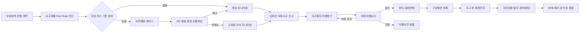

# HUG UI/UX 재설계 및 시연 데이터 전략 (2026-07-23)

> 상태: 제안안(Proposed)
> 범위: HUG 사용자 영역의 정보구조, 화면별 기능, 사고 전 예방·보증이행·채권회수 상태, ML 적용, 알림, 시연 데이터 구성
> 기준: 2026-07-23 현재 코드와 제공 데이터, 실제 HUG 공개 업무 흐름을 대조한 결과
> 핵심 원칙: `사고 전 계약관리`, `보증사고 이행`, `사고 후 채권관리`를 서로 다른 업무 객체와 화면으로 분리한다.

---

## 1. 재설계 목적과 결론

현재 HUG 영역은 `/hug/dashboard`, `/hug/map`, `/hug/incidents`에 통계, 사고 전 계약, 사고 접수, 회수 예측이 혼재한다. 특히 다음 문제가 있다.

1. 현재 대시보드의 `사건 우선순위 목록`은 실제로는 플랫폼 계약 목록이며, 사고 전 계약과 사고 후 채권이 한 화면에서 섞여 보인다.
2. 사고확률 PoC는 모델 파일까지 생성됐지만 API와 화면에 연결되지 않아 HUG의 사전예방 업무에 사용되지 않는다.
3. 현재 사고 상태는 `접수 → 검토 → 회수 이관 → 종결` 네 단계뿐이라 이행청구, 보완, 심사, 명도, 대위변제, 구상채권 등록을 표현할 수 없다.
4. 회수 우선순위, SHAP, 단건 회수예측은 사고 후 채권관리 기능인데 통합 대시보드에 직접 배치되어 있다.
5. 제공 HUG CSV에는 계약·사고·대위변제·경매·배당을 잇는 공통 사건 ID가 없어, 제공 데이터만으로 거래형 업무 시연을 구성할 수 없다.

따라서 HUG UI를 다음 네 개의 업무축으로 재편한다.

```text
1. HUG 통합 대시보드
   └─ 전체 현황과 통계, 지역·시계열 시각화

2. 사고 전 계약관리
   └─ 계약별 사고확률 PoC, Rule 위험신호, D-90/60/30, 증빙·신용보강, 3자 알림

3. 사고접수·보증이행
   └─ 사고통지, 이행청구, 보완, 심사, 명도, 대위변제, 구상채권 등록

4. 사고 후 채권관리
   └─ 회수 우선순위, SHAP, 등록채권 회수전망, 법무·경매·배당·회수·종결
```

사고 전 계약에는 `사고확률 PoC`를 부여하되, 현재 모델의 한계 때문에 운영 초기 화면에서는 반드시 `PoC 추정치`와 `실제 확률로 보정됐는지 여부`를 함께 표시한다. 사고확률만으로 공식 사고를 생성하거나 보증이행 여부를 판단하지 않는다. 사고확률, Rule 위험신호, 만기 긴급도, 미해소 조치를 결합해 HUG의 **사전예방 우선순위**를 만든다.

---

## 2. 목표 정보구조(IA)와 Route

### 2.1 HUG 사이드바

| 순서 | 메뉴 | 제안 Route | 역할 |
|---:|---|---|---|
| 1 | 통합 대시보드 | `/hug/dashboard` | 보증·예방·사고·회수 전 영역의 KPI와 시각화 |
| 2 | 사고 전 계약관리 | `/hug/contracts` | 사고접수 전 진행 계약의 확률·경보·D-일정·증빙 관리 |
| 3 | 사고접수·보증이행 | `/hug/incidents` | 임차인 신고부터 대위변제·채권등록까지 처리 |
| 4 | 사고 후 채권관리 | `/hug/recovery` | 등록 채권의 회수 우선순위와 회수 진행 관리 |
| 5 | 알림 | `/notifications` | 역할별 경보·기한·업무 알림 통합 조회 |

`/hug/map`은 사이드바의 독립 핵심업무 메뉴에서 제외하고, 통합 대시보드의 `전국 위험 현황` 카드에서 진입하는 상세 분석 Route로 유지한다. 기존 링크 호환을 위해 Route 자체는 삭제하지 않는다.

### 2.2 상세 Route

| 영역 | Route | 화면 |
|---|---|---|
| 통합 대시보드 | `/hug/dashboard` | KPI, 발급·사고 추이, 전국 사고율 지도, 피해주택 분포 |
| 지도 상세 | `/hug/map` | 시군구 사고율·피해주택 레이어 전체화면 분석 |
| 사고 전 계약 | `/hug/contracts` | 사고접수 전 계약 목록과 사전예방 우선순위 |
| 사고 전 계약 | `/hug/contracts/[contractId]` | HUG Shell 안의 계약 상세·예방업무 화면 |
| 공통 계약 상세 | `/contracts/[contractId]/manage` | 기존 3자 공동 사실 컴포넌트. HUG 상세 Route에서 재사용 |
| 보증이행 | `/hug/incidents` | 보증사고 통지·이행청구 업무 큐 |
| 보증이행 | `/hug/incidents/[incidentId]` | 단계별 이행 사건 상세 |
| 채권관리 | `/hug/recovery` | 회수 포트폴리오, 우선순위, 시뮬레이터, 진행·종결 탭 |
| 채권관리 | `/hug/recovery/[claimId]` | 채권 원장·재산·법무·경매·배당·회수 상세 |

### 2.3 현재 화면의 이동·재사용

| 현재 구현 | 변경 방향 | 구분 |
|---|---|---|
| `/hug/dashboard` KPI·발급 추이·지역 사고율·피해주택 분포 | 통합 대시보드에 유지하고 보증·예방 KPI를 추가 | 보완 |
| `/hug/dashboard` 하단 `사건 우선순위 목록` | `/hug/contracts`의 `사전예방 계약 목록`으로 이동 | 이동·보완 |
| `/hug/dashboard` 회수 우선순위·SHAP | `/hug/recovery`의 상단 핵심업무 영역으로 이동 | 이동 |
| `/hug/dashboard` `회수 가능성 예측` | `/hug/recovery`에서 `등록채권 회수전망 시뮬레이터`로 변경 | 이동·보완 |
| `/hug/map` 코로플레스·피해주택 버블 | 대시보드에 요약 삽입, `/hug/map`은 상세보기 유지 | 재사용 |
| `/hug/incidents` 4단계 큐 | 실제 보증이행 단계와 서류·SLA 중심으로 확장 | 전면 보완 |
| `/contracts/[contractId]/manage` | 공통 3자 사실 컴포넌트는 유지하고 `/hug/contracts/[contractId]`에서 HUG Shell·예방 탭과 함께 재사용 | 재사용·보완 |
| `/notifications` | 계약·사고·채권 CTA가 있는 업무 알림센터로 확장 | 보완 |

### 2.4 현재 구현 기준선

| 영역 | 이미 구현되어 재사용할 부분 | 목표 설계를 위해 필요한 보완·신규 개발 |
|---|---|---|
| 계약 공동관리 | 계약·반환계획·증빙·타임라인과 3자 조회 컴포넌트 | HUG 전용 Route wrapper, 보증정보, 예방상태·담당자·다음 조치 |
| D-일정 | D-90/60/30 점검, 기본 증빙요청, 3자 인앱 알림, 중복방지 키 | 일일 스케줄러, 항목별 증빙 bundle·완료율, 단계별 SLA, 전달·읽음·업무확인 이력 |
| 위험진단 | Rule 기반 위험신호와 데이터 완결성 | 사고확률 PoC와 별도 표시, 계약별 예측 스냅샷·이력 |
| 사고확률 PoC | 오프라인 모델 아티팩트와 평가 산출물 | 서빙 API, 계약 일괄 추론, 보정·버전·유효기간, UI 연결 |
| 사고접수 | 임차인 신고, 단순 4단계 큐와 타임라인 | 별도 이행청구 원장, 서류·심사·명도·지급·채권등록 상태머신 |
| 회수예측 | 회수율·배당소요일 모델, 우선순위, SHAP, 수기 입력 카드 | 실제 등록채권 ID 연결, 자동입력, 예측 저장·비교, 채권업무 원장 |
| 지도·통계 | 발급추이, 지역 사고율, 피해주택, 지도 상세 | 대시보드 임베드용 컴포넌트화와 출처·기준일 표시 |

현재 D-일정 점검은 한 종류의 상환능력 증빙만 제출되어도 전체가 제출된 것처럼 판단할 수 있고, 화면 버튼으로 실행하는 데모 방식이다. 목표안에서는 `evidence_bundle`의 필수 항목별 상태를 계산하고, 매일 실행되는 멱등 배치로 바꾼다.

### 2.5 백엔드 구현 반영 결과 (2026-07-23)

본 문서의 목표안 중 **백엔드만 구현 완료**했다. 프론트엔드 Route·컴포넌트·타입은 이번 구현 범위에서 변경하지 않았다. 상세 API와 제한사항은 [`HUG_백엔드_구현현황_260723.md`](./HUG_백엔드_구현현황_260723.md)를 기준으로 한다.

| 영역 | 백엔드 반영 결과 |
|---|---|
| 통합 대시보드 | 업무대장·제공 합성 참조·공공 집계 분리 KPI와 발급/사고 연도 시계열 API 구현 |
| 사고 전 계약 | PU PoC 단건·일괄 서빙, 계약별 `SUCCESS/NOT_SCORABLE/FAILED` 이력, 목록·상세·필터 구현 |
| 사전예방 | D-90/60/30 각 3개 항목 bundle, 예방 케이스·조치, 3자 구조화 알림, 멱등 sweep 구현 |
| 보증이행 | 사고통지와 이행청구 분리, 서류·심사·명도·대위변제·채권등록·인계 상태머신 구현 |
| 채권관리 | 등록채권 목록·상세, 병렬 상태축, append-only 원장, 예측 이력, 종결/읽기전용 구현 |
| 시연 데이터 | 고정 기준일·ID의 S1~S7 upsert, manifest·digest·출처·모델 hash 구현 |
| 검증 | 전체 백엔드 `92 passed`, 문법 검사 및 독립 코드리뷰 수행 |

운영 전에는 실제 HUG 코호트 기반 확률 보정, 일일 스케줄러 배포, 권한 세분화, 공식 SLA·원장 충당규칙 확정이 남아 있다.

---

## 3. 전체 업무 플로우와 객체 분리



### 3.1 반드시 분리할 ID

| ID | 객체 | 생성 시점 |
|---|---|---|
| `contract_id` | 보증·임대차 계약 | 계약 등록 또는 보증가입 |
| `prediction_id` | 사고확률 예측 결과 | 계약 생성·갱신 또는 재예측 |
| `prevention_case_id` | 사전예방 조치 묶음 | 경보가 조치 기준을 충족할 때 |
| `incident_id` | 임차인의 보증사고 통지 | 임차인이 사고를 신고할 때 |
| `performance_claim_id` | 보증이행청구 | 이행청구서가 접수될 때 |
| `recovery_claim_id` | HUG 구상·부대채권 | 대위변제 또는 비용 발생 후 채권 등록 시 |

한 계약에서 여러 차례 예측·예방조치가 발생할 수 있고, 한 이행사건에서 구상채권과 소송대지급금 등 여러 채권 원장 항목이 생길 수 있다. 따라서 계약 상태 하나로 전 과정을 표현하지 않는다.

---

## 4. 화면 1 — HUG 통합 대시보드

### 4.1 목적

HUG 전체 보증 포트폴리오를 한눈에 파악하고, 사고 전 예방·사고처리·사고 후 회수 중 어느 영역에 업무가 집중되어 있는지 확인하는 **현황판**이다. 개별 사건을 처리하는 화면이 아니며, 각 업무 화면으로 진입하는 관문 역할을 한다.

### 4.2 상단 KPI

KPI를 `보증·예방`과 `회수` 두 묶음으로 시각적으로 구분한다.

| 묶음 | KPI | 정의·클릭 동작 |
|---|---|---|
| 보증·예방 | 보증보험 계약 전체 건수 | 선택 기간 기준 전체 보증계약. 클릭 시 전체 계약 필터 |
| 보증·예방 | 사고 전 진행 계약 | 사고통지 전이며 만료·해지되지 않은 계약. 클릭 시 `/hug/contracts` |
| 보증·예방 | 고위험·조치필요 계약 | 예방 우선순위 상위 또는 기한 초과 계약. 클릭 시 고위험 필터 |
| 보증·예방 | 보증이행 진행 건 | 사고통지 이후 채권등록 이전 사건. 클릭 시 `/hug/incidents` |
| 회수 | 관리채권 수 | `recovery_claim_id` 기준 활성 채권 수 |
| 회수 | 대위변제 잔고 | 대위변제 원금 중 미회수 잔액 |
| 회수 | 예상 회수액 | 채권별 `예상회수율 × 현재 잔존원금` 합계 |
| 회수 | 예상 회수율 | 포트폴리오 가중 예상회수율. 단순 건별 중앙값과 구분 표기 |

상단 우측에는 `기준일`, `데이터 출처`, `실데이터/합성/시연` 배지를 표시한다. 합성데이터와 시연 데이터가 포함된 KPI는 운영 실적으로 오인되지 않도록 별도 색상과 툴팁을 사용한다.

KPI 모집단도 분리한다. `업무대장` 모드의 계약·이행·채권 KPI는 플랫폼 운영 데이터 또는 시연 Seed만 집계하고, 제공 합성 CSV 28,961건의 모델 결과는 `합성 참조 포트폴리오`로 별도 표시한다. HOUSTA 공개 집계도 지역·시장 통계에만 사용한다. 세 모집단의 건수·잔고·예상회수액을 하나의 숫자로 합산하지 않는다.

### 4.3 핵심 시각화

1. **전세보증금반환보증 발급·사고 추이**
   - 월별 발급건수와 사고건수를 같은 시간축에 표시한다.
   - 사고율은 `사고건수 ÷ 발급건수` 보조선으로 표시한다.
   - 건수와 비율의 축을 분리하고 툴팁에 분모·분자를 함께 보여준다.

2. **전국 위험 현황 지도**
   - 색상: 시군구 사고율.
   - 버블: 전세사기 피해주택 수.
   - `사고율`, `피해주택`, `동시보기` 레이어 토글을 제공한다.
   - 지역 클릭 시 `/hug/map?adm_cd=...` 또는 `/hug/contracts?region=...`로 이동한다.

3. **지역 사고율 순위**
   - 사고건수 최소 표본 기준을 통과한 지역만 순위를 낸다.
   - 사고율, 사고건수, 발급건수, 기준기간을 함께 표시한다.

4. **전세사기 피해주택 분포**
   - 최신 연도·지역별 피해주택 수와 전년 대비 증감을 표시한다.
   - 집계자료이며 개별 피해주택 위치를 의미하지 않음을 명시한다.

5. **업무 파이프라인 요약**
   - 사고 전 조치필요, 사고통지, 이행심사, 명도대기, 대위변제, 회수진행 건수를 단계별로 표시한다.
   - 각 단계를 클릭하면 대응 업무화면의 필터가 적용된다.

### 4.4 대시보드에서 제외할 것

- 전체 회수 우선순위 표와 SHAP 상세는 채권관리 화면으로 이동한다.
- 전체 사고 전 계약 목록은 계약관리 화면으로 이동한다.
- 수동 입력형 회수 시뮬레이터는 채권관리 화면으로 이동한다.
- 대시보드에는 `오늘 처리할 고위험 계약 Top 5`, `SLA 임박 이행사건 Top 5`, `회수 우선순위 Top 5`만 요약 카드로 제공한다.

---

## 5. 화면 2 — 사고 전 계약관리

### 5.1 대상과 목적

`사고접수 전`의 진행 중인 보증계약을 관리한다. 계약별 사고확률 PoC와 Rule 위험신호를 확인하고, D-90/60/30 반환준비, 증빙요청, 임대인 신용보강, 3자 알림을 통해 사고를 예방하는 HUG 업무화면이다.

공식 보증사고 접수와 구분하기 위해 화면의 기본 객체는 `incident`가 아니라 `contract`와 `prevention_case`다.

### 5.2 사고 전 계약 목록

#### 기본 컬럼

| 컬럼 | 설명 |
|---|---|
| 계약 ID·주소 요약 | 개인정보 마스킹, 공동 상세화면 링크 |
| 상품·보증금 | 보증상품과 HUG 노출액 |
| 만기 D-day | D-90/60/30/만기 경과 강조 |
| 사고확률 PoC | 숫자, 모델 버전, 보정상태, 예측일 |
| 사전예방 우선순위 | 사고확률 외 노출액·긴급도·미해소 조치를 결합한 업무점수 |
| Rule 위험신호 | 압류, 근저당, 전세가율, 지역 사고율, 공개명단 등 확인된 사실 |
| 증빙·신용보강 | 요청/제출/검토/보완/검증/기한초과 |
| 3자 알림 상태 | 임차인·임대인·HUG별 발송·확인 여부 |
| 다음 조치·기한 | 담당자가 지금 해야 할 한 가지 액션 |
| 담당자 | 배정 센터·담당자 |

#### 기본 정렬

단순 사고확률 내림차순이 아니라 `사전예방 우선순위` 내림차순으로 정렬한다.

PoC 기본식은 다음과 같이 시작하되, 운영 전 HUG와 가중치를 확정한다.

```text
사전예방 우선순위 =
  사고확률 백분위                 50%
  + 보증금 노출액 백분위          20%
  + 만기 긴급도                  15%
  + 미제출·미해소 조치 심각도      15%
```

사고확률 원값과 예방 우선순위는 별도 컬럼으로 보여준다. 큰 보증금, 촉박한 만기, 증빙 기한초과 때문에 확률이 같아도 업무 우선순위가 달라질 수 있기 때문이다.

#### 필터

- 사고확률 또는 확률 백분위
- 사전예방 우선순위
- D-90/60/30/만기경과
- 증빙 기한초과·임대인 무응답
- 신용보강 미완료
- 신규 등기변동·압류·근저당
- 지역·상품·주택유형·보증금 구간
- 담당 센터·담당자
- 데이터 부족·예측 실패·예측 만료

#### 일괄 액션

- 증빙 제출 요청
- D-일정 알림 재발송
- 임대인 신용보강 요청
- 담당자 배정
- HUG 상담 또는 콜백 등록
- 예측 재실행

### 5.3 사고확률 PoC 표시 원칙

현재 사고확률 PoC는 `시도`, `주택유형`, `보증금`만 사용하고 합성 사고군과 RTMS 유사 정상군을 학습했다. 따라서 화면은 다음을 반드시 구분한다.

| 표시 | 의미 |
|---|---|
| `PoC 추정확률` | 현재 모델의 `predict_proba` 출력 |
| `보정상태` | `UNCALIBRATED_POC` 또는 `CALIBRATED` |
| `예측 백분위` | 관리 포트폴리오 내 상대 위치 |
| `데이터 완결성` | 입력 누락과 출처 상태 |
| `주요 요인` | 지역·주택유형·보증금 등 모델 설명 |
| `Rule 위험신호` | 확률과 별도로 확인된 등기·증빙·임대인 사실 |

운영 전에는 `사고확률 72%`처럼 단독으로 확정 표현하지 않고 `PoC 72% · 미보정` 또는 `상위 5% 위험군`처럼 표시한다. HUG의 실제 정상 종료·사고 계약 데이터로 재학습·보정된 뒤에만 운영 확률로 승격한다.

### 5.4 계약 상세 — 3자 공동 사실 화면

기존 `/contracts/[contractId]/manage`의 컴포넌트를 재사용해 `/hug/contracts/[contractId]`를 만든다. 임차인·임대인·HUG가 동일한 계약 사실과 진행 이력을 보되 HUG 화면에서는 Sidebar가 유지되고, 개인정보와 버튼은 역할별 권한에 따라 다르게 보인다.

#### 공통 상단

- 계약 상태, 상품, 보증금, 계약기간, 만기 D-day
- 사고확률 PoC·백분위·모델 버전·예측일
- Rule 위험신호와 데이터 완결성
- 현재 예방상태와 다음 조치
- 임차인·임대인·HUG의 최근 확인시각

#### 탭

1. `계약 개요`: 계약서, 당사자, 주택, 보증정보.
2. `위험·예측`: PoC 확률 이력, Rule 위험요인, 등기변동, 지역 사고율.
3. `D-일정·반환준비`: D-90/60/30 체크포인트와 반환계획.
4. `증빙·신용보강`: 요청서류, 제출본, 검증결과, 근저당 말소·감액 등 조치.
5. `3자 알림`: 발송대상, 채널, 읽음, 확인, 재발송.
6. `변경·감사이력`: 계약·증빙·예측·상태변경 이벤트.

#### 역할별 액션

| 역할 | 주요 액션 |
|---|---|
| 임차인 | 위험·조치 확인, 사고 의심상황 신고, 상담 요청 |
| 임대인 | 반환계획 제출, 증빙 제출, 신용보강 조치완료 등록 |
| HUG | 증빙 요청, 보완 요청, 검증, 담당자 메모, 3자 알림, 고위험 모니터링 지정 |

### 5.5 D-90/60/30 예방 체크포인트

| 시점 | 기본 확인사항 | 미이행 시 조치 |
|---|---|---|
| D-90 | 계약종료 의사·연락처·반환계획, 최신 등기·보증상태 | 3자 1차 안내, 임대인 반환계획 요청 |
| D-60 | 반환재원·신용보강 증빙, 근저당·압류 변동 | 보완 요청, HUG 담당자 검토 큐 진입 |
| D-30 | 이사·반환일정, 미해소 위험, 필수서류 최종 확인 | 고위험 경보, 임차인 권리보전·상담 안내 |
| 만기·사고요건 | 실제 미반환 여부와 법적 사고요건 | 임차인 사고신고·이행청구 화면 연결 |

D-일정은 이 프로젝트가 제안하는 **사전관리 정책**이며 HUG의 공식 보증사고 성립요건이나 이행청구 기한이 아니다. D-30 미제출만으로 보증사고가 자동 성립하지 않는다. `신용보강` 역시 대환·여신 승인, 예치·추가담보, 자산매각 계획 등 반환재원을 보완하는 프로젝트 제안 기능이며, HUG 상품·법무 부서가 정책을 확정하기 전에는 계획·증빙 상태로만 표시한다.

### 5.6 사전 위험신호와 3자 알림

#### 주요 트리거

- 사고확률 또는 상대 백분위가 정책 임계값을 넘음.
- 증빙 제출기한이 지남.
- 임대인이 반환계획·보완 요청에 응답하지 않음.
- 근저당 말소·감액, 보증 추가, 담보 제공 등 약정한 신용보강이 완료되지 않음.
- 등기부에 소유권 변경, 압류·가압류, 신규 근저당이 탐지됨.
- 임대인 공개명단·사업자 상태가 변경됨.
- 계약이 D-90/60/30에 도달함.
- 모델 입력 데이터가 오래되거나 완결성이 낮음.

#### 알림 매트릭스

| 트리거 | 임차인 | 임대인 | HUG |
|---|---|---|---|
| 사고확률 상향 | 위험요인과 권장 행동 | 해소 가능한 조치와 제출기한 | 고위험 계약 큐·담당자 배정 |
| 증빙 기한초과 | 현재 미제출 사실 공유 | 즉시 제출 CTA | 검토 큐·재발송 CTA |
| 신용보강 미완료 | 계약조건 미충족 안내 | 조치완료·증빙 제출 CTA | 수동검토·상담 CTA |
| 중요 등기변동 | 권리보전·상담 안내 | 사실확인·소명 요청 | 긴급 모니터링·예측 재실행 |
| D-90/60/30 | 단계별 체크리스트 | 반환계획·증빙 요청 | 조치현황과 SLA 경보 |

알림에는 항상 `왜 알림이 발생했는지`, `누가 무엇을 언제까지 해야 하는지`, `해당 계약으로 이동` CTA가 들어가야 한다.

### 5.7 사전예방 상태

```text
Monitoring
→ RiskDetected
→ Notified
→ ActionRequested
→ EvidenceSubmitted
→ Verifying
→ Mitigated

또는

Verifying / ActionRequested
→ Overdue
→ EscalatedMonitoring
```

`EscalatedMonitoring`은 공식 보증사고가 아니다. 실제 사고 신고가 발생하면 별도의 `incident_id`를 생성한다.

---

## 6. 화면 3 — 사고접수·보증이행

### 6.1 큐의 대상

보증채권자인 임차인이 통지한 `incident`와 이에 연결된 `performance_claim`을 처리한다. `사고통지`와 `이행청구`는 별개 행위이므로, 기존 `incident`는 신고·통지 원장으로 유지하고 청구·심사·지급은 별도 `performance_claim` 원장으로 둔다. HUG가 사고확률만으로 큐에 사고를 자동 생성하지 않는다. 다만 사고 전 계약 상세에서 임차인의 사고신고 화면으로 연결할 수 있다.

이 문서의 상세 상태머신은 **전세보증금반환보증**을 기준으로 한다. 임대보증금보증 등 상품별 사고요건과 이행방식이 다르면 `workflow_type`과 `workflow_version`으로 별도 정의한다.

### 6.2 목록 화면

| 컬럼 | 설명 |
|---|---|
| 접수번호·계약 | `incident_id`, `contract_id`, 신고자 마스킹 |
| 사고유형 | 미반환, 경·공매, 기타 신고유형과 공식 사고유형을 구분 |
| 현재 단계 | 사고통지, 이행청구, 보완, 심사, 명도, 대위변제, 채권등록 |
| 청구금액·보증금 | 신고금액과 심사 확정금액을 구분 |
| 권리보전 | 임차권등기, 배당요구, 점유·전입 등 체크 |
| 서류 완결성 | 필수·보완 서류의 제출상태 |
| SLA | 단계 진입일, 경과일, 목표일, 지연사유 |
| 담당 센터·담당자 | 업무 소유자 |
| 다음 액션 | 보완요청, 심사, 명도일 확인 등 |

기본 필터는 `신규 접수`, `보완대기`, `심사중`, `명도대기`, `대위변제 완료`, `채권등록 완료`, `거절·종결`이다.

### 6.3 상세 단계

| 순서 | 상태 코드 제안 | HUG 화면의 핵심 확인·액션 | 완료 조건 |
|---:|---|---|---|
| 1 | `AccidentNotified` | 신고내용·계약·보증 유효성 1차 확인 | 사고통지 접수 |
| 2 | `ClaimReceived` | 이행청구서와 기본서류 접수 | 청구번호 생성 |
| 3 | `SupplementRequested` | 누락서류·권리보전·계약종료 증빙 요청 | 보완 제출 |
| 4 | `UnderReview` | 사고성립, 계약종료, 권리, 금액, 면책·공제 심사 | 심사결정 |
| 5 | `Approved` / `OnHold` / `Rejected` | 승인금액·사유 또는 유보·거절사유 통지 | 결과 통지 |
| 6 | `HandoverScheduled` | 이사일, 열쇠·비밀번호, 관리비·공과금 정산 확인 | 명도일 확정 |
| 7 | `HandoverCompleted` | 빈집·인도 증빙 확인 | 주택 인도 완료 |
| 8 | `SubrogationPaid` | 대위변제증서, 금융기관 선지급, 실제 지급액 기록 | 지급 완료 |
| 9 | `RecoveryClaimRegistered` | 구상원금·부대비용·채무자·권리·이율 등록 | `recovery_claim_id` 생성 |
| 10 | `TransferredToRecovery` | 채권관리 담당자·다음 조치 인계 | 채권관리 큐 노출 |

현재 `Received`, `Reviewing`, `TransferredToRecovery`, `Closed` 네 상태는 위 상태로 대체하거나 마이그레이션 매핑만 유지한다.

HUG 공개 절차는 `보증사고 발생·통지 → 이행청구 → 이행심사 → 대위변제`의 네 단계다. 위 표의 보완·명도예약·명도확인은 그 절차를 시스템에서 검증하고 SLA를 관리하기 위한 내부 하위상태다. 이행청구 접수 후 목표기한, 보완대기 제외시간, 명도 예정일을 각각 `claim_sla_due_at`, `sla_paused_at/reason`, `moveout_due_at`으로 관리한다.

### 6.4 사고유형별 분기

#### 계약종료 후 미반환

```text
계약종료 증빙
→ 임차권등기·권리유지 확인
→ 이행심사
→ 명도
→ HUG 지급
→ 구상채권 등록
```

#### 임대차 중 경·공매

```text
경·공매 통지
→ 권리신고·배당요구 확인
→ 배당 결과·미수령액 확정
→ 이행심사
→ 부족액 지급
→ 잔여 구상채권 등록
```

한 개의 직선 Stepper 안에서 사고유형에 해당하지 않는 단계는 `해당 없음`으로 표시하고 분기 사유를 남긴다.

### 6.5 상세 화면 구성

1. 상단 사건요약과 단계 Stepper.
2. `사고·계약`: 신고내용, 보증, 계약종료, 임대인 소명.
3. `청구·서류`: 필수서류, 보완요청, 검증결과.
4. `권리보전`: 임차권등기·배당요구·등기부 스냅샷.
5. `심사`: 체크리스트, 승인·유보·거절, 승인금액.
6. `명도·지급`: 이사일, 인도증빙, 공제, 지급내역.
7. `채권등록`: 구상채권·소송대지급금 등 생성 원장.
8. `알림·타임라인`: 임차인·임대인·HUG 통지와 감사로그.

`소송대지급금`을 현재 용어사전처럼 `임차인이 소송에서 승소해 HUG가 대신 지급한 보증금`으로 설명해서는 안 된다. 제공 합성데이터에서는 이 유형의 `발생금액`이 주로 소액 비용 범위로 나타나므로, **HUG가 소송 절차에서 먼저 지출하고 회수하는 비용성 부대채권으로 추정**된다. 다만 제공 파일에 공식 데이터 사전이 없으므로 화면에는 `잠정 정의·발제사 확인 필요` 배지를 붙이고, 원천 시스템 코드·회계처리 기준을 받은 뒤 설명을 확정한다.

---

## 7. 화면 4 — 사고 후 채권관리

### 7.1 화면 목적과 탭

구상채권이 등록된 뒤의 회수업무를 관리한다.

| 탭 | 대상 |
|---|---|
| `회수 우선순위` | 예상회수액·소요기간 기반 전체 활성 채권 정렬 |
| `회수 진행` | 자진상환, 재산조사, 보전, 소송, 경·공매, 배당 진행 건 |
| `상환·조정` | 분할상환, 채무조정, 협의매입 등 약정 건 |
| `종결` | 완제, 매각, 상각, 면책 등 종결 건 |

### 7.2 회수 우선순위 상위 채권

현재 구현된 표와 SHAP 설명을 이 화면으로 이동한다.

#### 표 컬럼

- 채권 ID·채권구분.
- 상품·담당 센터.
- 잔존원금과 총 청구액.
- 예상회수율과 회수등급.
- 예상 배당 소요일.
- 예상회수액.
- 회수 우선순위 점수.
- 현재 회수단계와 다음 액션.
- 예측일·모델 버전·데이터 기준.

현재 우선순위 구현식의 60% 항목은 순수 회수율이 아니라 `예상회수율 × 청구금액`으로 만든 예상회수액 백분위다. 화면 문구를 `예상회수액 60% · 회수속도 40%`로 수정한다.

ML 기반 점수와 지금 처리해야 하는 긴급도는 분리한다.

| 표시값 | 목적 | 산정 기준 |
|---|---|---|
| `회수기대 점수` | 금액이 크고 비교적 빠르게 회수할 기회 비교 | 예상회수액 백분위 60% + 예상소요일 역백분위 40% |
| `업무 긴급도` | 법적·운영상 지금 처리할 채권 식별 | 소멸시효, 배당요구 종기, 재판·매각기일, 보전처분 만료, 미처리 일수 등 Rule |

목록 정렬은 `회수기대`, `업무 긴급`, `다음 기한` 중 선택하게 한다. ML 점수만으로 법적 조치, 종결, 상각을 자동 결정하지 않는다.

#### `이 채권, 왜 이 점수인가`

- 선택한 채권의 회수율 SHAP Top 3를 보여준다.
- SHAP가 설명하는 대상이 `회수율 모델`임을 표시한다.
- 우선순위 전체 설명에는 별도로 `예상회수액 백분위`, `속도 백분위`, `가중치`를 분해해 보여준다.
- 회수율 SHAP를 우선순위 전체의 원인처럼 표현하지 않는다.

### 7.3 등록채권 회수전망 시뮬레이터

현재 `회수 가능성 예측`을 다음과 같이 수정한다.

#### 명칭

`등록채권 회수전망 시뮬레이터`

#### 대상

- 사고접수 전 보증계약이 아니다.
- 대위변제와 채권등록이 완료된 `recovery_claim_id`가 있는 채권이다.
- 경·공매 입력이 필요한 현재 모델은 경·공매 절차에 진입했거나 가정일을 명시한 채권으로 범위를 제한한다.

#### 입력 방식

1. 채권 검색·선택.
2. 상품, 채권구분, 잔존원금, 발생금액, 채권발생일을 원장에서 자동 입력.
3. 경·공매 신청일 등 시나리오 변수만 사용자가 조정.
4. 원장값과 가정값을 색상·배지로 구분.

#### 출력

- 예상회수율·회수등급.
- 예상 배당 소요일.
- 예상회수액.
- 포트폴리오 상대 우선순위.
- 회수율 SHAP 요인.
- 입력 스냅샷, 모델 버전, 실행자, 실행시각.
- 기존 예측 대비 변화.

#### 저장

현재처럼 브라우저 상태에서만 보여주지 않고 `prediction_id`로 저장한다. 채권 상세의 예측이력과 감사로그에서 다시 확인할 수 있어야 한다.

현재 모델 입력은 상품명, 채권구분, 청구금액, 발생금액, 경·공매 신청시점, 신청일과 채권발생일 간격이다. 재산조사 결과, 감정가, 선순위채권, 유찰횟수, 소송결과는 재학습 전까지 화면의 업무정보일 뿐 시뮬레이션 입력으로 가장하지 않는다. 등록채권 선택·자동입력·저장 연결이 구현되기 전 임시 화면은 `가상 채권 회수전망`으로 표시하고, 연결 완료 후에만 `등록채권` 명칭을 사용한다.

### 7.4 회수 진행 목록

| 컬럼 | 설명 |
|---|---|
| 채권 ID·채무자 | 마스킹된 채무자와 관계인 |
| 원금·비용·지연배상금 | 각각의 현재 잔액과 합계 |
| 현재 회수단계 | 재산조사, 보전, 상환, 소송, 경매, 배당 등 |
| 법무상태 | 지급명령·본안소송·집행권원·강제집행 |
| 경·공매상태 | 사건번호, 기일, 배당요구, 낙찰·배당 |
| 회수액·잔존액 | 입금·배당 충당 후 잔액 |
| 약정상태 | 분할상환·채무조정·협의매입 |
| 다음 액션·기한 | 현재 담당자가 수행할 조치 |
| 담당자 | 센터·담당자 |

### 7.5 채권 상세

1. `개요·예측`: 원금, 잔존액, 등급, 우선순위, 예측이력.
2. `채무자·재산`: 채무관계인, 부동산·금융·신용·재산조사 결과.
3. `보전·법무`: 가압류·압류, 지급명령, 소송, 집행권원.
4. `경·공매·배당`: 사건번호, 물건, 감정가, 순위, 기일, 배당표, 수령액.
5. `상환·조정`: 자진상환, 분할상환, 감면, 회생·파산, 협의매입.
6. `채권원장`: 원금, 소송대지급금, 지연배상금, 집행비용, 입금·배당 충당.
7. `문서`: 법원·채무자·내부 승인 문서.
8. `타임라인·감사`: 담당자 액션과 상태변경.

### 7.6 회수 상태는 병렬로 관리

회수업무는 법무, 경매, 상환약정이 병행될 수 있으므로 단일 직선 상태만 사용하지 않는다.

| 상태축 | 예시 값 |
|---|---|
| `recovery_stage` | Registered, Investigation, Preservation, Collection, Distribution, Closing |
| `collection_route` | Voluntary, PaymentPlan, Litigation, Auction, PublicSale, Insolvency |
| `legal_status` | None, PaymentOrder, Lawsuit, Judgment, Enforcement |
| `auction_status` | None, Filed, InProgress, Sold, DividendScheduled, Distributed |
| `repayment_plan_status` | None, Proposed, Active, Delinquent, Completed, Terminated |
| `balance_status` | Unrecovered, PartiallyRecovered, FullyRecovered |

화면의 대표 단계는 `recovery_stage`로 표시하되 상세 탭에서 병렬 상태를 함께 보여준다.

### 7.7 종결

종결은 별도 탭과 보관 화면에서 관리하고 종결사유를 필수화한다.

- 전액 회수.
- 채권 매각.
- 상각.
- 회생·파산 면책 또는 법적 소멸.
- 기타 승인 종결.

`상각`과 `채무면제`를 같은 의미로 표시하지 않는다. 종결 후에도 원장·문서·감사이력은 읽기 전용으로 조회할 수 있어야 한다.

---

## 8. ML·Rule·예방 시스템 설계

### 8.1 모델별 적용시점

| 모델·엔진 | 적용 객체 | 적용 시점 | 출력·용도 |
|---|---|---|---|
| 사고확률 PoC | 사고 전 계약 | 계약 생성·변경·정기배치 | PoC 확률, 백분위, 주요 요인 |
| Rule 위험진단 | 사고 전 계약 | 외부데이터·등기·증빙 변경 시 | 확인된 위험신호, 필수 조치 |
| 예방 오케스트레이션 | 사고 전 계약 | D-일정·기한·위험 이벤트 시 | 예방상태, 알림, 다음 액션 |
| 회수율 모델 | 등록 채권 | 채권등록·정보변경·수동실행 | 예상회수율, 등급, SHAP |
| 배당소요기간 모델 | 등록 채권 | 경·공매 입력 확보 후 | 예상 배당 소요일 |
| 회수 우선순위 공식 | 등록 채권 포트폴리오 | 배치 또는 예측 갱신 후 | 경제적 회수기대 점수 |
| 업무긴급도 Rule | 등록 채권 | 법정·업무기한 변경 시 | 기한위험, 다음 행동, 에스컬레이션 |
| 상담 분쟁·단계 분류 | 상담 텍스트 | 상담사 이관 시 | 상담 큐 태그·우선순위 |

### 8.2 사고확률 API 제안

#### 단건

`POST /api/v1/ml/accident/predict`

#### 계약 일괄 갱신

`POST /api/v1/hug/contracts/predictions/refresh`

#### 응답 필수필드

```json
{
  "prediction_id": "pred-...",
  "contract_id": "ct-...",
  "accident_probability": 0.42,
  "risk_percentile": 0.91,
  "calibration_status": "UNCALIBRATED_POC",
  "prediction_status": "SUCCESS",
  "model_version": "accident_clf_poc_260721",
  "feature_snapshot": {},
  "top_factors": [],
  "data_completeness": 0.73,
  "basis": "합성 사고군 + RTMS 유사 정상군 기반 PoC",
  "predicted_at": "2026-07-23T09:00:00+09:00"
}
```

현재 모델 아티팩트는 `processed/ml/models/` 밖에 있고 서빙 서비스가 로드하지 않는다. 모델 로더, 스키마, API, 계약별 저장소와 재예측 배치를 새로 연결해야 한다.

### 8.3 재예측 트리거

- 계약 생성·보증가입.
- 보증금·계약기간·주택정보 변경.
- 모델 버전 변경.
- 정기 배치.
- 지역 위험자료 갱신.
- 향후 시간가변 피처가 추가된 뒤 등기·증빙·임대인 상태 변경.

현재 PoC는 등기·증빙·신용보강을 피처로 사용하지 않으므로, 이 이벤트가 발생해도 PoC 확률이 실제로 달라지지 않을 수 있다. 초기에는 Rule·예방 상태를 별도로 갱신하고, 실제 HUG 계약 데이터를 확보한 뒤 시간가변 피처를 포함해 재학습한다.

### 8.4 운영 전 모델 보완

1. HUG 보증가입 계약 중 정상 종료와 실제 사고가 모두 있는 동일 코호트를 확보한다.
2. 계약 당시 시점의 피처만 사용해 결과 누출을 막는다.
3. 지역·상품·기간별 층화와 시간순 검증을 수행한다.
4. 실제 사고율로 확률을 보정한다.
5. 임계값별 예방 대상 건수, 재현율, 오탐률, 예상 업무량을 HUG와 검토한다.
6. 모델 버전별 성능·편향·드리프트를 모니터링한다.
7. 모델은 담당자 의사결정 보조로 사용하고 조치 근거와 재검토 경로를 제공한다.

---

## 9. 백엔드 도메인과 API 보완

### 9.1 주요 저장 객체

| 컬렉션·테이블 제안 | 핵심 필드 |
|---|---|
| `accident_predictions` | prediction_id, contract_id, probability, percentile, calibration, version, snapshot, factors |
| `prevention_cases` | prevention_case_id, contract_id, status, triggers, priority, owner, due_at |
| `preventive_actions` | action_id, prevention_case_id, type, actor_role, requested_at, due_at, completed_at |
| `performance_claims` | performance_claim_id, incident_id, stage, claim_amount, approved_amount, decision, SLA |
| `claim_documents` | claim_id, document_type, submitter, verification_status, requested_at, submitted_at |
| `recovery_claims` | recovery_claim_id, performance_claim_id, claim_type, principal, balance, debtor, stage |
| `recovery_events` | claim_id, event_type, status_axis, before, after, actor, occurred_at |
| `recovery_ledger` | principal, legal_cost, delay_damage, enforcement_cost, receipt, allocation, balance |
| `legal_cases` | claim_id, case_type, court, case_number, status, judgment, enforcement |
| `auction_cases` | claim_id, auction_type, filing_date, appraisal, sale_date, dividend_date, dividend_amount |

### 9.2 API 제안

#### 대시보드

- `GET /hug/dashboard/overview`
- `GET /hug/dashboard/issuance-incident-trend`
- 기존 `/region-risk`, `/issuance`, `/victims` 재사용

#### 사고 전 계약관리

- `GET /hug/contracts`
- `GET /hug/contracts/{contract_id}`
- `GET /hug/contracts/{contract_id}/prediction`
- `POST /hug/contracts/{contract_id}/prediction/refresh`
- `GET /hug/contracts/{contract_id}/prevention`
- `POST /hug/contracts/{contract_id}/preventive-actions`
- `PATCH /preventive-actions/{action_id}`

#### 보증이행

- 기존 `POST /incidents` 유지: 임차인 신고
- `GET /hug/incidents`
- `GET /hug/incidents/{incident_id}`
- `POST /hug/incidents/{incident_id}/claims`
- `POST /performance-claims/{claim_id}/documents/request`
- `POST /performance-claims/{claim_id}/decision`
- `POST /performance-claims/{claim_id}/handover`
- `POST /performance-claims/{claim_id}/subrogation-payment`
- `POST /performance-claims/{claim_id}/recovery-claims`

#### 채권관리

- `GET /hug/recovery/summary`
- `GET /hug/recovery/claims`
- `GET /hug/recovery/claims/{claim_id}`
- `POST /hug/recovery/claims/{claim_id}/events`
- `POST /hug/recovery/claims/{claim_id}/ledger-entries`
- `POST /hug/recovery/claims/{claim_id}/predict`
- `GET /hug/recovery/claims/{claim_id}/predictions`
- `POST /hug/recovery/claims/{claim_id}/close`

### 9.3 권한

현재 `hug_admin` 단일 역할로 시연할 수 있지만, 실제 확장에서는 최소한 다음 권한을 분리한다.

- 예방·계약 모니터링 담당.
- 보증이행 접수·심사 담당.
- 이행 승인권자.
- 채권관리 담당.
- 법무·경매 담당.
- 회계·원장 담당.
- 읽기 전용 관리자.

승인, 대위변제, 채권등록, 종결은 일반 상태변경 버튼이 아니라 권한·확인·감사로그가 있는 업무 액션으로 구현한다.

---

## 10. 제공 데이터와 시연 시나리오 데이터 전략

### 10.1 결론

백엔드·프론트 시연은 **제공 데이터만 사용하거나 시연 데이터를 전부 새로 만드는 한 가지 방식이 아니라, 둘을 역할별로 나누는 혼합 방식**이 적합하다.

```text
제공 데이터·공공 집계
→ 통계, 차트, 모델 학습, 분포와 기준선

시연 시나리오 데이터
→ 계약→예방→사고→이행→채권→회수로 이어지는 거래형 업무 플로우
```

### 10.2 데이터별 사용처

| 데이터 | 성격 | 사용처 | 사용하면 안 되는 방식 |
|---|---|---|---|
| 발제사 HUG CSV 7종 | 합성, 파일 간 공통 사건 ID 없음 | 회수모델 학습, 사고·대위변제·경매·배당 분포, 합성 포트폴리오 KPI | 주소·날짜·금액 유사성으로 파일 간 사건 조인 |
| 비식별 상담 938건 | 실제 비식별 상담 | RAG, 분쟁유형·진행단계 분류 | HUG 보증사고 원장으로 간주 |
| HOUSTA 발급·사고·피해주택 | 실제 공개 집계 | 발급·사고 추이, 지역 사고율, 지도·피해주택 분포 | 개별 계약·개별 피해자의 위치로 표현 |
| RTMS 전세계약 대조군 | 실제 거래, 무사고 미확정 | 사고확률 PoC 유사 정상군 | 실제 HUG 정상 종료 보증계약으로 표현 |
| 시연 Seed | 명시적 가상 사건 | 화면 간 연결, 상태변경, 알림, 문서, 원장, 법무·경매 타임라인 | HUG 실제 고객·실제 업무 실적으로 표현 |

위 표의 `합성 포트폴리오 KPI`는 업무대장의 `관리채권·잔고` KPI와 다른 참조 분석 카드다. 같은 화면에 놓더라도 탭과 출처 배지로 분리하고 서로 합산하지 않는다.

### 10.3 시연용 연결 시나리오

재현 가능한 고정 ID와 Seed를 사용한다. 런타임마다 무작위로 다른 데이터가 생기지 않도록 한다.

| 시나리오 | 주요 상태 | 시연할 장면 |
|---|---|---|
| S1 정상 모니터링 | 낮은 상대위험, D-120 | 일반 계약 조회와 데이터 완결성 |
| S2 사고 전 고위험 | PoC 상위, D-62, 증빙 기한초과 | HUG 계약 큐, 3자 알림, 임대인 보완 제출 |
| S3 위험 해소 | 신용보강 제출·검증 완료 | 위험신호 해소와 예방상태 `Mitigated` 전환 |
| S4 보증이행 진행 | 이행청구·보완 또는 심사중 | 단계 Stepper, 서류 요청, SLA |
| S5 대위변제·채권등록 | 대위변제 완료 | `recovery_claim_id` 생성과 채권관리 인계 |
| S6 회수 진행 | 경매·배당 또는 부분회수 | 우선순위·SHAP·원장·법무·경매 상세 |
| S7 종결 | 전액 회수 또는 승인 종결 | 종결사유와 읽기 전용 감사이력 |

### 10.4 Seed 생성 원칙

1. `demo-ct-*`, `demo-inc-*`, `demo-pc-*`, `demo-rc-*`처럼 도메인별 고정 ID를 사용한다.
2. 계약→예방→사고→이행→채권 연결은 Seed 스크립트에서 명시적으로 생성한다.
3. 금액·상품·회수율·소요일은 제공 합성데이터의 범주와 분위수를 참고하되, 특정 원본 행을 실제 사건처럼 복제·연결하지 않는다.
4. 모델 입력이 있는 시나리오는 가능하면 실제 저장된 모델로 추론하고 결과를 저장한다.
5. 오프라인 시연을 위해 마지막 정상 추론결과를 캐시할 수 있지만 `cached_demo_prediction`으로 표시한다.
6. 모든 응답에 `source_type`, `basis`, `is_demo`를 포함한다.
7. `demo_as_of_date`, 전역 seed, template version을 고정하고 실행 시각의 `today()`에 따라 상태가 변하지 않게 한다.
8. 같은 버전을 다시 실행하면 같은 ID로 upsert되도록 하고 원천 파일·모델 artifact 해시와 생성 건수를 manifest에 저장한다.

### 10.5 화면의 출처 배지

| `source_type` | 화면 라벨 |
|---|---|
| `live_api` | 실시간 API |
| `public_aggregate` | 공공 집계 |
| `provided_synthetic` | 제공 합성데이터 |
| `demo_scenario` | 시연 시나리오 |
| `model_poc` | PoC 모델 |
| `user_submitted` | 사용자 제출 |
| `cached_demo_prediction` | 오프라인 시연 캐시 |

배지는 단순 문자열 하나가 아니라 최소 `data_mode(REFERENCE/DEMO/LIVE)`, `source_type`, `source_dataset`, `as_of_date`, `scenario_id`, `model_version`, `input_snapshot`을 구조화해 저장한다. KPI, 표 행, 상세카드와 내보내기 파일에도 동일 출처를 노출한다.

### 10.6 추가 질문에 대한 최종 답

시연에서는 다음 조합을 사용한다.

- **대시보드 통계·그래프·지도**: HOUSTA 실제 공개 집계와 제공 합성데이터를 사용한다.
- **사고확률·회수율·배당기간 모델**: 현재 확보한 학습 데이터와 실제 모델 아티팩트를 사용하되 PoC·합성 기준을 표시한다.
- **화면 간 업무 플로우**: 연결 가능한 시연 시나리오 데이터를 별도로 생성한다.
- **알림·증빙·심사·명도·채권등록·법무·경매·종결**: 제공 파일에 필드와 공통 ID가 없으므로 시연 Seed가 반드시 필요하다.

즉, **통계와 모델의 분포는 제공 데이터에 근거하고, 거래형 업무 흐름은 제공 데이터의 한계를 보완하는 명시적 시연 데이터로 구성한다.**

---

## 11. 구현 우선순위

### P0 — 정보구조와 명칭 정리

- HUG 사이드바를 4개 업무축+알림으로 변경.
- 대시보드에서 회수표·시뮬레이터·계약목록 이동.
- `회수 가능성 예측`을 `등록채권 회수전망 시뮬레이터`로 변경.
- 위험등급 HIGH와 회수등급 HIGH의 색·명칭을 구분.
- 소송대지급금 용어설명 정정.

### P1 — 시연 도메인과 Seed

- `contract_id → incident_id → performance_claim_id → recovery_claim_id` 연결 모델 생성.
- S1~S7 시나리오 Seed.
- 데이터 출처 배지와 `is_demo` 공통필드.

### P2 — 사고 전 계약관리

- 사고확률 PoC 서빙 API와 계약별 예측 저장.
- `/hug/contracts` 목록·필터·우선순위.
- D-90/60/30 일일 배치, 항목별 증빙 bundle, 예방상태, 3자 알림 전달·확인 이력.
- 공동 계약상세 탭 보완.

### P3 — 사고접수·보증이행

- 상세 상태머신과 단계 Stepper.
- 청구·보완·심사·명도·지급·채권등록 액션.
- 사고유형별 분기와 서류 체크리스트.

### P4 — 채권관리

- 우선순위·SHAP 이동.
- 등록채권 선택형 회수전망 시뮬레이터와 예측 저장.
- 회수 진행·법무·경매·배당·원장·종결 상세.

### P5 — 통합 대시보드와 발표 폴리싱

- KPI 정의와 기간·지역 필터.
- 발급·사고·사고율 결합 차트.
- 지도 요약·상세 드릴다운.
- 오늘의 조치 Top 5와 업무화면 연결.

---

## 12. 대표 시연 플로우

```text
1. HUG 통합 대시보드
   → 전체 보증계약·고위험 계약·이행사건·관리채권 현황 확인

2. 사고 전 계약관리
   → PoC 상위·D-60 증빙기한초과 계약 선택
   → 사고확률·Rule 근거·미해소 조치 확인
   → 임대인 증빙요청 + 임차인/HUG 동시 알림

3. 사고접수·보증이행
   → 별도 시나리오의 임차인 사고신고 확인
   → 이행청구·보완·심사·명도·대위변제 진행
   → 구상채권 등록

4. 사고 후 채권관리
   → 신규 등록 채권이 우선순위 목록에 노출
   → SHAP와 우선순위 산식 확인
   → 등록채권 회수전망 시뮬레이션
   → 경매·배당·부분회수 타임라인과 잔존원장 확인
   → 종결 화면 확인
```

사고 전 고위험 시나리오와 사고 후 회수 시나리오는 같은 계약일 수도 있지만, 예방이 실패해야만 가치가 있다는 인상을 피하기 위해 발표에서는 `위험 해소 성공 사례`와 `별도의 사고·회수 사례`를 모두 보여준다.

---

## 13. 완료 기준

### 통합 대시보드

- 전체 보증, 사고 전 계약, 이행사건, 관리채권 KPI가 구분된다.
- 발급·사고·사고율 시계열과 지도·피해주택 분포가 표시된다.
- 모든 숫자에 기준일과 데이터 출처가 있다.

### 사고 전 계약관리

- 사고접수 전 계약만 기본 노출된다.
- 모든 대상 계약에 예측값 또는 `데이터 부족/예측 실패` 상태가 있다.
- PoC 확률, Rule 신호, 예방 우선순위를 구분해 보여준다.
- D-일정과 증빙·신용보강·3자 알림이 계약별로 추적된다.
- 경보가 자동으로 공식 사고를 생성하지 않는다.

### 사고접수·보증이행

- 임차인 신고 후 사고통지부터 채권등록까지 단계가 보인다.
- 각 단계에 담당자, 진입일, 목표일, 서류, 다음 액션이 있다.
- 승인·유보·거절, 명도, 실제 지급금액을 기록할 수 있다.
- 대위변제 완료 후에만 구상채권을 등록·인계한다.

### 채권관리

- 회수 우선순위와 회수율 등급이 Rule 위험등급과 구분된다.
- 회수율 SHAP와 우선순위 산식 설명이 분리된다.
- 시뮬레이터는 등록 채권을 선택해 자동 입력하고 결과를 저장한다.
- 법무·경매·배당·입금·잔존채권·종결사유를 조회할 수 있다.

### 시연 데이터

- 제공 합성, 공공 집계, 시연 Seed, PoC 예측의 출처가 구분된다.
- 제공 파일을 사건 단위로 임의 조인하지 않는다.
- 초기화 후 동일한 ID·상태·예측으로 시연을 재현할 수 있다.

---

## 14. 발제사·HUG 확인이 필요한 사항

1. 실제 보증가입 정상 종료계약과 사고계약의 비식별 학습데이터 제공 가능 여부.
2. 사고확률 운영 임계값과 예방 담당자의 일일 처리용량.
3. `구상채권`, `구상채권(신상품)`, `소송대지급금`의 원천 시스템 코드·분류기준·담당부서.
4. 배당 소요일의 정확한 기산일과 음수 값의 의미.
5. 사고통지·이행청구·심사·명도·대위변제의 실제 내부 승인권한과 SLA.
6. 회수 우선순위 가중치의 업무목표: 회수액 극대화, 신속 회수, 장기체류 해소, 취약 임차인 보호 중 우선순위.
7. 채권 원장 충당순서와 지연배상금·법무비용의 시스템 계산 규칙.
8. 실제 시연에서 공개 가능한 필드와 마스킹 기준.

---

## 15. 업무절차 참고자료

- [HUG 전세보증금반환보증 사고 정의·이행청구 안내](https://m.khug.or.kr/hug/web/ge/er/geer001100.jsp)
- [모바일HUG 전세보증금반환보증 이행절차](https://onestop.khug.or.kr/webView/webBiz/excu/loahExcu001)
- [HUG 주택명도(퇴거) 안내](https://www.khug.or.kr/hug/web/ge/er/geer004000.jsp)
- [HUG 보증이행 핵심서비스 이행표준](https://www.khug.or.kr/hug/web/ci/cc/cicc000004.jsp)

공개자료는 외부 고객 절차를 설명하므로, 내부 승인권한·원장코드·채권분류·실제 SLA는 발제사 또는 HUG 담당부서 확인 후 확정한다.
