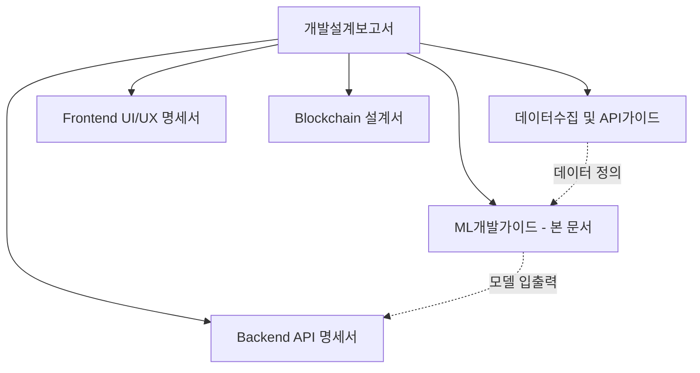
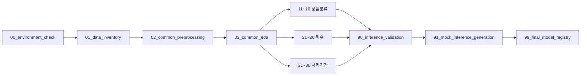
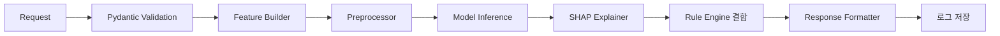

# HUG × 아이엔 안심주거 생태계

## ML 개발 가이드

작성일: 2026-07-14 (KST)
문서 버전: v1.0.0
작성 목적: Google Colab에서 실제 `.ipynb`를 작성하고 모델을 학습하여 FastAPI에 연결하기까지, 1인 개발자가 그대로 따라갈 수 있는 실무 기준 문서.

> **⚠️ [260721 갱신 공지]** 서빙 엔드포인트 실구현: 모델1(상담분류)=`POST /ml/counsel/classify`(본 문서의
> `/ml/counsel/predict`에서 개명), 모델2(회수율)=`POST /ml/recovery/predict`, 모델 메타=`GET /ml/models/info`.
> 모델3(처리기간)의 `/ml/duration/predict`와 `/ml/risk/predict`는 미구현(후자는 데이터 한계로 의도적 제외,
> rule 기반 `POST /risk/diagnose`가 담당). 상세: `구현현황_문서정합_260721.md`.

> 본 문서는 개발설계보고서(`개발설계보고서_260714_수정보완.docx`)와 데이터수집 및 API가이드(`데이터수집_및_API가이드_260714.md`)를 상위 문서로 하며, 두 문서와 충돌하는 경우 개발설계보고서를 우선한다. 외부 API 인증·호출, 프론트엔드 화면, 전체 REST API 명세, DB 전체 ERD, Solidity/블록체인 배포는 각각 `데이터수집_및_API가이드_260714.md`, `Frontend_UIUX_명세서_260714.md`, `Backend_API_명세서_260714.md`, `Blockchain_설계서_260714.md`에서 관리하며 본 문서에서는 상세히 다루지 않는다.

---

## 목차

0. 문서 개요
1. 선행 문서와 책임 범위
2. ML 개발 원칙
3. Google Colab 개발환경
4. Google Drive 폴더 구조
5. Notebook 구성
6. 공통 Notebook 작성 규칙
7. 데이터 인벤토리
8. 공통 전처리
9. EDA 기준
10. Feature Engineering
11. 데이터 분할과 검증
12. 모델 1: 상담 분류
13. 모델 2: 회수율·회수등급
14. 모델 3: 처리기간
15. Baseline
16. 모델 비교와 선정
17. SHAP 및 설명 가능성
18. 오류 분석
19. 모델 저장과 버전관리
20. FastAPI 연동
21. Rule Engine 결합
22. RAG·LLM 연계
23. Mock 추론
24. 모델 테스트
25. 모델 모니터링
26. 재학습 기준
27. 개인정보와 보안
28. 개발 로드맵
29. TODO 체크리스트
30. 한계와 향후 데이터 요구사항
31. 최종 산출물 목록

부록 A. Notebook 목록
부록 B. Feature 후보 목록
부록 C. 모델별 입출력 JSON
부록 D. 모델 평가 리포트 템플릿
부록 E. 모델 카드 템플릿
부록 F. 사용 금지 표현
부록 G. 파일명·버전 규칙

---

## 0. 문서 개요

### 0.1 문서 목적

본 문서는 HUG × 아이엔 안심주거 생태계(HUG 안심전세 체인)의 ML 파트를 담당하는 1인 개발자가 Google Colab에서 데이터 로딩부터 모델 학습, 검증, 저장, FastAPI 연동, Mock 시연까지 실제로 수행할 작업 순서를 정의한다. ML 개론이나 아이디어 수준의 설명이 아니라, 지금 이 폴더에 있는 실제 데이터를 대상으로 무엇을 어떤 순서로 만들지 규정하는 실무 문서다.

### 0.2 대상 독자

ML을 직접 개발하는 본인, 그리고 향후 이 프로젝트를 이어받을 개발자. Backend 개발자는 20장(FastAPI 연동)과 부록 C(입출력 JSON)만 참조해도 연동 작업이 가능하도록 작성한다.

### 0.3 데이터 현황 요약

작업 시작 전 실제 폴더(`DIVE2026/`, `DIVE2026/dive 데이터/`)를 확인한 결과는 아래와 같다. 상세는 7장에서 다룬다.

| 파일 | 실제 행수 | 성격 |
|---|---|---|
| 비식별_임대차상담데이터.xlsx | 938 | 실데이터(비식별), 발제사 제공 |
| 임대보증 대위변제_합성데이터.csv | 23,107 | 합성데이터 |
| 임대보증 사고현황_합성 데이터.csv | 25,687 | 합성데이터 |
| 전세 및 임대채무자 경매현황_합성데이터.csv | 32,542 | 합성데이터 |
| 전세 및 임대채무자 배당내역_합성 데이터.csv | 28,961 | 합성데이터 |
| 전세보증 대위변제_합성 데이터.csv | 66,579 | 합성데이터 |
| 전세사고(임대보증금 대비 사고금액)_합성 데이터.csv | 69,435 | 합성데이터 |
| 전세사고(주택가액 대비 임대보증금)_합성데이터.csv | 69,435 | 합성데이터 |

실제 발제사 데이터 중 **정형 사고·경매·배당 데이터는 전량 합성데이터이며 실데이터는 상담데이터 938건뿐**이다. 이 사실이 본 문서의 모델 설계 전반(2장 핵심 원칙, 13·14장 회수/처리기간 모델, 30장 한계)을 규정한다.

---

## 1. 선행 문서와 책임 범위

### 1.1 문서 체계



- **개발설계보고서**: 왜 이 시스템을 만드는지, 전체 아키텍처, 공통 식별자, MVP 범위를 정의하는 최상위 문서.
- **데이터수집 및 API가이드**: 발제사 데이터/외부 API의 출처, 인증, 요청·응답, Mock 전략을 정의하는 문서.
- **본 문서(ML개발가이드)**: 위 두 문서가 정의한 데이터를 가지고 실제로 Colab에서 무엇을, 어떤 순서로, 어떤 기준으로 학습·평가·저장·서빙하는지 정의한다.

### 1.2 본 문서의 책임 범위

**담당한다:**

Google Colab 개발환경, Google Drive 폴더 구조, Notebook 구성, 데이터 로딩, EDA, 전처리, Feature Engineering, 학습 데이터셋 생성, 모델별 학습, 검증과 평가, SHAP 설명, 모델 저장, 추론 입력·출력 스키마, FastAPI 연동(계약 수준), 모델 버전관리, 재학습 기준, 데이터 및 모델 한계, 해커톤 시연용 Mock 추론.

**담당하지 않는다(각 문서로 이관):**

| 항목 | 이관 문서 |
|---|---|
| 외부 API 인증키 발급, 호출 파라미터 상세 | `데이터수집_및_API가이드_260714.md` |
| 프론트엔드 화면 설계 | `Frontend_UIUX_명세서_260714.md` |
| 전체 REST API 명세, 오류코드 | `Backend_API_명세서_260714.md` |
| DB 전체 ERD | `Backend_API_명세서_260714.md` |
| Solidity·스마트컨트랙트·블록체인 배포 | `Blockchain_설계서_260714.md` |

### 1.3 선행 문서에서 가져온 프로젝트 방향 요약

개발설계보고서 6장(AI·ML·RAG 상위 설계)에 정의된 모델 3종과 책임을 그대로 계승한다.

| 모델/기능 | 해결 문제 | 평가기준 | 현재 한계(원문) |
|---|---|---|---|
| 상담 분류 모델 | 분쟁유형·진행단계·전문가 이관 | macro-F1 | 라벨 품질 의존 |
| 회수등급 모델 | 예상 배당률 또는 회수등급 | MAE 또는 F1 | 경매 회차 데이터 필요 |
| 처리기간 모델 | 사고 처리 소요기간 | MAE/RMSE | 절차 기준일 정의 필요 |

규칙 엔진이 명시적 위험 판단을 담당하고, ML은 패턴·유사도·회수등급·처리기간 예측만 담당하며, SHAP은 설명, RAG는 근거 검색, LLM은 문장 재구성만 하고 독자적 법률 결론을 생성하지 않는다는 6.1의 역할 분리 원칙을 ML 개발 전 과정에 적용한다(21·22장 참조).

데이터/API 상위표(개발설계보고서 표 14)에서 발제사 상담데이터와 HUG 사고·경매·배당데이터는 구분값이 **PoC**로 표기되어 있고 대체경로가 "샘플 상담 데이터", "샘플 사건 데이터"로 명시되어 있다. 실제 폴더 확인 결과 이 "샘플"은 곧 합성데이터이며, 이는 개발설계보고서가 이미 예견한 제약이다.

부록 F(발제사 확인 질문)의 "비식별 법인키 제공 가능 여부", "정상계약 데이터 제공 여부와 기준시점", "공통 계약·물건·사고키 존재 여부"는 현재 시점까지 미확정이며, 실제 파일에도 이 세 종류의 키가 전혀 존재하지 않는다(7.3~7.5절 확인). 본 문서의 모든 모델 설계는 이 세 키의 부재를 전제로 한다.

---

## 2. ML 개발 원칙

아래 9개 원칙은 본 문서의 모든 장에 적용되는 상위 규칙이다. 개별 장에서 이 원칙과 충돌하는 표현이 있다면 본 장을 따른다.

1. **정상계약 데이터와 사고계약 데이터가 동일 기준시점으로 연결되지 않으면 실제 사고확률 모델을 만들 수 없다.** 현재 보유 데이터는 사고·경매·배당 시점 이후의 기록만 있고, 정상적으로 종료된 계약(사고가 나지 않은 계약) 데이터가 없다. 따라서 "이 계약이 사고가 날 확률"을 추정하는 이진분류 모델은 만들 수 없다.
2. **정상계약 데이터가 없을 때 사용 가능한 표현**: 과거 사고사례 위험유사도, 고위험 패턴 충족도, 사고사례군 내 상대적 위험도, 위험등급, 회수등급, 예상 처리기간.
3. **사용하면 안 되는 표현**: 실제 사고확률, 실제 미반환확률, 실제 부도확률, 실제 정책효과, 인과효과. 코드 주석, 변수명, UI 문구, 모델 카드 어디에도 이 표현을 쓰지 않는다(부록 F).
4. **합성데이터는 다음 용도로만 사용한다**: UI·API 테스트, 개인정보 없는 시연, 클래스 불균형 완화의 보조, 충분한 원본 데이터가 존재하는 경우의 제한적 증강. 현재 사고·경매·배당 데이터는 전량 합성이므로 이 원칙이 13·14장 모델 전체에 직접 적용된다.
5. **합성데이터만으로 실제 예측 성능을 검증했다고 주장하지 않는다.** 평가지표는 산출하되 "합성데이터 기준 성능"으로 명시하고 실데이터 검증 전까지 운영 배포 근거로 사용하지 않는다.
6. **데이터 누수, 시간 누수, 동일 사건의 중복 분할을 방지한다.** 사고 이후에만 알 수 있는 변수를 사전 위험 신호로 쓰지 않고, 시간 기준 분할을 우선하며, 동일 사건이 train/test에 동시에 들어가지 않게 한다(10장, 부록 B의 누수 컬럼 참조).
7. **SHAP이나 Feature Importance는 인과관계가 아니라 모델의 예측 기여도로 설명한다.** "이 변수 때문에 위험하다"가 아니라 "이 변수가 모델 예측에 이만큼 기여했다"로 표현한다(17장).
8. **모델 실패 시 규칙 기반 결과로 fallback할 수 있도록 설계한다.** 모델 로딩 실패, 입력 스키마 오류, 추론 예외 발생 시 `ModelResultStatus = RuleOnlyFallback`으로 전환한다(개발설계보고서 부록 C와 동일 상태값 사용, 20·21장).
9. **법률 판단은 모델이 하지 않는다.** 고위험 사건(압류·가압류·경매개시·중대한 계약서 불일치·필수 증빙 미제출)은 규칙 엔진이 우선 판단하고 전문가 이관 대상으로 처리한다(12장, 21장).

---

## 3. Google Colab 개발환경

### 3.1 기본 환경

| 항목 | 내용 |
|---|---|
| 실행환경 | Google Colab (무료/Pro 등급 모두 가능, GPU 필수 아님) |
| Python | 3.x (Colab 기본 런타임) |
| Notebook | `.ipynb` |
| 저장소 | Google Drive 마운트 (`/content/drive/MyDrive/DIVE2026`) |
| 하드웨어 | CPU 기본. 구조화 데이터 모델(LightGBM/CatBoost/XGBoost)은 CPU 학습 기준으로 설계 |

### 3.2 라이브러리

| 라이브러리 | 용도 | 비고 |
|---|---|---|
| pandas, numpy | 데이터 처리 | 필수 |
| scikit-learn | 전처리, Baseline, 평가지표 | 필수 |
| lightgbm | 회수/처리기간 회귀·분류 | 필수 |
| catboost | 상담 분류, native category 처리 | 필수 |
| xgboost | 회수/처리기간 후보 모델 | 필수 |
| shap | 설명 가능성 | 필수 |
| matplotlib | 시각화 | 필수 |
| joblib | 모델/전처리기 직렬화 | 필수 |
| sentence-transformers | 상담 텍스트 임베딩 | 필수 |
| Ko-SBERT (jhgan/ko-sbert-sts 등) | 한국어 임베딩 후보 모델 | 후보, 확인 필요 |
| imbalanced-learn | 클래스 불균형 보조(SMOTE 등) | 필요 시만 |
| optuna | 하이퍼파라미터 탐색 | 시간 여유가 있을 때만 |

### 3.3 GPU/캐시 원칙

- GPU는 필수로 가정하지 않는다. 구조화 데이터 3개 모델(상담 구조화 Feature, 회수, 처리기간)은 CPU 학습을 기본으로 한다.
- 상담 텍스트 임베딩은 938건 수준으로 1회 생성 비용이 작지만, Colab 세션이 자주 끊기는 점을 고려해 **임베딩을 1회 생성 후 `data/features/counsel_embeddings.npy`(또는 `.parquet`)로 캐시 저장**하고, 이후 Notebook은 캐시를 우선 로드하도록 설계한다. 캐시가 없을 때만 재계산한다.

### 3.4 환경 설정 pseudocode

```text
1. Colab 런타임 유형 확인 (CPU/GPU, 확인만 하고 GPU 강제 요구하지 않음)
2. drive.mount('/content/drive')
3. pip install -q lightgbm catboost xgboost shap sentence-transformers imbalanced-learn optuna
4. import 및 버전 print (requirements 기록용)
5. SEED = 42 고정, random.seed / np.random.seed / 각 모델 random_state 통일
6. BASE_DIR = '/content/drive/MyDrive/DIVE2026' 상수 정의
```

---

## 4. Google Drive 폴더 구조

### 4.1 권장 구조

```text
DIVE2026/
├── data/
│   ├── raw/
│   │   ├── sponsor/        # 발제사 원본 파일 그대로 (수정 금지)
│   │   ├── external/       # 외부 API 원본 응답 (데이터수집가이드 연계)
│   │   └── mock/           # 시연용 Mock 원본
│   ├── interim/            # 컬럼 표준화, 타입 변환 결과
│   ├── processed/          # 학습/서빙용 Feature 테이블
│   ├── features/           # 임베딩 캐시, Feature 산출물
│   └── metadata/           # 데이터 인벤토리, 컬럼 매핑표
├── notebooks/
│   ├── common/              # 00~03
│   ├── model_01_counsel/    # 11~16
│   ├── model_02_recovery/   # 21~26
│   └── model_03_duration/   # 31~36
├── models/
│   ├── model_01/
│   ├── model_02/
│   ├── model_03/
│   └── registry/            # 통합 모델 레지스트리
├── reports/
│   ├── eda/
│   ├── evaluation/
│   ├── shap/
│   └── figures/
├── exports/
│   ├── inference_samples/   # Mock 포함 추론 샘플 JSON
│   ├── feature_schema/
│   └── api_contract/        # FastAPI 연동용 계약 파일
└── docs/                     # 본 문서 등 상위 문서 사본
```

### 4.2 폴더 역할

| 폴더 | 역할 | 수정 원칙 |
|---|---|---|
| `data/raw/` | 원본 그대로 보관, 재현성의 기준점 | **직접 수정 금지.** 원본 파일명·값을 절대 바꾸지 않는다 |
| `data/interim/` | 컬럼명 매핑, 타입 변환, 1차 정제 결과 | raw에서만 파생, interim끼리 덮어쓰기 가능 |
| `data/processed/` | 학습/추론에 바로 쓰는 Feature/Label 테이블 | 버전 suffix(`_v1`, `_v2`) 사용 |
| `data/features/` | 임베딩 캐시 등 재계산 비용이 큰 산출물 | 캐시 무효화 조건 명시 |
| `data/metadata/` | 데이터 인벤토리, 컬럼 매핑표, 스키마 정의 | 각 Notebook 실행 시 갱신 |
| `notebooks/` | 역할별 분리된 `.ipynb` | 한 Notebook에 모든 작업을 넣지 않는다(5장) |
| `models/` | 모델 아티팩트, 버전별 폴더 | 19장 구조 준수 |
| `reports/` | EDA/평가/SHAP 리포트와 이미지 | 이미지 파일명은 Notebook명 접두어 사용 |
| `exports/` | FastAPI/Frontend에 전달할 산출물 | 개인정보 없는 산출물만 배치 |

**원칙**: `raw`는 원본 보존과 재현성의 기준점이므로 어떤 경우에도 직접 수정하지 않는다. 정제·가공은 반드시 `interim` 또는 `processed`에서 새 파일로 생성한다.

---

## 5. Notebook 구성

### 5.1 원칙

Notebook 하나에 모든 작업을 넣지 않는다. 공통 작업(00~03), 모델별 파이프라인(11~16, 21~26, 31~36), 통합 검증(90~99)으로 분리한다. 전체 25개 Notebook 목록과 상세(목적/입력/출력/주요작업/완료기준/선행/후속)는 **부록 A**에 표로 정리한다. 아래는 4개 블록의 개요다.

| 블록 | Notebook 범위 | 역할 |
|---|---|---|
| 공통 | `00`~`03` | 환경 확인, 데이터 인벤토리, 공통 전처리, 공통 EDA |
| 모델 1 (상담 분류) | `11`~`16` | EDA → 전처리 → 임베딩 → 학습 → 평가 → Export |
| 모델 2 (회수) | `21`~`26` | EDA → 전처리 → Feature Engineering → 학습 → 평가 → Export |
| 모델 3 (처리기간) | `31`~`36` | EDA → 전처리 → Feature Engineering → 학습 → 평가 → Export |
| 통합 | `90`, `91`, `99` | 추론 검증, Mock 생성, 최종 레지스트리 갱신 |

### 5.2 Notebook 간 의존 관계



---

## 6. 공통 Notebook 작성 규칙

### 6.1 표준 실행 순서

모든 Notebook은 아래 21단계를 기본 골격으로 하되, Notebook 성격에 맞지 않는 단계(예: `00_environment_check`의 EDA)는 생략할 수 있다.

1. Notebook 목적
2. 실행환경 확인
3. Google Drive 마운트
4. 패키지 설치
5. Seed 설정
6. 경로 설정
7. 데이터 로딩
8. 데이터 스키마 검증
9. 결측치 및 이상치 확인
10. EDA
11. 전처리
12. Feature Engineering
13. 데이터 분할
14. 모델 학습
15. 평가
16. 오류 분석
17. SHAP 또는 모델 설명
18. 모델 저장
19. 메타데이터 저장
20. 추론 샘플 검증
21. 다음 Notebook 안내

### 6.2 모든 Notebook 필수 기록 항목

| 항목 | 예시 |
|---|---|
| 실행일시(KST) | `2026-07-14T21:00:00+09:00` |
| 데이터 버전 | `processed_counsel_v1` |
| 모델 버전 | `counsel_classifier_v1.0.0` |
| 사용 컬럼 | 리스트 |
| 행 수 | train/valid/test 각각 |
| 타깃 분포 | 클래스별 개수/비율 |
| Seed | `42` |
| 라이브러리 버전 | `lightgbm==...`, `catboost==...` 등 |
| 평가 결과 | 지표별 값 |
| 저장 파일 경로 | 절대 경로 |

이 기록은 Notebook 마지막 셀에서 `dict` → `json.dump`로 `data/metadata/` 또는 `models/.../training_config.json`에 저장한다(pseudocode만, 19장·20장 참조).

---

## 7. 데이터 인벤토리

### 7.1 발제사 제공 데이터 (실제 파일 확인 완료)

| 파일명 | 출처 | 실제 행수 | 주요 컬럼 | 날짜 기준 | 모델 활용 | 타깃 활용 | 키 존재 | 품질 이슈 | 전처리 우선순위 |
|---|---|---|---|---|---|---|---|---|---|
| `비식별_임대차상담데이터.xlsx` | 아이엔(실데이터) | 938 | 일련번호, 자료군, 상담월, 지역(시도/시군구), 보증금구간, 계약상태, 주택유형, 선순위권리, 보증보험, 분쟁유형, 진행단계, 상황요약, 담당자의견, 특이사항, 상담변호사 | 상담월(YYYY-MM) | 모델 1 | 분쟁유형, 진행단계 (전문가 이관 라벨은 파생 필요) | 일련번호(행 ID만, 사건 추적 키 아님) | 분쟁유형 8클래스 중 1건짜리 클래스 존재(전출선근저당후=1), 상황요약 결측 3건, 담당자의견 결측 46건, 특이사항 결측 381건(40.6%) | 최우선 |
| `임대보증 대위변제_합성데이터.csv` | HUG(합성) | 23,107 | 상품명, 최초 발급일자, 개인/법인사업자 구분, 대위변제금액(보증이행), 주택형태, `Unnamed: 5`(빈 컬럼) | 최초 발급일자(2018-10~2026-05) | 모델 2 참고 | 부분(대위변제금액) | 없음 | 원인불명 빈 컬럼(`Unnamed: 5`) 존재 | 상 |
| `임대보증 사고현황_합성 데이터.csv` | HUG(합성) | 25,687 | 채무자 법인/개인사업자 구분, 보증종료일자, 사고사유, 사업장지역상세(전체 도로명주소), 주택형태, 임대보증금 금액, 임대보증금 대비 사고금액(%), 보증종료일자 기준 사고발생일자 소요일 | 보증종료일자(2021-01~2027-05, **미래날짜 포함**) | 모델 2/3 | 사고금액비율, 소요일 | 없음 | 소요일 컬럼에 음수값 확인(예: -42, 날짜 순서 역전), 지역상세가 상세주소 수준 | 최우선 |
| `전세 및 임대채무자 경매현황_합성데이터.csv` | HUG(합성) | 32,542 | 상품명, 경공매구분, 경매신청일자, 배당금액, 대위변제금액, 물건종류, 물건 소재지 | 경매신청일자(2017-01~2025-12) | 모델 2 | 배당금액/대위변제금액 비율(후보 A) | 없음 | 배당금액 0인 행 다수(회수 실패 또는 미배당 구분 필요) | 최우선 |
| `전세 및 임대채무자 배당내역_합성 데이터.csv` | HUG(합성) | 28,961 | 상품명, 경/공매신청일자, 신청청구금액, 채권구분, 발생일자, 발생금액, 발생금액대비 총회수금액(%), 신청일자대비 배당 소요일 | 발생일자(2017-10~2026-05) | 모델 2/3 | 총회수금액비율(후보 B), 배당 소요일 | 없음 | 채권구분 값 다양성 확인 필요 | 최우선 |
| `전세보증 대위변제_합성 데이터.csv` | HUG(합성) | 66,579 | 상품명, 보증상태, 사고접수일자, 대위변제금액, 시도구 | 사고접수일자(2021-05~2026-05) | 모델 2/3 | 보증상태(해지 등, 후보 C 재료) | 없음 | 시도구가 상세주소 일부만 포함(지역명 파싱 필요) | 상 |
| `전세사고(임대보증금 대비 사고금액)_합성 데이터.csv` | HUG(합성) | 69,435 | 보증종료일자, 시도명, 주택유형, 임대보증금액, 임대보증금액 대비 사고금액 비율(%) | 보증종료일자(2018-03~**2028-04, 미래날짜**) | 모델 2 | 사고금액비율 | 없음 | 비율값 100.0 다수(사고금액=보증금 전액, 편중) | 중 |
| `전세사고(주택가액 대비 임대보증금)_합성데이터.csv` | HUG(합성) | 69,435 | 상품명, 보증종료일자, 시도명, 주택유형, 주택가액, 주택가액 대비 임대보증금액 비율(%) | 보증종료일자(2018-03~2028-04) | 모델 2 | 전세가율 계산 재료 | 없음 | 시도명이 "세종특별자치시 OO길 0"처럼 상세주소 혼입 | 중 |

### 7.2 외부 수집 데이터 (`데이터수집_및_API가이드_260714.md` 기준, 실파일 확인 불가)

| 데이터셋 | 출처 | 모델 활용 | 확인 상태 |
|---|---|---|---|
| 외부 실거래가 (RTMS) | 국토교통부/공공데이터포털 | 위험 Feature(전세가율) 보조, ML 직접 학습 대상 아님 | 실파일 확인 필요 |
| 건축물대장 | 국토교통부/공공데이터포털 | 위험 Feature(건물유형/연식) 보조 | 실파일 확인 필요 |
| 등기부 조회결과 (CODEF) | CODEF | 위험 Feature(권리부담) 보조, 규칙 엔진 주 사용 | 실파일 확인 필요 |
| 공시가격/공시지가 | 부동산공시가격 알리미/공공데이터포털 | 담보가치 보정 | 실파일 확인 필요, API 방식 확인 필요 |
| 법인 공개정보 (OpenDART) | 금융감독원 | 법인 임대인 위험 신호 보조 | 실파일 확인 필요 |
| Mock 데이터 (등기부/공시가/사업자상태 등 11종) | 자체 제작 | UI·API 테스트, 시연 | 데이터수집가이드 6장 정의, 23장 참조 |

**주의**: 위 외부 데이터는 계약 전 위험진단(규칙 엔진 + Feature 보조)에 쓰이며, 모델 2·3(회수/처리기간)과는 직접 연결되지 않는다. 본 문서는 이 외부 API들의 인증·호출 상세를 다루지 않는다.

### 7.3 컬럼과 연결 가능성 확인 결과

7개 합성 CSV 파일과 상담데이터 xlsx 전체를 확인한 결과, **사건(case), 계약(contract), 채무자(debtor), 법인(corporation)을 식별할 수 있는 공통 키 컬럼이 어느 파일에도 존재하지 않는다.** `상품명`, `주택유형/형태`, `지역` 등 값 자체가 겹치는 범주형 컬럼은 있으나 이는 조인 키가 아니라 속성값이다. 따라서:

- 사고현황 ↔ 경매현황 ↔ 배당내역을 같은 사건 단위로 조인할 수 없다.
- 상담데이터(실데이터) ↔ HUG 사고데이터(합성)를 연결할 방법이 없다.
- 각 파일은 **서로 독립된 표본 집합**으로 취급해야 하며, 모델 2·3은 파일 단위로 별도 타깃/Feature 세트를 정의한다(13·14장).

### 7.4 정상계약 데이터 부재

7개 합성 파일 모두 **사고, 대위변제, 경매, 배당이 발생한 건만** 포함한다. 사고 없이 정상 종료된 계약 데이터는 어떤 파일에도 없다. 이는 2장 원칙 1과 직접 연결되며, "계약이 사고로 이어질 확률"을 지도학습으로 추정하는 모델은 현재 데이터로 만들 수 없다. 대신 사고사례 내부의 상대적 위험 패턴(고위험 패턴 충족도 등)만 다룬다.

### 7.5 비식별 법인키 부재

`임대보증 대위변제_합성데이터.csv`의 "개인사업자/법인사업자" 구분처럼 법인 여부를 나타내는 범주값은 있으나, 법인을 특정하고 여러 파일에 걸쳐 동일 법인의 이력을 추적할 수 있는 비식별 법인키(고유 법인 ID)는 없다. 따라서 "특정 법인 임대인의 반복 사고 패턴"과 같은 법인 단위 집계·그래프 분석은 현재 불가능하며, 개발설계보고서가 이를 "장기 확장" 범위로 분류한 것과 일치한다.

---

## 8. 공통 전처리 기준

### 8.1 컬럼명

- 모든 처리된 컬럼명은 `snake_case`로 통일한다(`보증종료일자` → `guarantee_end_date`).
- 한글 원본 컬럼명과 표준 영문 컬럼명 매핑표를 `data/metadata/column_mapping.csv`(원본파일명, 원본컬럼, 표준컬럼, 데이터타입, 설명)로 별도 관리한다.
- 컬럼명은 팀/개인이 임의로 바꾸지 않고 매핑표를 갱신하는 방식으로만 변경한다.

### 8.2 날짜

- 모든 날짜 컬럼은 `pandas.to_datetime`으로 변환하되 원본 문자열 컬럼은 `_raw` 접미사로 보존한다.
- 모든 일시는 KST 기준으로 취급한다(원본에 타임존 정보가 없으므로 KST로 가정한다는 점을 메타데이터에 명시).
- **미래 날짜·역전 날짜 검증을 반드시 수행한다.** 7.1절에서 확인했듯 `임대보증 사고현황`과 `전세사고(임대보증금 대비 사고금액)`에 오늘(2026-07-14) 이후의 미래 날짜가 존재하고, 사고현황의 소요일 컬럼에 음수값이 존재한다. 이 값들은 삭제하지 않고 `date_validation_flag`(정상/미래날짜/역전날짜)로 별도 플래그를 만들어 EDA와 모델 학습 시 명시적으로 다룬다.
- 보증 시작·종료·사고·경매·배당일 간 순서 검증: `guarantee_start ≤ guarantee_end ≤ incident_date ≤ auction_date ≤ distribution_date` 순서를 기대하되, 파일 간 조인 키가 없으므로(7.3절) 이 검증은 **파일 내부 컬럼 간 순서**로 한정한다.

### 8.3 금액

- 쉼표 제거 후 숫자 변환, 음수값 검증(음수 발견 시 삭제하지 않고 플래그).
- 원 단위로 통일한다(현재 확인된 금액 컬럼은 모두 원 단위로 보인다. 만원 단위 혼입 여부는 각 Notebook의 8단계 스키마 검증에서 재확인).
- 분포가 넓은 금액(대위변제금액, 임대보증금 등)은 `log1p` 변환 후보로 별도 컬럼(`_log`)을 만든다.
- 극단값(초고액 사고)에 대한 winsorization은 모델별로 판단하며, 원본 금액 컬럼은 항상 보존한다.

### 8.4 주소

- 시도/시군구/법정동 단위로 분리한다. 상담데이터는 이미 지역(시도)/지역(시군구)로 분리되어 있어 그대로 사용한다.
- 사고현황·대위변제 파일의 "사업장지역상세", "시도구", "물건 소재지"는 상세주소가 섞여 있으므로(7.1절) 시도/시군구 수준까지만 파싱하고, 동·호 등 상세주소는 학습 Feature에서 최소화한다(27장 개인정보 원칙과 연결).
- 표본 수가 적은 지역은 광역 단위(수도권/광역시/기타)로 통합한다.

### 8.5 범주형

- 표본 수가 적은 희소 범주(예: 상담데이터 분쟁유형 중 "전출선근저당후" 1건, "이중·다운계약" 8건)는 `기타`로 통합하거나 상위 범주로 합친다. 통합 기준은 12장에서 구체화한다.
- 결측·미상 값은 `unknown` 범주로 명시적으로 남긴다(임의 삭제 금지).
- CatBoost 사용 시 native category 처리를 우선 검토하고, Logistic Regression 등에는 One-hot encoding을 적용한다.

### 8.6 결측치

- 단순 대체(평균/최빈값)와 `{컬럼}_missing_flag` 생성을 구분한다. 상담데이터의 "특이사항" 결측 40.6%처럼 결측 자체가 "특이사항 없음"이라는 정보일 수 있으므로 삭제 대신 플래그로 남긴다.
- 0과 결측치를 혼동하지 않는다(예: 배당금액 0은 "배당 없음"이라는 실제 값이지 결측이 아니다).

### 8.7 이상치

- 실제 고액 사고를 단순 제거하지 않는다. IQR만으로 자동 삭제하지 않고, 데이터 오류(예: 8.2절의 음수 소요일, 미래 날짜)와 실제 극단 사건(초고액 보증금 사고)을 구분해서 처리한다.
- 오류로 판단된 값은 `_flag` 컬럼으로 표시하고 모델별로 제외 여부를 결정하며, 삭제 시에도 사유를 Notebook에 기록한다.

### 8.8 텍스트

- 상담데이터의 "상황요약", "담당자의견", "특이사항"은 개인정보 제거 여부를 재확인한다(파일명이 "비식별"이나, 27장 기준에 따라 잔존 개인정보를 재검토).
- 공백·특수문자 정리, 긴 텍스트 절단 기준(예: 상위 1% 길이에서 절단)을 정의한다.
- 임베딩은 캐시 파일로 저장한다(3.3절).
- 원문과 정제본을 분리 저장한다(`counsel_text_raw`, `counsel_text_clean`).

### 8.9 중복

- 완전 중복 행 제거.
- 동일 사건 반복 기록, 동일 채권의 여러 배당 행(배당내역 파일처럼 한 채권이 여러 회차로 나뉘는 경우) 여부를 확인하되, **현재 데이터에는 사건 단위 키가 없으므로(7.3절) 엄밀한 사건 단위 집계는 불가능**하다. 대신 상품명·금액·날짜 조합의 완전 중복만 우선 점검한다.

---

## 9. EDA 기준

각 Notebook의 10단계(EDA)에서 공통으로 확인할 항목이다.

| 항목 | 내용 |
|---|---|
| 분포 | 수치형 컬럼 히스토그램, 범주형 컬럼 빈도표(12장 분쟁유형/진행단계 분포처럼 클래스 불균형을 반드시 수치로 제시) |
| 결측 | 컬럼별 결측률, 결측 패턴(특정 조건에서만 결측되는지) |
| 이상치 | 날짜 역전/미래날짜(8.2절), 금액 음수/0, 비율 100% 초과·음수 |
| 상관 | 수치형 Feature 간 상관관계, 다중공선성 후보 |
| 시계열 추이 | 날짜 컬럼 기준 월별/연도별 건수 추이(대체 데이터가 최근에 몰려 있는지 확인) |
| 그룹별 비교 | 지역/주택유형/상품명별 타깃 분포 차이 |

산출물은 `reports/eda/{notebook명}_eda.md`와 `reports/figures/{notebook명}_*.png`로 저장한다.

---

## 10. Feature Engineering

Feature 후보 전체 목록(정의, 산식, 원본 컬럼, 적용 모델, 누수 가능성, 결측 처리, 현재 데이터로 생성 가능 여부)은 **부록 B**에 표로 정리한다. 핵심 원칙은 다음과 같다.

- **사고 이후에만 알 수 있는 변수를 계약 전 위험모델(규칙 엔진 Feature)에 사용하지 않는다.** 예를 들어 `days_from_incident_to_auction`(사고~경매 소요일)은 회수·처리기간 모델에는 쓸 수 있지만, 계약 전 위험진단용 Feature로 넘기면 시간 누수가 된다.
- 모델 2(회수)·모델 3(처리기간)은 7.3절에서 확인했듯 파일 간 조인이 불가능하므로, Feature는 **파일 내부에서 생성 가능한 것만** 후보로 삼는다. 부록 B에 "현재 데이터로 생성 가능 여부"를 파일 단위로 명시한다.
- 비율 Feature(전세가율, 회수율 등)는 분모가 0이거나 결측인 경우를 별도 처리한다(division-by-zero 방지, `_ratio_valid_flag` 생성).

---

## 11. 데이터 분할과 검증

- 가능하면 시간 기반 Train/Validation/Test 분할을 우선한다(날짜 컬럼 기준 오름차순 정렬 후 앞 70%/뒤 15%/15% 분할 등).
- 같은 사건 또는 같은 계약의 행이 서로 다른 세트에 들어가지 않도록 Group Split을 적용한다. **다만 7.3·7.5절에서 확인했듯 현재 데이터에는 사건 키·채무자 키·법인키가 전혀 없어 엄밀한 Group Split은 적용할 수 없다.** 이 경우 시간 기반 분할로 대체하고, 이 한계를 평가 리포트(부록 D)에 명시한다.
- 텍스트 임베딩(모델 1)은 분할 이전에 생성해 캐시하되, 임베딩 자체는 문장 단위 변환이라 데이터 누수를 유발하지 않는다. 다만 전처리기(encoder, scaler 등)는 반드시 학습 세트에만 `fit`한다.
- 하이퍼파라미터 조정은 Validation에서만 수행하고, 최종 Test는 한 번만 평가한다.
- 권장 분할: Train 70% / Validation 15% / Test 15%. 단 상담데이터의 희소 클래스(1~9건)는 이 비율을 기계적으로 적용하면 Test에 표본이 0이 될 수 있으므로, 극희소 클래스는 Stratified split에서 제외하고 전량 Train에 배치하거나 상위 범주와 병합한다(11.2절 참조).
- Cross Validation은 보조적으로 사용하고 시간 기반 검증을 우선한다.

---

## 12. 모델 1: 상담 분류 및 전문가 이관

### 12.1 목적

`비식별_임대차상담데이터.xlsx`(938건, 실데이터) 기반으로 분쟁유형, 진행단계, 전문가 이관 필요도를 분류한다.

### 12.2 실제 데이터 기준 클래스 분포

| 분쟁유형 | 건수 | 비고 |
|---|---|---|
| 기타·일반문의 | 313 | |
| 경매·공매 | 212 | |
| 보증금미반환 | 183 | |
| 전세사기 | 119 | |
| 묵시적갱신분쟁 | 93 | |
| 원상복구·정산 | 9 | 희소 클래스 |
| 이중·다운계약 | 8 | 희소 클래스 |
| 전출선근저당후 | 1 | 극희소, 단독 클래스 유지 어려움 |

| 진행단계 | 건수 | 비고 |
|---|---|---|
| 상담·검토 | 328 | |
| 소송제기 | 205 | |
| 임차권등기 | 181 | |
| 내용증명·공시송달 | 84 | |
| 판결·집행 | 73 | |
| HUG이행청구 | 62 | |
| 상고심 | 5 | 희소 클래스 |

**전처리 방침**: 분쟁유형은 "전출선근저당후"(1건)를 "기타·일반문의" 또는 "경매·공매" 중 상담 내용 재검토 후 병합하고, "이중·다운계약"(8건)과 "원상복구·정산"(9건)은 별도 클래스로 유지하되 학습 시 class_weight 보정을 병행한다. 진행단계 "상고심"(5건)도 동일하게 class_weight로 대응하고 병합은 신중히 검토한다.

### 12.3 입력 후보

지역(시도/시군구), 보증금구간, 계약상태, 주택유형, 선순위권리, 보증보험, 상황요약, 담당자의견, 특이사항, 자료군.

### 12.4 타깃 후보와 전문가 이관 라벨 처리

원본 데이터에 "전문가 이관 여부" 컬럼이 없으므로 아래 네 갈래로 구분한다.

| 구분 | 정의 | 처리 |
|---|---|---|
| 규칙 기반 이관 라벨 | 분쟁유형이 전세사기·경매·공매이거나 진행단계가 소송제기 이상인 경우 이관 필요로 규칙 정의 | `expert_referral_rule` 컬럼 생성(21장 규칙 엔진과 연동) |
| 학습 가능한 원본 라벨 | 분쟁유형, 진행단계 | 그대로 지도학습 타깃 |
| 파생 라벨 | 규칙 기반 이관 라벨을 준지도 방식으로 학습(분류 모델이 규칙 라벨을 흉내내도록 학습 후 확신도 낮은 사례만 모델이 추가 판단) | 확장안, MVP 이후 |
| 수동 검토 필요 | 상담변호사 의견(담당자의견)이 있는 건 중 이관 여부가 애매한 사례 | 표본 추출 후 수동 라벨링 후보 목록화 |

MVP 범위에서는 **규칙 기반 이관 라벨**을 1차로 사용하고, 학습 모델은 이 라벨을 재현하는 보조 역할로 한정한다.

### 12.5 모델 후보

| 후보 | 설명 |
|---|---|
| Baseline | 다수 클래스 예측, Logistic Regression(구조화 Feature만) |
| 정형 데이터 | CatBoost(범주형 native 처리) |
| 텍스트 | Ko-SBERT 또는 sentence-transformers 임베딩 + Logistic Regression |
| 결합 모델 | 정형 Feature + 텍스트 임베딩 concat 후 CatBoost/LightGBM |
| 제외 | 대형 언어모델 Fine-tuning (938건으로는 과적합 위험이 커 기본안에서 제외) |

### 12.6 검증

- Stratified split 우선(희소 클래스는 전량 train에 배치하거나 별도 처리, 11장 참조).
- macro-F1, weighted-F1, 클래스별 precision/recall, confusion matrix.
- Top-k(k=2) 정확도 필요성 검토(진행단계처럼 인접 단계 혼동이 잦은 경우).

### 12.7 오류 분석 관점

혼동이 많은 분쟁유형 쌍, 진행단계 인접 클래스(예: 소송제기 ↔ 판결·집행) 혼동, 텍스트가 짧거나 정보가 부족한 사례, 고위험 사건(전세사기 등) 누락 여부를 우선 확인한다.

### 12.8 출력 스키마

```json
{
  "predicted_dispute_type": "보증금미반환",
  "dispute_type_confidence": 0.71,
  "predicted_stage": "소송제기",
  "stage_confidence": 0.64,
  "expert_referral": true,
  "expert_referral_reasons": ["분쟁유형=전세사기 규칙 일치"],
  "similar_case_query": {"topic": "보증금미반환", "region": "서울"},
  "model_version": "counsel_classifier_v1.0.0"
}
```

`*_confidence`는 모델의 softmax 출력값이며 보정(calibration) 전 원시 확률이다. 표본이 938건으로 적어 신뢰도 보정(Platt scaling 등)을 적용하기 전까지는 **"실제 확률"이 아니라 "모델의 상대적 확신도"로만 표현**하고 UI 문구도 이에 맞춘다(부록 F).

---

## 13. 모델 2: 회수율·회수등급 예측

### 13.1 목적

HUG 경매·배당·사고 관련 합성데이터를 기반으로 사건의 예상 회수 가능성을 분석한다. 7.3절에서 확인했듯 파일 간 조인이 불가능하므로, 타깃 정의는 파일 단위로 분리한다.

### 13.2 타깃 정의(파일별 분리)

| 후보 | 정의 | 산출 파일 |
|---|---|---|
| 후보 A | 배당금액 / 대위변제금액 | `전세 및 임대채무자 경매현황_합성데이터.csv` |
| 후보 B | 발생금액대비 총회수금액(%) (원본에 이미 비율로 존재) | `전세 및 임대채무자 배당내역_합성 데이터.csv` |
| 후보 C | 보증상태(해지 등) 기반 회수완료 여부, 또는 임대보증금 대비 사고금액 비율의 역수 개념 | `전세보증 대위변제_합성 데이터.csv`, `전세사고(임대보증금 대비 사고금액)_합성 데이터.csv` |

**분리 원칙**: 데이터셋마다 분모와 의미가 다르므로 무리하게 하나로 합치지 않는다. 아래처럼 별도 모델로 분리한다.

- **경매사건 예상 배당률 모델**: 후보 A 기반, `전세 및 임대채무자 경매현황` 단독 학습.
- **채권 회수완료 등급 모델**: 후보 B/C 기반, `배당내역`·`전세보증 대위변제`·`전세사고(임대보증금 대비 사고금액)`을 각각 별도 모델로 학습하고 결과를 등급(LOW/MEDIUM/HIGH)으로 통일해 제공.

### 13.3 입력 후보

상품명, 경공매구분, 대위변제금액, 신청청구금액, 발생금액, 주택유형, 지역(시도 단위로 정제), 사고사유, 법인/개인사업자 구분, 파생 기간 변수(10장/부록 B).

### 13.4 모델 후보

| 후보 | 설명 |
|---|---|
| Baseline | 상품명/지역/주택유형 그룹별 median 또는 group mean |
| LightGBM Regressor | 회수율(연속값) 회귀 |
| CatBoost Regressor | 범주형 많은 경우 |
| XGBoost Regressor | 후보 비교용 |
| CatBoost/LightGBM Classifier | 회수등급(LOW/MEDIUM/HIGH) 분류 시 |

### 13.5 평가

**회귀**: MAE, RMSE, Median AE, 구간별 오차(0~30%, 30~70%, 70~100% 등), 실제값 대비 예측구간(P50/P80).

**분류**: macro-F1, weighted-F1, confusion matrix, calibration(신뢰도-실제 정답률 비교).

### 13.6 타깃 값이 비율(0~1)인 경우

- clipping(0~1 범위 강제)을 기본으로 하고,
- logit transformation을 회귀 모델 후보로 검토하며,
- Beta Regression은 확장안으로 남긴다.
- `전세사고(임대보증금 대비 사고금액)_합성 데이터.csv`처럼 비율값 100.0이 다수(zero/one inflated 특성)인 경우, 이 분포 특성을 EDA에서 반드시 수치로 제시하고 모델 선택에 반영한다.

### 13.7 출력 스키마

```json
{
  "expected_recovery_rate": 0.62,
  "recovery_grade": "MEDIUM",
  "expected_recovery_amount": 210000000,
  "top_factors": ["region_risk_group", "claim_amount", "housing_type_group"],
  "similar_group_summary": {"region": "서울", "housing_type": "다세대주택", "sample_size": 412},
  "model_version": "recovery_regressor_v1.0.0"
}
```

**명시 사항**: 현재 데이터(합성, 파일 간 미연결)로는 최적 매각가격이나 정책 개입 효과를 예측하지 않는다. `top_factors`는 SHAP 기반 기여도이며 인과관계가 아니다(17장).

---

## 14. 모델 3: 처리기간 예측

### 14.1 목적

경공매 신청 또는 사고 발생 이후 배당·처리까지 예상 소요기간을 예측한다.

### 14.2 기준일·종료일 정의(파일별 분리, 절차 혼합 금지)

| 절차유형 | 시작 | 종료 | 산출 파일 |
|---|---|---|---|
| 사고~경공매 처리 | 보증종료일자 | 사고발생일자 | `임대보증 사고현황_합성 데이터.csv`("보증종료일자 기준 사고발생일자 소요일" 컬럼 직접 존재. 단 8.2절에서 확인한 음수값 처리 필요) |
| 경공매신청~배당 | 경/공매신청일자 | 발생일자(배당) | `전세 및 임대채무자 배당내역_합성 데이터.csv`("신청일자대비 배당 소요일" 컬럼 직접 존재) |
| 대위변제~해지 | 최초 발급일자 | 사고접수일자(보증상태=해지 시점 근사) | `전세보증 대위변제_합성 데이터.csv` (종료 시점 컬럼이 명확하지 않아 `확인 필요`) |

서로 다른 절차의 기간을 하나로 섞지 않고 절차유형별 별도 모델 또는 `procedure_type` Feature로 구분한다.

### 14.3 입력 후보

절차유형, 지역(시도 단위), 상품명, 주택유형, 채권규모(신청청구금액/대위변제금액), 사고사유, 법인/개인사업자, 신청연도·월, 경공매구분.

관할법원은 현재 파일에 컬럼이 없어 `확인 필요`로 표시하고 향후 데이터 확보 시 추가한다.

### 14.4 모델 후보

| 후보 | 설명 |
|---|---|
| Baseline | 절차유형/지역/주택유형 집단 중앙값 |
| LightGBM Regressor | 소요일 회귀 |
| CatBoost Regressor | 후보 비교 |
| Survival Analysis(확장안) | 데이터가 우측 검열(censored)된 경우, 즉 "아직 처리 중"인 사건을 포함할 때 |
| Random Survival Forest(확장안) | 검열 데이터 비중이 클 때 |

현재 파일에서 진행 중(미종료) 사건과 종료 사건을 구분하는 컬럼이 명확하지 않으므로, 검열 여부는 `확인 필요`로 표시하고 1차 MVP는 완료 사건 기준 회귀로 한정한다.

### 14.5 평가

MAE, RMSE, Median AE, P50/P80 error, 기간구간별 정확도(0~90일/90~180일/180일 초과 등), 장기화 위험(180일 초과 등 임계값 기준) 분류 성능.

### 14.6 출력 스키마

```json
{
  "expected_days": 145,
  "expected_range": {"lower": 90, "upper": 210},
  "delay_risk": "MEDIUM",
  "top_factors": ["procedure_type", "claim_amount", "region_risk_group"],
  "model_version": "duration_regressor_v1.0.0"
}
```

---

## 15. Baseline

복잡한 모델 이전에 반드시 아래 Baseline을 먼저 만들고, 최종 모델이 이를 실제로 능가하는지 표로 비교한다(16장).

| 모델 | Baseline 정의 |
|---|---|
| 상담 분류 | 다수 클래스 예측(가장 많은 분쟁유형/진행단계로 항상 응답), Logistic Regression(구조화 Feature만) |
| 회수율 | 전체 중앙값, 지역·주택유형 그룹 중앙값 |
| 처리기간 | 전체 중앙값, 절차유형별 중앙값 |

---

## 16. 모델 비교와 선정

각 모델별로 아래 형식의 비교표를 `reports/evaluation/{model}_comparison.md`에 저장한다.

| 모델 | 지표1 | 지표2 | Baseline 대비 개선 | 채택 여부 |
|---|---|---|---|---|
| Baseline | - | - | - | 비교 기준 |
| 후보 모델 A | | | | |
| 후보 모델 B | | | | |
| **최종 모델** | | | | 채택 |

선정 기준: Baseline 대비 유의미한 개선(정성적으로 확인, 표본이 적어 통계적 유의성 검정은 참고용으로만 병행), 클래스별/구간별 성능이 특정 그룹에서 과도하게 낮지 않은지(오류 분석, 18장), 추론 속도(FastAPI 서빙 가능 수준)를 함께 고려한다.

---

## 17. SHAP 및 설명 가능성

### 17.1 원칙

- 전체 Feature Importance(모델 단위)와 개별 예측 SHAP(케이스 단위)를 모두 산출한다.
- **사용자 화면**과 **HUG 관리자 화면**의 설명 수준을 구분한다: 사용자에게는 자연어 요약 2~3개 요인만, 관리자에게는 SHAP 값과 순위를 포함한 상세 근거를 제공한다.
- SHAP 값을 그대로 노출하지 않고 자연어 근거로 변환한다.
- 상관관계를 인과관계로 표현하지 않는다(2장 원칙 7).
- 임대인 유형·지역 등 민감하거나 오해될 수 있는 변수는 설명 문구 작성 시 별도 검토한다(예: 특정 지역명을 직접 위험 원인처럼 서술하지 않음).
- 모델 기여도(SHAP)와 법률 위험 규칙(21장 Rule Engine)을 UI에서 구분 표시한다.

### 17.2 표현 예시

**허용**: "예상 처리기간이 길어진 주요 요인은 동일 절차유형의 과거 장기화 사례, 채권규모, 지역별 처리기간 분포입니다."

**금지**: "해당 지역이라 사고가 발생했습니다."(부록 F)

### 17.3 산출물

`reports/shap/{model}_summary_plot.png`, `reports/shap/{model}_force_plot_sample_*.png`, `reports/shap/{model}_top_features.csv`.

---

## 18. 오류 분석

각 모델 평가 리포트(부록 D)에 아래 항목을 공통으로 포함한다.

| 항목 | 내용 |
|---|---|
| 최다 오분류 쌍/구간 | 모델 1의 혼동 클래스, 모델 2·3의 오차 큰 구간 |
| 정보 부족 사례 | 텍스트가 짧거나 결측이 많은 상담 건, Feature 결측이 많은 사고 건 |
| 고위험 누락 | 전세사기·경매 등 고위험 분쟁유형을 다른 유형으로 오분류한 사례 |
| 합성데이터 특유 패턴 | 13.6절의 zero/one inflated 비율처럼 합성데이터 생성 방식에서 비롯된 것으로 보이는 편중 패턴 |
| 조치 | 재라벨링 후보, class_weight 조정, Feature 추가 필요 여부 |

---

## 19. 모델 저장과 버전관리

### 19.1 저장 구조

```text
models/model_01/v1.0.0/
├── model.joblib
├── preprocessor.joblib
├── label_encoder.joblib
├── feature_schema.json
├── metrics.json
├── training_config.json
├── requirements.txt
├── model_card.md
└── checksum.sha256
```

모델마다 모델 파일, 전처리기, 인코더, Feature 순서, 입력 스키마, 출력 스키마, 평가 지표, 학습 데이터 버전, Notebook 버전, 라이브러리 버전, 모델 해시, 생성일시(KST)를 저장한다.

### 19.2 파일명·버전 규칙

| 모델 | 파일명 예시 |
|---|---|
| 모델 1 | `counsel_classifier_v1.0.0.joblib` |
| 모델 2 | `recovery_regressor_v1.0.0.joblib` |
| 모델 3 | `duration_regressor_v1.0.0.joblib` |

버전은 `MAJOR.MINOR.PATCH` 규칙을 따르며 상세는 부록 G에 정리한다.

---

## 20. FastAPI 연동

본 문서는 모델 API의 **입출력 계약**만 정의한다. 전체 Endpoint 상세는 `Backend_API_명세서_260714.md`에서 관리한다.

### 20.1 추론 흐름



### 20.2 모델 로딩 원칙

- 서버 시작 시 한 번만 로드하고, 요청마다 재로딩하지 않는다.
- 모델 버전은 환경변수(`MODEL_01_VERSION` 등)로 관리한다.
- 로딩 실패 시 `ModelResultStatus = RuleOnlyFallback`으로 전환한다(개발설계보고서 부록 C 상태값과 동일).
- 입력 Feature 누락을 사전 검증하고, 추론 시간을 로깅하며, 예측 원문과 개인정보는 로그에 최소화한다.

### 20.3 모델별 Request/Response 예시

**모델 1**

```json
// Request
{"region": "서울", "deposit_range": "1억~2억", "housing_type": "다세대주택", "counsel_text": "..."}
// Response
{"predicted_dispute_type": "보증금미반환", "dispute_type_confidence": 0.71, "expert_referral": true, "model_version": "counsel_classifier_v1.0.0"}
```

**모델 2**

```json
// Request
{"product_name": "전세보증금반환보증", "claim_amount": 210000000, "region": "서울", "housing_type": "다세대주택"}
// Response
{"expected_recovery_rate": 0.62, "recovery_grade": "MEDIUM", "model_version": "recovery_regressor_v1.0.0"}
```

**모델 3**

```json
// Request
{"procedure_type": "경공매신청~배당", "claim_amount": 210000000, "region": "서울"}
// Response
{"expected_days": 145, "delay_risk": "MEDIUM", "model_version": "duration_regressor_v1.0.0"}
```

전체 필드는 부록 C에 통합 정리한다.

---

## 21. Rule Engine 결합

위험진단은 ML 단독 결과가 아니라 아래 구조로 산출한다.

```text
Final Risk Result = Rule Engine + ML Pattern Result + Data Completeness + RAG Evidence
```

| 구분 | 예시 |
|---|---|
| 규칙 엔진이 우선하는 경우 | 압류, 가압류, 경매개시, 중대한 계약서 불일치, 필수 증빙 미제출 |
| ML이 보조하는 경우 | 상담사례 유사도, 분쟁유형, 회수등급, 처리기간, 전문가 이관 필요도 |

규칙 결과와 ML 결과가 충돌할 때는 **보수적 결과를 우선**한다(예: 규칙이 고위험으로 판단했는데 ML이 낮은 위험 유사도를 제시해도 최종 결과는 고위험으로 표시).

---

## 22. RAG·LLM 연계

역할을 명확히 구분한다.

| 구성요소 | 역할 |
|---|---|
| ML | 분류, 회귀, 위험유사도, 회수등급, 처리기간 |
| RAG | 유사 상담사례 검색, 관련 절차 안내, 필요한 증빙, 전문가 이관 근거, 출처 기반 설명 |
| LLM | 구조화된 결과를 사용자 친화적 문장으로 변환. 근거가 없는 법률 결론 생성 금지 |

RAG의 소스(938건 상담데이터 임베딩 등)와 청크·검색 방식은 `데이터수집_및_API가이드_260714.md` 11장(RAG 데이터 준비)을 그대로 따르며, 본 문서에서는 ML이 생성한 구조화 결과(분쟁유형, 회수등급 등)를 RAG 검색 쿼리 조건으로 넘기는 연결점만 정의한다(12.8절 `similar_case_query` 필드).

---

## 23. Mock 추론

행사장에서 모델 또는 API가 실패할 경우를 대비해 Mock 추론을 준비한다.

### 23.1 최소 시나리오

| # | 시나리오 |
|---|---|
| 1 | 정상 계약 |
| 2 | 근저당 존재 |
| 3 | 압류·가압류 존재 |
| 4 | 선순위보증금 미확인 |
| 5 | 법인 임대인 위험집단 |
| 6 | 회수등급 높음 |
| 7 | 회수등급 낮음 |
| 8 | 처리기간 장기 |
| 9 | 모델 추론 실패 |
| 10 | 데이터 부족 |

각 시나리오별 입력 JSON과 기대 출력 JSON은 `91_mock_inference_generation.ipynb`에서 생성해 `exports/inference_samples/mock_scenario_{n}.json`으로 저장한다. Mock 결과와 실제 모델 결과를 UI에서 혼동하지 않도록 응답에 `"is_mock": true/false` 필드를 항상 포함한다.

---

## 24. 모델 테스트

`90_inference_validation.ipynb`에서 아래를 검증한다.

| 항목 | 검증 내용 |
|---|---|
| 스키마 검증 | Request/Response 필드, 타입이 부록 C와 일치하는지 |
| 결측 입력 처리 | 필수 Feature 누락 시 오류 응답 또는 fallback 동작 |
| RuleOnlyFallback | 모델 로딩 실패를 인위적으로 발생시켜 fallback 경로가 정상 작동하는지 |
| 추론 시간 | 단건 추론 응답 시간이 FastAPI 타임아웃 내인지 |
| Mock 일관성 | 23장 10개 시나리오가 모두 `is_mock: true`로 응답하는지 |

---

## 25. 모델 모니터링

해커톤 MVP와 향후 운영 확장을 구분한다.

### 25.1 MVP 단계

추론 성공·실패 건수, 입력 스키마 오류 건수, 추론시간, 모델 버전, RuleOnlyFallback 발생 횟수를 로그로 남긴다.

### 25.2 향후 운영 확장

입력 데이터 분포 변화, 성능 저하, 클래스 분포 변화, Feature Drift, Prediction Drift, 재학습 주기, 실제 결과 라벨 회수.

**명시**: 정상계약 데이터가 확보되기 전에는 "사고확률" 자체를 모니터링하지 않는다(2장 원칙 1과 연결). 회수등급·처리기간 모델의 실측 대비 오차 모니터링은 실데이터 확보 후에만 유의미하다.

---

## 26. 재학습 기준

아래 조건 중 하나 이상 충족 시 재학습을 검토한다.

- 새로운 실제 데이터 일정량 확보(특히 상담데이터 외 실 사고·경매·배당 데이터)
- 모델 성능 하락(25장 모니터링 지표 기준)
- 입력 Feature 변경
- 타깃 정의 변경
- 신규 API 데이터 추가(데이터수집가이드 API 목록 확장)
- 법인키 또는 계약키 제공(7.5절 공백 해소)
- 정상계약 결과 데이터 확보(7.4절 공백 해소)
- 서비스 정책 변경

재학습 전 기존 모델과 비교 평가(16장 비교표 형식)하고, **성능이 낮으면 배포하지 않는다.**

---

## 27. 개인정보와 보안

- 원본 상담텍스트의 개인정보 제거 여부를 재확인한다("비식별" 파일명을 그대로 신뢰하지 않고 8.8절에서 재검토).
- 상세주소는 최소화한다(8.4절, 사고현황 파일의 상세주소 파싱 시 특히 주의).
- 주민등록번호·사업자등록번호 원문을 학습에 사용하지 않는다.
- 모델 아티팩트(joblib 등)에 원본 데이터가 포함되지 않도록 전처리기·인코더 저장 시 원본 값이 아닌 매핑 정보만 저장한다.
- Notebook 출력 셀에 개인정보가 노출되지 않도록 `display()` 전 마스킹 여부를 확인한다.
- 공유 Colab에서 Secret을 직접 출력하지 않는다. API Key는 Colab Secrets 또는 환경변수로 관리한다.
- Google Drive 접근권한을 관리한다(불필요한 공유 링크 생성 금지).
- 임베딩(3.3절, Ko-SBERT)에도 개인정보가 잔존할 수 있음을 검토한다(문장 임베딩에서 원문 복원 가능성은 낮으나 완전히 배제할 수 없음).
- 온체인에는 ML 입력 원문을 저장하지 않는다(개발설계보고서 8장 온체인 금지 항목과 동일).

---

## 28. 개발 로드맵

### 28.1 우선순위

| 우선순위 | 범위 |
|---|---|
| 1 | 데이터 인벤토리, 공통 전처리, 상담 분류 Baseline, 회수율 또는 처리기간 모델 중 하나, FastAPI용 아티팩트 Export |
| 2 | SHAP, 결합 모델, 두 번째 회수 모델, RAG 임베딩 |
| 3 | Optuna, Survival Analysis, 고급 Calibration, 복잡한 Ensemble |

### 28.2 일자별 작업안 (1인 개발 기준)

| 일자 | 작업 |
|---|---|
| Day 1 | `00`~`03` 공통 Notebook, 데이터 인벤토리 확정, 컬럼 매핑표 작성 |
| Day 2 | 모델 1(`11`~`13`): 상담 EDA, 전처리, 임베딩 캐시 생성 |
| Day 3 | 모델 1(`14`~`16`): Baseline+CatBoost 학습, 평가, Export |
| Day 4 | 모델 2 또는 3 택1(`21`~`24` 또는 `31`~`34`): EDA, 전처리, Feature Engineering, 학습 |
| Day 5 | 선택한 모델 평가·SHAP·Export(`25`~`26` 또는 `35`~`36`) |
| Day 6 | 나머지 모델(2 또는 3) Baseline까지 진행 |
| Day 7 | 나머지 모델 학습·평가·Export, `90` 추론 검증 |
| Day 8 | `91` Mock 시나리오 10종 생성, FastAPI 연동 테스트 |
| Day 9 | `99` 최종 레지스트리, 모델 카드 작성, 문서 정리 |
| Day 10 | 리허설, 장애 대응(Mock 전환) 점검 |

시간이 부족할 경우 우선순위 1(상담 분류 + 모델 2/3 중 1개)만으로도 시연이 가능하도록 설계했다.

---

## 29. TODO 체크리스트

- [ ] Google Drive 폴더 생성(4장 구조)
- [ ] Colab Notebook 25개 생성(부록 A)
- [ ] 발제사 원본파일을 `data/raw/sponsor/`로 복사(원본 그대로, 수정 금지)
- [ ] 데이터 인벤토리 작성 및 `data/metadata/data_inventory.csv` 저장(7장, 완료된 항목을 실제 실행 결과로 갱신)
- [ ] 컬럼 매핑표(`column_mapping.csv`) 생성
- [ ] 날짜·금액 정제, 미래날짜/음수 소요일 플래그 처리(8.2절)
- [ ] 타깃 정의 확정(모델 2 후보 A/B/C 중 파일별 확정, 모델 3 절차유형별 확정)
- [ ] 데이터 누수 점검(부록 B 누수 컬럼 재확인)
- [ ] 상담 분류 Baseline 학습
- [ ] 회수·처리기간 모델 중 1개 이상 Baseline 학습
- [ ] 후보 모델 비교(16장 표)
- [ ] 오류 분석(18장)
- [ ] SHAP 생성(17장)
- [ ] 아티팩트 저장(19장 구조 준수)
- [ ] FastAPI 추론 샘플 테스트(20장, 24장)
- [ ] Mock JSON 10종 생성(23장)
- [ ] 모델 카드 작성(부록 E)
- [ ] 최종 모델 레지스트리 갱신(`99_final_model_registry.ipynb`)

---

## 30. 한계와 향후 데이터 요구사항

### 30.1 현재 데이터의 구조적 한계

1. **정상계약 데이터 부재**(7.4절): 사고가 나지 않은 정상 종료 계약 데이터가 전무하다. 진짜 의미의 "사고확률" 모델은 불가능하며, 사고사례 내부의 상대적 위험유사도만 제공한다.
2. **공통 키 부재**(7.3절): 사건·계약·채무자·법인을 식별하는 키가 어느 파일에도 없어 파일 간 조인이 불가능하다. 모델 2·3은 파일 단위로 분리 학습해야 한다.
3. **비식별 법인키 부재**(7.5절): 법인 단위 반복 사고 패턴 분석이 불가능하다.
4. **정형 데이터 전량 합성**(0.3절, 2장 원칙 4·5): 사고·경매·배당 관련 7개 파일이 모두 합성데이터다. 학습·평가는 가능하나 "합성데이터 기준 성능"이며 실제 예측 성능을 검증한 것이 아니다.
5. **데이터 품질 이슈**(7.1절): 미래 날짜(2027~2028년), 음수 소요일(날짜 역전), 원인 불명 빈 컬럼(`Unnamed: 5`)이 실제로 확인됐다. 삭제 전 원인 확인이 필요하며 확인 전까지 플래그로 남긴다.
6. **표본 크기**: 실데이터인 상담데이터가 938건으로 적어 희소 클래스(1~9건) 학습이 구조적으로 어렵다.
7. **관할법원 등 일부 Feature 부재**(14.3절): 처리기간 모델에 필요한 일부 입력이 현재 파일에 없다.

### 30.2 향후 데이터 요구사항 (개발설계보고서 부록 F와 연결)

- 정상 종료 계약 데이터(기준시점 포함)
- 비식별 법인키
- 사건·계약·물건 단위 공통 키
- 경매 회차별 데이터, 배당 데이터의 절차 기준일 명확화
- 처리기간 모델용 관할법원 등 추가 컬럼

이 항목들이 확보되기 전까지 본 문서의 모델 2·3은 **PoC 수준의 패턴 학습**으로 범위를 한정하며, 개발설계보고서 표 9의 "Mock·데모 = Mock 결과를 실제 예측성능으로 주장하지 않음" 원칙을 그대로 계승한다.

---

## 31. 최종 산출물 목록

| 산출물 | 경로 | 담당 Notebook |
|---|---|---|
| 데이터 인벤토리 | `data/metadata/data_inventory.csv` | `01` |
| 컬럼 매핑표 | `data/metadata/column_mapping.csv` | `02` |
| 상담 분류 모델 아티팩트 | `models/model_01/v*/` | `14`~`16` |
| 회수 모델 아티팩트 | `models/model_02/v*/` | `24`~`26` |
| 처리기간 모델 아티팩트 | `models/model_03/v*/` | `34`~`36` |
| 평가 리포트 3종 | `reports/evaluation/` | `15`,`25`,`35` |
| SHAP 리포트 3종 | `reports/shap/` | `15`,`25`,`35` |
| Feature Schema | `exports/feature_schema/` | `16`,`26`,`36` |
| 추론 샘플(정상) | `exports/inference_samples/` | `90` |
| Mock 시나리오 10종 | `exports/inference_samples/mock_scenario_*.json` | `91` |
| 모델 레지스트리 | `models/registry/registry.json` | `99` |
| 모델 카드 3종 | `models/model_0*/v*/model_card.md` | `16`,`26`,`36` |

---

## 부록 A. Notebook 목록

| Notebook | 목적 | 입력 | 출력 | 주요 작업 | 완료 기준 | 선행 | 후속 |
|---|---|---|---|---|---|---|---|
| `00_environment_check.ipynb` | 런타임/라이브러리 확인 | 없음 | `environment_report.json` | 버전 출력, Drive 마운트 테스트 | 필수 패키지 import 성공 | 없음 | `01` |
| `01_data_inventory.ipynb` | raw 데이터 스캔 | `data/raw/**` | `data/metadata/data_inventory.csv` | 파일별 shape/dtype/결측률 집계 | 인벤토리 표와 실제 파일 일치 | `00` | `02` |
| `02_common_preprocessing.ipynb` | 공통 표준화 | raw | `data/interim/*_std.parquet`, `column_mapping.json` | snake_case 변환, 날짜·금액 정제 | 표준 스키마 통과 | `01` | `03` |
| `03_common_eda.ipynb` | 전체 EDA | interim | `reports/eda/common_eda.md` | 분포·상관·결측 시각화 | EDA 리포트 저장 | `02` | `11`,`21`,`31` |
| `11_counsel_eda.ipynb` | 상담데이터 EDA | `비식별_임대차상담데이터.xlsx` | `reports/eda/counsel_eda.md` | 분쟁유형/진행단계 분포, 텍스트 길이 분석 | 클래스 불균형 정량화 완료 | `03` | `12` |
| `12_counsel_preprocessing.ipynb` | 상담 전처리 | `11` 출력 | `data/processed/counsel_clean.parquet` | PII 재확인, 결측플래그, 희소범주 통합 | 정제본/원문 분리저장 | `11` | `13` |
| `13_counsel_embedding.ipynb` | 텍스트 임베딩 | `12` 출력 | `data/features/counsel_embeddings.npy` | Ko-SBERT 임베딩, 캐시 저장 | 938건 임베딩 1회 생성 및 캐시 확인 | `12` | `14` |
| `14_counsel_model_training.ipynb` | 상담 분류 학습 | `13` 임베딩+구조화 Feature | `models/model_01/*` | Baseline, CatBoost, 결합모델 학습 | Baseline 대비 비교표 완성 | `13` | `15` |
| `15_counsel_evaluation.ipynb` | 평가/오류분석 | `14` 모델 | `reports/evaluation/model_01_report.md` | macro-F1, confusion matrix, 오류사례 | 평가리포트 템플릿 충족 | `14` | `16` |
| `16_counsel_export.ipynb` | 아티팩트 Export | `15` | `models/model_01/v*/`, `exports/inference_samples/model_01_sample.json` | 모델저장, feature_schema, model_card 작성 | 추론 샘플 검증 통과 | `15` | `90` |
| `21_recovery_eda.ipynb` | 회수 데이터 EDA | 합성 5종 CSV | `reports/eda/recovery_eda.md` | 타깃 후보 A/B/C 분포 비교 | 타깃 정의 후보 비교 완료 | `03` | `22` |
| `22_recovery_preprocessing.ipynb` | 회수 데이터 정제 | `21` | `data/processed/recovery_clean.parquet` | 금액·날짜 정제, 이상치 검토 | 검증 규칙 통과 | `21` | `23` |
| `23_recovery_feature_engineering.ipynb` | 회수 Feature 생성 | `22` | `data/features/recovery_features.parquet` | ratio/구간/지역군 Feature 생성, 누수 점검 | 누수 없는 Feature set 확정 | `22` | `24` |
| `24_recovery_model_training.ipynb` | 회수 모델 학습 | `23` | `models/model_02/*` | Baseline, LightGBM/CatBoost, 시간 기반 split | Baseline 대비 개선표 완성 | `23` | `25` |
| `25_recovery_evaluation.ipynb` | 회수 모델 평가 | `24` | `reports/evaluation/model_02_report.md` | MAE/RMSE/F1, calibration, SHAP | 평가리포트 완성 | `24` | `26` |
| `26_recovery_export.ipynb` | 회수 아티팩트 Export | `25` | `models/model_02/v*/` | 저장, 스키마, 모델카드 | 추론 샘플 검증 | `25` | `90` |
| `31_duration_eda.ipynb` | 처리기간 EDA | 사고현황/배당내역 CSV | `reports/eda/duration_eda.md` | 절차유형별 소요일 분포 | 절차유형 정의 완료 | `03` | `32` |
| `32_duration_preprocessing.ipynb` | 처리기간 정제 | `31` | `data/processed/duration_clean.parquet` | 음수/역전 소요일 처리(8.2절) | 검증 규칙 통과 | `31` | `33` |
| `33_duration_feature_engineering.ipynb` | 처리기간 Feature | `32` | `data/features/duration_features.parquet` | 기간 파생 변수, 누수 점검 | Feature set 확정 | `32` | `34` |
| `34_duration_model_training.ipynb` | 처리기간 모델 학습 | `33` | `models/model_03/*` | Baseline, LightGBM/CatBoost | Baseline 대비 개선표 완성 | `33` | `35` |
| `35_duration_evaluation.ipynb` | 처리기간 평가 | `34` | `reports/evaluation/model_03_report.md` | MAE/RMSE, 구간별 정확도 | 평가리포트 완성 | `34` | `36` |
| `36_duration_export.ipynb` | 처리기간 Export | `35` | `models/model_03/v*/` | 저장, 스키마, 모델카드 | 추론 샘플 검증 | `35` | `90` |
| `90_inference_validation.ipynb` | 통합 추론 검증 | `models/*` | `exports/inference_samples/validation_report.md` | 스키마 검증, RuleOnlyFallback 테스트 | 3모델 정상/실패 케이스 통과 | `16`,`26`,`36` | `91` |
| `91_mock_inference_generation.ipynb` | Mock 시나리오 생성 | `90` | `exports/inference_samples/mock_scenario_*.json` | 10개 시나리오 JSON 쌍 생성 | 10개 시나리오 생성 완료 | `90` | `99` |
| `99_final_model_registry.ipynb` | 최종 레지스트리 갱신 | `models/model_01~03` | `models/registry/registry.json` | 버전/체크섬/생성일 기록 | 레지스트리 갱신 완료 | `91` | 없음(Backend 연결) |

## 부록 B. Feature 후보 목록

| Feature | 정의 | 산식 | 원본 컬럼 | 적용 모델 | 누수 가능성 | 결측 처리 | 현재 데이터로 생성 가능 여부 |
|---|---|---|---|---|---|---|---|
| `deposit_to_house_value_ratio` | 주택가액 대비 보증금 비율 | 임대보증금액 / 주택가액 | `전세사고(주택가액 대비 임대보증금)` 원본에 이미 존재 | 위험 Feature | 낮음 | 분모 0/결측 시 flag | 가능(원본 컬럼 존재) |
| `mortgage_to_deposit_ratio` | 근저당 대비 보증금 비율 | 근저당액 / 보증금 | CODEF 등기부(외부) | 위험 Feature | 낮음 | 조회 실패 시 flag | 불가(외부 API 필요, 현재 폴더에 없음) |
| `senior_claim_to_house_value_ratio` | 선순위채권 대비 주택가액 비율 | 선순위채권 / 주택가액 | CODEF 등기부(외부) | 위험 Feature | 낮음 | 조회 실패 시 flag | 불가(외부 API 필요) |
| `guarantee_duration_days` | 보증기간 | 보증종료일자 - 최초발급일자 | 대위변제 파일 | 회수/처리기간 | 낮음 | 발급일 결측 시 제외 | 부분 가능(발급일과 종료일이 서로 다른 파일에 있어 조인 불가, 파일 내부 컬럼 조합만 가능) |
| `days_from_guarantee_start_to_incident` | 보증개시~사고 기간 | 사고발생일자 - 보증개시일 | 사고현황 파일 | 처리기간 | **높음(계약 전 위험모델에 사용 금지)** | 음수/미래날짜 flag(8.2절) | 가능(단, 원본에 "소요일" 컬럼 직접 존재, 음수값 확인됨) |
| `days_from_incident_to_auction` | 사고~경매 기간 | 경매신청일자 - 사고발생일자 | 파일 간 조인 필요 | 처리기간 | **높음** | 조인 불가로 생성 불가 | **불가(공통 키 없음, 7.3절)** |
| `days_from_auction_to_distribution` | 경매~배당 기간 | 발생일자(배당) - 경매신청일자 | 배당내역 파일 | 처리기간 | 중(사고 이후 정보이므로 위험모델 사용 금지) | flag | 가능(원본에 "배당 소요일" 컬럼 직접 존재) |
| `subrogation_to_claim_ratio` | 대위변제 대비 청구금액 비율 | 대위변제금액 / 신청청구금액 | 배당내역 파일 | 회수 | 낮음 | 분모 0 flag | 가능 |
| `recovery_amount_ratio` | 회수금액 비율 | 발생금액대비총회수금액(%), 원본 존재 | 배당내역 파일 | 회수(타깃 자체) | 해당없음(타깃) | - | 가능(원본 컬럼) |
| `remaining_balance_ratio` | 잔여채권 비율 | 1 - recovery_amount_ratio | 배당내역 파일 | 회수 | 낮음 | - | 가능(파생) |
| `region_risk_group` | 지역 위험군 | 시도 단위 그룹핑 | 각 파일 지역 컬럼 | 공통 | 낮음 | unknown 처리 | 가능 |
| `housing_type_group` | 주택유형 그룹 | 주택유형/형태 표준화 | 각 파일 | 공통 | 낮음 | unknown 처리 | 가능 |
| `incident_reason_group` | 사고사유 그룹 | 사고사유 상위 범주화 | 사고현황 파일 | 회수/처리기간 | 낮음 | unknown 처리 | 가능 |
| `landlord_type` | 임대인 유형 | 개인/법인사업자 구분 | 대위변제 파일 | 위험/회수 | 낮음 | unknown 처리 | 가능 |
| `contract_status` | 계약상태 | 원본 컬럼 | 상담데이터 | 상담 분류 | 낮음 | unknown 처리 | 가능 |
| `insurance_status` | 보증보험 가입여부 | 원본 컬럼 | 상담데이터 | 상담 분류 | 낮음 | unknown 처리 | 가능 |
| `prior_right_flag` | 선순위권리 존재 여부 | 원본 컬럼 이진화 | 상담데이터 | 상담 분류/위험 | 낮음 | unknown 처리 | 가능 |
| `missing_document_count` | 증빙 결측 개수 | 상황요약/담당자의견/특이사항 결측 개수 합 | 상담데이터 | 상담 분류 | 낮음 | 해당없음(결측 자체가 값) | 가능 |
| `api_data_completeness_score` | 외부 API 데이터 완전성 점수 | 조회 성공 API 수 / 전체 API 수 | 외부 API(데이터수집가이드) | 위험 | 낮음 | - | 불가(현재 폴더에 API 응답 없음) |
| `evidence_verification_count` | 증빙 검증 완료 개수 | Backend 검증 이력 | Backend DB | 위험 | 낮음 | - | 불가(ML 문서 범위 밖, Backend 연동 후) |
| `d90_response_delay_days` | D-90 응답 지연일 | D-90 요청~응답 기간 | Backend DB | 위험 | 낮음 | - | 불가(ML 문서 범위 밖) |

**데이터 누수 경고**: `days_from_guarantee_start_to_incident`, `days_from_incident_to_auction`, `days_from_auction_to_distribution`처럼 사고 발생 이후에만 확정되는 변수는 계약 전 위험진단(규칙 엔진) Feature로 사용하지 않는다. 회수·처리기간 모델(사고가 이미 발생한 사건을 다루는 모델)에서만 사용한다.

## 부록 C. 모델별 입출력 JSON

### 모델 1: 상담 분류

```json
{
  "request": {
    "region_sido": "서울",
    "region_sigungu": "동작구",
    "deposit_range": "1억~2억",
    "contract_status": "계약중(종료예정)",
    "housing_type": "다세대주택",
    "prior_right": "근저당설정",
    "insurance_status": "가입",
    "counsel_text": "다세대주택이며 9개호실이 근저당 공동담보로..."
  },
  "response": {
    "predicted_dispute_type": "경매·공매",
    "dispute_type_confidence": 0.78,
    "predicted_stage": "HUG이행청구",
    "stage_confidence": 0.55,
    "expert_referral": true,
    "expert_referral_reasons": ["분쟁유형=경매·공매 규칙 일치"],
    "similar_case_query": {"topic": "경매·공매", "region": "서울"},
    "model_version": "counsel_classifier_v1.0.0",
    "is_mock": false
  }
}
```

### 모델 2: 회수율·회수등급

```json
{
  "request": {
    "product_name": "전세보증금반환보증",
    "claim_amount": 218000000,
    "region_sido": "인천",
    "housing_type": "다세대주택",
    "landlord_type": "개인사업자"
  },
  "response": {
    "expected_recovery_rate": 0.58,
    "recovery_grade": "MEDIUM",
    "expected_recovery_amount": 126440000,
    "top_factors": ["claim_amount", "region_risk_group", "housing_type_group"],
    "similar_group_summary": {"region": "인천", "housing_type": "다세대주택", "sample_size": 388},
    "model_version": "recovery_regressor_v1.0.0",
    "is_mock": false
  }
}
```

### 모델 3: 처리기간

```json
{
  "request": {
    "procedure_type": "경공매신청~배당",
    "claim_amount": 151191001,
    "region_sido": "서울",
    "product_name": "전세보증금반환보증"
  },
  "response": {
    "expected_days": 454,
    "expected_range": {"lower": 320, "upper": 600},
    "delay_risk": "HIGH",
    "top_factors": ["procedure_type", "claim_amount"],
    "model_version": "duration_regressor_v1.0.0",
    "is_mock": false
  }
}
```

## 부록 D. 모델 평가 리포트 템플릿

```markdown
# {모델명} 평가 리포트

- 데이터 버전: processed_{model}_v1
- 학습일: 2026-07-__ (KST)
- 타깃 정의: {13.2절/14.2절 참조 후보 명시}
- Train/Validation/Test 행 수: {N} / {N} / {N}
- 클래스 또는 타깃 분포: (표)
- Baseline: {15장 정의}
- 후보 모델: {목록}
- 최종 모델: {선정 모델}
- 평가 지표: (표)
- 클래스별 결과: (표, 이미지: reports/evaluation/{model}_confusion_matrix.png)
- 오류 사례: (표, 18장 관점)
- SHAP: reports/shap/{model}_summary_plot.png
- 한계: (30장 참조, 합성데이터 여부 명시)
- 사용 허용 범위: {예: HUG 관리자 대시보드 참고 지표}
- 사용 금지 표현: 부록 F 참조
- 배포 파일: models/{model}/v{x.y.z}/
- 모델 버전: {model}_v{x.y.z}
```

## 부록 E. 모델 카드 템플릿

```markdown
# Model Card: {model_name}

## 개요
- 목적: {12.1/13.1/14.1절}
- 모델 유형: {Classifier/Regressor}
- 버전: {vX.Y.Z}
- 생성일(KST): {timestamp}

## 학습 데이터
- 출처: {파일명, 실데이터/합성데이터 구분 명시}
- 규모: {행 수}
- 알려진 한계: {30장 참조}

## 성능
- 지표: {부록 D 참조}
- Baseline 대비: {16장 비교표 참조}

## 의도된 사용
- {예: HUG 관리자 대시보드 참고 지표, 최종 판단 아님}

## 의도되지 않은 사용
- 실제 사고확률·부도확률 산정
- 법률 자문 대체
- 단독 의사결정 근거

## 윤리·데이터 고려사항
- 정상계약 데이터 부재(2장 원칙 1)
- 합성데이터 기반 검증 한계(2장 원칙 5)
```

## 부록 F. 사용 금지 표현

| 금지 표현 | 대체 표현 |
|---|---|
| 실제 사고확률 | 과거 사고사례 위험유사도, 고위험 패턴 충족도 |
| 실제 미반환확률 | 사고사례군 내 상대적 위험도 |
| 실제 부도확률 | 회수등급 |
| 실제 정책효과 | (사용 자체를 금지, 정책효과 주장 불가) |
| 인과효과 / "~때문에 사고가 발생했습니다" | 모델 예측 기여도, "~가 주요 요인으로 나타났습니다" |
| "해당 지역이라 사고가 발생했습니다" | "예상 처리기간이 길어진 주요 요인은 동일 절차유형의 과거 장기화 사례, 채권규모, 지역별 처리기간 분포입니다" |

## 부록 G. 파일명·버전 규칙

- 모델 파일명: `{model_key}_{model_type}_v{MAJOR}.{MINOR}.{PATCH}.joblib`
  - `model_key`: `counsel_classifier`, `recovery_regressor`, `duration_regressor` 등
- 버전 규칙: `MAJOR`는 타깃 정의 변경, `MINOR`는 Feature/모델 구조 변경, `PATCH`는 재학습(데이터 갱신)만 있을 때 증가.
- Notebook 산출물 파일명: `{notebook_no}_{내용}_{YYMMDD}.{ext}` (예: `15_counsel_eval_260714.md`)
- Mock 시나리오 파일명: `mock_scenario_{n}_{설명}.json` (예: `mock_scenario_09_inference_failure.json`)
- 데이터 처리 단계 파일명: `{원본명}_std.parquet`(interim), `{원본명}_features_v{n}.parquet`(processed)

---

*본 문서는 개발설계보고서와 데이터수집 및 API가이드를 상위 문서로 하며, 실제 폴더(`DIVE2026/`, `DIVE2026/dive 데이터/`)의 파일을 직접 확인하여 작성했다. `확인 필요`로 표시된 항목은 발제사 확인 또는 추가 데이터 확보 후 갱신한다.*
