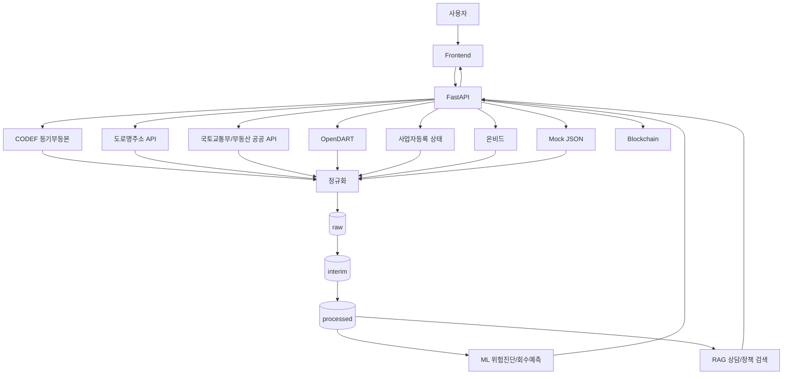
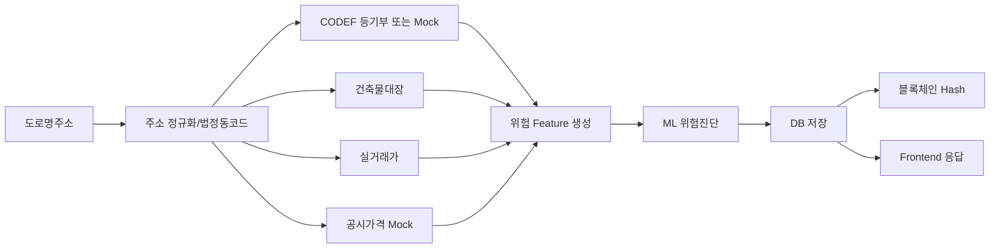
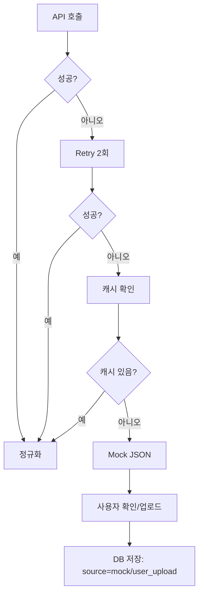

# HUG × 아이엔 안심주거 생태계

## 데이터 수집 및 API 연동 가이드

작성일: 2026-07-14 (KST)  
문서 목적: 실제 개발자가 데이터 수집, API 연동, Mock 데이터 생성, ML 학습 데이터 준비, FastAPI 연동, 개발 진행을 체크리스트처럼 수행하기 위한 실무 문서

> 원칙: 공식 문서로 확인된 내용만 확정값으로 사용한다. 공식 문서 상세 페이지 또는 과금/제한이 불명확한 항목은 `확인 필요`로 표시한다.

---

# 0. 문서 목적

| 구분 | 개발설계보고서 | 데이터 수집 및 API 연동 가이드 |
|---|---|---|
| 핵심 질문 | 왜 사용하는가 | 어떻게 준비하는가 |
| 독자 | 기획자, 심사위원, PM | Backend, ML, Data, Frontend, Blockchain 개발자 |
| 산출물 | 시스템 구조, 설계 근거, 기대효과 | API 키, 요청/응답, DB 적재, Mock, Notebook, TODO |
| 변경 주기 | 큰 구조 변경 시 | 개발 중 매일 갱신 |

실무 목표:

- 발제사 제공 데이터와 외부 API 데이터를 구분한다.
- API별 MVP 사용 여부, Fallback, Mock 전략을 명확히 한다.
- ML 학습 데이터, RAG 데이터, FastAPI 응답 스키마, 블록체인 기록 대상을 연결한다.
- 해커톤 기간 내 구현해야 할 API와 발표용 Mock 범위를 분리한다.

---

# 1. 전체 데이터 구조



| 데이터 | 생성 위치 | 입력 위치 | 주요 사용처 |
|---|---|---|---|
| 사용자 입력 주소 | Frontend | FastAPI `risk/diagnose` | 주소 정규화, API 호출 키 |
| 등기부등본 | CODEF API 또는 Mock | `data/raw/codef/` | 권리부담, 근저당, 압류 Feature |
| 도로명주소 | 도로명주소 API | `data/interim/address/` | 법정동코드, 도로명주소 표준화 |
| 실거래가 | 공공데이터포털 국토교통부 API | `data/raw/rtms/` | 전세가율, 지역 시세 |
| 건축물대장 | 공공데이터포털 건축물대장 API | `data/raw/building/` | 용도, 사용승인일, 위반건축물 여부 |
| 공시가격/공시지가 | 부동산 공시가격 API | `data/raw/official_price/` | 담보가치, 전세가율 보정 |
| DART 법인정보 | OpenDART | `data/raw/dart/` | 법인 임대인 위험 신호 |
| 사업자등록 상태 | 국세청 API | `data/raw/business_status/` | 폐업/휴업 리스크 |
| 온비드 공매 | 온비드 또는 공공데이터 | `data/raw/onbid/` | 경매/공매 위험 신호 |
| 아이엔 상담데이터 | 발제사 제공 CSV/XLSX | `data/raw/in/` | RAG, 상담 유형 분류 |
| HUG 사고/대위변제 | 발제사 제공 CSV/XLSX | `data/raw/hug/` | 위험분류, 회수예측 |
| ML 추론 결과 | ML service | `data/processed/predictions/` 및 DB | FastAPI, Frontend |
| 블록체인 해시 | FastAPI | Polygon Amoy 또는 Mock chain | 결과 위변조 방지 |

---

# 2. 데이터 분류

## 2.1 발제사 제공 데이터

| 데이터 | 목적 | 파일형식 | 예상컬럼 | 활용모델 | 저장위치 |
|---|---|---|---|---|---|
| 아이엔 상담데이터 | 상담 유형 분류, RAG 답변 근거 | CSV/XLSX/JSON | 상담일시, 상담유형, 상담내용, 지역, 계약단계, 처리결과 | RAG, 상담분류 | `data/raw/in/`, `data/processed/rag/` |
| HUG 사고데이터 | 사고 발생 패턴 학습 | CSV/XLSX | 사고ID, 사고일, 지역, 보증금, 주택유형, 임대인유형, 사고사유 | RiskClassification | `data/raw/hug/`, `data/processed/ml/` |
| HUG 대위변제 | 회수 가능성/소요기간 예측 | CSV/XLSX | 사고ID, 대위변제일, 변제금액, 회수금액, 회수일, 진행상태 | RecoveryPrediction | `data/raw/hug/`, `data/processed/ml/` |
| 경매 데이터 | 권리관계/회수 가능성 판단 | CSV/XLSX/PDF | 사건번호, 법원, 감정가, 최저가, 낙찰가, 배당요구종기 | RecoveryPrediction | `data/raw/auction/`, `data/interim/auction/` |
| 배당 데이터 | 회수율 산정 | CSV/XLSX/PDF | 사건번호, 채권자, 채권액, 배당액, 배당순위 | RecoveryPrediction | `data/raw/dividend/`, `data/processed/ml/` |
| 임대인/법인 목록 | DART/사업자 상태 조회 대상 | CSV/XLSX | 임대인명, 법인명, 사업자번호, 법인등록번호 | EntityRisk | `data/raw/entities/`, `data/interim/entities/` |

공통 처리 규칙:

- 원본 파일은 `raw`에 그대로 보관한다.
- 컬럼명 매핑과 타입 변환은 `interim`에서 수행한다.
- 학습용 Feature와 Label은 `processed`에 저장한다.
- 개인정보 컬럼은 `processed` 저장 전 마스킹, 해시, UUID 치환한다.

## 2.2 외부 Open API

### 2.2.1 API 요약표

| API명 | 공급기관 | 공식URL | 인증방식 | 무료/유료 | 호출방식 | 응답 | MVP |
|---|---|---|---|---|---|---|---|
| CODEF 등기부등본 | CODEF | https://developer.codef.io/ / https://www.codef.io/ | OAuth/token 방식 확인 필요 | 유료 가능성 높음, 확인 필요 | REST | JSON 확인 필요 | 예 |
| 도로명주소 API | 행정안전부/주소기반산업지원서비스 | https://business.juso.go.kr/ | 승인키 | 무료 | REST GET | XML/JSON | 예 |
| 국토교통부 실거래가 | 국토교통부/공공데이터포털 | https://www.data.go.kr/ | 공공데이터포털 serviceKey | 무료 | REST GET | XML 중심, JSON 지원 여부 확인 필요 | 예 |
| 건축물대장 | 국토교통부/공공데이터포털 | https://www.data.go.kr/ | 공공데이터포털 serviceKey | 무료 | REST GET | XML 중심 | 예 |
| 공동주택 공시가격 | 한국부동산원/부동산공시가격 알리미 또는 공공데이터포털 | https://www.realtyprice.kr/ / https://www.data.go.kr/ | 확인 필요 | 무료 확인 필요 | REST 또는 파일, 확인 필요 | XML/JSON 확인 필요 | Mock 우선 |
| 개별주택가격 | 지자체/부동산공시가격 알리미 또는 공공데이터포털 | https://www.realtyprice.kr/ / https://www.data.go.kr/ | 확인 필요 | 무료 확인 필요 | REST 또는 파일, 확인 필요 | XML/JSON 확인 필요 | Mock 우선 |
| 개별공시지가 | 국토교통부/공공데이터포털 | https://www.data.go.kr/ | 공공데이터포털 serviceKey 확인 필요 | 무료 | REST GET | XML 중심 | Mock 우선 |
| OpenDART | 금융감독원 | https://opendart.fss.or.kr/guide/main.do | API 인증키 `crtfc_key` | 무료 | REST GET | JSON/XML | 예 |
| 사업자등록 상태 | 국세청/공공데이터포털 | https://www.data.go.kr/ | 공공데이터포털 serviceKey | 무료 | REST POST | JSON | 예 |
| 온비드 | 한국자산관리공사 온비드/공공데이터포털 | https://www.onbid.co.kr/ / https://www.data.go.kr/ | 확인 필요 | 무료 확인 필요 | REST 또는 파일, 확인 필요 | XML/JSON 확인 필요 | 발표용 |
| Firebase 또는 알림 API | Google Firebase | https://firebase.google.com/docs/cloud-messaging | Firebase service account/OAuth2 | 무료 할당량 후 과금 가능 | HTTP v1 | JSON | 선택 |

### 2.2.2 API별 상세표

#### ① CODEF 등기부등본

| 항목 | 내용 |
|---|---|
| API명 | CODEF 부동산 등기부등본 조회 |
| 공급기관 | CODEF |
| 공식URL | https://developer.codef.io/ , https://www.codef.io/ |
| 인증방식 | CODEF 계정, Client ID/Secret, OAuth/token 방식 확인 필요 |
| 무료/유료 | 유료 가능성 높음. 해커톤 제공 크레딧 여부 확인 필요 |
| 호출방식 | REST POST 예상. 정확한 엔드포인트는 CODEF 콘솔에서 확인 |
| JSON/XML | JSON 예상 |
| 사용목적 | 소유권, 근저당, 압류, 가압류, 전세권 등 권리부담 추출 |
| 입력값 | 주소, 부동산고유번호 또는 등기 조회 식별자, 발급/열람 구분 |
| 출력값 | 등기 구분, 소유자, 권리자, 채권최고액, 접수일, 말소여부 |
| 호출예시 | `POST /v1/kr/public/real-estate-register` 형식은 확인 필요 |
| 응답예시 | `{"status":"OK","registry":{"owner":"masked","liens":[{"type":"mortgage","amount":120000000}]}}` |
| 제한사항 | 개인정보/유료 API, 조회 동의/권한 검토 필요 |
| Fallback | `mock_registry_normal.json`, `mock_registry_mortgage.json`, `mock_registry_seizure.json` |
| MVP 사용여부 | 사용 |
| 추후확장여부 | 전자서명/사용자 동의 기반 실조회 |

#### ② 도로명주소 API

| 항목 | 내용 |
|---|---|
| API명 | 도로명주소 검색 API |
| 공급기관 | 행정안전부 주소기반산업지원서비스 |
| 공식URL | https://business.juso.go.kr/ |
| 인증방식 | 승인키 |
| 무료/유료 | 무료 |
| 호출방식 | REST GET |
| JSON/XML | XML/JSON |
| 사용목적 | 사용자 입력 주소를 표준 도로명주소, 지번주소, 법정동코드로 정규화 |
| 입력값 | `confmKey`, `keyword`, `currentPage`, `countPerPage`, `resultType` |
| 출력값 | `roadAddr`, `jibunAddr`, `admCd`, `rnMgtSn`, `bdMgtSn`, `zipNo` |
| 호출예시 | `GET https://business.juso.go.kr/addrlink/addrLinkApi.do?confmKey={KEY}&keyword=서울특별시 강남구 테헤란로&resultType=json` |
| 응답예시 | `{"results":{"common":{"errorCode":"0"},"juso":[{"roadAddr":"...","admCd":"1168010100"}]}}` |
| 제한사항 | 승인키 필요, 과도한 호출 제한 가능 |
| Fallback | 최근 성공 주소 캐시, 수동 주소 입력, Mock address |
| MVP 사용여부 | 사용 |
| 추후확장여부 | 좌표 변환, 건물관리번호 기반 API 연계 |

#### ③ 국토교통부 실거래가

| 항목 | 내용 |
|---|---|
| API명 | 국토교통부 실거래가 공개 API |
| 공급기관 | 국토교통부/공공데이터포털 |
| 공식URL | https://www.data.go.kr/ |
| 인증방식 | 공공데이터포털 `serviceKey` |
| 무료/유료 | 무료 |
| 호출방식 | REST GET |
| JSON/XML | XML 중심. JSON 지원 여부는 서비스별 확인 필요 |
| 사용목적 | 지역/월별 매매 및 전월세 실거래가를 이용한 전세가율, 지역가격 추정 |
| 입력값 | 법정동코드 `LAWD_CD`, 계약월 `DEAL_YMD`, serviceKey |
| 출력값 | 거래금액, 보증금, 월세, 계약년월, 층, 면적, 건축년도 |
| 호출예시 | `GET https://apis.data.go.kr/1613000/RTMSDataSvcAptTrade/getRTMSDataSvcAptTrade?LAWD_CD=11680&DEAL_YMD=202506&serviceKey={KEY}` |
| 응답예시 | `<item><dealAmount>120,000</dealAmount><excluUseAr>84.9</excluUseAr><floor>10</floor></item>` |
| 제한사항 | 서비스별 엔드포인트와 데이터 갱신 주기 확인 필요 |
| Fallback | `mock_transaction_recent.json`, KB/수동 CSV, 발표용 평균값 |
| MVP 사용여부 | 사용 |
| 추후확장여부 | 전월세/오피스텔/연립다세대 API 확대 |

#### ④ 건축물대장

| 항목 | 내용 |
|---|---|
| API명 | 건축HUB 건축물대장정보 서비스 |
| 공급기관 | 국토교통부/공공데이터포털 |
| 공식URL | https://www.data.go.kr/ |
| 인증방식 | 공공데이터포털 `serviceKey` |
| 무료/유료 | 무료 |
| 호출방식 | REST GET |
| JSON/XML | JSON+XML |
| 사용목적 | 주택유형, 용도, 사용승인일, 위반건축물 가능성, 면적 정보 확인 |
| 입력값 | `sigunguCd`, `bjdongCd`, `bun`, `ji`, `serviceKey` |
| 출력값 | 대지위치, 건물명, 주용도, 구조, 연면적, 사용승인일 |
| 호출예시 | `GET https://apis.data.go.kr/1613000/BldRgstHubService/getBrTitleInfo?sigunguCd=11680&bjdongCd=10300&bun=0012&ji=0000&_type=json&serviceKey={KEY}` |
| 응답예시 | `<item><mainPurpsCdNm>공동주택</mainPurpsCdNm><useAprDay>20190101</useAprDay></item>` |
| 제한사항 | 주소 파싱 품질에 민감. 지번 분리 실패 시 조회 실패 |
| Fallback | 주소별 Mock building profile, 사용자 업로드 건축물대장 |
| MVP 사용여부 | 사용 |
| 추후확장여부 | 층별/전유부/표제부 세부 API 확장 |

#### ⑤ 공동주택 공시가격

| 항목 | 내용 |
|---|---|
| API명 | 공동주택 공시가격 조회 |
| 공급기관 | 디지털트윈국토/VWorld |
| 공식URL | 디지털트윈국토 마이포털 > 나의 오픈API |
| 인증방식 | VWorld 인증키 + 등록 서비스 URL |
| 무료/유료 | 개발키 기준 무료 범위 확인 필요 |
| 호출방식 | 서비스별 공식 API URL/레이어명 확인 필요 |
| JSON/XML | 서비스별 확인 필요 |
| 사용목적 | 공동주택 담보가치 및 전세가율 보정 |
| 입력값 | 주소, 단지명, 동/호, 기준연도 |
| 출력값 | 공시가격, 기준연도, 전용면적, 단지/동/호 |
| 호출예시 | 현재 키의 등록 서비스 URL은 `https://www.khug.or.kr/index.jsp`; 실제 API URL/레이어명 확인 전까지 Mock 유지 |
| 응답예시 | `{"official_price": 620000000, "base_year": 2026}` |
| 제한사항 | "서비스 URL"은 API endpoint가 아니라 인증키 사용 허용 URL이다. Python 수집 스크립트에서 쓰려면 실제 API URL, key/domain 파라미터, 레이어명을 별도로 확인해야 한다. |
| Fallback | Mock official price, 수동 입력, 최근 실거래가 기반 추정값 |
| MVP 사용여부 | Mock |
| 추후확장여부 | 사용 |

#### ⑥ 개별주택가격

| 항목 | 내용 |
|---|---|
| API명 | 개별주택가격 조회 |
| 공급기관 | 디지털트윈국토/VWorld |
| 공식URL | 디지털트윈국토 마이포털 > 나의 오픈API |
| 인증방식 | VWorld 인증키 + 등록 서비스 URL |
| 무료/유료 | 개발키 기준 무료 범위 확인 필요 |
| 호출방식 | 서비스별 공식 API URL/레이어명 확인 필요 |
| JSON/XML | 서비스별 확인 필요 |
| 사용목적 | 단독/다가구 주택 가치 산정 |
| 입력값 | 주소, 법정동코드, 지번, 기준연도 |
| 출력값 | 개별주택가격, 기준연도, 대지면적, 건물면적 |
| 호출예시 | 현재 키의 등록 서비스 URL은 `https://www.khug.or.kr/index.jsp`; 실제 API URL/레이어명 확인 전까지 Mock 유지 |
| 응답예시 | `{"individual_house_price": 450000000, "base_year": 2026}` |
| 제한사항 | "서비스 URL"은 API endpoint가 아니라 인증키 사용 허용 URL이다. 실제 조회에는 별도 API URL/레이어명이 필요하다. |
| Fallback | Mock, 사용자 입력, 감정가/실거래가 보정 |
| MVP 사용여부 | Mock |
| 추후확장여부 | 사용 |

#### ⑦ 개별공시지가

| 항목 | 내용 |
|---|---|
| API명 | 개별공시지가 조회 |
| 공급기관 | 디지털트윈국토/VWorld |
| 공식URL | 디지털트윈국토 마이포털 > 나의 오픈API |
| 인증방식 | VWorld 인증키 + 등록 서비스 URL |
| 무료/유료 | 개발키 기준 무료 범위 확인 필요 |
| 호출방식 | 서비스별 공식 API URL/레이어명 확인 필요 |
| JSON/XML | 서비스별 확인 필요 |
| 사용목적 | 토지가치, 담보가치, 경매 회수 가능성 보정 |
| 입력값 | 법정동코드, 지번, 기준연도 |
| 출력값 | 공시지가, 기준일, 면적, 지목 |
| 호출예시 | 현재 키의 등록 서비스 URL은 `https://www.khug.or.kr/index.jsp`; 실제 API URL/레이어명 확인 전까지 Mock 유지 |
| 응답예시 | `{"land_price_per_sqm": 3500000, "base_year": 2026}` |
| 제한사항 | "서비스 URL"은 API endpoint가 아니라 인증키 사용 허용 URL이다. 개별주택가격과 중복 사용 시 Feature leakage 주의 |
| Fallback | Mock, 지자체 CSV, 실거래가 기반 추정 |
| MVP 사용여부 | Mock |
| 추후확장여부 | 사용 |

#### ⑧ OpenDART

| 항목 | 내용 |
|---|---|
| API명 | OpenDART 공시정보 API |
| 공급기관 | 금융감독원 |
| 공식URL | https://opendart.fss.or.kr/guide/main.do |
| 인증방식 | API 인증키 `crtfc_key` |
| 무료/유료 | 무료 |
| 호출방식 | REST GET |
| JSON/XML | JSON/XML |
| 사용목적 | 법인 임대인 공시 여부, 재무정보, 주요 공시 리스크 탐색 |
| 입력값 | `crtfc_key`, `corp_code`, `bgn_de`, `end_de`, `page_no` |
| 출력값 | 공시목록, 회사명, 보고서명, 접수번호, 공시일 |
| 호출예시 | `GET https://opendart.fss.or.kr/api/list.json?crtfc_key={KEY}&corp_code={CORP_CODE}&bgn_de=20250101&end_de=20260714` |
| 응답예시 | `{"status":"000","list":[{"corp_name":"...","report_nm":"사업보고서"}]}` |
| 제한사항 | 상장/공시대상 법인 중심. 일반 개인 임대인은 조회 불가 |
| Fallback | DART 없음 상태 Mock, 사업자등록 상태 API만 사용 |
| MVP 사용여부 | 사용 |
| 추후확장여부 | 재무지표, 감사의견, 주요사항보고서 분석 |

#### ⑨ 사업자등록 상태

| 항목 | 내용 |
|---|---|
| API명 | 사업자등록정보 진위확인 및 상태조회 서비스 |
| 공급기관 | 국세청/공공데이터포털 |
| 공식URL | https://www.data.go.kr/ |
| 인증방식 | 공공데이터포털 `serviceKey` |
| 무료/유료 | 무료 |
| 호출방식 | REST POST |
| JSON/XML | JSON |
| 사용목적 | 임대사업자 폐업/휴업/계속 여부 확인 |
| 입력값 | 사업자등록번호 목록 `b_no` |
| 출력값 | 사업자상태, 과세유형, 폐업일, 상태코드 |
| 호출예시 | `POST https://api.odcloud.kr/api/nts-businessman/v1/status?serviceKey={KEY}` |
| 응답예시 | `{"data":[{"b_no":"1234567890","b_stt":"계속사업자","tax_type":"부가가치세 일반과세자"}]}` |
| 제한사항 | 개인정보 및 사업자번호 저장 정책 필요 |
| Fallback | Mock active/closed business, 사용자 서류 업로드 |
| MVP 사용여부 | 사용 |
| 추후확장여부 | 진위확인 API, 법인등기 정보 연계 |

#### ⑩ 온비드

| 항목 | 내용 |
|---|---|
| API명 | 온비드 공매/입찰 정보 |
| 공급기관 | 한국자산관리공사 온비드/공공데이터포털 |
| 공식URL | https://www.onbid.co.kr/ , https://www.data.go.kr/ |
| 인증방식 | 확인 필요 |
| 무료/유료 | 확인 필요 |
| 호출방식 | 확인 필요 |
| JSON/XML | 확인 필요 |
| 사용목적 | 공매 진행 여부, 압류재산 위험 신호, 회수 가능성 보정 |
| 입력값 | 주소, 물건번호, 공고일, 지역 |
| 출력값 | 공매물건명, 감정가, 최저입찰가, 입찰기간, 진행상태 |
| 호출예시 | 확인 필요 |
| 응답예시 | `{"asset_id":"ONBID-001","status":"입찰진행","min_bid_price":300000000}` |
| 제한사항 | 해커톤 기간 내 API 실연동보다 Mock 권장 |
| Fallback | `mock_onbid_auction.json`, 법원경매/수동 CSV |
| MVP 사용여부 | 발표용 |
| 추후확장여부 | 사용 |

#### ⑪ Firebase 또는 알림 API

| 항목 | 내용 |
|---|---|
| API명 | Firebase Cloud Messaging HTTP v1 |
| 공급기관 | Google Firebase |
| 공식URL | https://firebase.google.com/docs/cloud-messaging |
| 인증방식 | Firebase service account, OAuth2 access token |
| 무료/유료 | 무료 할당량 후 과금 가능. 프로젝트 요금제 확인 필요 |
| 호출방식 | REST POST |
| JSON/XML | JSON |
| 사용목적 | 위험진단 완료, 계약 체크리스트, 등기 변동 감지 알림 |
| 입력값 | device token, topic, title, body, data payload |
| 출력값 | message name 또는 오류코드 |
| 호출예시 | `POST https://fcm.googleapis.com/v1/projects/{project_id}/messages:send` |
| 응답예시 | `{"name":"projects/{project_id}/messages/0:..."} ` |
| 제한사항 | 모바일 토큰/권한 필요. 웹앱은 Web Push 설정 필요 |
| Fallback | DB notification table, 이메일/카카오 알림톡은 확인 필요 |
| MVP 사용여부 | 선택 |
| 추후확장여부 | 실시간 위험 알림 |

---

# 3. API 우선순위

| 우선순위 | 의미 | API/데이터 | 이유 |
|---|---|---|---|
| ★★★★★ | 반드시 구현 | 도로명주소, CODEF 또는 등기부 Mock, 건축물대장, 실거래가, 사업자등록 상태 | 위험진단 핵심 Feature 생성 |
| ★★★★☆ | 시간되면 | OpenDART, Firebase 알림 | 법인 임대인/사용자 경험 강화 |
| ★★★☆☆ | Mock | 공동주택 공시가격, 개별주택가격, 개별공시지가 | 가치평가 Feature이나 API 확인 비용 존재 |
| ★★☆☆☆ | 발표용 | 온비드, 경매/배당 PDF 추출 | 회수예측 스토리 강화 |
| ★☆☆☆☆ | 향후확장 | 등기 변동 알림, 전자서명, 실시간 온체인 검증 | MVP 이후 운영 기능 |

---

# 4. API 연동 순서



| 순서 | 작업 | 입력 | 출력 | 실패 시 |
|---|---|---|---|---|
| 1 | 도로명주소 정규화 | 사용자 주소 | 표준주소, 법정동코드, 건물관리번호 | 수동 주소 입력 |
| 2 | CODEF 등기부 조회 | 표준주소/부동산 식별자 | 권리관계 JSON | 등기부 Mock |
| 3 | 건축물대장 조회 | 법정동코드, 지번 | 용도/면적/사용승인일 | 건축물 Mock |
| 4 | 실거래가 조회 | 법정동코드, 계약월 | 지역 거래가격 | 최근 캐시/Mock |
| 5 | 공시가격 조회 또는 Mock | 주소, 기준연도 | 공시가격 | Mock |
| 6 | 사업자/DART 조회 | 사업자번호/법인명 | 사업상태/공시정보 | 조회불가 Feature |
| 7 | Feature 생성 | 정규화 데이터 | ML 입력 벡터 | 기본값/결측 플래그 |
| 8 | 위험진단 | Feature | 위험등급, 사유 | Rule-based fallback |
| 9 | DB 저장 | 진단결과 | raw/interim/processed 테이블 | 로컬 JSON 큐 |
| 10 | 블록체인 기록 | 결과 hash | tx_hash | Mock tx_hash |
| 11 | Frontend 응답 | 결과/근거 | 화면 표시 | 오류 안내 |

---

# 5. API 실패 대응

공통 실패 처리:



| API | Timeout | 인증 실패 | 데이터 없음 | 최종 Fallback |
|---|---|---|---|---|
| 도로명주소 | Retry, 캐시 | 키 재발급 안내 | 수동 주소 입력 | `mock_address.json` |
| CODEF | Retry, 비동기 큐 | 키/요금 확인 | 사용자 등기부 업로드 | 등기부 Mock 3종 |
| 실거래가 | Retry, 월 범위 축소 | serviceKey 확인 | 최근 6개월 확대 | 지역 평균 Mock |
| 건축물대장 | Retry | serviceKey 확인 | 지번 파싱 재시도 | 건축물 Mock |
| 공시가격 | Retry | 인증 확인 | 수동 입력 | 공시가격 Mock |
| OpenDART | Retry | `crtfc_key` 확인 | DART 없음 처리 | `dart_exists=false` |
| 사업자등록 | Retry | serviceKey 확인 | 사업자번호 확인 | 사업자 상태 Mock |
| 온비드 | Retry | 확인 필요 | 공매 없음 처리 | 온비드 Mock |
| Firebase | Retry | service account 확인 | 토큰 삭제 | DB 알림 테이블 |

---

# 6. Mock 데이터

## 6.1 필수 Mock 목록

| Mock | 파일명 | 목적 |
|---|---|---|
| 정상 등기부 | `mock_registry_normal.json` | 기준 정상 케이스 |
| 근저당 있음 | `mock_registry_mortgage.json` | 근저당비율 Feature |
| 압류 있음 | `mock_registry_seizure.json` | 고위험 Rule |
| 전세권/가압류 있음 | `mock_registry_complex_rights.json` | 복합 권리부담 |
| 공시가격 조회 성공 | `mock_official_price_success.json` | 담보가치 계산 |
| 실거래가 없음 | `mock_transaction_empty.json` | 결측 대응 |
| 사업자 폐업 | `mock_business_closed.json` | 임대사업자 위험 |
| 법인 DART 있음 | `mock_dart_found.json` | 법인 정보 표시 |
| 법인 DART 없음 | `mock_dart_not_found.json` | 일반 사업자 처리 |
| 온비드 공매 진행 | `mock_onbid_active.json` | 발표용 위험 신호 |
| 블록체인 기록 성공 | `mock_blockchain_tx_success.json` | 결과 해시 표시 |

## 6.2 JSON 예시

```json
{
  "case_id": "case_001",
  "source": "mock_registry_mortgage",
  "address": {
    "road_address": "서울특별시 강남구 테헤란로 000",
    "adm_cd": "1168010100"
  },
  "registry": {
    "owner_type": "individual",
    "rights": [
      {
        "type": "mortgage",
        "holder": "OO은행",
        "amount": 180000000,
        "registered_at": "2024-03-11",
        "is_cancelled": false
      }
    ]
  },
  "price": {
    "deposit": 400000000,
    "recent_trade_price": 620000000,
    "official_price": 510000000
  },
  "features": {
    "jeonse_ratio": 0.645,
    "mortgage_ratio": 0.290,
    "rights_burden_ratio": 0.935
  },
  "label": {
    "risk_grade": "HIGH",
    "risk_reasons": ["근저당 설정", "전세가율 높음"]
  }
}
```

```json
{
  "business_status": {
    "b_no_hash": "sha256:...",
    "status": "폐업자",
    "closed_date": "2025-12-31",
    "source": "mock_business_closed"
  }
}
```

---

# 7. ML 데이터 준비

## 7.1 Google Colab 폴더 구조

```text
data/
  raw/
    hug/
    in/
    codef/
    rtms/
    building/
    official_price/
    dart/
    business_status/
  interim/
    address/
    normalized/
    entity/
  processed/
    ml/
    rag/
    predictions/
  external/
    public_codes/
    region_codes/
models/
  risk_classifier/
  recovery_predictor/
notebooks/
  01_EDA.ipynb
  02_Preprocessing.ipynb
  03_RiskClassification.ipynb
  04_RecoveryPrediction.ipynb
  05_InferenceExport.ipynb
exports/
  feature_schema.json
  model.pkl
  label_encoder.pkl
  inference_sample.json
```

## 7.2 Notebook 역할

| Notebook | 역할 | 입력 | 출력 |
|---|---|---|---|
| `01_EDA.ipynb` | 데이터 구조 확인, 결측/분포/상관 탐색 | raw CSV/XLSX | EDA 리포트 |
| `02_Preprocessing.ipynb` | 컬럼 표준화, 타입 변환, 결측 처리 | raw/interim | `processed/ml/train.parquet` |
| `03_RiskClassification.ipynb` | 위험등급 분류 모델 학습 | Feature table | risk model |
| `04_RecoveryPrediction.ipynb` | 대위변제 회수율/소요기간 예측 | 사고/경매/배당 | recovery model |
| `05_InferenceExport.ipynb` | FastAPI용 추론 함수와 샘플 Export | trained model | `model.pkl`, `feature_schema.json` |

---

# 8. 데이터 전처리

| 데이터/컬럼 | 결측치 | 이상치 | 날짜 | 금액 | 주소 | 텍스트 | 범주형 |
|---|---|---|---|---|---|---|---|
| 상담데이터 | 상담내용 없으면 제외 | 반복/스팸 제거 | KST `YYYY-MM-DD` | 해당 없음 | 주소 마스킹 | 개인정보 제거, 형태소/임베딩 | 상담유형 표준코드 |
| HUG 사고 | 핵심 Label 없으면 제외 | 보증금 상하위 0.5% 검토 | 사고일 표준화 | 원 단위 integer | 법정동코드 변환 | 사고사유 정규화 | 주택유형/사고유형 인코딩 |
| 대위변제 | 회수금액 결측은 0 또는 진행중 | 음수/초과 회수 검토 | 변제일/회수일 | 원 단위 integer | 지역코드 | 진행상태 통일 | 회수상태 |
| 등기부 | 권리금액 없으면 결측 플래그 | 채권최고액 과대값 검토 | 접수일 | 원 단위 integer | 표준주소 매핑 | 권리명 표준화 | 권리유형 |
| 실거래가 | 거래 없음은 빈 리스트 | 면적/금액 극단값 검토 | 계약년월 | 만원 단위는 원 단위 변환 | 법정동코드 | 단지명 정규화 | 거래유형 |
| 건축물대장 | 사용승인일 결측 플래그 | 면적 0 검토 | `YYYYMMDD` 변환 | 해당 없음 | 지번 파싱 | 용도명 표준화 | 건물용도/구조 |
| DART | 공시 없음 플래그 | 해당 없음 | 공시일 | 재무금액 원 단위 | 해당 없음 | 보고서명 키워드 | 공시유형 |
| 사업자등록 | 조회불가 플래그 | 해당 없음 | 폐업일 | 해당 없음 | 해당 없음 | 상태명 표준화 | 계속/휴업/폐업 |

---

# 9. Feature Engineering

| 모델 | Feature | 계산식/설명 |
|---|---|---|
| RiskClassification | `jeonse_ratio` | 보증금 / 최근 매매가 또는 공시가격 보정값 |
| RiskClassification | `mortgage_ratio` | 근저당 채권최고액 합계 / 기준가격 |
| RiskClassification | `rights_burden_ratio` | 보증금 + 선순위채권 / 기준가격 |
| RiskClassification | `has_seizure` | 압류/가압류/가처분 존재 여부 |
| RiskClassification | `building_age_years` | 기준일 - 사용승인일 |
| RiskClassification | `region_code` | 법정동코드 앞 5자리 또는 10자리 |
| RiskClassification | `deposit_bucket` | 보증금 구간 |
| RiskClassification | `business_closed_flag` | 사업자 폐업 여부 |
| RiskClassification | `dart_disclosure_flag` | 법인 공시 존재 여부 |
| RecoveryPrediction | `days_since_incident` | 기준일 - 사고일 |
| RecoveryPrediction | `auction_discount_ratio` | 최저입찰가 / 감정가 |
| RecoveryPrediction | `dividend_expected_ratio` | 예상 배당액 / 채권액 |
| RecoveryPrediction | `claim_amount` | 대위변제 또는 보증금 금액 |
| RecoveryPrediction | `senior_claim_ratio` | 선순위 채권 / 감정가 |
| RAG Routing | `consultation_stage` | 계약전/계약중/사고후 |
| RAG Routing | `topic_tags` | 등기, 보증, 경매, 배당, 대위변제 |

---

# 10. DB 저장 규칙

| Layer | 역할 | 예시 파일명/테이블 |
|---|---|---|
| raw | 원본 보존, 재현성 확보 | `raw_codef_20260714_case001.json` |
| interim | 파싱/정규화/컬럼 매핑 | `interim_registry_rights_20260714.parquet` |
| processed | 학습/서빙용 Feature | `processed_risk_features_v1.parquet` |

규칙:

| 항목 | 규칙 | 예시 |
|---|---|---|
| 컬럼명 | `snake_case` | `registered_at`, `mortgage_amount` |
| 날짜 | ISO `YYYY-MM-DD` | `2026-07-14` |
| 일시 | ISO + KST | `2026-07-14T13:30:00+09:00` |
| 금액 | 원 단위 integer | `400000000` |
| 비율 | 0~1 float | `0.645` |
| UUID | UUID v4 | `risk_case_id` |
| 원천 | `source_system` 필수 | `codef`, `mock`, `user_upload` |
| 개인정보 | 원문 저장 금지, 필요 시 암호화 | `owner_name_enc`, `b_no_hash` |
| API 응답 | raw JSON 별도 저장 | `api_response_raw` |
| 에러 | error_code/error_message 저장 | `API_TIMEOUT` |

권장 핵심 테이블:

| 테이블 | 설명 |
|---|---|
| `risk_cases` | 진단 요청 단위 |
| `addresses` | 주소 정규화 결과 |
| `registry_rights` | 등기 권리 항목 |
| `building_profiles` | 건축물대장 요약 |
| `market_prices` | 실거래가/공시가격 |
| `entity_checks` | DART/사업자 상태 |
| `risk_predictions` | ML/Rule 결과 |
| `rag_chunks` | 상담/RAG Chunk |
| `blockchain_receipts` | hash, tx_hash, chain_id |

---

# 11. RAG 데이터 준비

| 항목 | 규칙 |
|---|---|
| 대상 | 아이엔 상담데이터, HUG FAQ, 보증/대위변제 안내문, 내부 상담 매뉴얼 |
| 제외 | 주민번호, 전화번호, 계좌, 상세 주소, 실명 |
| Chunk 크기 | 500~900 Korean characters |
| Overlap | 80~150 characters |
| Embedding 입력 | 개인정보 제거 후 `question + answer + tags` |
| Metadata | `doc_id`, `source`, `consultation_stage`, `topic`, `region_code`, `created_at`, `pii_removed` |
| 필터 | 계약단계, 주제, 문서 출처, 최신성 |
| 검색방법 | Hybrid 권장: BM25 + Vector top-k 후 rerank |
| 응답근거 | chunk_id와 source를 FastAPI 응답에 포함 |

RAG JSONL 예시:

```json
{"chunk_id":"rag_0001","source":"in_consulting","topic":"근저당","consultation_stage":"계약전","text":"개인정보 제거된 상담 요약...","metadata":{"pii_removed":true,"created_at":"2026-07-14"}}
```

---

# 12. 블록체인 데이터

| 구분 | 온체인 저장 | 오프체인 저장 |
|---|---|---|
| 저장하는 것 | `case_id_hash`, `result_hash`, `model_version_hash`, `created_at`, `issuer` | 원본 API 응답, ML Feature, 위험진단 상세, 사용자 입력 |
| 저장하지 않는 것 | 주소 원문, 이름, 주민번호, 사업자번호 원문, 등기부 원문 | 필요 시 암호화 저장 |
| 목적 | 결과 위변조 방지, 제출시점 증명 | 서비스 운영, 재조회, 설명가능성 |
| 저장소 | Polygon Amoy 또는 Mock chain | PostgreSQL/Supabase/Object Storage |

Hash 생성 규칙:

```text
canonical_json = sort_keys({
  case_id,
  normalized_address_hash,
  risk_grade,
  risk_score,
  model_version,
  created_at
})
result_hash = sha256(canonical_json)
```

블록체인 기록 테이블:

| 컬럼 | 타입 | 설명 |
|---|---|---|
| `receipt_id` | uuid | 기록 ID |
| `case_id` | uuid | 진단 케이스 |
| `chain_id` | int | Amoy는 확인 필요 |
| `contract_address` | text | 배포 후 입력 |
| `result_hash` | text | sha256 |
| `tx_hash` | text | 트랜잭션 해시 |
| `status` | text | pending/success/failed/mock |

---

# 13. 개인정보

| 구분 | 처리 |
|---|---|
| 수집 가능 | 주소, 보증금, 계약일, 주택유형, 법인명, 사업자번호는 목적/동의 범위 내 |
| 수집 금지 | 주민등록번호, 계좌번호, 불필요한 실명, 원본 연락처 |
| 암호화 | 꼭 필요한 원문 식별자는 AES 등 애플리케이션 레벨 암호화 |
| Hash | 사업자번호, case fingerprint, 주소 fingerprint |
| Masking | 이름 `홍*동`, 전화 `010-****-1234`, 주소 상세호수 제거 |
| UUID | 사용자/케이스/문서 식별자는 UUID 사용 |
| 로그 | API 요청/응답 로그에 개인정보 원문 남기지 않음 |
| RAG | 개인정보 제거 완료 Chunk만 임베딩 |
| 블록체인 | 개인정보 및 주소 원문 절대 저장 금지 |

---

# 14. 디렉터리 구조

```text
project/
  backend/
    app/
      api/
      core/
      services/
      schemas/
      repositories/
    tests/
    requirements.txt
  frontend/
    src/
    public/
    package.json
  ml/
    notebooks/
    src/
    models/
    exports/
  blockchain/
    contracts/
    scripts/
    deployments/
  data/
    raw/
    interim/
    processed/
    external/
    mock/
  docs/
    데이터수집_및_API가이드_260714.md
    api_contracts.md
  api/
    openapi.yaml
    postman_collection.json
  tests/
    fixtures/
      mock_registry_normal.json
      mock_registry_mortgage.json
      mock_business_closed.json
```

---

# 15. 실제 해야할 TODO

## 15.1 계정/키

- [x] CODEF 계정 생성
- [ ] CODEF 상품/등기부 API 권한 확인 (콘솔에서 최종 엔드포인트·상품명 확인 필요)
- [x] CODEF API Key 또는 Client ID/Secret 발급 (데모·샌드박스)
- [x] 공공데이터포털 계정 생성
- [x] 도로명주소 API 승인키 발급 (2026-07-14 발급, 유효 30일 — 만료일 캘린더 등록 필요)
- [x] 국토교통부 실거래가 API 신청
- [x] 건축물대장 API 신청
- [x] 공시가격/공시지가 키 발급 확인 (디지털트윈국토/VWorld 3종, 실제 API URL/레이어명 확인 전까지 Mock 유지)
- [x] OpenDART 인증키 발급
- [x] 사업자등록 상태조회 API 신청
- [ ] 온비드 API 또는 다운로드 데이터 확인 (미발급, Mock 유지)
- [ ] Firebase 프로젝트 생성 또는 알림 제외 결정 (보류)

## 15.2 개발/데이터

- [x] Mock JSON 11종 작성 (2026-07-14 완료 + 도로명주소/건축물대장 Fallback용 2종 추가 — 5장 Fallback 표와 6.1절 목록 불일치 보완, `mock_address_fallback.json`/`mock_building_fallback.json`)
- [x] `data/raw`, `data/interim`, `data/processed`, `data/mock` 생성
- [ ] PostgreSQL 또는 Supabase 생성 (Backend_API_명세서_260714.md에서 MongoDB로 확정 변경됨 — 해당 문서 기준으로 대체)
- [ ] DB 테이블 초안 생성
- [x] FastAPI 환경변수 `.env.example` 작성
- [x] API client wrapper 작성 (`scripts/collect_raw_data.py`, 2026-07-14)
- [x] Retry/timeout 공통 모듈 작성 (`scripts/collect_raw_data.py`의 `http_call`, 재시도 2회·timeout 15초)
- [x] API 응답 raw 저장 모듈 작성 (`scripts/collect_raw_data.py`의 `save_raw`, 실패 시 Mock Fallback 자동 저장)
- [ ] Feature schema 작성 (등기부·실거래가 실 데이터 확보 후 진행 — processed/ml/README.md 참고)
- [ ] Notebook 5개 생성
- [x] CSV 컬럼 매핑표 작성 (`metadata/column_inventory_260714.md`)
- [ ] RAG Chunk 생성 스크립트 작성 (청크 산출물 1,009건은 존재하나 생성 스크립트 자체는 미보관 — 재현성 위해 추후 스크립트화 필요)
- [ ] 블록체인 hash 생성 함수 작성
- [ ] Polygon Amoy 지갑/테스트 토큰 준비
- [ ] 발표용 정상/위험 케이스 시나리오 3개 작성

> 2026-07-14 갱신: 위 API 9종을 `scripts/collect_raw_data.py`로 실호출 시도했으나 이 작업 환경의
> 아웃바운드 네트워크가 프록시 allowlist로 제한되어 있어 전부 `network_blocked_by_sandbox_proxy`로 실패했고,
> 가이드 5장 Fallback 정책에 따라 Mock으로 대체해 `raw/{address,rtms,building,business_status,dart,official_price,codef}/`에
> `*_mock_fallback.json`으로 저장했다. 키 자체의 유효성은 아직 검증되지 않았다 — 아웃바운드 네트워크가
> 열린 환경(로컬 PC 등)에서 `python scripts/collect_raw_data.py`를 재실행하면 성공한 API는 자동으로
> `*_live.json`으로 대체 저장된다. 상세: `metadata/api_connection_test_260714.json`.

---

# 16. 개발 순서

| 일정 | 목표 | 산출물 |
|---|---|---|
| Day1 | 데이터/API 키 준비, Mock 우선 구축 | API 키 목록, Mock JSON, `.env.example` |
| Day2 | 도로명주소, 실거래가, 건축물대장 연동 | FastAPI API client, raw 저장 |
| Day3 | CODEF 또는 등기부 Mock, 사업자/DART 연동 | 등기 Feature, entity risk |
| Day4 | 전처리/Feature Engineering | `processed_risk_features_v1.parquet`, feature schema |
| Day5 | ML baseline 및 Rule fallback | risk classifier, inference sample |
| Day6 | RAG Chunk/검색, FastAPI 통합 | RAG index, `/risk/diagnose` |
| Day7 | 블록체인 hash, Frontend 연결 | tx_hash/mock receipt, 화면 표시 |
| Day8 | 실패 대응, 발표 시나리오 고정 | Postman collection, demo data |
| Day9 | 통합 테스트, 문서 보강 | test fixtures, QA checklist |
| Day10 | 발표 리허설, API 장애 대비 | offline demo mode |

---

## 부록 A. FastAPI 최소 엔드포인트

| Method | Path | 목적 |
|---|---|---|
| `POST` | `/api/v1/address/normalize` | 주소 정규화 |
| `POST` | `/api/v1/risk/diagnose` | 통합 위험진단 |
| `GET` | `/api/v1/risk/{case_id}` | 진단 결과 조회 |
| `POST` | `/api/v1/rag/search` | 상담/정책 검색 |
| `POST` | `/api/v1/blockchain/anchor` | 결과 hash 기록 |
| `GET` | `/api/v1/health` | API 상태 확인 |

## 부록 B. 공식 문서 확인 링크

| 항목 | URL | 확인 상태 |
|---|---|---|
| CODEF 개발자센터 | https://developer.codef.io/ | 상품별 상세 확인 필요 |
| CODEF 서비스 | https://www.codef.io/ | 확인 |
| 도로명주소 API | https://business.juso.go.kr/ | 확인 |
| 공공데이터포털 | https://www.data.go.kr/ | 확인 |
| OpenDART 개발가이드 | https://opendart.fss.or.kr/guide/main.do | 확인 |
| 온비드 | https://www.onbid.co.kr/ | API 상세 확인 필요 |
| Firebase Cloud Messaging | https://firebase.google.com/docs/cloud-messaging | 확인 |
| 부동산공시가격 알리미 | https://www.realtyprice.kr/ | API 제공 방식 확인 필요 |
